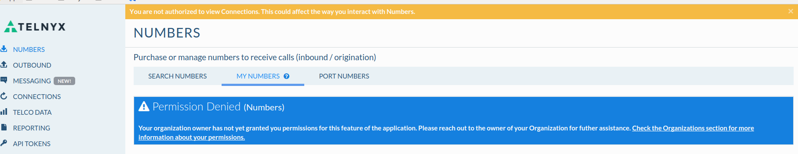

# Get Started with Organizations

*Part 2 of 2 — see also: [Part 1](get-started-with-organizations--part-1.md)*

User Organizations let a single Telnyx account owner tie multiple sub-accounts together under one umbrella entity, delegating scoped permissions through groups. This page covers how to create an organization, invite and manage sub-members, configure permission groups, and understand the technical and operational limits of the feature.

## Permission Denied Example

When a sub-account does not have the appropriate access or permissions — for example, to view numbers — the following general error is displayed:

- **Your organization owner has not yet granted you permissions for this feature of the application. Please contact your organization owner to discuss which permissions you should have on your sub account.**
- **You are not authorized to access the requested resource.**

### Sections With Limited Sub-Member Access

While Telnyx continues to expose more permission sets, sub-members currently have access to the following sections but may see **undesired results** because of the migration to V2 — not all V2 services are yet exposed to the organizations functionality. In time this behaviour will change; in the meantime, Telnyx **strongly recommends** that sub-members leverage the **API key** of their organization owner's account.

- [API Keys](https://portal.telnyx.com/#/app/api-keys)
- [Account](https://portal.telnyx.com/#/app/account/general)
  - General
  - Organizations
  - Notifications
- [Advanced Features](https://portal.telnyx.com/#/app/advanced-features)
- [Debugging Tools](https://portal.telnyx.com/#/app/debugging/sip-call-flow-tool)
- [Number Lookup](https://portal.telnyx.com/#/app/lookup)
- [Telnyx Storage](get-started-with-telnyx-storage-inference-guide.md)

Sub-members **do not** have access to the **verification** or **single sign-on** pages, as these can only ever be required or configured by the organization owner. If a sub-member attempts to paste the URL of these links into the webpage, they will be met with an error.

## Special Notes on User Organizations

- You can only create **one organization per account**.
- If you have sent an invite to a member, you can delete the invitation to disallow them from joining — but only if they have not yet accepted it.
- You can only have **10 open invitations** at any time. Further attempts to add more members will result in the error: **"You have too many active invitations. Please wait for one to be accepted or declined before sending another."** Remove any stale invitations or resend them so the member can accept.
- Only send invitations to people you really want in your organization so you can delegate specific permissions to them via the permission groups you create.
- If a member has accepted the invitation and signed up but you no longer want them in the organization, do not give them permissions in any group, or remove them from any groups they are already in.
- The organization owner should then contact [support@telnyx.com](mailto:support@telnyx.com) to request that a user be blocked if they should no longer be part of the organization, as technically they would still have access to the five points above.
- You cannot remove an individual's email after an invitation has been sent. The "revoked" status applies when you send an invitation and then delete it afterwards.
- The invitee will still receive the email, but if they sign up they will not be part of your organization — as long as you have deleted the invitation. Otherwise, if they sign up, they will be part of your organization.

## Technical Notes on User Organizations

Sub-users are given the ability to do things on behalf of an organization through granted permissions, and permissions are always granted to **groups**. A single user can be in any number of groups, and will always have the net **MOST PERMISSIONS** possible based on all of the groups they are in.

### Category vs Entity Permissions

Permissions come in two types:

- **Category permission** — grants access to a whole category of things. For example, a category permission for connections gives members of a group a set of permissions for *all* connections that belong to the organization.
- **Entity permission** — grants access to just one of something.

In the initial release of User Organizations, **only category permissions** are present. Entity permissions will be added in a subsequent release.

### Permission Actions

Permissions specify how something can be interacted with:

- **create** — the ability to add more of something
- **read** — the ability to view something
- **update** — the ability to change something
- **delete** — the ability to remove or delete something

It is possible to grant permissions to modify something without giving the ability to read it. This will likely result in unintuitive behaviour for portal-using accounts, but it may make sense and be useful for direct API users.

Because a user always has the most permissions possible based on all of the groups they are in, a user in a group with category read permission for numbers and another group with category update permission for numbers will have permission to both read and update all numbers for the organization.

## Transferring Numbers and Configurations to Another Account

If you have existing numbers on your account that you want to transfer to another account, Telnyx recommends submitting a **port-in request** for those numbers on the new account.

Configurations cannot be transferred directly. Once the port-in requests are set up on the new account, and prior to their activation, schedule a maintenance window outside of business hours to recreate the configurations associated with the numbers on the new account, in order to minimise downtime.

If you have a SIP Connection on Account X and want to transfer it to Account Y, SIP Connections need to be unique. You will either need to set up expert authentication methods on the new SIP Connection on Account Y (so it is considered unique) or remove the SIP Connection from Account X in order to recreate it on Account Y.

## Related Articles

- [Managed Accounts](managed-accounts.md)
- [Get Started with Telnyx Storage & Inference Guide](get-started-with-telnyx-storage-inference-guide.md)
- [Configuring a FreePBX V13 Credentials Trunk](https://support.telnyx.com/en/articles/1130648-configuring-a-freepbx-v13-credentials-trunk)
- [MS Teams: Call2Teams & Telnyx](https://support.telnyx.com/en/articles/6133589-ms-teams-call2teams-telnyx)
- [Verified Numbers FAQ](https://support.telnyx.com/en/articles/6790265-verified-numbers-faq)
