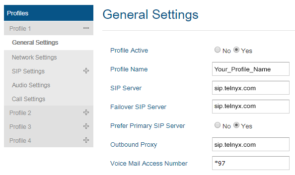
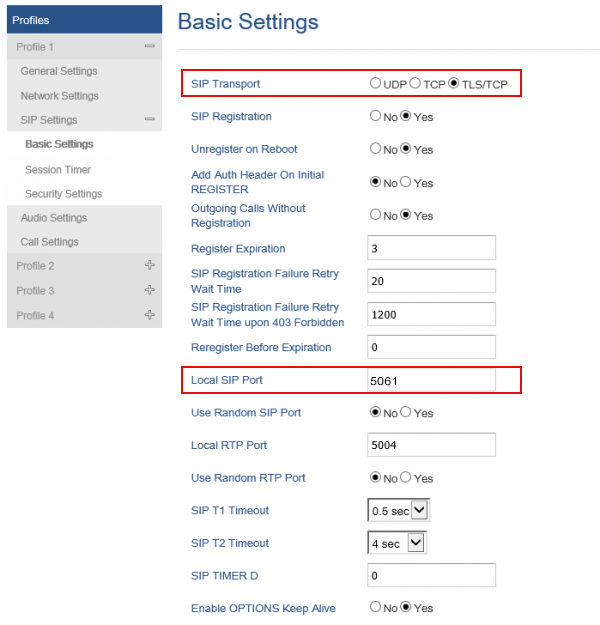
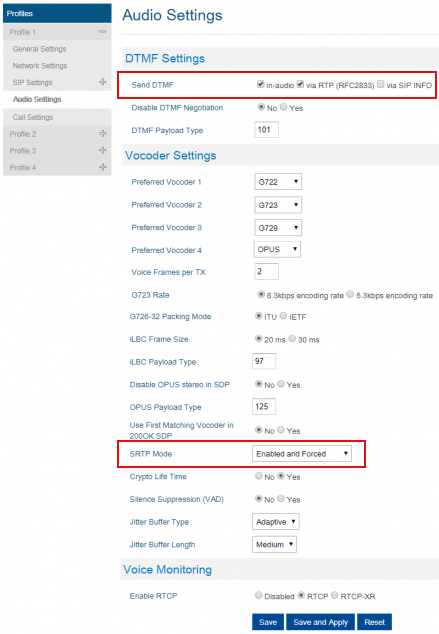
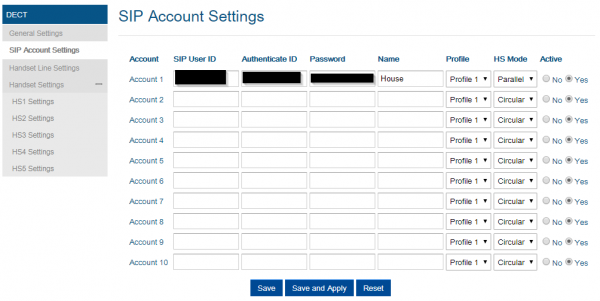
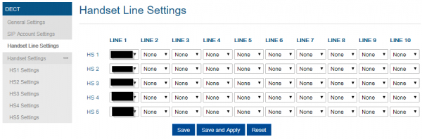

# Grandstream Device Setup and Telnyx Rate Change Notifications

*Part 1 of 6 — see also: [Part 2](grandstream-device-setup-and-telnyx-rate-change-notifications--part-2.md), [Part 3](grandstream-device-setup-and-telnyx-rate-change-notifications--part-3.md), [Part 4](grandstream-device-setup-and-telnyx-rate-change-notifications--part-4.md), [Part 5](grandstream-device-setup-and-telnyx-rate-change-notifications--part-5.md), [Part 6](grandstream-device-setup-and-telnyx-rate-change-notifications--part-6.md)*

This page consolidates Telnyx setup guides for several Grandstream devices (DP752, GRP260x, GRP2612, GXP1700, and GXV3370) along with information about how Telnyx notifies customers of rate changes and upcoming updates to the Global Conversational rate deck. Each device section walks through prerequisites, SIP trunk configuration, codec settings, and account setup, while the rate change sections explain notification timelines, origination type classifications, and pricing update frequency.

## Grandstream DP752

The [Grandstream DP752](https://www.grandstream.com/products/ip-voice-telephony/dect-cordless/product/dp720) is a mobilized VoIP solution that doesn't tie a user to their desk. This mobile DECT handset offers all the essential call control features on the go. A single DP752 base station can pair with up to 5 DP722 handsets, and each base station supports up to 10 SIP accounts, full HD audio, a 3.5mm headset jack, multi-language support, a speakerphone and more. DECT authentication and encryption protect calls and accounts.

*Note:* This guide also supports configuration of a Grandstream DP750.

Additional documentation:

- [User manual](https://www.grandstream.com/hubfs/Product_Documentation/DP750_DP720_User_Guide.pdf)
- [Admin manual](https://www.grandstream.com/hubfs/Product_Documentation/DP750_DP720_Administration_Guide.pdf)
- [DP750 FAQ](https://blog.grandstream.com/faq)
- [Firmware updates](https://www.grandstream.com/support/firmware)
- [Grandstream Helpdesk](https://helpdesk.grandstream.com/)
- [Grandstream community forum](https://forums.grandstream.com/)

### Configuring the DP752 for Telnyx

In this activity you will:

1. Get your DP752's IP address
2. Set up your DP752 for traffic flow
3. Configure codecs
4. Configure user accounts

**Pre-requisites:**

- Ensure that your [Telnyx Mission Command Portal](get-started-with-a-mission-control-account.md) is configured properly
- [Provision a DID from Telnyx](https://portal.telnyx.com/#/app/numbers/search-numbers) ([Requesting Numbers](https://support.telnyx.com/en/articles/3562148-requesting-numbers))
- RECOMMENDED: [Enable TLS to encrypt your traffic](https://support.telnyx.com/en/articles/1130711-does-telnyx-encrypt-communication)
- Ensure your Grandstream DP752 is on the [latest firmware](https://www.grandstream.com/support/firmware)

#### Get your DP752's IP address

1. On the DP72x/DP730 handset, press **Menu**.
2. Use arrow keys to reach **Status > Base Status**.
3. Press the **Select** softkey to display the Info page, which contains the IP address of your device. Keep this for the next step.

#### Set up your DP752 for traffic flow

1. From your computer, open a browser and paste your device's IP address into the address bar. You may need to prepend the address with `http://` to reach your DP750 Base Station.
2. Log in. For the initial login, use the default credentials:
   - **Username:** `admin`
   - **Password:** `admin`
3. From the left-hand navigation, expand **Profiles > Profile 1** and click **General Settings** to enter the following information:
   - **Profile Active:** Select *Yes* unless you want the profile to remain inactive.
   - **Profile Name:** Choose a name that makes sense for your purpose.
   - **SIP Server:** `sip.telnyx.com`
   - **Failover SIP Server:** `sip.telnyx.com` (Each SIP region has two SIP proxies. In the event of a failover, Telnyx will attempt to connect through the secondary IB SIP proxy.)
   - **Prefer Primary SIP Server:** Select *Yes*.
   - **Outbound Proxy:** `sip.telnyx.com`
   - **Voice Mail Access Number:** `*97`

   
4. Click **Save**, then **Apply**.
5. From the left-hand navigation, expand **SIP Settings > Basic Settings** and change or confirm the following:
   - **SIP Transport:** By default, *UDP* is selected. If you enabled TLS and your account is configured to use SRTP encryption, choose *TLS*.
   - **Local SIP Port:** If using UDP transport, use port `5060`. If using TLS transport, use port `5061`.

   
6. Click **Save**, then **Apply**.

#### Configure codecs

1. From the left-hand navigation, expand **Profiles > Profile 1** and change or confirm the following:
   - **Send DTMF:** Select *In-Audio* and *via RTP*.
   - **SRTP Mode:** If using TLS encryption, select *Enabled and Forced*. Otherwise, leave as default.

   
2. Click **Save**, then **Apply**.

#### Configure user accounts

1. From the left-hand navigation, expand **DECT > SIP Account Settings** and configure the following for each account:
   - **SIP User ID:** The Telnyx account ID
   - **Authenticate ID:** The Telnyx account ID
   - **Password:** The Telnyx account password
   - **Name:** Your caller ID. Keep in mind:
     - Caller ID Name should be in capital letters for clearer display on some devices.
     - Do not use special characters; spaces are allowed.
     - Some Canadian providers will not show more than 15 characters.
   - **Profile:** Choose the profile you created earlier (e.g., Profile 1).
   - **HS Mode:** Options include:
     - *Circular mode*: all phones ring sequentially, starting with the phone after the one which rang last.
     - *Linear mode:* all phones ring sequentially in the predetermined order, starting with the first phone each time.
     - *Parallel mode:* all phones ring concurrently; after one phone answers, the remaining available phones can make new calls.
     - *Shared mode:* all phones ring concurrently and always share the same line (similar to analog phones).
     - *Non-Hunting Group:* an account will be assigned to a single specific handset.
   - **Active:** Whether or not the account is active. Typically *Yes*.

   
2. Click **Save**, then **Apply**.
3. From the left-hand navigation, expand **DECT > Handset Line Settings**.
4. Make sure the SIP account you just created is selected in the Line 1 column for every handset.

   
5. Click **Save**, then **Apply**.
