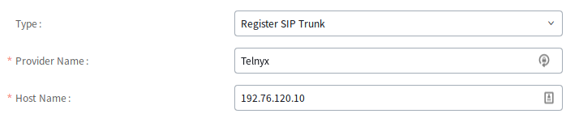
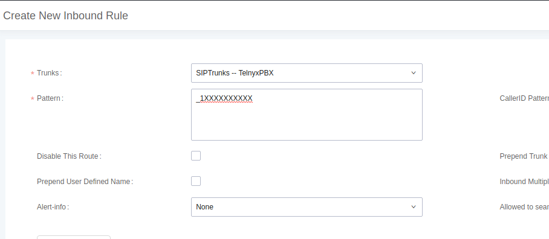
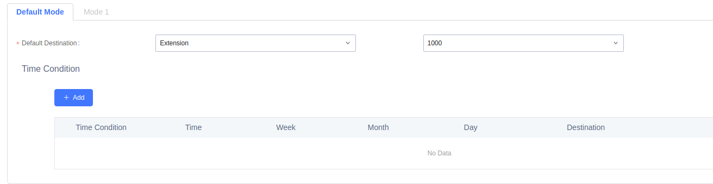
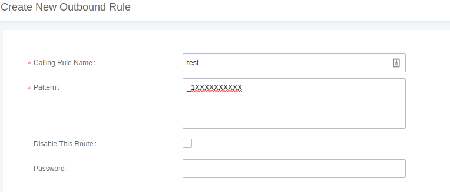
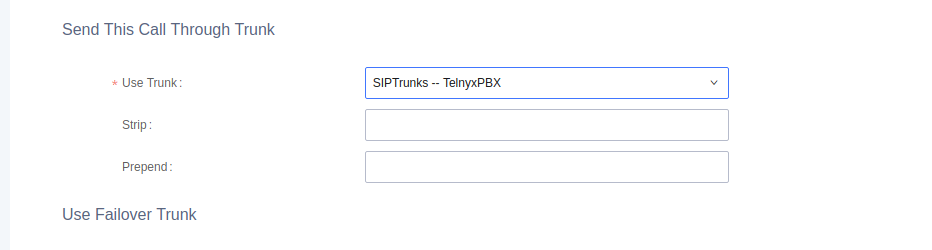
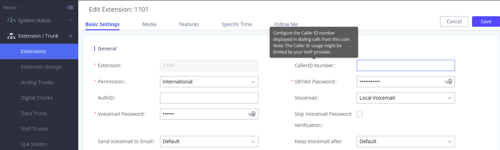
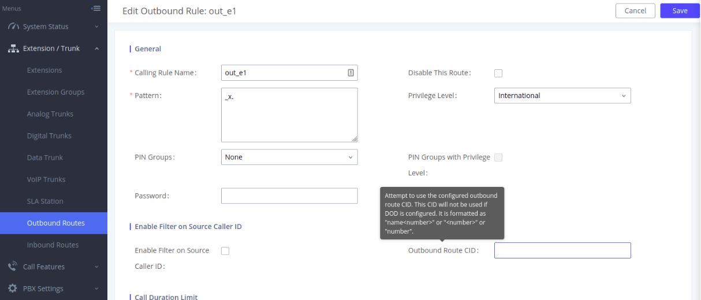
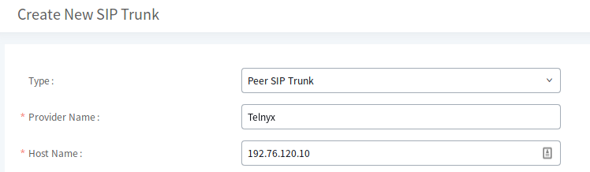

# Grandstream Devices with Telnyx

*Part 1 of 4 — see also: [Part 2](grandstream-devices-with-telnyx--part-2.md), [Part 3](grandstream-devices-with-telnyx--part-3.md), [Part 4](grandstream-devices-with-telnyx--part-4.md)*

Configuration guides for integrating Grandstream hardware — including the UCM6202 IP PBX, UCM6xxx series, HT802 ATA, and DP752 DECT base station — with Telnyx SIP services for voice and fax.

## Overview

Grandstream manufactures a range of SIP-based Unified Communications products for small and medium businesses and enterprises. Telnyx supports integration with several Grandstream devices, including the UCM6202 IP PBX, the broader UCM6xxx series, the HT802 analog telephone adapter (ATA), and the DP752 DECT base station. This page consolidates the configuration steps for each device family.

## Prerequisites

Before configuring any Grandstream device with Telnyx, complete the following in the Telnyx Mission Control Portal:

- Configure your [Telnyx Mission Control Portal](https://support.telnyx.com/en/articles/1176636-get-started-with-a-mission-control-account) account.
- Purchase a DID and provision it to a SIP connection.
- Create an outbound voice profile.
- Create either a credentials connection or an IP connection, depending on the auth method you plan to use.
- Ensure your Grandstream device is running the [latest firmware](https://www.grandstream.com/support/firmware).
- Recommended: [Enable TLS to encrypt your traffic](https://support.telnyx.com/en/articles/1130711-does-telnyx-encrypt-communication).

## Grandstream UCM6202 — Auth Setup

The [Grandstream UCM6202](https://www.grandstream.com/products/ip-pbxs/ucm-series-ip-pbxs/product/ucm6200-series) is an IP PBX appliance that combines enterprise-grade voice, video, data, and mobility features. This section covers credential-based registration.

### Log into the Web UI

1. The IP address used to access the web UI depends on where the computer is connected:
   - If connected to the same switch/router as the UCM6200 WAN port, browse to the WAN IP shown on the device's LCD.
   - If connected to the LAN side, browse to the default IP `192.168.2.1`.
2. Default credentials are `admin` / `admin`. Units manufactured after January 2017 have a unique random password printed on a sticker on the back of the unit. Change the default password after first login.

### Configure the SIP Trunk

1. In the left-hand navigation, expand **Extension/Trunk** and click **VoIP Trunks**.

   
2. Click **Add SIP trunk** and fill in:
   - **Type:** Register SIP Trunk
   - **Provider Name:** Telnyx
   - **Host Name:** `sip.telnyx.com`
   - **Username:** Your Telnyx SIP username
   - **Password:** Your Telnyx SIP password

   

   
3. Click **Save**.

> If you have issues setting this up with a hostname, you can use the primary IP address `192.76.120.10`.

### Create an Inbound Route

1. Expand **Extension/Trunk** and click **Inbound Routes**.

   
2. Select the trunk and click **Add** under **Inbound Routes**.

   
3. Enter the patterns that apply to this inbound rule. See [Asterisk dialplan patterns](https://www.voip-info.org/asterisk-dialplan-patterns/) for formatting.

   
4. In default mode, set the default destination to **Extension**.

   
5. Click **Save**.

### Create an Outbound Route

1. Expand **Extension/Trunk** and click **Outbound Routes**.

   
2. Name the calling rule and add the number pattern.

   
3. Set the privilege level to match the service plan in your Telnyx portal.

   
4. Select your trunk in the **Use Trunk** section.

   

### Configure an Outbound Caller ID

Grandstream supports three ways to configure caller ID on a SIP trunk:

- A single global outbound caller ID applied to every number on the trunk.
- A unique caller ID for every extension on the trunk.
- A unique caller ID for every outbound route.

> Caller ID naming conventions: use capital letters, no special characters (spaces are allowed), and keep names under 15 characters for Canadian providers. See [Telnyx's caller ID number policy](https://support.telnyx.com/en/articles/3546251-caller-id-number-policy).

1. **Global CID:** Expand **PBX Settings** and click **General Settings**.

   
2. **Per-extension CID:** Expand **Extension/Trunk** and click **Extensions**.
3. Click the extension and provide the caller ID in the **CallerID Number** field.

   
4. **Per-route CID:** Expand **Extension/Trunk** and click **Outbound Routes**.
5. Set the caller ID for the entire route in the **Outbound Route CID** field.

   

## Grandstream UCM6202 — IP Auth Setup

The IP auth method uses Telnyx's IP-based authentication instead of SIP credentials. The setup is identical to the credential-based flow above, except for the SIP trunk configuration.

### Configure the SIP Trunk (IP Auth)

1. Expand **Extension/Trunk** and click **VoIP Trunks**.

   
2. Click **Add SIP trunk** and fill in:
   - **Type:** Register SIP Trunk
   - **Provider Name:** Telnyx
   - **Host Name:** `192.76.120.10`

   
3. Click **Save**.

The remaining steps — inbound route, outbound route, and outbound caller ID — are identical to the credential-based setup described above.
