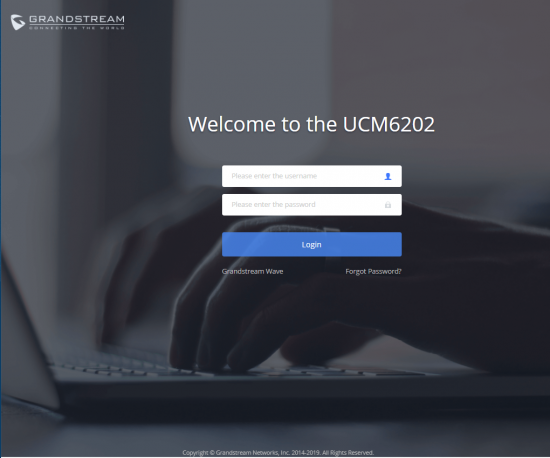
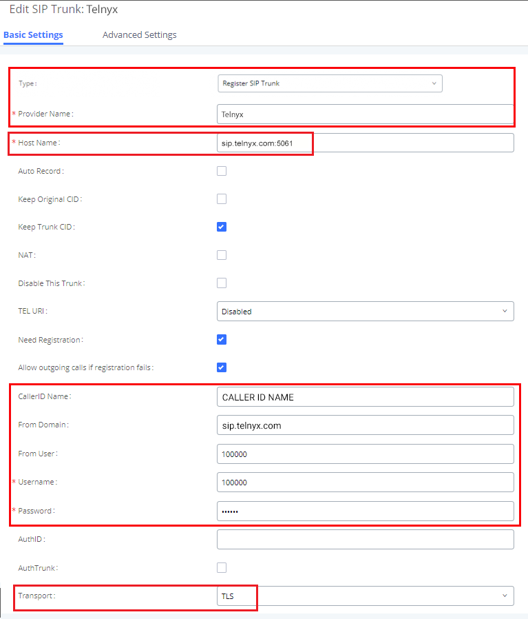
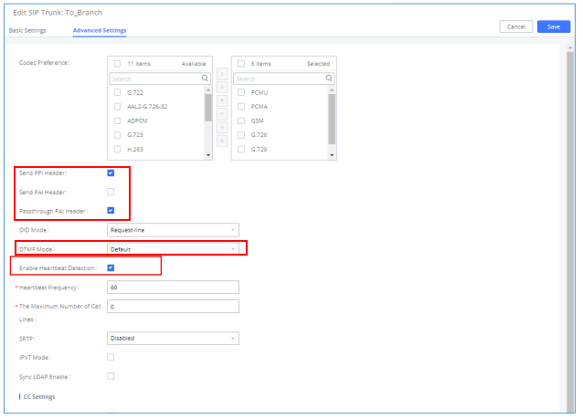
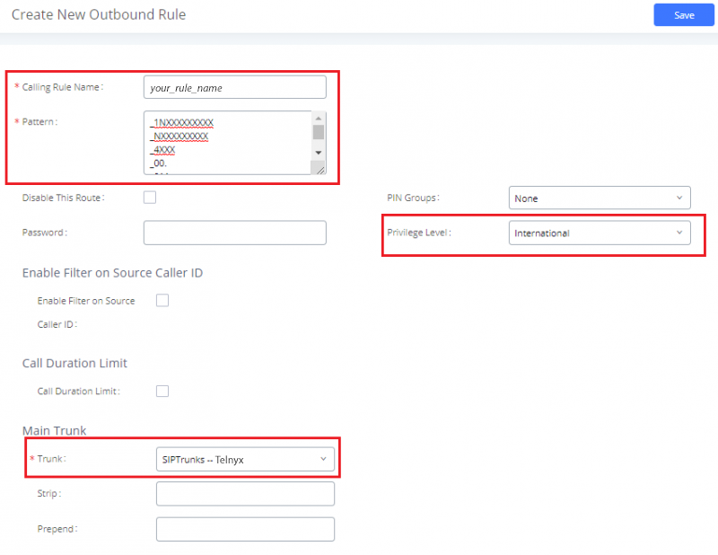

# Grandstream Devices with Telnyx

*Part 2 of 4 — see also: [Part 1](grandstream-devices-with-telnyx--part-1.md), [Part 3](grandstream-devices-with-telnyx--part-3.md), [Part 4](grandstream-devices-with-telnyx--part-4.md)*

Configuration guides for integrating Grandstream hardware — including the UCM6202 IP PBX, UCM6xxx series, HT802 ATA, and DP752 DECT base station — with Telnyx SIP services for voice and fax.

## Grandstream UCM6xxx — SIP Trunks

The [UCM6xxx series](https://www.grandstream.com/products/ip-pbxs/ucm-series-ip-pbxs/product/ucm6200-series) is a centralized IP PBX appliance. Firmware 1.0.18.x is the last supported release for UCM61xx; UCM61xx will continue to receive critical security updates and major bug fixes only. Always upgrade to the latest official firmware.

> Additional setup considerations: extension range on UCM6xxx in the main office is 1000–1999; international numbers should be prefixed with `99` with no size limits; local numbers start with `06` and are 10 digits in length.

### Log into the UCM Device

1. Ensure the UCM device is powered on and showing an IP address on its screen.
2. From a computer on the same network, open a browser and enter the IP address in the format `http(s)://ipaddress:portnumber`. The default protocol is HTTPS and the default port is `8089`.
3. Default credentials are `admin` / `admin`.

   

### Create SIP Trunks

You will need the following Telnyx information to register your trunk(s):

| Field | Value |
| --- | --- |
| Provider address | `sip.telnyx.com` |
| Username | Your Telnyx SIP username |
| Authenticate ID | Your Telnyx SIP username |
| Password | Your Telnyx SIP password |
| Main number | Your main 10-digit number |
| Provided DIDs | The 10-digit DIDs you have provisioned |

1. Navigate to **Extension/Trunk > VoIP Trunks** and click **Add SIP Trunk**.
2. On the **Basic Settings** tab, configure:
   - **Type:** Register SIP trunk
   - **Provider Name:** Telnyx
   - **Host Name:** `sip.telnyx.com` (append `:5061` if using TLS)
   - **Keep Trunk CID:** Enable to send the trunk's own CID, or disable to let extensions send their own.
   - **Caller ID Name:** Follow the naming conventions (capital letters, no special characters, ≤15 characters for Canadian providers).
   - **From Domain:** `sip.telnyx.com`
   - **Username:** Your Telnyx account/sub-account username
   - **Password:** Your Telnyx account/sub-account password
   - **Transport:** `TCP` or `UDP` (or `TLS` if encrypting traffic)

   
3. On the **Advanced Settings** tab, configure:
   - **Codec Preference:** Use only Telnyx-supported codecs — `ulaw(g711u)`, `alaw(g711a)`, `g722`, `g729`.
   - **Send PPI Header** or **Send PAI Header:** Enable only one. PPI and PAI cannot be enabled simultaneously.
   - **Passthrough PAI Header:** If Send PAI Header is disabled, enabling this preserves PAI headers for calls passing through UCM.
   - **DTMF Mode:** Default (RFC2833)
   - **Enable Heartbeat Detection:** Check this box to prevent your modem from closing local SIP ports.
   - **Heartbeat Frequency:** 60
   - **SRTP:** If encrypting calls with TLS, choose `Enabled and forced`.

   
4. Click **Save**, then **Apply Changes**.
5. Check registration status under **System Status > Dashboard**.

> If a status is Rejected, the UCM was not registered with Telnyx. Verify the Telnyx server is reachable and double-check your trunk credentials.

### Configure Outbound Routes

1. Click **Extension/Trunk > Outbound Routes** and click **+Add**.

   
2. Configure:
   - **Calling Rule Name:** Any descriptive name.
   - **Pattern:** The dial pattern. To include a dial-out prefix, type it after the `_` character.
   - **Trunk:** The Telnyx trunk to use.
   - **Privilege Level:** Required privilege for extensions to use this route.
   - **Strip:** Number of digits to strip after the `_` character. For example, to use `9` as a prefix with pattern `_9NXXXXXXXXX`, set Strip to `1`.

   

### Configure the Inbound Route

> We don't suggest using more than one Telnyx trunk on the same device.

1. Click **Extension/Trunk > Inbound Routes** and click **Add**.

   
2. Configure:
   - **Trunks:** The Telnyx trunk for incoming calls.
   - **Patterns:** The Telnyx DID phone number exactly as shown in Mission Control Portal, prefixed with `_`.
   - **Default Destination:** The default destination for incoming calls.

   

### Optional: Time Conditions

1. Click **Extension/Trunk > Outbound Routes** (or **Inbound Routes**).
2. Find the **Time Condition** section.
3. Select the time when this trunk should be used.
4. Click **Add**.

### Optional: Group Trunks

Starting from firmware 1.0.20.17, you can create VoIP Trunk Groups to apply the same settings across multiple accounts on the same SIP server. Create a trunk group instead of a new trunk and use the **+** button in the **Username** field to add multiple trunks.

### Optional: Failover Route

Failover trunks ensure calls go through an alternate route when the primary trunk is busy or down. UCM6xxx uses failover trunks when:

- No response from the first trunk after 32 seconds.
- The UCM6xxx receives 403/407/408/503/603 SIP responses from the primary trunk.
- The primary trunk is disabled.
- The primary trunk is an analog trunk and is busy or not connected.

To configure: go to **PBX → Basic/Call Routes → Outbound Routes**, click **Click to add failover trunk**, select the failover trunk, and strip/prepend digits if needed.
