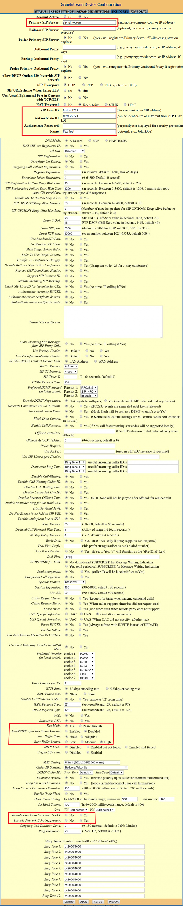
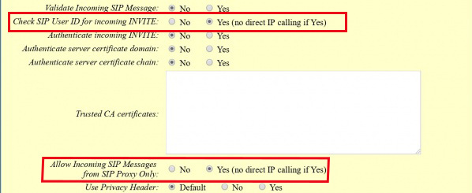

# Grandstream Devices with Telnyx

*Part 3 of 4 — see also: [Part 1](grandstream-devices-with-telnyx--part-1.md), [Part 2](grandstream-devices-with-telnyx--part-2.md), [Part 4](grandstream-devices-with-telnyx--part-4.md)*

Configuration guides for integrating Grandstream hardware — including the UCM6202 IP PBX, UCM6xxx series, HT802 ATA, and DP752 DECT base station — with Telnyx SIP services for voice and fax.

## Grandstream HT802 — Telnyx Setup

The [Grandstream HT802](https://www.grandstream.com/hubfs/Product_Documentation/ht80x_user_guide.pdf) is a 2-port analog telephone adapter (ATA) for residential and office environments. This guide configures the HT802 for sending and receiving faxes through Telnyx.

> Current firmware: 1.0.33.4 (1.0.35.4 in Beta). Ensure your device is on the [most current firmware](https://www.grandstream.com/support/firmware).

> In your Telnyx Portal, under **Connection Settings > Inbound**, set **DNIS** to **SIP Username** — Telnyx does not support phone numbers as connection usernames.

### Set Up the HT802 for Configuration

1. Connect the 802 to your router with the supplied ethernet cable.
2. Connect your phone to the configured FXS port.
3. Plug in the power cord and wait 60 seconds.
4. Pick up the connected phone and dial `***`. You will hear "Enter a menu option."
5. Dial `0 2` to hear the IP address of your 802. Write it down.
6. Open a browser and enter the IP address (strip leading zeros, e.g. `192.168.001.010` becomes `192.168.1.10`). Do this quickly — the interface has a timeout.
7. Log in with the default password `admin`.

   

### Configure the HT802

1. Click **FXS PORT1** in the top menu and configure:
   - **Primary SIP server:** `sip.telnyx.com`
   - **Failover SIP server:** Leave blank
   - **Outbound Proxy:** Leave blank (unless on firmware 1.0.15.4 or lower — then use `sip.telnyx.com`)
   - **NAT Traversal:** Keep-Alive
   - **SIP User ID:** Your Telnyx SIP ID
   - **Authenticate ID:** Your Telnyx SIP ID
   - **Authenticate Password:** Your Telnyx SIP account password
   - **Name:** Outbound Caller ID (capital letters, no special characters, ≤15 characters)
   - **DNS Mode:** A Record
   - **SIP Registration:** Yes
   - **Unregister on Reboot:** No
   - **Outgoing Call Without Registration:** Yes
   - **Register Expiration:** 5
   - **Allow Incoming SIP Messages from SIP Proxy Only:** Yes
   - **Preferred DTMF method:** In-audio, RFC2833
   - **Use P-Access-Network-Info Header:** No
   - **Use P-Emergency-info Header:** No
   - **Enable Call Features:** No
   - **Dial Plan:** `{[x*]+}`
   - **Preferred Vocoder:** PCMU, PCMA, G72
   - **Fax Mode:** T38
   - **Re-INVITE After Fax Tone Detected:** Disabled

   **Optional for low fax success rates:**
   - **Jitter Buffer Type:** Fixed
   - **Jitter Buffer Length:** High
   - **Disable Line Echo Canceller (LEC):** Yes
   - **Disable Network Echo Suppressor:** Yes

   

### Optional: Prevent Direct IP Calls

On the FXS PORT1 page, enable:

- **Check SIP User ID for Incoming INVITE:** Yes
- **Allow Incoming SIP Messages from SIP Proxy Only:** Yes

   

With these enabled, the device cannot make direct IP calls.

### Configure the Telnyx Command Portal

1. Set up a [Number](https://support.telnyx.com/en/articles/4380325-search-and-buy-numbers), [Connection](https://support.telnyx.com/en/articles/1177115-how-to-setup-a-did-to-sip-connection), and [Outbound Profile](https://support.telnyx.com/en/articles/4320411-more-about-outbound-voice-profiles) in the Telnyx Command Portal.
2. Send a test fax.

## Grandstream DP752 — Telnyx Setup

The [Grandstream DP752](https://www.grandstream.com/products/ip-voice-telephony/dect-cordless/product/dp720) is a DECT cordless IP phone solution. A single DP752 base station pairs with up to 5 DP722 handsets and supports up to 10 SIP accounts. This guide also supports the Grandstream DP750.

### Get the DP752's IP Address

1. On the DP72x/DP730 handset, press **Menu**.
2. Use the arrow keys to reach **Status > Base Status**.
3. Press the **Select** softkey to display the Info page containing the IP address.

### Set Up the DP752 for Traffic Flow

1. Open a browser and enter the device's IP address (prepend `http://` if needed).
2. Log in with default credentials `admin` / `admin`.
3. Expand **Profiles > Profile 1** and click **General Settings**:
   - **Profile Active:** Yes
   - **Profile Name:** A descriptive name
   - **SIP Server:** `sip.telnyx.com`
   - **Failover SIP Server:** `sip.telnyx.com`
   - **Prefer Primary SIP Server:** Yes
   - **Outbound Proxy:** `sip.telnyx.com`
   - **Voice Mail Access Number:** `*97`

   
4. Click **Save**, then **Apply**.
5. Expand **SIP Settings > Basic Settings**:
   - **SIP Transport:** `UDP` by default; choose `TLS` if using SRTP encryption.
   - **Local SIP Port:** `5060` for UDP, `5061` for TLS.

   
6. Click **Save**, then **Apply**.

### Configure Codecs

1. Expand **Profiles > Profile 1**:
   - **Send DTMF:** In-Audio and via RTP
   - **SRTP Mode:** `Enabled and Forced` if using TLS; otherwise leave as default.

   
2. Click **Save**, then **Apply**.

### Configure User Accounts

1. Expand **DECT > SIP Account Settings** and configure for each account:
   - **SIP User ID:** Telnyx account ID
   - **Authenticate ID:** Telnyx account ID
   - **Password:** Telnyx account password
   - **Name:** Caller ID (capital letters, no special characters, ≤15 characters)
   - **Profile:** The profile created above
   - **HS Mode:**
     - *Circular mode:* phones ring sequentially, starting after the last phone that rang.
     - *Linear mode:* phones ring sequentially in predetermined order, starting with the first phone each time.
     - *Parallel mode:* phones ring concurrently; after one answers, the remaining can make new calls.
     - *Shared mode:* phones ring concurrently and always share the same line.
     - *Non-Hunting Group:* an account is assigned to a single specific handset.
   - **Active:** Yes

   
2. Click **Save**, then **Apply**.
3. Expand **DECT > Handset Line Settings**.
4. Ensure the SIP account is selected in the **Line 1** column for every handset.

   
5. Click **Save**, then **Apply**.

## Additional Resources

- [Grandstream UCM6200 series product page](https://www.grandstream.com/products/ip-pbxs/ucm-series-ip-pbxs/product/ucm6200-series)
- [Grandstream UCM6200 series datasheet](https://www.grandstream.com/hubfs/Product_Documentation/datasheet_ucm6200_series_english.pdf?hsLang=en)
- [Grandstream UCM62xx administrator's user manual](https://www.grandstream.com/hubfs/Product_Documentation/ucm62xx_usermanual.pdf)
- [Grandstream UCM6xxx user guides](https://www.grandstream.com/support/resources?title=UCM6200%20series&hsLang=en)
- [Grandstream HT802 user guide](https://www.grandstream.com/hubfs/Product_Documentation/ht80x_user_guide.pdf)
- [Grandstream DP750/DP720 user manual](https://www.grandstream.com/hubfs/Product_Documentation/DP750_DP720_User_Guide.pdf)
- [Grandstream DP750/DP720 admin manual](https://www.grandstream.com/hubfs/Product_Documentation/DP750_DP720_Administration_Guide.pdf)
- [Grandstream firmware updates](https://www.grandstream.com/support/firmware)
- [Grandstream FAQ](https://blog.grandstream.com/faq)
- [Grandstream user forum](https://forums.grandstream.com/)
- [Grandstream Learning Center](https://www.grandstream.com/learning-center)
- [Grandstream Helpdesk](https://helpdesk.grandstream.com/)
- [UCM6200 series how-to guides](https://www.grandstream.com/support/resources?title=UCM6200%20series)
- [UCM6510 series how-to guides](https://www.grandstream.com/support/resources?title=UCM6510)
