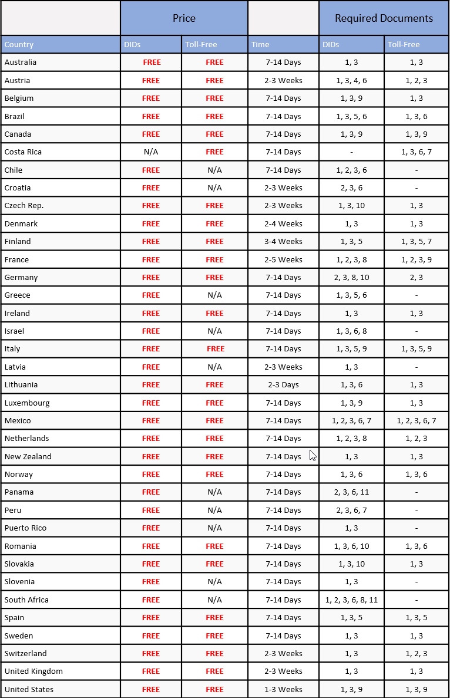
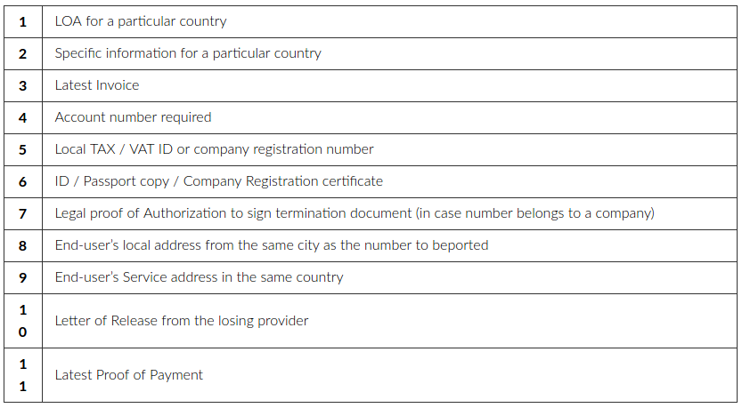

# International Number Porting and Ordering — Required Documents

*Part 3 of 3 — see also: [Part 1](international-number-porting-and-ordering-required-documents--part-1.md), [Part 2](international-number-porting-and-ordering-required-documents--part-2.md)*

This page consolidates Telnyx's international number porting and ordering documentation requirements. It covers how to submit port requests via the Telnyx Portal, country-specific porting requirements and LoA templates for countries including Austria, Belgium, Czech Republic, Hungary, Israel, Luxembourg, Netherlands, Norway, Romania, Slovakia, and Slovenia, plus the comprehensive international numbers required documents table, document code definitions, additional requirements, international toll-free local dialling rules, and special notes on local CLI calling.

## International Toll-Free Local Dialling Rules

International toll-free numbers can only be reached from in-country, and local operators may only connect local calls to your toll-free number in a particular dialed number format.

| Country | Prefix | Local Dialling Rule |
| --- | --- | --- |
| Argentina | 54-800 | 0 800 xxx xxx / 800 xxx xxx |
| Australia | 61-1300 (Shared Cost) / 61-1800 | 1 300 xxx xxx / 1 800 xxx xxx |
| Austria | 43-800 | |
| Bahrain | 973-800 | 800 xx xxx |
| Belarus | 375-882 | 882 xxxx xxxxx |
| Belgium | 32-800 | 0 800 xx xxx |
| Bolivia | 591-800 | 800 xxx xxx |
| Bosnia and Herzegovina | 387-800 | 0 800 xx xxx |
| Brazil | 55-800 | 0 800 xxx xxxx |
| Bulgaria | 359-800 | 0 800 xxxx |
| Canada | 1-800 / 1-844 / 1-855 / 1-866 / 1-877 / 1-888 | 1 8xx xxx xxxx (might depend on current local operator) |
| Chile | 56-800 | 800 xx xxx |
| China | 86-400 (Shared Cost) | 400 xxx xxxx |
| Colombia | 57-800 | 01 800 xxxx xxxx |
| Croatia | 385-800 | 0 800 xxx xxx |
| Costa Rica | 506-800 | 800 xxx xxxx |
| Cyprus | 357-800 | 800 xx xxx |
| Czech Republic | 420-800 | 800 xxx xxx |
| Denmark | 45-807 | 807 xx xxx |
| Ecuador | 593-1800 | 1 800 xxx xxx |
| Estonia | 372-800 | 800 xxx xxxx |
| Finland | 358-800 | +358 800 xxx xxx (preferred) / 0 800 xxx xxx |
| France | 33-800 / 33-805 | 0 800 xxx xxx / 0 805 xxx xxx |
| Georgia | 995-800 | 0 800 xxx xxx |
| Germany | 49-800 | 0 800 xxxx xxxxx |
| Hong Kong | 852-800 | 800 xxx xxx |
| Iceland | 354-800 | 800 xxxx |
| Indonesia | 62-803 / 62-7803 | 00 7 80x xxx xxxx |
| Ireland | 353-1890 (Shared Cost) / 353-800 | 1 890 xxx xxx / 1 800 xxx xxx |
| Israel | 972-1809 | 1 809 xxx xxx |
| Italy | 39-800 | 800 xxx xxx |
| Japan | 81-120 / 81-800 | 0 120 xxx xxx / 0 800 xxx xxxx |
| Latvia | 371-800 | 800 xx xxx |
| Lithuania | 370-800 | 00 370 800 xx xxx / +370 800 xx xxx / 8 800 xx xxx |
| Luxembourg | 352-800 | 800 xx xxx |
| Malaysia | 60-1800 | 1 800 xxx xxx |
| Mexico | 52-800 | 01 800 xxx xxxx |
| Monaco | 377-800 | 800 xx xxx |
| Montenegro | 382-808 | 0 808 xx xxx |
| Netherlands | 31-800 | 0 800 xxx xxxx |
| New Zealand | 64-800 | 0 800 xxx xxx |
| Norway | 47-800 | 800 xx xxx |
| Panama | 507-800 | 800 xxxx |
| Peru | 51-800 | 0 800 xx xxx |
| Poland | 48-800 | 800 xxx xxx |
| Portugal | 351-800 | 800 xxx xxx |
| Romania | 40-800 | 800-xxxxxx |
| Russian Federation | 7-800 | 8 800 xxx xxxx / +7800 xxx xxxx |
| Serbia | 381-800 | 0 800 xxx xxx |
| Singapore | 65-800 | 800 xxx xxxx |
| Slovakia | 421-800 | 800 xxx xxx |
| Slovenia | 386-80 | 080 xxx xxx |
| South Africa | 27-800 | 0 800 xxx xxx |
| South Korea | 82-308 | 00 308 xxx xxx |
| Spain | 34-800 / 34-900 | 800 xxx xxx / 900 xxx xxx |
| Sweden | 46-20 | 020 xxx xxx |
| Switzerland | 41-800 | 0 800 xx xxx |
| Taiwan | 886-801 | 00 801 xxx xxx |
| Thailand | 66-1800 | 1 800 xxx xxx |
| Ukraine | 380-800 | 0 800 xxx xxx |
| United Arab Emirates | 971-800 | 800 xxxx xxxxx |
| United Kingdom | 44-800 / 44-808 | 0 800 xxx xxxx / 0 808 xxx xxxx |
| United States | 1-800 / 1-844 / 1-855 / 1-866 / 1-877 / 1-888 | 1 800 xxx xxxx / 1 844 xxx xxxx / 1 855 xxx xxxx / 1 866 xxx xxxx / 1 877 xxx xxxx / 1 888 xxx xxxx |
| Uruguay | 598-401 / 598-413 | 000 401 xx xxx / 000 413 xxx xxxx |
| Venezuela | 58-800 | 0 800 xxx xxxx |

## Special Notes on Local Calling

1. Due to individual local country regulations, voice calls bearing a CLI (Caller Line Identification) and terminating to the same country of origin, or those bearing no CLI at all, are subject to rejections from the local operators in order to protect their subscribers from unwanted, malicious, or spoofing calls, since local CLI calls cannot enter a country's international exchanges.
2. Unfortunately, due to the vast amount of network operators and changing regulations of each country, such types of calls might be observed to stop working without prior notice. For that reason, it is recommended that you use an international, and/or different to the termination country, CLI for your calls.
3. If your business requires a local CLI, please reach out to your account manager or sales representative at [sales@telnyx.com](mailto:success@telnyx.com) to discuss your use case further.

## Reference Images

