# Porting Numbers to Telnyx and Microsoft Teams Integration

*Part 3 of 6 — see also: [Part 1](porting-numbers-to-telnyx-and-microsoft-teams-integration--part-1.md), [Part 2](porting-numbers-to-telnyx-and-microsoft-teams-integration--part-2.md), [Part 4](porting-numbers-to-telnyx-and-microsoft-teams-integration--part-4.md), [Part 5](porting-numbers-to-telnyx-and-microsoft-teams-integration--part-5.md), [Part 6](porting-numbers-to-telnyx-and-microsoft-teams-integration--part-6.md)*

This page covers how to find a porting PIN or passcode from common carriers, port numbers away from specific providers (Twilio, voip.ms, Microsoft Teams) into Telnyx, and configure Microsoft Teams with Telnyx using Direct Routing, Operator Connect, or Call2Teams, including emergency call routing.

## Configuring Telnyx with Microsoft Teams Direct Routing

[Direct Routing](https://learn.microsoft.com/en-us/microsoftteams/direct-routing-plan) with [Microsoft Teams](https://www.microsoft.com/en-us/microsoft-teams/group-chat-software) allows businesses to connect external phone lines to Microsoft Teams and use Teams as an office phone system instead of a legacy PBX. This means you can maintain your existing [SIP trunks](https://telnyx.com/products/sip-trunks) and PSTN connectivity, retaining control over your numbers and realizing cost savings over the MS Teams Calling Plans.

This integration is carried out via the [Telnyx MS Teams SBC](https://telnyx.com/resources/integrated-sbc-direct-routing), which interconnects Microsoft Teams with the Telnyx telephony platform. Telnyx SBC uses the base domain `mstsbc.telnyx.tech`, and Telnyx customers can interconnect using a subdomain of `mstsbc.telnyx.tech` and a token for authentication.

Additional resources:

- [Microsoft Teams Direct Routing documentation](https://learn.microsoft.com/en-us/microsoftteams/direct-routing-plan)
- [Microsoft support](https://support.microsoft.com/en-US)

### Pre-requisites

- A Telnyx account with a purchased number. Learn how to set up your account [here](https://support.telnyx.com/en/articles/1176636-get-started-with-a-mission-control-account).
- A **Microsoft Teams E5** license assigned to each user who will be making and receiving calls to the PSTN.
- Sign-in access to the Microsoft 365 admin center as a Global Administrator. To validate the role, sign in to the Microsoft 365 admin center (<https://portal.office.com>) and go to **Users → Active Users**. Click your user and under **Account → Roles** click **Manage roles.** Verify that you have a Global Administrator role applied to your account.


- A Microsoft license. You will need one of these base plans and an add-on if necessary:

| BASE PLAN | ADD ON REQUIRED FOR DIRECT ROUTING |
| --- | --- |
| Microsoft Business Basic / Standard / Premium | Microsoft 365 Business Voice without Calling Plan |
| Microsoft Office 365 Enterprise E1 / E3 / F3 / A1 / A3 | Phone System |
| Microsoft Office 365 Enterprise E5 | No add on required |

### 1. Add a SIP Connection in Telnyx

Once you have set up your Telnyx account, set up a new connection for the Telnyx SBC on the [SIP Connections page](https://portal.telnyx.com/#/app/connections).

1. Click **Create SIP Connection** and choose a name for your connection. On the next page, choose **MS Teams Direct Routing SBC** as the SIP Connection Type.


2. Take note of the auto-generated subdomain — it will be needed at different stages of the setup.
3. Click **Next** and follow the guide to set up your **Authentication and Routing** details, followed by your **Configuration** details.


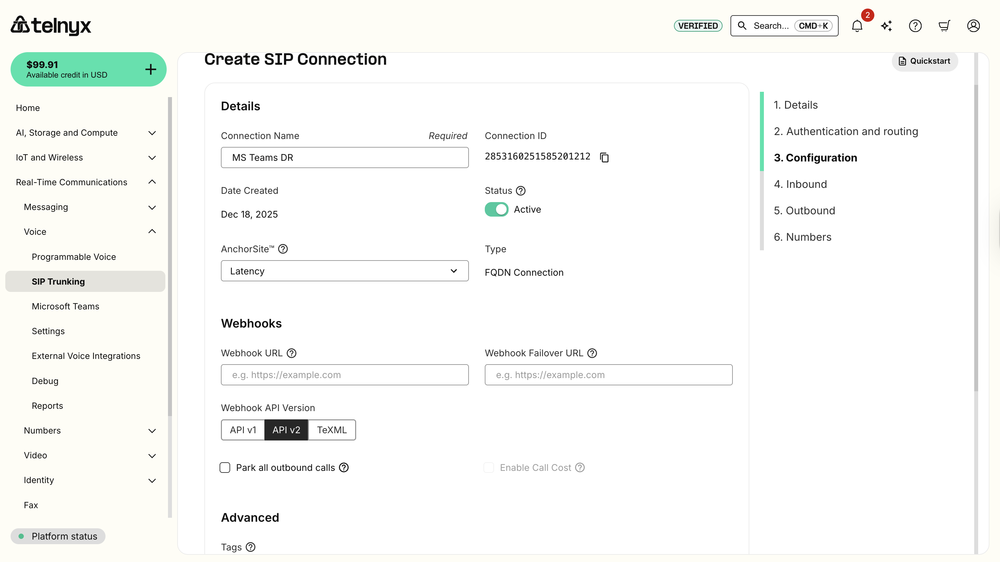

4. Scroll down and click **Next**.

### 2. Set Up Inbound and Outbound Details

Set up **Inbound** and **Outbound** details for the SIP Connection. You can also assign it an Outbound Voice Profile. For Outbound settings, keep in mind the details of the Outbound profile being assigned (visible under Voice > Settings > Outbound profiles).

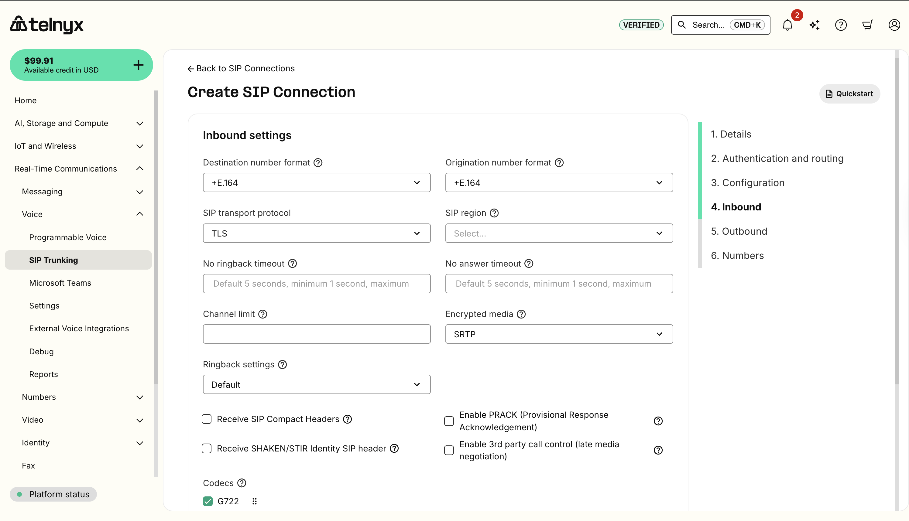

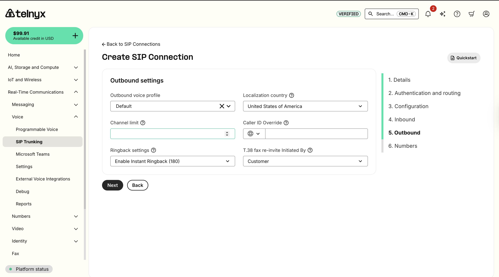

Click **Next**.

### 3. Assign a Number to the Telnyx SBC Connection

1. If you have not already, purchase a number from Telnyx.
2. Navigate to the Numbers section and assign the number to your connection.

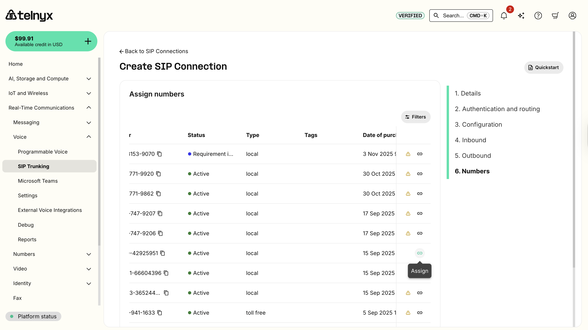

Alternatively, navigate to the Numbers page in the Telnyx Mission Control Portal and assign your MS Teams connection to the desired DID.


Click **Complete**.

### 4. Add a Subdomain to the Customer Tenant in Microsoft

1. Search for *Domains* within the Microsoft 365 admin center search bar.
2. Click **Add Domain** at the top left and add the auto-generated subdomain that corresponds to the SIP Connection created in step 1.

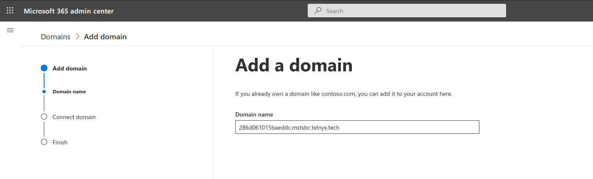

3. Click **Use This Domain** and verify the domain on the following page. Select **Add a TXT record instead**.

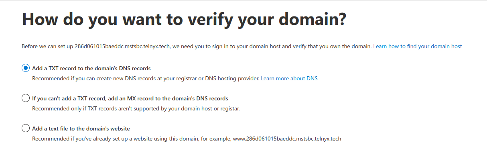

4. Click **Next** and take note of the TXT value displayed.

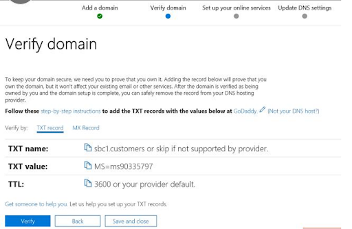

5. Navigate back to your MS Teams SBC SIP Connection settings in your Telnyx Mission Control Portal.
6. Navigate to the **Domain Validation** header in the top right corner of the window and paste the TXT Value from MS Teams into the **TXT Value** text box.

**Note:** The TXT Name and TTL fields should match the fields shown in the MS 365 admin center, hence why they cannot be edited. Any user who tries to set the `txt_name` on a MS DR connection to `*.mstsbc.telnyx.tech` will get an error that says:

```
txt_name should not include the '.mstsbc.telnyx.tech' suffix. Use only the identifier portion (e.g. '1234abc' instead of '1234abc.mstsbc.telnyx.tech')
```

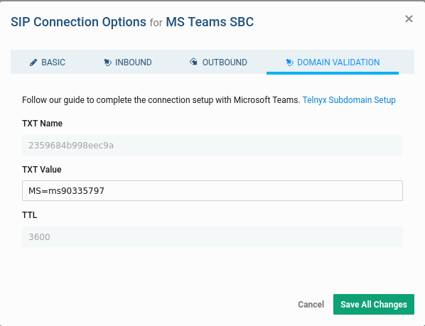

7. Click **Save All Changes**.
8. Navigate back to Microsoft 365 admin center and click **Verify** at the bottom.
9. On the next page, select **More Options**.
10. Select **Skip and do this later** and click **Next**.


11. You will be prompted that setup has been complete.

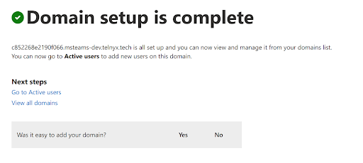

### 5. Activate the Subdomain

After registering a domain name, activate it by adding at least one user and assigning the domain that matches the subdomain auto-generated when the SIP Connection was created.

1. From Microsoft 365 Admin Center, navigate to **Users → Active Users → Add a user**.


2. Fill in the user details:
   - **Domain:** Select the Telnyx subdomain (i.e. *yyyy.mstsbc.telnyx.tech*)
   - Assign E5 license under "Product Licenses".
3. Click **Add**.

**Note:** You can remove the E5 license from this user once you are able to add this domain to Direct Routing.

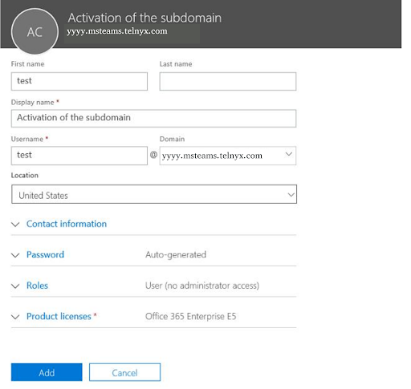

### 6. Add the Telnyx SBC in Direct Routing

1. In the left tab of the Microsoft Teams admin center, navigate to **Voice → Direct Routing**.
2. Click the **SBCs** tab.

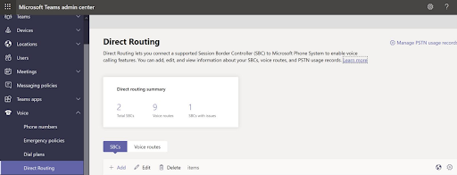

3. Click **Add** and enter the subdomain that was auto-generated in your SIP Connection.
4. Provide the following information:
   - **Enabled:** Toggle on
   - **SIP Signaling port:** *5061*
   - **Send SIP options:** Toggle on
   - **Forward P-Asserted-Identity (PAI) header:** Toggle on if you would like anonymous calls to connect.

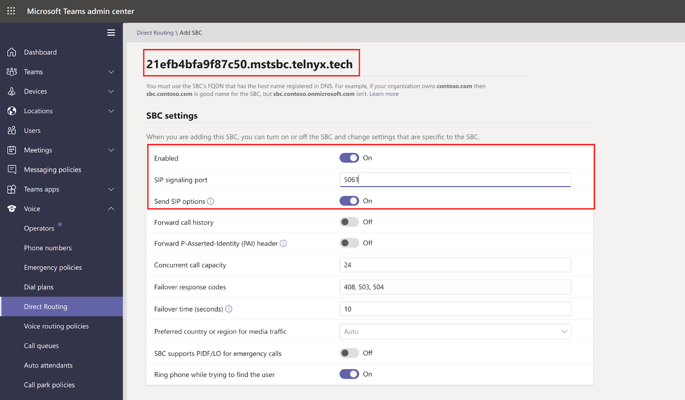

5. Click **Save**.


**Note:** Changes on the MS Teams admin portal may take up to 24 hours to take effect.

### 7. Create Voice Routes

1. In the left-hand navigation of your 365 admin portal, navigate to **Voice → Direct Routing**.
2. Select the **Voice routes** tab.
3. Click **Add**, and enter a name and description for your voice route.
4. Set the priority and specify the dialed number pattern as per Telnyx's number plan.

**For US numbers:**

- prepend: *1*; match pattern: *NXXNXXXXXX*
- prepend: blank; match pattern: *1NXXNXXXXXX*

**For International numbers:**

- prepend: Country Dialing prefix; match pattern: *NXXNXXXXXX*
- prepend: blank; match pattern: (Country Dialing prefix)*NXXNXXXXXX*


### 8. Enroll the SBC

1. From the **Direct Routing** page, navigate to **SBCs enrolled**.
2. Click **Add SBCs**.
3. Select the SBCs you want to enroll.
4. Click **Apply**.

### 9. Add the PSTN Usage Records

PSTN usage records specify a class of call (such as internal, local, or long distance) that can be made by a user or group of users in an organization.

1. From your Microsoft 365 admin portal, navigate to **Voice → Direct Routing** and find the **PSTN usage records** section.
2. Click **Add PSTN usage**.
3. Select the PSTN records you want to add.

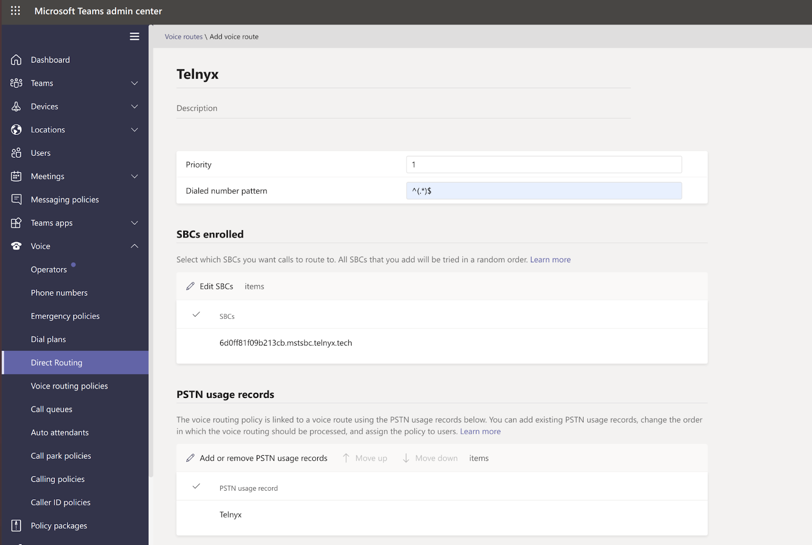

**Note:** This example includes "^(.*)$", which allows you to dial any destination. We recommend using a different pattern if you want to include restrictions.

4. Click **Apply**.
5. From the left-hand navigation, under **Voice**, click **Voice Routing Policies.**
6. In the **PSTN usage records** section, click **Add PSTN** usage.
7. Select *Telnyx*.

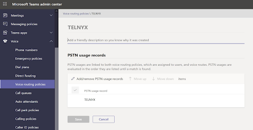

8. Click **Save**.

### 10. Configure Voice Routing Policies

1. From the left-hand navigation of the 365 admin portal, under **Voice**, click **Voice Routing Policies.**
2. Click **Add**.
3. Type **TELNYX** as the name and add a description.

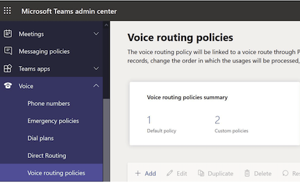

### 11. Assign Dial Plan and Voice Routing Policies

1. From the left-hand navigation of the 365 admin portal, click **Users**.
2. Click the **Policies** tab.
3. Select **Edit** and assign the following:
   - **Dial Plan:** *Telnyx*
   - **Voice Routing Policy:** *Telnyx*

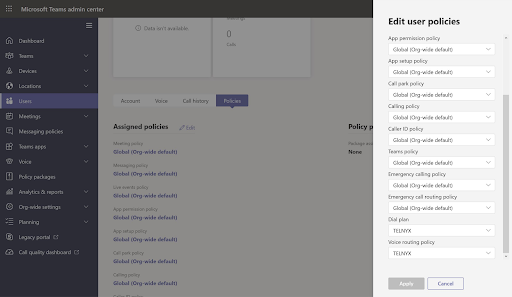

4. Click **Apply**.

### 12. Assign Telnyx DID to On-Premises PSTN Connectivity

Provision a user with an on-premises phone number. Go to [admin.teams.microsoft.com](http://admin.teams.microsoft.com/) > **Manage Users**. Click on the intended user.

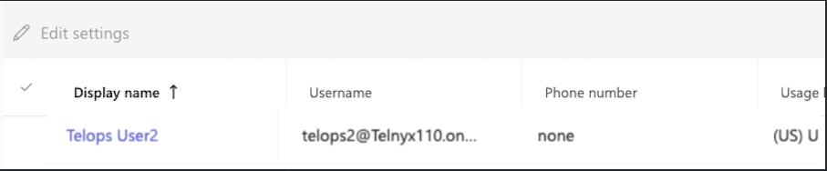

Under Account:

- Enable the toggle `Enterprise Voice`
- Click on `Assign a primary phone number`

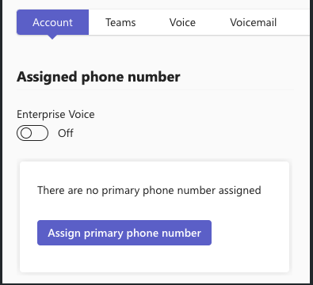

A new prompt will open to the side. Add the phone number and click **Apply**.

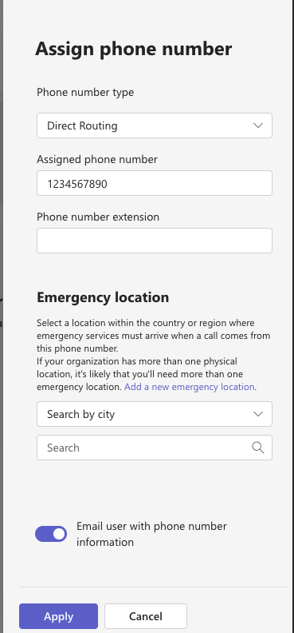

### 13. Make Test Calls with Microsoft Teams

1. Call a PSTN number from the Microsoft Teams client. Confirm that the call connects through Telnyx and that there is two-way audio.
2. Call a Telnyx DID that is assigned to both your new Microsoft Teams SIP Connection and one of your Microsoft Teams users from the PSTN (i.e. a cell phone). Confirm that the call is received in Microsoft Teams and that two-way audio is functioning correctly.
3. Check the CDRs from the **Reporting** section of your [Telnyx Mission Control Portal](https://portal.telnyx.com/) to validate that both calls went through correctly.

If you encounter any issues during these tests, contact [support@telnyx.com](mailto:support@telnyx.com) with a note of the number dialled and the date/time.
