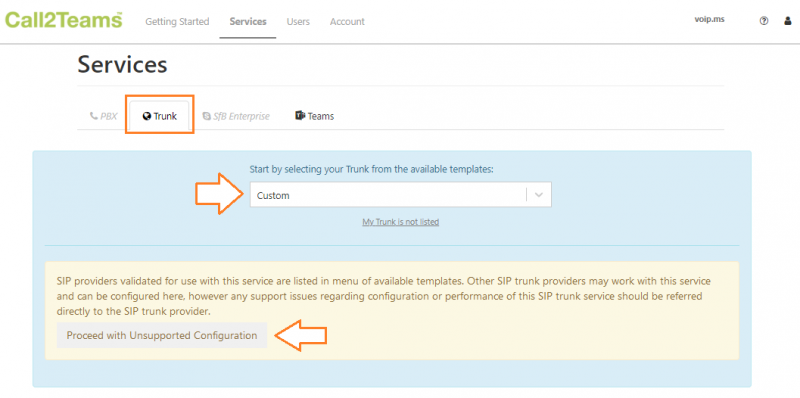

# Porting Numbers to Telnyx and Microsoft Teams Integration

*Part 4 of 6 — see also: [Part 1](porting-numbers-to-telnyx-and-microsoft-teams-integration--part-1.md), [Part 2](porting-numbers-to-telnyx-and-microsoft-teams-integration--part-2.md), [Part 3](porting-numbers-to-telnyx-and-microsoft-teams-integration--part-3.md), [Part 5](porting-numbers-to-telnyx-and-microsoft-teams-integration--part-5.md), [Part 6](porting-numbers-to-telnyx-and-microsoft-teams-integration--part-6.md)*

This page covers how to find a porting PIN or passcode from common carriers, port numbers away from specific providers (Twilio, voip.ms, Microsoft Teams) into Telnyx, and configure Microsoft Teams with Telnyx using Direct Routing, Operator Connect, or Call2Teams, including emergency call routing.

## MS Teams: Call2Teams & Telnyx

[Microsoft Call2Teams](https://www.call2teams.com/) is an add-on for Office 365 that connects Microsoft Teams to any PBX or [SIP Trunk](https://telnyx.com/products/sip-trunks), allowing you to make and receive calls on any device using the Microsoft Teams App.

### Pre-requisites

- Your Telnyx Portal must be correctly [set up and configured for use](https://support.telnyx.com/en/articles/1176636-get-started-with-a-mission-control-account)
- Have your SIP Credentials (the username/password for your main SIP account or SIP sub-account)
- Have [DID(s) available](https://support.telnyx.com/en/articles/4380325-search-and-buy-numbers) to assign
- A PC running a Windows OS
- Create a temporary spare user license on Microsoft 365
- Global admin access to your Microsoft 365 tenant
- Create a Call2Teams subscription

### 1. Set Up the Office 365 Tenant

1. Once you have created your subscription to Call2Teams, you will receive an email inviting you to the portal. Click **Accept Invitation** and use your Office 365 account to log in. Make sure this account is associated with the organization you are configuring Call2Teams for and that you have global-level access.
2. Give Call2Teams permission to connect to your 365 account. You **must** check the **Connect on behalf of your organization** checkbox.

3. Click **Accept**.

### 2. Connect to Telnyx and Create a SIP Trunk

1. From the Call2Teams admin portal, click on the **Service** tab in the top navigation.
2. Find the **Trunk** tab. Click on this, then click **Add New Trunk**.
3. Select from a list of verified providers with pre-configured profiles. As of the time of writing, Telnyx is not yet on this list, so select **Custom**. You will get a message telling you that any Telnyx-specific support cannot be handled by Microsoft at this time. Click **Proceed with Unsupported Configuration**.

4. Enter your Telnyx account information:
   - **Service Name**: *Telnyx Trunk 1*
   - **Country**: Your Country
   - **State/Province**: Your State/Province
   - **Range Start/Range End**: Use your Telnyx DIDs. Ensure that you add + plus your country code before entering your DID. If you have more than one DID that you would like to add and they are not sequential, add each of these DIDs on both the **START Range** and the **Range END** fields. Add each DID separately by clicking **+ Add Additional Range.**
   - **SIP Domain**: *sip.telnyx.com*
   - **Authenticate Type**: *Registration*
   - **Username**: Your Telnyx account/sub-account username
   - **Auth Username**: Your Telnyx account/sub-account username
   - **Password**: Your Telnyx account/sub-account password
   - **Expiry (seconds)**: If you want, click on the padlock, and enter *300*. You can also leave this blank.
   - **Protocol**: *UDP* or *TCP*
   - **Encrypt Media**: *No*
   - **Propagate Refer**: *Yes* (Select *Yes* to propagate received SIP REFER messages from Microsoft upstream to this service. If set to *No* then transfers are bridged out as new calls. On the 2nd Gen OneClick Teams connector, select *Yes* if you have users in a Call Center, but otherwise select *No* as this will allow consultative transfers to work better.)
   - **Outside Line Prefix**: Leave this option blank
   - **E164 Number Format**: *Localized*
   - **From Header**: *SIP Identifier*
   - **P-Asserted-Identity Header**: This will be the outbound caller ID Name. Choose *Passthrough Caller Id* (the caller ID given by the far end, e.g. Teams user extension name) or *Trunk User Number* (to display the phone number assigned to the user in the portal).
   - **E164 Number Translation** (The incoming number needs to be converted to E164 format):
     - **Outbound International Prefix**: *011*
     - **Outbound National Prefix**: Leave blank
     - **Inbound International Prefix**: Indicate
     - **Inbound National Prefix**: Leave blank

5. Click **Add Trunk**.
6. Your new trunk will appear in your list. Click on the Trunk tab to see your list at any time. You can also monitor the health of your Trunk from this list.

### 3. Associate a Number with a Team Member

1. Click on the **Users** tab in the top navigation.
2. Click **Add New User** and provide the following information:
   - **Select a User:** Select the user intended for the number.
   - **PBX/Trunk:** Select a trunk you have created.
   - **Select a Trunk Number:** Select the DID intended for this user.

3. Click **Add**, followed by **Sync Now** in the upper right.
