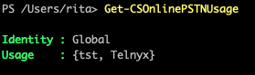
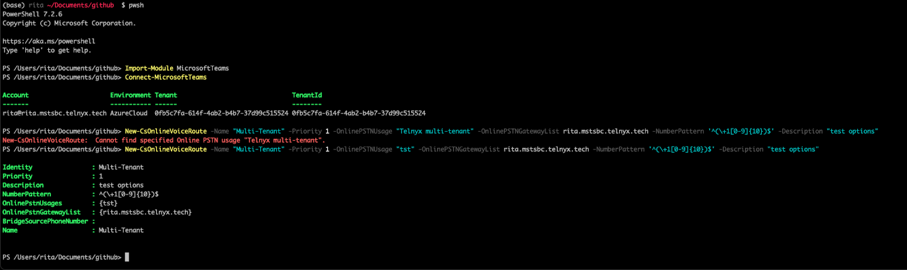
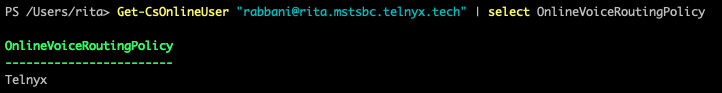
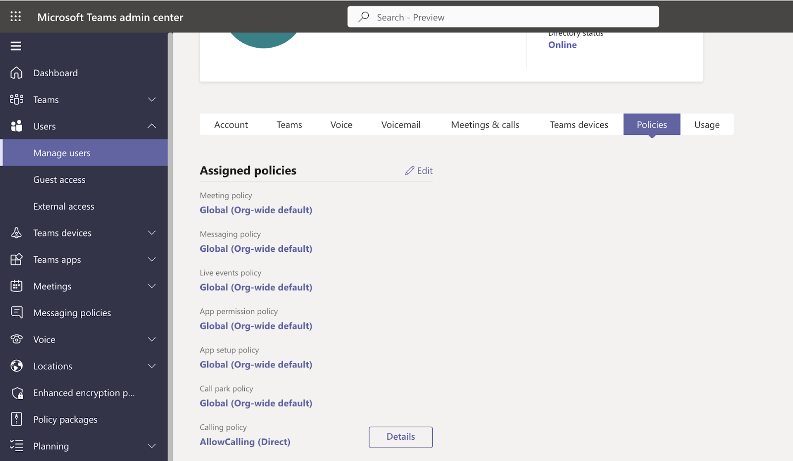
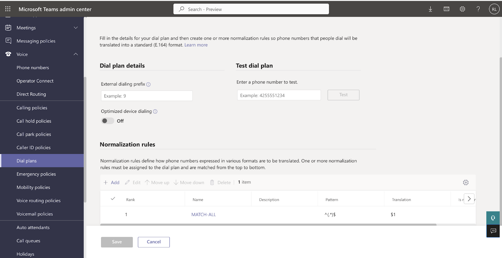
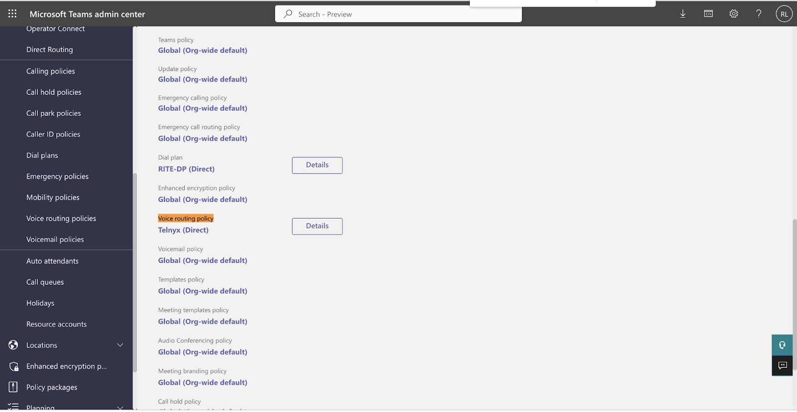

# Porting Numbers to Telnyx and Microsoft Teams Integration

*Part 5 of 6 — see also: [Part 1](porting-numbers-to-telnyx-and-microsoft-teams-integration--part-1.md), [Part 2](porting-numbers-to-telnyx-and-microsoft-teams-integration--part-2.md), [Part 3](porting-numbers-to-telnyx-and-microsoft-teams-integration--part-3.md), [Part 4](porting-numbers-to-telnyx-and-microsoft-teams-integration--part-4.md), [Part 6](porting-numbers-to-telnyx-and-microsoft-teams-integration--part-6.md)*

This page covers how to find a porting PIN or passcode from common carriers, port numbers away from specific providers (Twilio, voip.ms, Microsoft Teams) into Telnyx, and configure Microsoft Teams with Telnyx using Direct Routing, Operator Connect, or Call2Teams, including emergency call routing.

## TLS & SIP Warnings for Teams

If you already have Microsoft Teams Direct Routing configured with an SBC, you may encounter warnings related to TLS connectivity and SIP Options status. While these warnings do not impact call quality or reliability, we recommend implementing the following setup to address any potential configuration issues.

You will need PowerShell installed. To install PowerShell on Windows, follow [this article](https://learn.microsoft.com/en-us/powershell/scripting/install/install-powershell-on-windows?view=powershell-7.4&viewFallbackFrom=powershell-7.3). To install PowerShell on Mac, follow [this article](https://learn.microsoft.com/en-us/powershell/scripting/install/install-powershell-on-macos?view=powershell-7.4&viewFallbackFrom=powershell-7.3).

### Run PowerShell

- **Windows:** Run *cmd.exe* and execute `PowerShell`.
- **Mac:** Run Mac Terminal and execute `pwsh`.

Import the Microsoft Teams module if you do not already have it:

```
Import-Module MicrosoftTeams
```

Connect to the Customer tenant:

```
Connect-MicrosoftTeams
```

A window will pop up for credentials.

### Add a New Online PSTN Usage

```
Set-CsOnlinePstnUsage -Identity Global -Usage @{Add="Telnyx"}
```

Verify the usage was created:

```
Get-CSOnlinePSTNUsage
```



### Add a New Voice Profile

This uses the subdomain previously verified on the account. Associate the existing subdomain auto-generated in the Telnyx SIP connection to the new Voice Profile.


Run the following command (tailored to your configuration):

```
New-CsOnlineVoiceRoute -Name "Multi-Tenant" -Priority 1 -OnlinePSTNUsage "Telnyx" -OnlinePSTNGatewayList <string_from_the_telnyx_portal_connection>.mstsbc.telnyx.tech -NumberPattern '^(\+1[0-9]{10})$' -Description "Telnyx"
```



From now on, on the customer tenant there are no OPTIONS to check, just the voice route.

### Add a New Routing Policy

```
New-CsOnlineVoiceRoutingPolicy "Telnyx" -OnlinePstnUsages "Telnyx"
```

```
Grant-CsOnlineVoiceRoutingPolicy -Identity "<user_email>" -PolicyName "Telnyx"
```

Verify the Voice Routing Policy was correctly created and attached to the user:

```
Get-CsOnlineUser "<your_user>@<string_from_the_telnyx_portal_connection>.mstsbc.telnyx.tech" | select OnlineVoiceRoutingPolicy
```



### User Policy

- **CallingPolicy: Allow Calling** — Create a new Calling Policy in **Voice** > **Calling Policies** in the Teams Admin center.


Associate a calling policy to a user: **Users** > Select the user you want to allow to make calls > **Policies** > **Assigned policies** > **Calling policy** > <**Name_of_your_Calling_Policy**>.



- **DialPlan** — Create a new Dialplan in **Voice** > **Dial Plans**.



Associate it to the desired user: **Users** > Select the user > **Policies** > **Assigned policies** > **Dial plan** > <**Your_Dial_Plan_Name**>.


- **Voice routing policy** — The one created in PowerShell, which can also be consulted in **Voice** > **Voice Routing Policies**. Associate it to the user: **Users** > Select the user > **Policies** > **Assigned policies** > **Voice Routing Policy** > <**Your_Voice_Routing_Policy_Name**>.



### Ensure the User is Enabled for Enterprise Voice

Run the following command in PowerShell:

```
Get-CsOnlineUser -Identity "<user_email>"
```

If you encounter a similar output (with the appropriate names, times, and regions), please note that it may take up to 30 minutes for the changes to be fully implemented and take effect. After this period, everything should be working as intended.
