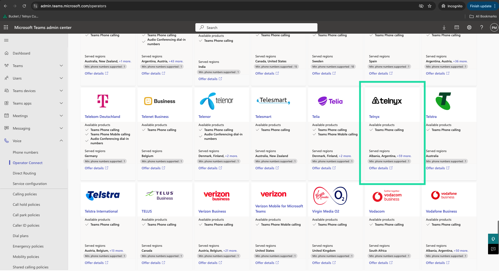
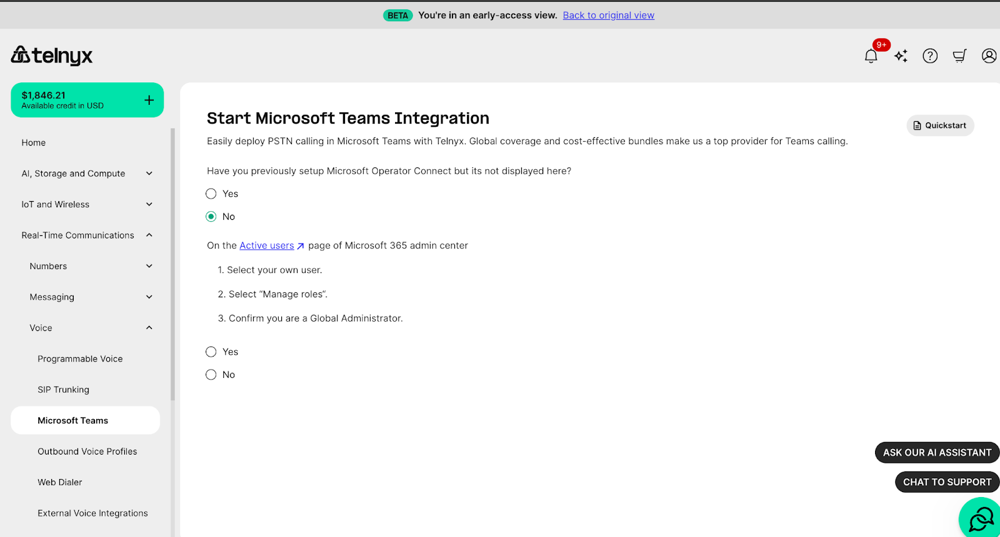
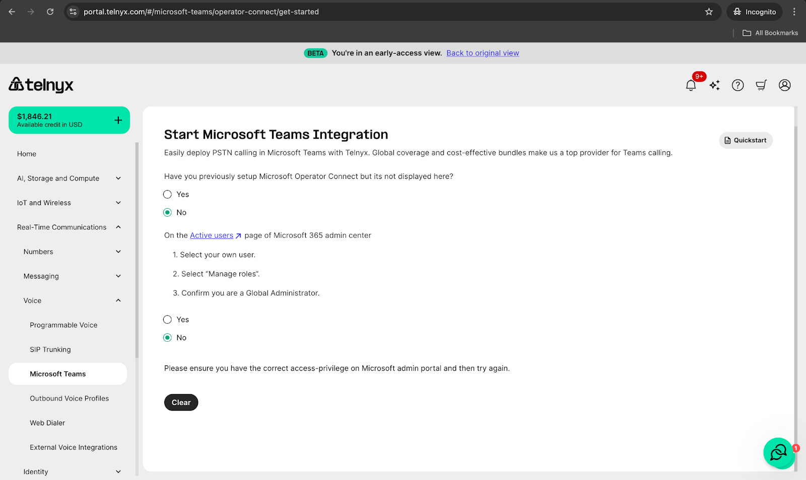

# Porting Numbers to Telnyx and Microsoft Teams Integration

*Part 6 of 6 — see also: [Part 1](porting-numbers-to-telnyx-and-microsoft-teams-integration--part-1.md), [Part 2](porting-numbers-to-telnyx-and-microsoft-teams-integration--part-2.md), [Part 3](porting-numbers-to-telnyx-and-microsoft-teams-integration--part-3.md), [Part 4](porting-numbers-to-telnyx-and-microsoft-teams-integration--part-4.md), [Part 5](porting-numbers-to-telnyx-and-microsoft-teams-integration--part-5.md)*

This page covers how to find a porting PIN or passcode from common carriers, port numbers away from specific providers (Twilio, voip.ms, Microsoft Teams) into Telnyx, and configure Microsoft Teams with Telnyx using Direct Routing, Operator Connect, or Call2Teams, including emergency call routing.

## Operator Connect Guide - Microsoft Teams

Use Telnyx Operator Connect to connect Microsoft Teams Phone users to PSTN calling through Telnyx. Operator Connect lets you enable Telnyx as an operator in the Microsoft Teams admin center, synchronize your Microsoft tenant with Telnyx, add or port phone numbers, and assign those numbers to Teams users.

Unlike Direct Routing, Operator Connect does not require you to configure or manage your own SBC, voice routes, or PSTN usage records in Microsoft Teams. Telnyx provides the operator-managed PSTN connectivity.

### Minimum Requirements

- A Telnyx portal account. If you do not have one, [sign up](https://telnyx.com/sign-up) here.
- Access to the Telnyx Microsoft Teams or Operator Connect setup flow.
- Microsoft 365 administrator access with permission to manage Teams voice settings.
- Access to the Microsoft Teams admin center.
- Users who are licensed for Teams Phone.
- At least one Telnyx number available for Operator Connect, or a porting plan for numbers you want to move to Telnyx.
- Emergency address information for numbers that require emergency-service configuration.

Microsoft 365 E5 or Office 365 E5 is not the minimum requirement for Operator Connect. E5 is sufficient because it includes Teams Phone, but Operator Connect users only need the required Microsoft Teams and Teams Phone entitlements for their plan.

References:

- [Microsoft Operator Connect planning requirements](https://learn.microsoft.com/en-us/microsoftteams/operator-connect-plan)
- [Microsoft Operator Connect configuration](https://learn.microsoft.com/en-us/microsoftteams/operator-connect-configure)
- [Microsoft Teams Phone licensing](https://learn.microsoft.com/en-us/microsoftteams/teams-add-on-licensing/microsoft-teams-add-on-licensing)

### Step 1: Log In to Telnyx and the Microsoft Teams Admin Portals

- Log into the [Mission Control Portal](https://portal.telnyx.com).
- Log into your [Microsoft Teams account](https://admin.teams.microsoft.com/) with a valid admin account. Note the email associated with your Telnyx account — this will be needed when setting up the integration between Telnyx and Microsoft.

### Step 2: Navigate to the Microsoft Teams Section

- On the left-hand menu, navigate to the Microsoft Teams tab.
- Check if you have already configured Operator Connect in your environment. If not, follow the setup wizard in the Admin Dashboard by clicking **Get Started**.

### Step 3: Verify Your Email Address

- In the Microsoft Teams Admin, navigate to the [Operator Connect](https://admin.teams.microsoft.com/operators) tab under the Voice section on the left-hand menu. Verify that **Telnyx** is listed among your available operators.

- Ensure the contact email in the Operator Setting page in the Microsoft Teams Admin Portal matches the email address associated with your Telnyx portal account.
- When you have confirmed the email address in both systems, select **Yes** in the setup Wizard in the Mission Control Portal. This will start a synchronization of your Telnyx and Microsoft Teams account.
- If your accounts do not immediately sync, wait 24 hours and check again before reaching out to support.

### Step 4: Associate Your Telnyx Numbers to Your Microsoft Integration

If any of the steps above are a "No", you will receive specific instructions on how to resolve the issue from the wizard.

Ensure you have entered the correct details in both the Microsoft Teams Admin Dashboard and your Telnyx portal account to avoid setup errors.

### Assigning a Number

In your connections on the Teams page, click the edit button (Pencil Icon) — it will open the settings tab. Select the next **Numbers** tab.

If you do not have numbers already added, select **Add Numbers**.

Select which Agent will be using the app (Human or Voice App), and select the country your number will be used from. Click **Next**.

If you have already purchased your numbers, they will show up in the list. Otherwise, select **Buy Numbers** which will redirect you to the Buy Numbers Page. Search and purchase numbers there.

Move back to **Add numbers to this connection** under Teams and add numbers to your Operator Connect setup. Add an Emergency address from the drop-down and click **Submit**.

Confirm Charges and on the next page your numbers will appear in the **Number History** tab list with the Status of the connection. Orange = Not yet ready, Green = Ready to use. Use the refresh button on the right to check status updates.

You can find your available numbers in the **Numbers** Tab.

Now that your numbers are connected, go to the [Phone Numbers](https://admin.teams.microsoft.com/phone-numbers) page on the Teams Admin and assign a number to a User. Select Number, click Edit, then search for a user to assign and click **Apply**.

Finally, test your App by calling from [Teams](https://teams.microsoft.com/v2/) and back. Your Assigned number will show up below the dial pad.

### Tips - Emergency Address in Shared Calling Policies in Teams

When setting emergency addresses for MSFT Teams, make sure these steps are followed to ensure they are properly routed when users call emergency services or when users are called back:

- Ensure emergency calling policy is set and assigned to users.
- Dynamic emergency calling is set to on. This will ensure the actual address is always sent when the emergency call is placed.
- Static Emergency address in Teams settings is correctly set, as Microsoft will fall back to it if the dynamic address is not available.

### Pricing

Customers can find pricing for Operator Connect bundles on the [Bundles Pricing Page](https://portal.telnyx.com/#/bundles/order) in the portal.

## Microsoft Teams Emergency Call Routing

Ensuring that emergency calls are routed accurately and efficiently is critical. Microsoft Teams integrates advanced technologies to support emergency services, ensuring that when a call is made to emergency numbers, it is quickly and correctly routed to the correct Public Safety Answering Point (PSAP).

One key component in this process is the use of [Dynamic Location Routing](https://learn.microsoft.com/en-us/microsoftteams/configure-dynamic-emergency-calling). This feature ensures that emergency calls made through Microsoft Teams are directed to the right location, taking into account the caller's current position.

### Technical Overview

**PIDF-LO** (Presence Information Data Format Location Object) is a standardized protocol crucial for enhancing the effectiveness of emergency calls by embedding precise location data. This information is essential for VoIP providers, enabling them to route calls accurately to the appropriate Emergency PSAP.

Telnyx leverages Microsoft's **Dynamic Location Routing** to ensure rapid and accurate routing of emergency calls. In this implementation, Microsoft Teams includes emergency address details within the SIP INVITE MIME part. Telnyx then processes this information to route the call accurately to the appropriate emergency PSAP.

The current methods for PIDF-LO supported are LIS or ASSIST. The XML data is processed by Telnyx to determine the correct PSAP for routing the emergency call. By leveraging this technology, Microsoft Teams and Telnyx ensure that every emergency call is handled with the utmost accuracy.

See also [E911 Setup Guide](e911-setup-guide.md) and [How do I test E911 service?](how-do-i-test-e911-service.md).
