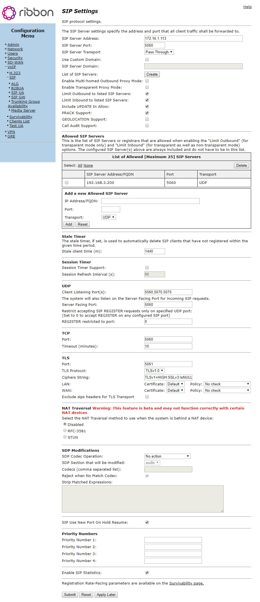
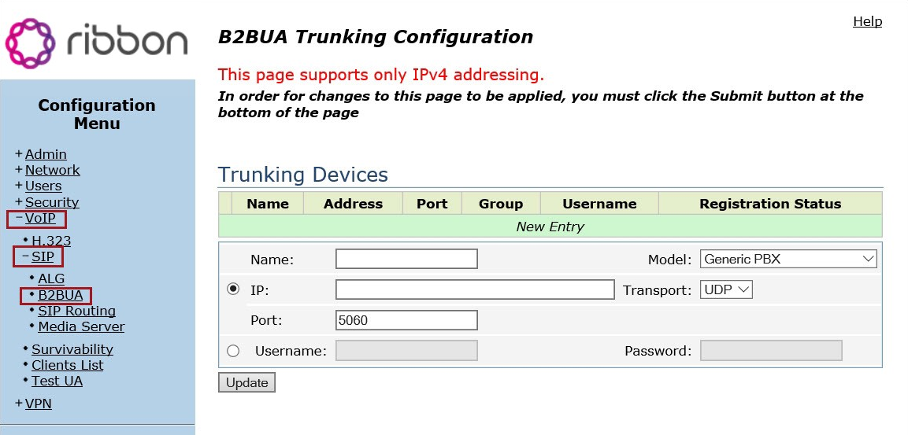
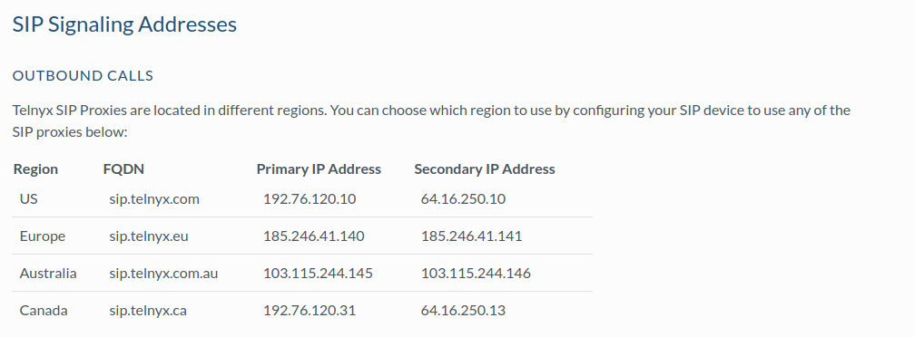

# SBC and Gateway Setup with Telnyx

*Part 2 of 3 — see also: [Part 1](sbc-and-gateway-setup-with-telnyx--part-1.md), [Part 3](sbc-and-gateway-setup-with-telnyx--part-3.md)*

Consolidated setup guides for configuring Oracle Acme Packet, Audiocodes, Ribbon EdgeMarc 6000, Sansay VSXi, and Mediatrix C7/4100 SBCs and gateways with the Telnyx Mission Control Portal, including SIP trunk, session agent, codec, and telephony port configuration.

## Audiocodes SBC Setup

[Audiocodes SBC devices](https://www.audiocodes.com/solutions-products/products/session-border-controllers-sbcs) provide SIP trunk connectivity, security, and media handling for enterprise and service-provider environments. They support SIP-to-TDM and SIP-to-SIP hybrid functionality.

### Configure the Audiocodes SBC Using INI

**Define the IP Group:**

```
[ IPGroup ]
IPGroup_Description:  Telnyx
IPGroup_SIPGroupName: sip.telnyx.com
[ \IPGroup ]
```

**Define the SIP Proxy:**

```
[ ProxyIp ]
FORMAT ProxyIp_Index = ProxyIp_IpAddress, ProxyIp_TransportType, ProxyIp_ProxySetId;
ProxyIp 1 = "192.76.120.10/32:5060", 0, 1;
ProxyIp 2 = "64.16.250.10/32:5060", 0, 1;
[ \ProxyIp ]
```

**Define Coders:**

```
[ CodersGroup0 ]
CodersGroup0_Name:        g711ulaw64k
CodersGroup0_pTime:       20
CodersGroup0_PayloadType: 0
[ \CodersGroup0 ]
```

Depending on requirements, additional configuration such as IP profiles and routing may be needed.

Additional resources: [Audiocodes SBC documentation](https://www.audiocodes.com/library/technical-documents?productFamilyGroup=1637), [Audiocodes SBC interoperability list](https://www.audiocodes.com/partners/interoperability-list), [Audiocodes support](https://www.audiocodes.com/services-support).

---

## Ribbon EdgeMarc 6000 Setup

The [Ribbon EdgeMarc 6000](https://ribboncommunications.com/solutions/enterprise-solutions/secure-cloud-communications-solutions/microsoft-solutions-teams-direct-routing) is an Intelligent Edge device that acts as a demarcation/control point with physical telephony ports and the ability to run virtual network functions. This guide is also compatible with EdgeMarc VOS 15.7.

Additional prerequisites for this device include creating an [IP authentication connection](https://support.telnyx.com/en/articles/2602782-ip-authentication-with-tech-prefix) in Mission Control Portal.

### 1. Configure SIP Settings

1. [Log into EdgeMarc](https://rbbn.my.site.com/Support/login).
2. From the left navigation, choose **VoIP > SIP** to open the **SIP Settings** page.
3. In the **SIP protocol settings** section, configure:
   - **SIP Server Address:** `sip.telnyx.com`
   - **SIP Server Port:** `5060`
   - **SIP Server Transport:** `UDP`
   - **Use Custom Domain:** Check the box
   - **SIP Server Domain:** `sip.telnyx.com`
   - **Limit Inbound to listed Proxies:** Check the box
   - **Limit Outbound to listed Proxies:** Check the box



### 2. Define SIP Trunk Registration

1. From the left navigation, choose **VoIP > SIP > B2BUA**.
2. In the **Trunking Devices** section, click **New Row** and provide:
   - **Name:** Identifier for the trunking device
   - **Model:** Select your PBX from the drop-down
   - **IP:** Select the IP radio button and enter the PBX IP address
   - **Transport:** `TLS` if using TLS encryption, otherwise `UDP` or `TCP`
   - **Port:** `5060` (or `5061` for TLS)



3. Click **Update** to create the trunking device, then **Submit** to push the configuration to the EdgeMarc.

### 3. Configure Inbound Rules

1. From the left navigation, choose **VoIP > SIP > B2BUA** and click the **Match** tab.
2. Click **New Row** and provide:
   - **Direction:** `Inbound`
   - **Mode:** `BothModes`
   - **Default:** Select the radio button
   - **Action:** `Inbound`

### 4. Configure Outbound Rules

1. From the left navigation, choose **VoIP > SIP > B2BUA** and click the **Match** tab.
2. Click **New Row** and provide:
   - **Direction:** `Outbound`
   - **Mode:** `BothModes`
   - **Pattern:** Select the radio button, then choose `Calling` from the drop-down
   - **Called/Calling Party:** Enter `.` to allow all callers, or pattern-match (e.g., `1312270X`)
   - **Source:** `Any`
   - **Action:** `Outbound`
3. Click **Update**, then **Submit** to push the configuration.

Additional resources: [EdgeMarc 6000 documentation](https://rbbn.my.site.com/Support/login), [EdgeMarc/Ribbon support](https://ribboncommunications.com/services/ribbon-support-portal), [EdgeMarc VoIP settings overview](https://rbbn.my.site.com/Partners/login).

---

## Sansay SBC VSXi Setup

The [Sansay VSXi session controller](https://www.sansay.com/products/vsxi/) is a high-performance software SBC for service providers, providing security, DDoS protection, NAT, protocol interworking, traffic management, and digit mapping for ANI/DNIS manipulation.

### 1. Create Resources

1. Log into the Sansay portal and select **Resources** from the navigation.
2. Create two new resources — one for the inbound trunk and one for the outbound trunk.

### 2. Define Resource Settings for the Inbound Trunk

Configure the SIP server information for the inbound trunk:

- **Resource Type:** `Inbound`
- **Resource Type:** `Peering`
- **Protocol:** `SIP`
- **SIP Profile:** `SIP_Peering:0`

**General Info:**

- **SIP Trunk ID:** `1000`
- **Trunk name:** `Telnyx Inbound`
- **Company Name:** `Telnyx`
- **Route Table:** `*:0`
- **Remote Port:** `5060`
- **Service Port:** `SIP Public Default 1:1`
- **Aggregate Capacity:** `1200`
- **Average CPS Limit:** `500`
- **Authorized RPS:** `500`
- **Unauthorized RPS:** `500`
- **Group Policy:** `Round Robin`
- **Digit Mapping Table:** `no-translation:0`
- **Min Call Duration:** `0`
- **Max Call Duration:** `43200`
- **RTP TOS:** `B8`
- **Direction:** `Both`
- **Service State:** `inservice`
- **Allow Direct Media:** `No`
- **No Answer Timeout:** `120`
- **No Ring Timeout:** `30`
- **Option Poll:** `Disable`
- **Cause Code Profile:** `Default:0`
- **Stop Route Profile:** `Default:0`
- **PAI:** `Disable`

**Digit Translation & RN Handling:**

- **Ingress & Egress:** `all`
- **Outbound ANI:** `pass`
- **Tech Prefix:** `default`

**Codec Info:**

- **Policy:** `enforced`
- **Codec 1:** `g711u64k`
- **Codecs 2–8:** `None`

**Fqdns Info:**

Review the [Telnyx signalling IP addresses](https://sip.telnyx.com/#signaling-addresses) and [media IP addresses](https://sip.telnyx.com/#media) for the proxies and media servers relevant to your location.




Click **Save as** then **Submit**.

### 3. Define Resource Settings for the Outbound Trunk

Use the same settings as the inbound trunk with the following changes:

- **SIP Trunk ID:** `1001`
- **Trunk name:** `Telnyx Outbound`

All other parameters (General Info, Digit Translation & RN Handling, Codec Info, Fqdns Info) match the inbound trunk configuration.


Click **Save as & Submit** to push the configuration to Sansay.

Additional resources: [VSXi datasheet](https://www.sansay.com/wp-content/uploads/2013/05/Sansay_VSXi_Session-Controller_9_2013.pdf), [Contact Sansay](https://www.sansay.com/contact-us/), [VSXi REST API](https://support.sansay.com/t/36d6tz/vsxi-rest-api), [VSXi knowledgebase](https://www.sinsay.com/sq/en/faq).

---
