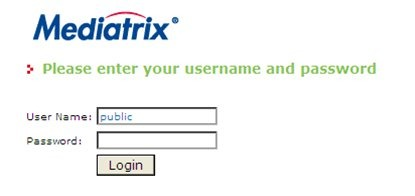
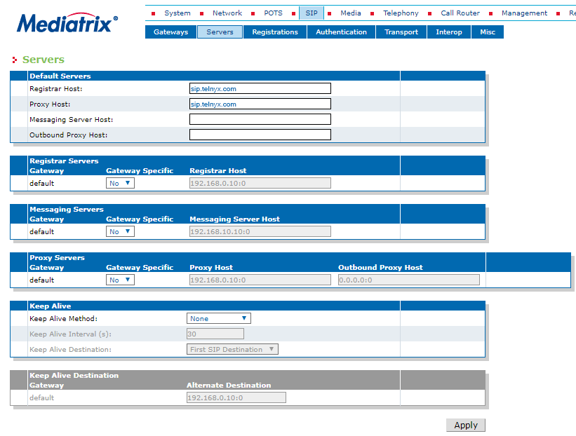
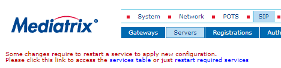
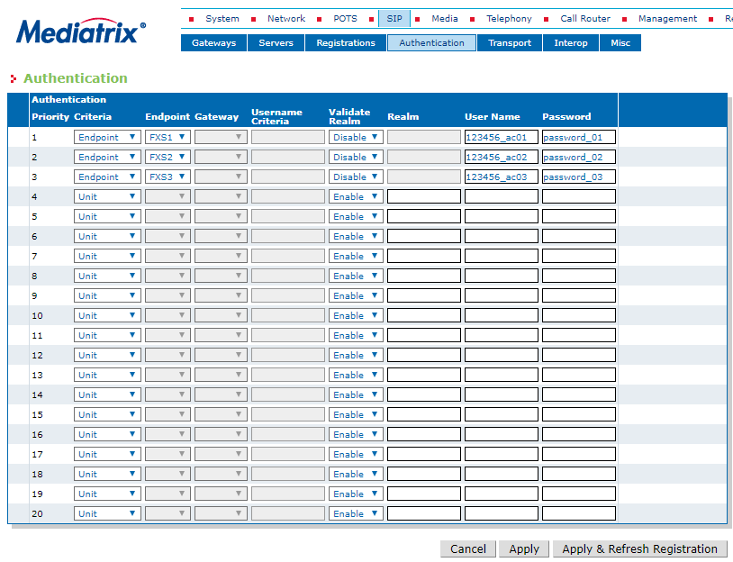
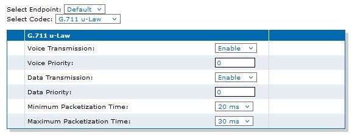

# SBC and Gateway Setup with Telnyx

*Part 3 of 3 — see also: [Part 1](sbc-and-gateway-setup-with-telnyx--part-1.md), [Part 2](sbc-and-gateway-setup-with-telnyx--part-2.md)*

Consolidated setup guides for configuring Oracle Acme Packet, Audiocodes, Ribbon EdgeMarc 6000, Sansay VSXi, and Mediatrix C7/4100 SBCs and gateways with the Telnyx Mission Control Portal, including SIP trunk, session agent, codec, and telephony port configuration.

## Mediatrix C7/4100 Setup

The [Mediatrix C7 Series gateways](https://documentation.media5corp.com/pages/viewpage.action?pageId=16547905) combine a VoIP analog adaptor and media gateway with FXS, FXO, and BRI interfaces. The setup criteria for the Mediatrix 4100 are the same; differences are called out where they exist.

It is strongly recommended that the device has the latest firmware from the [Mediatrix download page](https://documentation.media5corp.com/display/DGWLATEST/Latest+DGW).

### 1. Connect the Device to the Network

1. The C7 and 4100 each have two ethernet ports:
   - Connect the device to your router/network via **ETH1** (**WAN** on the 4100). It is set to obtain an IP address via DHCP.
   - **ETH2** (**LAN** on the 4100) has a default IP of `192.168.1.2` and is used to manage the device directly via a web browser.
2. Check the Power LED:
   - If **ON**, connect a phone to a telephony port and dial `*#*0` to hear the device's IP address. Note it for the next step.
   - If **OFF**, verify the network cable is connected, the router/switch port is active, or connect the device to a computer via **ETH2/LAN**.

### 2. Access the Mediatrix GUI

1. From a computer on the same network, open a web browser and enter the IP address from the previous step.
2. Log in with the default credentials:
   - **Username:** `public`
   - **Password:** (empty)

### 3. Set the Telnyx Server FQDN

1. Click **SIP** in the top menu, then **Servers**.
2. Set **Registrar Host** to your registrar FQDN (e.g., `sip.telnyx.com`).
3. Set **Proxy Host** to your proxy FQDN (e.g., `sip.telnyx.com`).
4. Click **Apply**.

### 4. Restart Required Services

After clicking **Apply**, a message at the top of the screen prompts a services restart. Either open the **Services Table** and restart manually, or click **Restart Required Services** from the link in the message.

### 5. Register Telephony Ports

1. Click **SIP** in the top menu, then **Registrations**.
2. For each analog port to register, provide:
   - **Username:** Associated Telnyx username for your account or sub-account
   - **Friendly Name:** Display name for outbound calls
   - **Register:** Enable
3. Click **Apply**.

### 6. Set the Telnyx Credentials

1. Click **SIP** in the top menu, then **Authentications**.
2. Click **Edit All Entries** to open the telephony port entries.
3. For each registered entry, configure:
   - **Criteria:** `Endpoint`
   - **Endpoint:** Select the telephony port to register
   - **Validate Realm:** `Disable`
   - **Username:** Telnyx account/sub-account username
   - **Password:** Telnyx account/sub-account password
4. Click **Apply & Refresh Registration**.

### 7. Set Auto-Routing for the Telnyx Username Format

1. Click **Call Router** in the top menu, then **Auto-routing**.
2. Configure:
   - **Auto-routing:** `Enable`
   - **Criteria Type:** `SIP Username`
3. Click **Apply**.

4. Verify by clicking **Status** under **Call Router** and confirming auto routes are present in the **Route** table.

### 8. Disable G.711 a-law Codec (North America Only)

In North America and Japan, µ-Law is the standard voice encoding. Disable G.711 a-law and configure µ-Law:

1. Click **Media** in the top menu, then **Codecs**.
2. Find **G.711 a-law** and disable it for both **Voice** and **Data**.
3. Click **Apply**.

4. Perform a services restart.
5. Find **G.711 µ-Law** and click the pencil icon under **Advanced**.
6. Set:
   - **Minimum Packetization:** `20ms`
   - **Maximum Packetization:** `30ms`
7. Click **Apply**.

### 9. Set Dial Patterns (DTMF Maps)

1. Click **Telephony** in the top menu, then **DTMF Maps**.
2. In the second row, configure:
   - **DTMF Map:** `*xx`
   - **Transformation:** `x`
3. Click **Apply**.

### 10. (Optional) Set a Time Server

If your DHCP server does not provide an SNTP server, configure one manually:

1. Click **Network** in the top menu, then **Host**.
2. In the **SNTP Configuration** table, set:
   - **SNTP Configuration Source:** `Static`
   - **Primary SNTP:** `pool.ntp.org` (or any reachable SNTP server)
3. Click **Apply**.

Additional resources: [Mediatrix technical documentation](https://documentation.media5corp.com/pages/viewpage.action?pageId=16547905).

---

## Related Setup Guides

- [Oracle: Acme Packet SBC Setup](oracle-acme-packet-sbc-setup.md)
- [Audiocodes SBC: Setup](audiocodes-sbc-setup.md)
- [Ribbon: EdgeMarc 6000 Setup](ribbon-edgemarc-6000-setup.md)
- [Sansay: SBC VSXi Setup](sansay-sbc-vsxi-setup.md)
- [Mediatrix C7/4100: Telnyx Setup](mediatrix-c7-4100-telnyx-setup.md)
- [Configuring a Cisco CUBE/CUCM SIP Trunk](configuring-a-cisco-cube-cucm-sip-trunk.md)
- [Configuring a Cisco CUBE/CUCM IP Trunk](configuring-a-cisco-cube-cucm-ip-trunk.md)
- [Cisco: Configure a Cisco CME IP Trunk](cisco-configure-a-cisco-cme-ip-trunk.md)
- [How to configure a Thirdlane PBX](how-to-configure-a-thirdlane-pbx.md)
- [Grandstream UMC6202: Auth Setup](grandstream-umc6202-auth-setup.md)
- [Grandstream HT802: Telnyx Setup](grandstream-ht802-telnyx-setup.md)
- [Flyingvoice: Telnyx Setup](flyingvoice-telnyx-setup.md)
- [Panasonic KX-HDV: Telnyx setup](panasonic-kx-hdv-telnyx-setup.md)
- [Gigaset A510: Telnyx Setup](gigaset-a510-telnyx-setup.md)
- [Snom C520: Telnyx Setup](snom-c520-telnyx-setup.md)
- [Yeastar S-Series: Telnyx SIP](yeastar-s-series-telnyx-sip.md)
- [Xorcom PBX: SIP Trunk](xorcom-pbx-sip-trunk.md)
- [How to configure Yeastar P-series](how-to-configure-yeastar-p-series.md)
- [Audiocodes 400HD](audiocodes-400hd.md)
- [Fanvil A32i: Telnyx Setup](fanvil-a32i-telnyx-setup.md)
