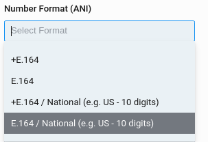
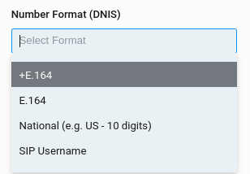
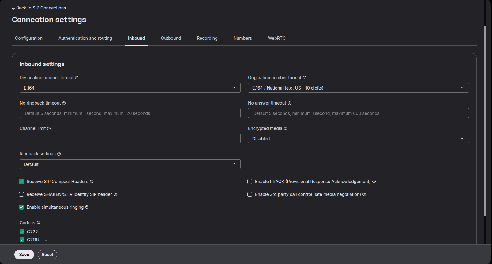

# SIP Connections

*Part 2 of 4 — see also: [Part 1](sip-connections--part-1.md), [Part 3](sip-connections--part-3.md), [Part 4](sip-connections--part-4.md)*

This page covers Telnyx SIP Connections comprehensively, including connection types (credential, IP, FQDN, and Call Control authentication), telephony credentials (SIP Connection Credentials, On-Demand Credentials, and JSON Web Tokens), inbound and outbound settings (number formats, transport protocols, ringback, codecs, encryption, and timeouts), webhook configuration with Park Outbound Calls, AnchorSite® media anchoring, advanced settings (DTMF, T.38, comfort noise), RTCP settings, SIP URI Calling, Outbound Voice Profiles, concurrent outbound call limits, and the tagging feature for organizing services.

## Inbound SIP Settings

The following settings are available on the Inbound tab of a SIP Connection:

### Number Format (DNIS / ANI)

Controls the number format in the FROM/TO and INVITE URI. Useful when your system only supports a particular number format on inbound rules.

- **DNIS (Dialed Number Information Service)** — Allows the recipient of a call to know the phone number originally dialed.
- **ANI (Automatic Number Identification)** — A telecommunications network feature for automatically determining the origination telephone number on toll calls for billing purposes.

Available number formats:

- **+E.164** — Includes the number with the `+` in front of the country code.
- **E.164** — Includes the number without the `+` in front of the country code.
- **National (10 digits)** — Includes the local 10-digit format of the country.
- **SIP Username** — Includes the username of the SIP Connection. Only available for credential authentication-based connections and only for DNIS.
- **+E.164 / National (10 digits)** — Only available for ANI. If the dialed number is US-based and the origin is also US-based, the SIP INVITE contains a 10-digit ANI. If the origin is international, the ANI is sent as +E.164.
- **E.164 / National (10 digits)** — Only available for ANI. Same logic as above, but the international case sends E.164 without the `+`.

### SIP Transport Protocol

Only available on IP Auth, FQDN Auth, or MS Teams Auth type SIP Connections. Allows you to set which transport protocol to use for SIP signalling.

### SIP Region

Only available on IP Auth, FQDN Auth, or MS Teams Auth type SIP Connections. Allows you to set the Telnyx region from which SIP signalling will be sent to your system.

### No Ringback Timeout

Controls how long Telnyx will wait for your SIP 180/183 response before terminating the call. Default is 5 seconds. Cannot be set to less than 1 second or more than 2 minutes.

### No Answer Timeout

Controls how long Telnyx will wait for your SIP 200 OK response before terminating the call. Default is 5 seconds. Cannot be set to less than 1 second or more than 10 minutes.

### SIP Subdomain

Only available on IP Auth, FQDN Auth, or MS Teams Auth type SIP Connections. Allows you to set a SIP subdomain which can receive calls. Leaving this empty disables SIP subdomain calls.

### Receive SIP Subdomain Calls

Only available on IP Auth, FQDN Auth, or MS Teams Auth type SIP Connections. Allows Telnyx to process calls with a defined subdomain. For example, if `sip:test1234@client123.sip.telnyx.com` is dialed, `client123` is the subdomain. Can be set to allow from anyone (public internet) or just from your other account connections.

### Channel Limit

Controls how many concurrent calls are allowed at any one time. By default, there is no limit.

### Receive SIP URI Calls

Only available on credential type SIP Connections. Allows Telnyx to process calls where `sip:username@sip.telnyx.com` is dialed. Can be disabled, set to allow from anyone, or just from your connections. See [SIP URI Calling](sip-uri-calling.md) for more details.

### Encrypted Media

Allows the media of inbound calls to be encrypted with SRTP. When enabled, Telnyx will send the SIP INVITE with crypto media attributes to establish end-to-end media encryption.

### Ringback Settings

- **Default Ringback Setting** — Telnyx will not send anything but will relay any messages and/or early media sent from the called party to the PSTN inbound carrier.
- **Generate Ringback Tone (183)** — Telnyx replies with an instant 183 message with SDP and starts sending early media carrying a US ringback tone. If the called party starts sending early media, Telnyx stops generating the ringback tone.
- **Enable Instant Ringback (180)** — Telnyx replies with an instant 180 Ringing message and the PSTN inbound carrier is expected to generate a ringback tone.

### Offered Audio / Video Codecs

Allows you to enable the codecs you prefer to be used and in order of preference.

### Enable SIP Compact Headers

When enabled, Telnyx sends the SIP INVITE with compacted SIP headers, ideal for reducing bandwidth consumption.

### Enable PRACK

When enabled, allows for an acknowledgment system for provisional 1XX responses. Each time you send back a 1XX, Telnyx will send back a SIP PRACK acknowledgment. Disabled by default.

### Receive ISUP Headers into SIP Headers

Sometimes inbound PSTN carriers send SS7 PSTN ISUP information as mime content type in the body of the SIP INVITE. Enable this feature to convert ISUP into appropriate SIP Headers if your system has difficulty parsing ISUP headers.

### Enable Shaken/Stir Header

Select yes to receive attestation information in the webhooks for incoming calls. Unselected by default.

### Enable 3rd Party Call Control

Specifically for Cisco UCM devices but useful in cases where the SIP INVITE doesn't include an SDP (late media negotiation).

### Enable Simultaneous Ringing

Activate this feature to allow multiple SIP devices registered under the same credentials-authenticated SIP connection to ring at the same time.

## Outbound SIP Settings

The following settings are available on the Outbound tab of a SIP Connection:

### Outbound Voice Profile

Choose which outbound profile the SIP Connection can be associated with.

### Localization Country

When enabled, allows the user to dial out with the associated exit code of that country and dial local numbers without including the exit + country code. When no country is specified, Telnyx attempts to validate dialed numbers as US; if validation fails, a 404 invalid destination response is returned.

### Channel Limit for Outbound Calls

When specified, Telnyx honours the channel limit and does not process any more concurrent outbound calls beyond that. The user will receive a 403 channel limit reached response.

### Caller ID Override

Choose to always override the caller ID for all outbound calls, override for normal calls only, or override for emergency calls only. For example, with "Emergency Only" enabled, if a caller dials 911, Telnyx will convert the caller ID provided in your SIP INVITE to the one defined in your SIP Connection.

### T.38 Re-invite Initiated By (FAX Settings)

For fax machines sending outbound faxes. Default is Telnyx. Can be set to "Customer" to initiate the SIP reINVITE for T.38, or "Disabled".

### Encrypted Media

Allows outbound call media to be encrypted with SRTP. When enabled, Telnyx expects to receive your SIP INVITE with crypto media attributes.

### Ringback Settings

- **Default Ringback Settings** — Any 18x messages and/or early media received from the PSTN Term Carrier will be passed to the calling party agent.
- **Enable Instant Ringback (180)** — Telnyx replies with an instant 180 message and the calling party agent is expected to generate a ringback tone.
- **Generate Ringback Tone (183)** — Telnyx replies with an instant 183 message with SDP and starts sending early media carrying a US ringback tone.
