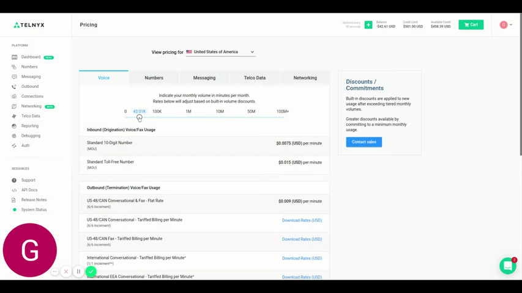

# Telnyx Billing, Pricing & Account Settings

*Part 1 of 5 — see also: [Part 2](telnyx-billing-pricing-account-settings--part-2.md), [Part 3](telnyx-billing-pricing-account-settings--part-3.md), [Part 4](telnyx-billing-pricing-account-settings--part-4.md), [Part 5](telnyx-billing-pricing-account-settings--part-5.md)*

This page consolidates Telnyx guidance on how billing, pricing, taxes, and account settings work in the Mission Control Portal. It covers billing increments, channel billing, pricing options, decimal precision, payment methods, billing groups, notification settings, account security, password recovery, and US sales, USF, and TRS fees.

## Billing Increments

A billing increment is how Telnyx calculates billing for each call of unique duration. Telnyx uses 60/60 billing increments, so a call of 11 seconds is billed as 60 seconds, and a call of 96 seconds is billed as 120 seconds (2 × 60 seconds).

International calling is billed in 60-second increments in most cases, but the increment can vary by destination. For a full breakdown of billing increments by country, download your international rates from within the [Mission Control Portal](https://portal.telnyx.com/#/app/pricing).

Telnyx no longer offers 6-second billing increments.

## Billing Decimal Precision

Telnyx considers 4 decimal points for billing. For example, the SMS rate is $0.0025 USD, and call rates are also considered up to 4 decimal points. More information on pricing is available on the [Telnyx pricing page](https://telnyx.com/pricing).

## Channel Billing

Channel billing is an alternative billing method that allows you to pay a flat fee for unlimited inbound minutes. Instead of being billed based on inbound minutes of usage, you select the number of concurrent calls you would like to support for inbound traffic and pay per channel.

Each channel allows for one concurrent (or simultaneous) inbound call. You can use as many inbound minutes as you want with no additional charges; however, you can only support one call at a time per channel provisioned.

Channel billing is only applicable for standard DIDs. Toll-free or international DIDs only have the option for pay-per-minute.

### How Channels Work

- **Channels can be shared across multiple numbers.** You do not need one channel per number. When you enable channel billing for a number, it shares the total channels provisioned with all other numbers that have channel billing enabled. For example, 5 channels can be shared across 10 numbers, allowing unlimited inbound minutes on those 10 numbers but limiting you to a maximum of 5 simultaneous calls across all 10 numbers at any time.
- **You can have more channels than numbers.** A single phone number with 5 channels provisioned can receive up to 5 simultaneous calls. Adding another number to channel billing gives you 2 numbers with unlimited inbound minutes and the ability to support up to 5 simultaneous calls across both.
- **You can mix billing methods on the same account.** Some numbers can be billed on channels while others are billed per minute. Pay-per-minute numbers are billed based on minutes of usage and do not affect your channel limit. Only numbers set to channel billing have unlimited usage, and concurrent calls are limited by the channels provisioned.

### What Happens When Channels Are Exhausted

Whenever all available channels are currently being used, any new inbound call will be rejected with a "User Busy" hangup cause.

### Setting Up Channel Billing

You must add channels before you can set a number to channel billing.

1. Log in to your [Mission Control Portal](https://portal.telnyx.com/#/app/home) account.
2. Navigate to the **Channels** tab within the **Numbers** section in the left-hand navigation menu.

   
3. Use the plus (+) or minus (-) buttons to add or remove channels and click **Update**.
4. Navigate to your number's settings page and scroll down to the billing section. Select **Channel** as the billing method in the drop-down.

   
5. Share channels across multiple numbers by enabling the channel billing method for all the numbers you'd like.

### Configuring Channels by Zone

To use channel billing, set the Voice Billing Method to **Channel** at the number level. Only Telnyx numbers belonging to countries included in the Channel Zones are eligible.

In the **Real-Time Communications** menu, go to **Numbers** > **Manage Numbers** and edit a Telnyx number to configure the Voice Billing Method in the Voice tab. If the number is eligible, you can configure **Channel** as the Voice Billing Method.

To reserve channels in different zones, go to **Real-Time Communications** > **Voice** > **Settings** and open the **Voice Channels** tab.

In the Voice Channels screen, customers can reserve channels on the respective zone and view countries associated with each zone.

When you enable channel billing for a specific number, the total channels provisioned for that zone are shared among all numbers in that zone where channel billing is enabled. Channels from the same zone can be shared across multiple numbers, even if they belong to different regions, as long as the country number is included in the zone.

### Channel Pricing by Zone

Channel costs appear in the Monthly Recurring Charges (MRC) section of the bill or invoice; the calls themselves show up as $0. The more channels you have, the lower the per-channel cost.

**US Zone:**
- 0–10 channels: $12
- 10–50 channels: $11
- 50–250 channels: $9.00
- 250+ channels: $8.00

**Zone A:**
- 0–10 channels: $15
- 10–50 channels: $14
- 50–250 channels: $12
- 250+ channels: $10

**Zone B:**
- 0–10 channels: $20
- 10–50 channels: $19
- 50–250 channels: $15
- 250+ channels: $14

**Zone C:**
- 0–10 channels: $25
- 10–50 channels: $23
- 50–250 channels: $19
- 250+ channels: $17

### Supported Countries per Zone

**US Zone:**
- United States (US)

**Zone A:**
- Argentina (AR), Austria (AT), Belgium (BE), Bosnia and Herzegovina (BA), Bulgaria (BG), Croatia (HR), Czech Republic (CZ), Denmark (DK), Estonia (EE), Finland (FI), France (FR), Georgia (GE), Germany (DE), Greece (GR), Hungary (HU), Ireland (IE), Italy (IT), Latvia (LV), Lithuania (LT), Luxembourg (LU), Netherlands (NL), Norway (NO), Poland (PL), Portugal (PT), Romania (RO), Serbia (RS), Spain (ES), Sweden (SE), Switzerland (CH), United Kingdom (UK)

**Zone B:**
- Australia (AU), Bahrain (BH), Brazil (BR), Canada (CA), Chile (CL), Colombia (CO), Costa Rica (CR), Cyprus (CY), Dominican Republic (DO), Ecuador (EC), Iceland (IS), Kazakhstan (KZ), Kenya (KE), Malta (MT), Mexico (MX), Nicaragua (NI), Panama (PA), Peru (PE), Puerto Rico (PR), Singapore (SG), Slovakia (SK), South Africa (ZA), Thailand (TH), Turkey (TR), U.S. Virgin Islands (VI), Uganda (UG), Ukraine (UA), Venezuela (VE)

**Zone C:**
- Israel (IL), Japan (JP), New Zealand (NZ), Slovenia (SI)

## Pricing Options

To see current pricing options, navigate to the **Pricing** page under your account's icon (top right) within the Portal. The Pricing page contains 5 tabs: Voice, Numbers, Messaging, Telco Data, and Networking.

Each tab has a toggle that adjusts pricing based on your desired usage:

1. **Voice:** toggle between bucketed monthly minutes volume for Inbound (Origination) Voice/Fax usage for both Standard DIDs and Toll-Free DIDs.
2. **Numbers:** toggle between the required amount of numbers per month.
3. **Messaging:** toggle between bucketed monthly message volume per month.
4. **Telco Data:** CNAM, LRN, and Switch Data pricing.
5. **Networking:** select different bandwidth options for Mbps per month.

