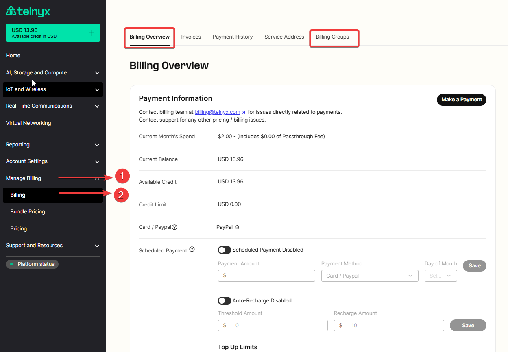
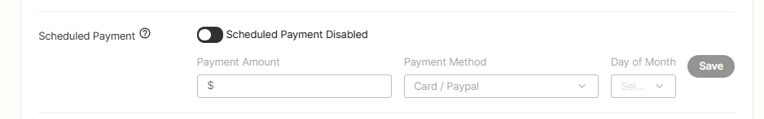
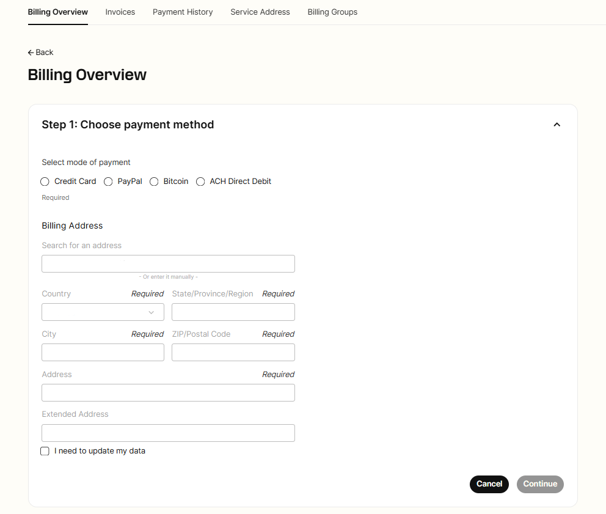
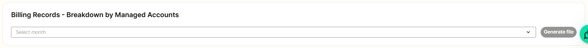
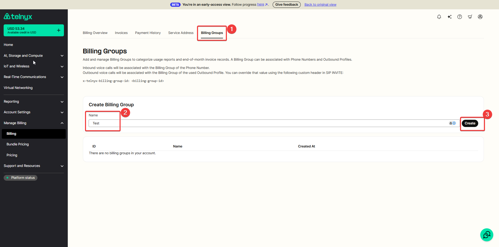
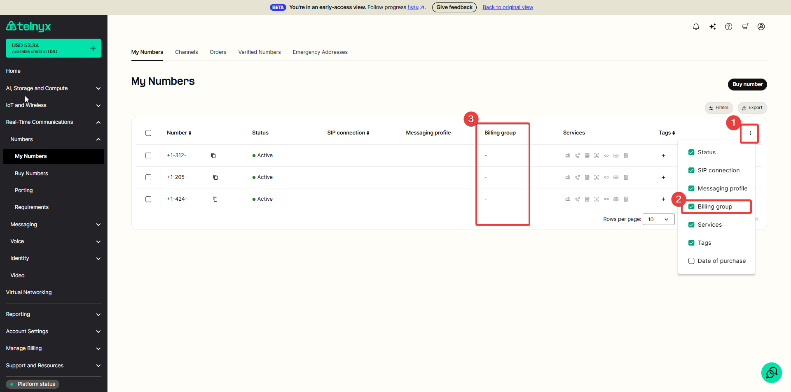

# Telnyx Billing, Pricing & Account Settings

*Part 2 of 5 — see also: [Part 1](telnyx-billing-pricing-account-settings--part-1.md), [Part 3](telnyx-billing-pricing-account-settings--part-3.md), [Part 4](telnyx-billing-pricing-account-settings--part-4.md), [Part 5](telnyx-billing-pricing-account-settings--part-5.md)*

This page consolidates Telnyx guidance on how billing, pricing, taxes, and account settings work in the Mission Control Portal. It covers billing increments, channel billing, pricing options, decimal precision, payment methods, billing groups, notification settings, account security, password recovery, and US sales, USF, and TRS fees.

## Billing Setup and Payment Methods

The Mission Control Portal offers various functionalities to help track billing information. Both Billing and Billing Groups can be found in the [Billing Overview](https://portal.telnyx.com/#/billing/payment) drop-down menu in the top right-hand corner of the portal. Billing Groups can be found next to Billing in the navigation bar at the top of this section.

The [Billing section](https://portal.telnyx.com/#/app/billing/payment) is where you primarily manage your balance, payment method, auto-recharge preferences, and access your invoices.

### Payment Information

You can view your current balance and add a payment method for recurring payments. PO Boxes are unsupported when saving a billing address for a payment method.

Click **Make Payment** in the bottom right and fill out the required information.

### Scheduled Payment

When you activate scheduled payments using the toggle feature, you can specify a payment amount, choose a payment method, and select a preferred day each month for Telnyx to automatically process the payment. This ensures your account balance is topped up without manual intervention and helps avoid service disruption in case of a negative balance.

### Accepted Payment Methods

Telnyx allows customers to make payments with:

- Credit Card
- PayPal
- Bitcoin
- [ACH Direct Debit](https://support.telnyx.com/en/articles/7045419-ach-direct-debit-payment-method)

Your last payment method is saved for future payments. Once you have a saved payment method, you can delete it. You will receive a payment receipt PDF upon successful transactions via Credit Card, PayPal, Bitcoin, or ACH done through either manual top-up or auto-recharge. In the event of a failed transaction attempt, you will be automatically alerted via email.

Starting July 3rd 2023, a 3% transaction fee applies on PayPal payments for customers who have access to ACH payments.

### Top-Up Limits

New users can make payments up to $100 on day one of account creation. That limit increases by $50/day and applies as a whole across any payment method you use. To remove this limit, request [Level 2 Verification](https://portal.telnyx.com/#/account/my-account/verifications).

### Payment Method Restrictions

- New accounts are subject to a payment method review once a payment method is added. This review can take up to 48 hours, excluding weekends.
- Once the review is successful, you will receive an email with the subject **Attention: Payment Method Allowed**.
- If the review is unsuccessful, you will receive an email **Attention: Suspension of Your Credit Card and PayPal Payment Methods**. Contact [support@telnyx.com](mailto:support@telnyx.com) for further review, which may require additional [KYC](https://support.telnyx.com/en/articles/5295540-how-to-sign-up-for-a-telnyx-account#h_2d0ddcbae2) details.
- The billing address you provide must match the country of the phone number you used to verify your account. This restriction can be removed if your account is Level 2 verified. See [Account Verification](https://support.telnyx.com/en/articles/1130595-account-verification).

### Auto-Recharge Limits

When auto-recharge is triggered, Telnyx always charges your saved payment method an amount that brings your balance up to the **Threshold + Recharge** amount. This may cause significantly higher charges than your set recharge amount if your balance falls far below your set threshold due to monthly charges.

Auto-recharge is limited to 10 times in a 24-hour period. You will experience service disruption if 10 recharges of your recharge amount cannot cover a day of usage. This limitation cannot be removed. Set up [notifications](https://portal.telnyx.com/#/advanced-features/notifications) so you can promptly make payments manually.

The auto-recharge threshold is based on your available credit. Once the available credit reaches the threshold amount set, the auto-recharge is triggered.

### Replacing a Saved Payment Method

Telnyx only saves one payment method. To change your credit card, first delete your current one by clicking the trash icon next to your current payment method.

Once deleted, add a new payment method by making a payment following the steps at the beginning of this article. The minimum payment is $10 USD. To delete a saved ACH payment method, click the trash can icon to the right of the listed bank account.

### Service Address

Your Service Address is the location from where you consume service provided by Telnyx. Telnyx uses the service address to determine tax rates. If you do not fill in a service address, Telnyx will use the billing address.

## Invoices

Below payment information, you'll find [Invoices](https://portal.telnyx.com/#/billing/invoices). Here you can download and view your invoices for past months. Invoices for the previous month appear during the first few days of the new month. They can be sorted by status (Paid, Unpaid).

Within the invoice section, you can also generate Ledger and Billing Records for past months, which show your usage and payments broken down by your Billing Groups or Managed Accounts.

## Payment History

The [Payment History](https://portal.telnyx.com/#/billing/history) page allows you to view payments made in the last 12 months on the portal, along with an option to download payment receipts. You can select the payment type that was used to individually see your credit card receipts, PayPal receipts, or bitcoin receipts.

## Billing Groups

The Telnyx Mission Control Portal gives you the ability to create and assign Billing Groups. Billing Groups let you categorize usage reports and end-of-month invoice records. A Billing Group can be assigned to Numbers and Outbound Profiles.

### Creating a Billing Group

To create a billing group, enter the desired name of the group and click create. You can delete created Billing Groups in the section below creation.

### Assigning Billing Groups

To add a Billing Group to a number, select the **billing group option** on your number and choose the group you'd like to associate with the number.

Adding a Billing Group to an Outbound Profile can be done in the **Advanced Settings** of your Outbound Voice Profile. See more details in the [release notes](https://telnyx.com/release-notes/new-feature-release-billing-groups).
