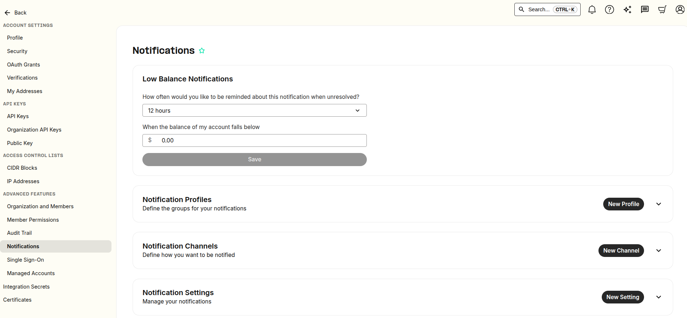
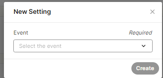

# Telnyx Billing, Pricing & Account Settings

*Part 3 of 5 — see also: [Part 1](telnyx-billing-pricing-account-settings--part-1.md), [Part 2](telnyx-billing-pricing-account-settings--part-2.md), [Part 4](telnyx-billing-pricing-account-settings--part-4.md), [Part 5](telnyx-billing-pricing-account-settings--part-5.md)*

This page consolidates Telnyx guidance on how billing, pricing, taxes, and account settings work in the Mission Control Portal. It covers billing increments, channel billing, pricing options, decimal precision, payment methods, billing groups, notification settings, account security, password recovery, and US sales, USF, and TRS fees.

## Notification Settings

The Notification Settings section is typically only configurable by account organization owners. The [Notifications](https://portal.telnyx.com/#/advanced-features/notifications) settings can be found under **Account Settings > Advanced Settings** in the left-hand side of your Portal.



### Types of Notifications

There are two types of notifications in your Mission Control Portal:

**1. Low Balance Notifications**


This section is for Low Balance Notifications, where you can choose how often you would like to be reminded about this notification when unresolved, and the balance amount that would trigger the notification. Changes are auto-saved, and automatic emails are sent to the account owner's email address.

**2. Event Notifications**

This section is used to configure and customize notifications for events related to your account. Supported events are:

1. **Send Newly Available Invoice** — a new invoice is available in the portal. Currently, only email notifications are supported.
2. **When a Number Order Completes** — a number order you submitted has completed (success, failure, or partial success). Currently, only webhook notifications are supported.
3. **Low Available Credit** — sent when the available credit is below the configured threshold. This is the same notification as the Low Balance Notification but here you can configure other channels in case you need to send the low balance notification to several people or through several channels.
4. **Port In Notification** — Telnyx has received a port-in request from your account; you'll also get updates on the process.
5. **Port Out Notification** — Telnyx has [received a port-out notification](https://support.telnyx.com/en/articles/2030667-i-received-a-port-out-notification) for a number on your account.
6. **SIM Card Status Change** — each time one of your SIM cards changes status, a notification will be triggered.
7. **Data Usage Notification** — sent when a SIM reaches the usage threshold set for data usage notifications.
8. **Suspicious Outbound Voice Traffic** — if our system detects any unusual outbound voice traffic patterns, you'll receive an email notification immediately, enabling you to take swift action to secure your account. Examples of patterns include:
   - Multiple calls either concurrently or in quick succession to the same destination prefix
   - Multiple on-going calls to the same high-cost destination
   - Multiple long-lived concurrent calls

### Notification Setup

**1. Notification Profiles**

Define the groups for your notifications and select which profile you want to be notified. To create a new profile, click **New Profile** and enter the name. You can view and manage your Notification Profiles in the drop-down beside new profile.


**2. Notification Channels**

Define how you want to be notified through SMS, Voice, Email, or Webhook. To set up a new channel, click **New Channel**, then select which Notification Profile you want to be notified, how you want to be notified (SMS, Voice, etc.), and to what destination (DID, example.org, etc.). You can view and manage your Notification Channels in the drop-down beside new channels.


**3. Notification Settings**

Manage your notifications and select which events you want to be notified about and to which Notifications Profile. To create new settings, click **New Settings**, where you will select what event you want to be notified about and to which Notifications Profile. You can view and manage your Notification Settings in the drop-down beside new settings.




### Webhook Example: Number Order Complete

```json
{
    "data": {
        "event_type": "number_order.complete",
        "id": "da5ddb44-4eda-45f0-b8a7-913a4092eccc",
        "occurred_at": "2024-09-13T09:12:21.140324Z",
        "payload": {
            "billing_group_id": null,
            "connection_id": null,
            "created_at": "2024-09-13T09:12:19.728170+00:00",
            "customer_reference": null,
            "id": "e3dcb7d4-4f0b-4800-bd9f-b04cc684a82f",
            "messaging_profile_id": null,
            "phone_numbers": [
                {
                    "bundle_id": null,
                    "country_code": "US",
                    "id": "5fd37101-437d-4138-9a09-98c13bd9d73f",
                    "phone_number": "+1312XXXXXXX",
                    "phone_number_type": "local",
                    "record_type": "number_order_phone_number",
                    "regulatory_requirements": [],
                    "requirements_met": true,
                    "requirements_status": "approved",
                    "status": "success"
                }
            ],
            "phone_numbers_count": 1,
            "record_type": "number_order",
            "requirements_met": true,
            "status": "success",
            "sub_number_orders_ids": [
                "1ae729ee-6e07-43db-bb05-d3077ba6b85e"
            ],
            "updated_at": "2024-09-13T09:12:19.728170+00:00"
        },
        "record_type": "event"
    },
    "meta": {
        "attempt": 1,
        "delivered_to": "https://128e-93-107-73-249.ngrok-free.app"
    }
}
```
