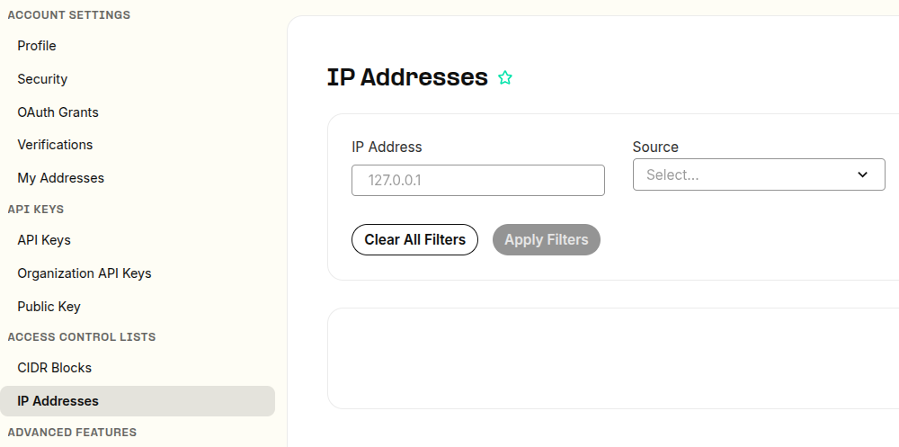

# Telnyx Billing, Pricing & Account Settings

*Part 4 of 5 — see also: [Part 1](telnyx-billing-pricing-account-settings--part-1.md), [Part 2](telnyx-billing-pricing-account-settings--part-2.md), [Part 3](telnyx-billing-pricing-account-settings--part-3.md), [Part 5](telnyx-billing-pricing-account-settings--part-5.md)*

This page consolidates Telnyx guidance on how billing, pricing, taxes, and account settings work in the Mission Control Portal. It covers billing increments, channel billing, pricing options, decimal precision, payment methods, billing groups, notification settings, account security, password recovery, and US sales, USF, and TRS fees.

## Account Settings

The [Account](https://portal.telnyx.com/#/account/general) section is located under the profile icon in the top right-hand corner of your account. Click the top right corner, then select **Account Settings** from the drop-down menu.

### Account Information

This section allows you to enter your personal details and helps in situations where you require account verification or when the support team needs to contact you.

**Promo Code Redemption:** From time to time, Telnyx may issue promo codes, and it is within this section that you can redeem them.

**Data Storage Location:** Choose where to store data to comply with its regulations and laws. The current available options are:

- United States
- Germany
- Australia

This setting can only be changed **once**, at which point Telnyx will begin migrating your data to the new region. Learn more at [telnyx.com/data-privacy](https://telnyx.com/data-privacy).

### Access Control IPs

Add your list of SIP Signals or media IPs that originate traffic to the Telnyx network. This prevents your SIP traffic from being blocked as part of any actions Telnyx takes to secure its network.

### Security

In this section, you can edit your email, password, and set up two-factor authentication, among other things.

**Email:** Change your account email address. You will need to provide the current password.

**Password:** Update this field if you ever need to change your password, or visit the [password reset](https://portal.telnyx.com/#/login/password-reset) page to send yourself a password email reset notification.

**Sign in via email link:** Log into your Telnyx account via a one-time link sent to your email instead of a password.

**Two-Factor Authentication (2FA):** Set up two-factor authentication using a [TOTP](https://telnyx.com/resources/totp-meaning) app or by sending a code to your phone number. See [2FA TOTP Setup](https://support.telnyx.com/en/articles/3739748-2fa-totp-setup) for more information.

**Security Paraphrase:** Set up your personal paraphrase. The purpose of the security paraphrase is to verify your account when you reach out to support, especially for any changes that need to be made. For example, if you want to cancel your account, you will be requested to verify your security paraphrase.

**Account Verification ID:** Your account verification ID number, another option to use when reaching out to support.

**Numeric Security Codes:** Ephemeral codes that rotate every 3 minutes, also another option to use when reaching out to support.

## Password Reset

Your password must contain at least one punctuation mark or symbol, must contain at least one upper-case letter, and may not be any shorter than 12 characters.

If you have forgotten your Telnyx account password or the account has been locked due to unsuccessful attempts, you can recover the password using one of two methods.

### Method 1: Reset the Password via Sign-In Page

**Step 1:** Navigate to the Telnyx [portal](https://portal.telnyx.com) and click the **Forgot your password** link.

**Step 2:** Enter your registered email address linked to your Telnyx account and click **Reset password**. A reset password link will be sent to your inbox.

**Step 3:** Check your inbox and open the email from Telnyx with the subject line **Reset password instructions** and click the **Change my password** link.

**Step 4:** You will be navigated to the **Change Password** page. Enter the new password twice (for confirmation) and click **Update password** to set a new password.

### Method 2: Reset the Password from Account Settings

You can change your account password by navigating to the account settings, provided that you're already logged in to your Telnyx account.

**Step 1:** Navigate to the Telnyx [portal](https://portal.telnyx.com) and click the profile icon in the top right corner of the screen, then click **Account Settings**.

**Step 2:** Select **Security** from the left sidebar.

**Step 3:** On the Security page, click **Change Password**.

**Step 4:** Request a verification code to be sent to your email, then enter the code when prompted.

**Step 5:** Enter the current password and the new password twice for confirmation and click **Change Password**.

