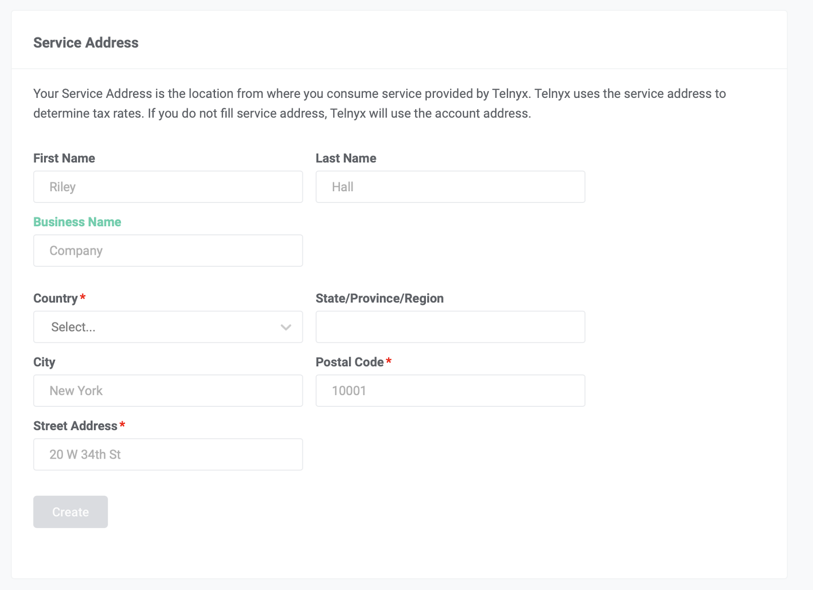

# Telnyx Billing, Pricing & Account Settings

*Part 5 of 5 — see also: [Part 1](telnyx-billing-pricing-account-settings--part-1.md), [Part 2](telnyx-billing-pricing-account-settings--part-2.md), [Part 3](telnyx-billing-pricing-account-settings--part-3.md), [Part 4](telnyx-billing-pricing-account-settings--part-4.md)*

This page consolidates Telnyx guidance on how billing, pricing, taxes, and account settings work in the Mission Control Portal. It covers billing increments, channel billing, pricing options, decimal precision, payment methods, billing groups, notification settings, account security, password recovery, and US sales, USF, and TRS fees.

## US Sales, Telecommunication Taxes, USF Fees, and TRS Fees

### US Sales and Telecommunication Taxes

Sales and telecommunication taxes are taxes charged on the sale of a product or service. These taxes may be assessed at the State, County, and Municipal jurisdictional levels. Each jurisdiction may categorize Telnyx's products differently, and these jurisdictions may have different regulations regarding the applicable taxes.

Telnyx is required to collect any applicable state and local taxes, telecommunications taxes, and other indirect taxes on the sale of its services in jurisdictions where it is determined to have [nexus](https://en.wikipedia.org/wiki/State_income_tax#Nexus) (economic presence or substantial presence) based on the address where the service or services are consumed by the customer.

**How Telnyx determines your address for tax purposes:** Telnyx uses the address associated with your primary portal account for tax purposes by default. If you are using Telnyx services in a location that differs from this address, you can add a service address to your [portal account](https://portal.telnyx.com/#/billing/service-address). Navigate to **Account Settings**, click **Billing**, and then **Service Address**.

**How Telnyx determines the tax rate:**

- A customer's service address
- Tax regulations in the state and the local jurisdiction that apply to Telnyx
- The types of products and services consumed by the customer in the month
- Tax status of the customer in a given jurisdiction

**How you will know how much you owe in taxes each month:** In the **Summary** section of the monthly invoice, you will see a line item for the total tax charge. The invoice will also include a dedicated section for tax charges showing the breakdown by tax type.

**How tax reflects on your Telnyx account balance:** Telnyx calculates and applies taxes to your account daily. The tax amount is deducted from the customer's balance based on usage and purchases on the following calendar day.

**Tax estimates:** Since taxes are calculated based on multiple factors like service usage and effective tax rates, there is no way to provide an accurate estimate in advance.

**Tax ID or VAT number:** Customers cannot add or update a Tax ID, VAT number, or company tax registration number directly in Mission Control Portal. Mission Control Portal allows customers to add or update a service address for tax calculation purposes under **Account Settings** > **Billing** > **Service Address**, but this is not a Tax ID or VAT number field. If you need a Tax ID, VAT number, or other company tax registration number added to your Telnyx invoices, contact Telnyx Support at [support@telnyx.com](mailto:support@telnyx.com) with your account details and the tax registration number you would like added. Once added, the Tax ID or VAT number will only appear on newly issued invoices. Previously issued invoices cannot be updated or regenerated to include the new Tax ID or VAT number.

**Tax exemptions:** Subject to all applicable laws and changes thereof, customers who qualify for tax exemptions should reach out to [tax@telnyx.com](mailto:tax@telnyx.com) with appropriate exemption certificates or documents.

**Address updates and past invoices:** Per standard operating procedures, Telnyx does not adjust the billing or invoicing of a closed billing period. Past months' taxes will not be recalculated and charged, and no previous invoices will be regenerated.

### USF Fees

The Universal Service Fund (USF) is a federal fund aimed at promoting access to telecommunications services for all Americans, regardless of location or economic status. It is a program administered by the Federal Communications Commission (FCC) and requires companies providing interconnected VoIP and telecommunications services to retail customers, including businesses and residences, to contribute to the USF. It is calculated as a percentage of a company's end-user telecommunications revenues. More information is available at [www.fcc.gov/general/universal-service](https://www.fcc.gov/general/universal-service).

All customers operating in the United States and purchasing Telnyx interconnected VoIP or telecommunications services will be subject to a USF passthrough fee each month based on their usage of those services, in addition to federal, state, and local regulatory fees and taxes.

USF is applied to telecom and/or VoIP consumption and Programmable Voice (US Outbound and Inbound) services. Only the Interconnected VoIP portion of these products is subject to USF.

Under the dedicated section for tax charges on your Telnyx invoice, you will see the breakdown by tax type with a line item indicating USF fee applied in that month.

If your company files the FCC Form 499-A and makes USF contributions directly as a provider of telecommunications, your company may qualify for an exemption from USF fee that Telnyx imposes on USF-assessable services. Reach out to [tax@telnyx.com](mailto:tax@telnyx.com) with appropriate documents to apply for exemption. You are required to renew this exemption certificate annually.

### TRS Fees

The Telecommunications Relay Service (TRS) is a federal fund administered by the FCC and requires companies providing interconnected VoIP and telecommunications services to retail customers, including businesses and residences, to contribute to the TRS Fund. It is calculated as a percentage of a company's end-user telecommunications revenues.

The TRS Fund was established by the FCC in 1993 to reimburse TRS providers for the cost of providing interstate TRS services. TRS services are telephone transmission services that provide hearing- or speech-challenged individuals with the ability to use a traditional telephone. Under the FCC's rules, Telnyx must contribute a percentage of its end-user communications revenues to the TRS Fund. The contribution percentage varies annually.

All customers based in the United States and purchasing Telnyx interconnected VoIP or telecommunications services will be subject to a TRS passthrough fee each month based on their usage of those services, in addition to federal, state, and local regulatory fees and taxes.

TRS is applied to telecom and/or VoIP consumption and Programmable Voice (US Outbound and Inbound) services. Only the Interconnected VoIP portion of these products is subject to TRS.

Under the dedicated section for tax charges on your Telnyx invoice, you will see the breakdown by tax type with a line item indicating TRS fee applied in that month.

If your company files the FCC Form 499-A and makes TRS contributions directly as a provider of telecommunications, your company may qualify for an exemption from the TRS fees that Telnyx imposes on TRS-assessable services. Reach out to [tax@telnyx.com](mailto:tax@telnyx.com) with appropriate documents to apply for exemption. You are required to renew this exemption certificate annually.
