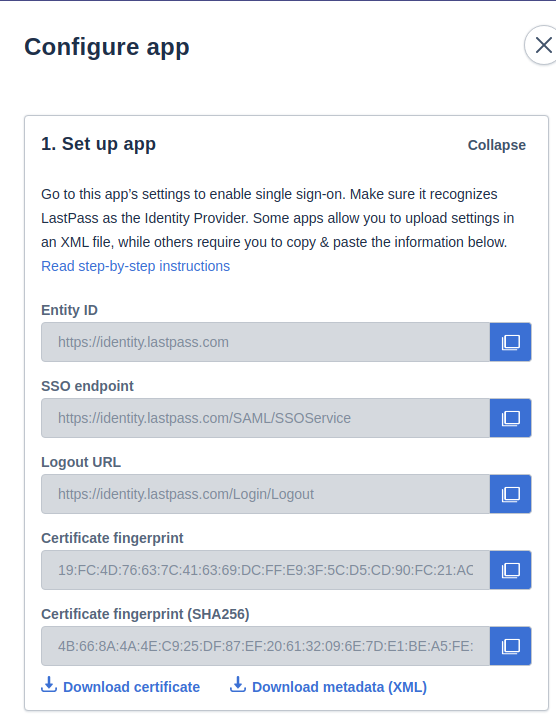
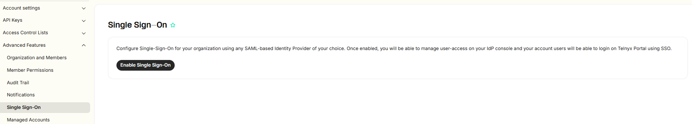
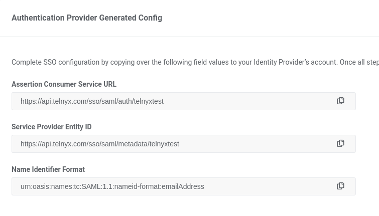
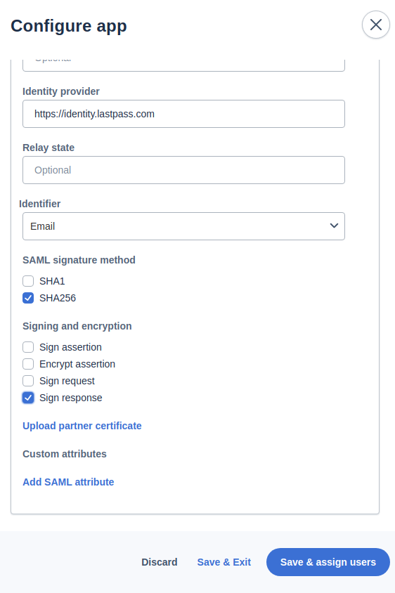
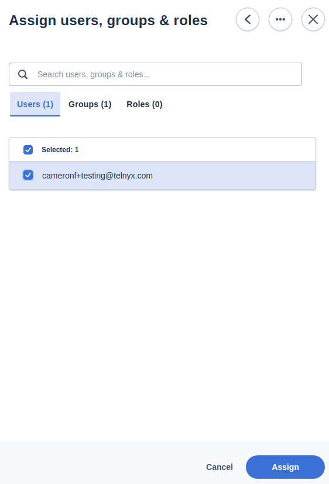

# Telnyx Compliance and SSO Identity Provider Setup

*Part 2 of 4 — see also: [Part 1](telnyx-compliance-and-sso-identity-provider-setup--part-1.md), [Part 3](telnyx-compliance-and-sso-identity-provider-setup--part-3.md), [Part 4](telnyx-compliance-and-sso-identity-provider-setup--part-4.md)*

This page consolidates Telnyx guidance on HIPAA, Business Associate Agreements, and the conduit exception, alongside step-by-step instructions for configuring SAML-based Single Sign-On with OneLogin, Okta, LastPass, Azure AD, Auth0, and GSuite.

## Okta SAML Identity Setup

[Okta](https://www.okta.com/topic/SAML/) offers implementation of Security Assertion Markup Language (SAML) for your network. [SAML](https://en.wikipedia.org/wiki/SAML_2.0) is the most-used security language that has come to define the relationship between identity providers and service providers.

### Create an SSO app on Okta

1. Log into your Okta Admin panel.
2. Click **Applications** in the left-hand navigation and click **Browse App Catalog**.

   
3. Search for *SAML* and choose **SAML Service Provider**.

   
4. Click **Add**.

   
5. Change the **Application Label** to a name of your choice.

   
6. Click **Next**.
7. On the **Sign-On Options** page, select **SAML 2.0**.
8. Set the **Default Relay State** to `https://portal.telnyx.com`.
9. Click **View Setup Instructions** and retrieve your **Identity Provider Entity Id**. The link should resemble `https://<okta-org>.okta.com/app/<okta-idp-id>/sso/saml/metadata`.

   

### Configure Telnyx and complete the Okta setup

1. In the Telnyx Mission Control Portal, navigate to the [Single Sign-On](https://portal.telnyx.com/#/advanced-features/single-sign-on) section and click **Enable Single Sign-On**.

   
2. Enter an **Authentication Provider name** and **Short Name**, then paste the **IdP Metadata URL** (the Identity Provider Entity ID from Okta).
3. Click **Import IdP Settings & Save**. **NOTE:** After saving, the *IdP Entity ID* field will be set to "not found" (an error in the Okta file). Extract the `<okta-idp-id>` from the IdP Metadata URL and paste it into this field manually.

   
4. Click **Save Changes**.
5. From the **Authentication Provider Generated Config** section, copy the **Assertion Consumer Service URL** and **Service Provider Entity ID**.

   
6. In Okta, fill in the **Advanced Sign-On** settings and **Credential** details using the values from Telnyx. In the **Application username format** field, select *Email*.

   
7. Click **Save**, then return to the Telnyx Mission Control Portal and select **Enable Single Sign-On**.

   
8. Click **Save Changes**.

If you experience technical difficulties, check the status of Okta's features at [https://status.okta.com/](https://status.okta.com/).

Additional resources: [Okta documentation for adding a SAML Identity provider](https://help.okta.com/en-us/content/topics/security/idp-add-saml.htm), [General Okta end-user documentation](https://help.okta.com/eu/en-us/Content/Topics/end-user/end-user-home.htm?cshid=csh-user-home), [Okta discussion forums](https://support.okta.com/help/s/group/CollaborationGroup/Recent?language=en_US), [Okta help and support](https://support.okta.com/help/s/?language=en_US), [Okta developer portal](https://developer.okta.com/).

## LastPass SAML Identity Setup

The [LastPass SSO solution](https://www.lastpass.com/solutions/integrations/saml) leverages [SAML 2.0](https://en.wikipedia.org/wiki/SAML_2.0) to provide endpoint security for a wide range of business needs. [LastPass](https://www.lastpass.com/) provides a true SSO experience for end users, allowing them to access key apps without having to enter a unique password.

### Create an SSO app on LastPass

1. Log into your [LastPass admin portal](https://admin.lastpass.com/dashboard).
2. From the left-hand navigation, click **Applications → SSO Apps**.
3. Click **Add your first SSO App**.

   
4. On the pop-up screen, click **Add unlisted app** and choose a name for your app.
5. On the **Configure App** page, on the **Set up App** tab, click **Expand** and note the **Certificate Fingerprint (SHA256)**, **Entity ID**, and **SSO Endpoint** values.

   

### Configure Telnyx and complete the LastPass setup

1. In the Telnyx Mission Control Portal, navigate to the [Single Sign-On](https://portal.telnyx.com/#/app/advanced-features/single-sign-on) section and click **Enable Single Sign-On**.

   
2. Enter an **Authentication Provider name** and **Short Name**, select **Manually enter configuration**, and provide:
   - **IdP Certificate Fingerprint:** Certificate Fingerprint (SHA256) from LastPass.
   - **IdP Certificate Fingerprint Algorithm:** *sha256*.
   - **IdP Entity ID:** Entity ID from LastPass.
   - **IdP SSO Target URL:** SSO Endpoint from LastPass.

   
3. Click **Save Changes**.
4. From the **Authentication Provider Generated Config** section, copy the **Assertion Consumer Service URL** and **Service Provider Entity ID**.

   
5. In LastPass, open the **Set up LastPass** tab, click **Expand**, then click **Advanced Settings** and provide:
   - **ACS:** Assertion Consumer Service URL from Telnyx.
   - **Entity ID:** Service Provider Entity ID from Telnyx.
   - **Identifier:** *Email*.
   - **SAML signature method:** *SHA256*.
   - **Sign Response:** Enable.

   

   
6. Click **Save & Assign to users**, then click **Assign users, groups and roles**.

   
7. Select the appropriate users and click **Assign**.

   
8. In the Telnyx Mission Control Portal, click **Enable Single Sign-On**.

   
9. Click **Save Changes**.

If you experience technical difficulties, check the status of LastPass features at [https://status.lastpass.com/](https://status.lastpass.com/).

Additional resources: [LastPass support and documentation](https://support.lastpass.com/s/?language=en_US), [LastPass download](https://lastpass.com/misc_download2.php).
