# Telnyx Compliance and SSO Identity Provider Setup

*Part 3 of 4 — see also: [Part 1](telnyx-compliance-and-sso-identity-provider-setup--part-1.md), [Part 2](telnyx-compliance-and-sso-identity-provider-setup--part-2.md), [Part 4](telnyx-compliance-and-sso-identity-provider-setup--part-4.md)*

This page consolidates Telnyx guidance on HIPAA, Business Associate Agreements, and the conduit exception, alongside step-by-step instructions for configuring SAML-based Single Sign-On with OneLogin, Okta, LastPass, Azure AD, Auth0, and GSuite.

## Azure AD SAML Identity Setup

[Azure Active Directory (Azure AD)](https://azure.microsoft.com/en-us/services/active-directory/#overview) is Microsoft's enterprise cloud-based identity and access management (IAM) solution that provides single sign-on and multi-factor authentication.

### Create and configure a SAML toolkit application on Microsoft Azure

1. Log into your [Microsoft Azure Admin Portal](https://portal.azure.com/#home).
2. From the left-hand navigation, click **Microsoft Entra ID**.

   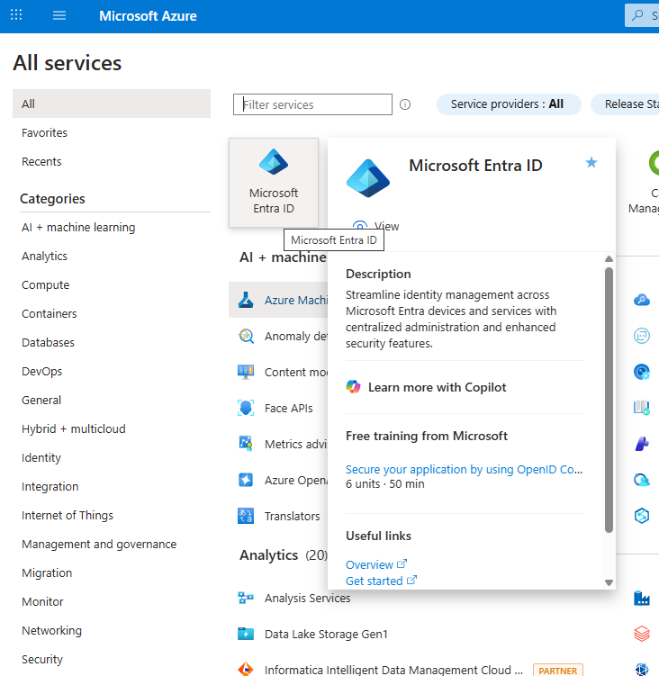
3. On the Active Directory Overview page, click **Enterprise Applications** in the left-hand navigation.

   
4. Click **New Application** in the top left.
5. On the **Browse Microsoft Entra App Gallery** menu, search for **Microsoft Extra SAML toolkit**.
6. Click the result to create the app.
7. Fill in a name of your choice.

   
8. Click **Create**.
9. On the new application page, find the **Getting Started** section and click the **Set up single sign on** card.

   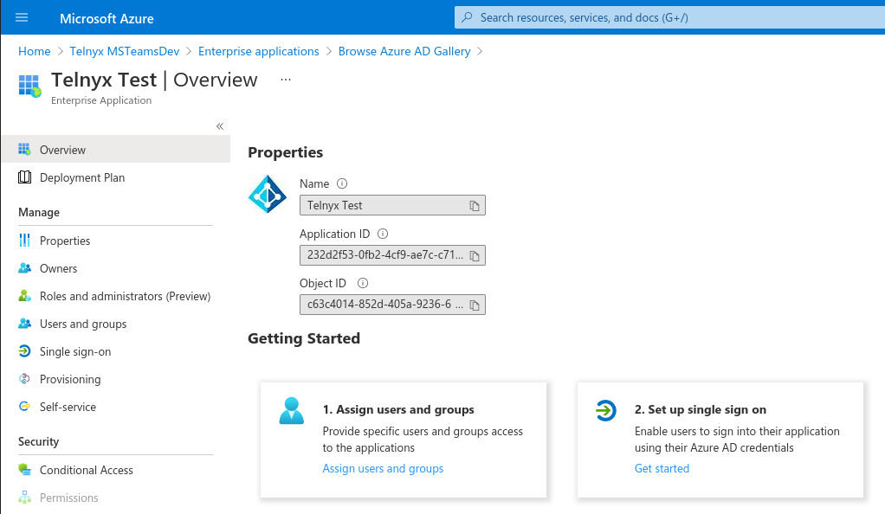
10. Select the **SAML** card to proceed to the configuration section.
11. Copy the **App Federation Metadata URL** and the **Thumbprint** from card 3.

    

### Configure Telnyx and complete the Azure AD setup

1. In the Telnyx Mission Control Portal, navigate to the [Single Sign-On](https://portal.telnyx.com/#/advanced-features/single-sign-on) section and click **Enable Single Sign-On**.

   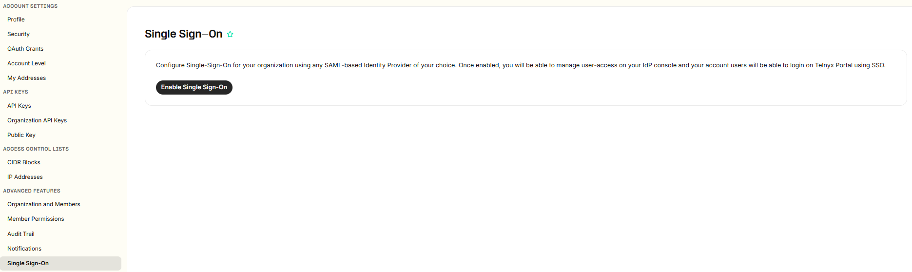
2. Enter an **Authentication Provider Name** and **Short Name**, then paste the **IdP Metadata URL** (the App Federation Metadata URL from Azure).

   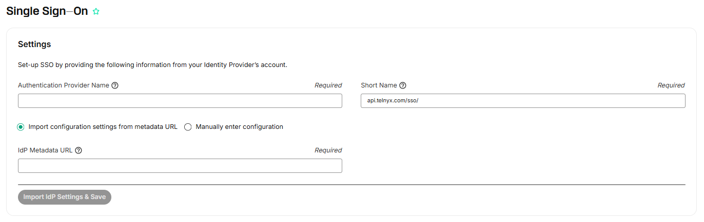
3. Click **Import IdP Settings & Save**. The authentication provider settings will fill in automatically except for the **IdP Certificate Fingerprint**.
4. Replace the "not found" in the **IdP Certificate Fingerprint** field with the **Thumbprint** from Azure, then click **Save Changes**.

   
5. From the **Authentication Provider Generated Config** section, copy the **Assertion Consumer Service URL**, **Service Provider Entity ID**, and **Name Identifier Format**.

   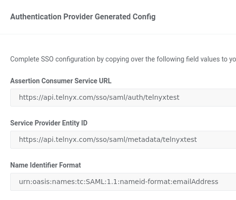
6. In Azure, click **Edit** in the top right of card 1 (**Basic SAML Configuration**).
7. Remove the default **Identifier (Entity ID)** value (such as `https://samltookit.azurewebsites.net`).
8. Paste the **Service Provider Entity ID** into the **Identifier (Entity ID)** field.
9. Paste the **Assertion Consumer Service URL** into the **Reply URL (Assertion Consumer Service URL)** field.
10. Paste `https://api.telnyx.com/sso/saml/login/YOUR_SHORT_NAME` into the **Sign on URL** field.
11. Fill in `https://portal.telnyx.com/` in the **Relay State** field.

    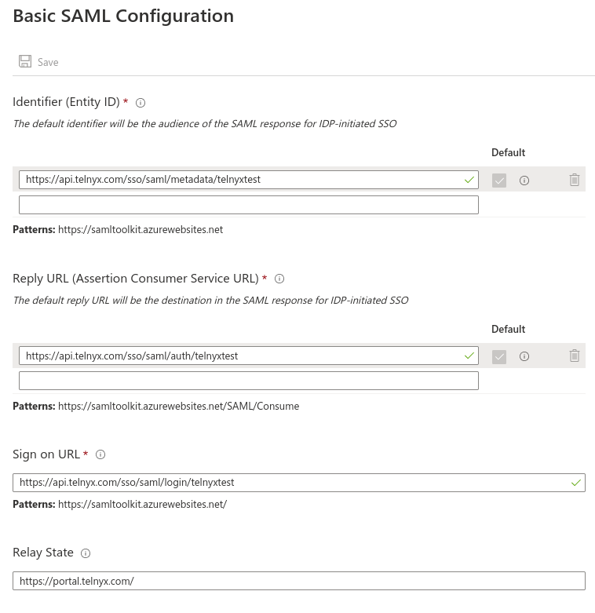
12. Click **Save**.
13. In the Telnyx Mission Control Portal, check **Enable Single Sign-On**.

    
14. Click **Save Changes**.

If you experience technical difficulties, check the status of Azure's features at [https://azure.status.microsoft/en-us/status](https://azure.status.microsoft/en-us/status).

Additional resources: [Active Directory documentation](https://learn.microsoft.com/en-us/entra/fundamentals/whatis), [Microsoft support](https://support.microsoft.com/en-US).

## Auth0 SSO Integration

[Auth0](https://auth0.com/) is a flexible, drop-in SaaS solution to add authentication and authorization services to your applications. Auth0 offers different subscription levels including Free, Developer, and Developer Pro.

### Create the web application in Auth0

1. Log into your Auth0 admin dashboard.
2. In the left-hand navigation, click **Applications**, then **Applications** in the submenu. Click the purple **+ Create Application** button.

   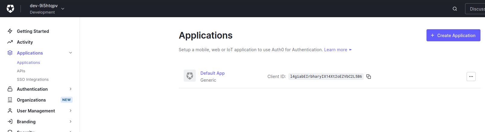
3. Enter a name of your choice and select **Regular Web Applications**.

   
4. Click **Create**.
5. Scroll to the bottom of the **Settings** tab and click **Advanced Settings**.
6. Select the **Certificates** tab and click **Download Certificates**, choosing **PEM** format. Save the `YOUR_TENANT.pem` file.
7. Select the **Endpoints** tab and copy the **SAML Protocol URL**.

   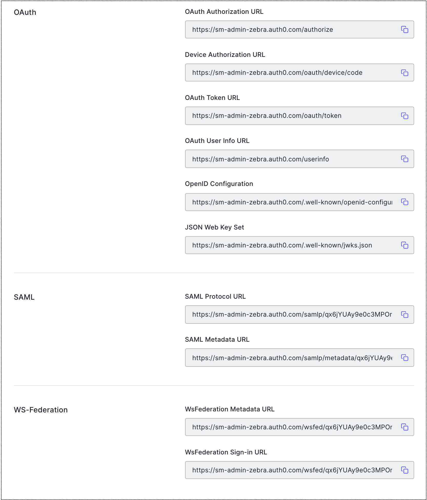
8. Scroll to the top and select the **Addons** tab.
9. Enable the **SAML2 Web App** toggle.

   
10. On the **Settings** tab, enter the **Application Callback URL** (the Assertion Consumer Service URL).

    
11. Click **Enable**.

### Configure SAML SSO for Telnyx

1. On the SAML Addon **Usage** tab, locate the **Identity Provider Metadata** link and click **Download** to obtain the metadata file.

   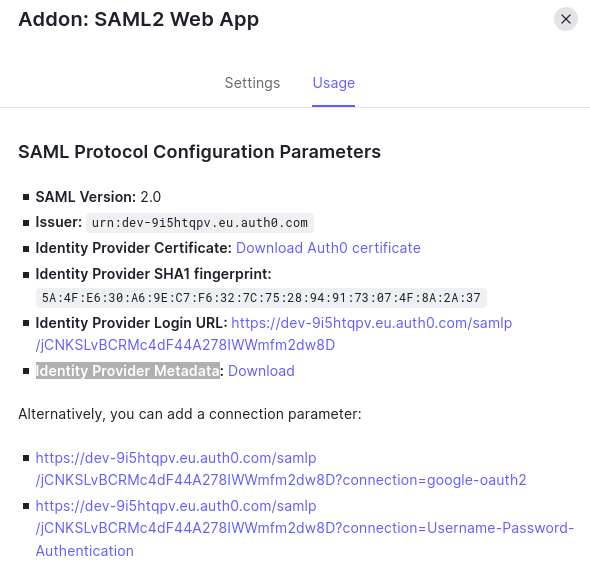
2. In the Telnyx Mission Control Portal, navigate to the [Single Sign-On](https://portal.telnyx.com/#/app/advanced-features/single-sign-on) section and click **Enable Single Sign-On**.

   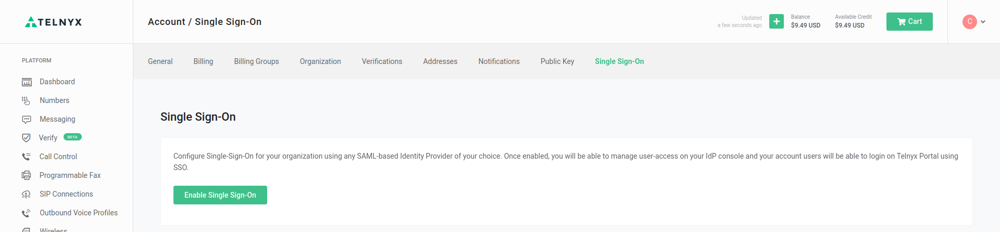
3. Enter an **Authentication Provider Name** and **Short Name**, then paste the **IdP Metadata URL**.

   
4. Click **Import IdP Settings & Save**.
5. From the **Authentication Provider Generated Config** section, copy the **Assertion Consumer Service URL**, **Service Provider Entity ID**, and **Name Identifier Format**.

   
6. In the Auth0 Admin portal, click the **Settings** tab and paste the **Assertion Consumer Service URL** into the **Application Callback URL** field.

   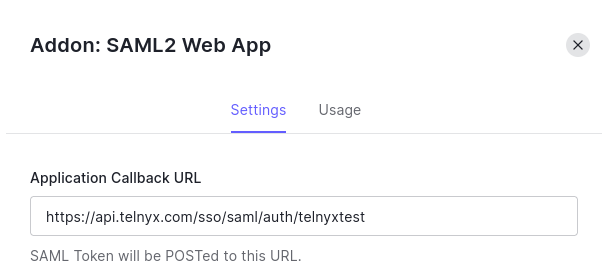
7. In the **Settings** field below, enter a JSON object using the values from Telnyx:

   ```
   {"audience": "https://apidev.telnyx.com/sso/saml/metadata/SHORTNAME", "recipient": "https://apidev.telnyx.com/sso/saml/auth/SHORTNAME", "signResponse": true, "nameIdentifierFormat": "urn:oasis:names:tc:SAML:1.1:nameid-format:emailAddress", "nameIdentifierProbes": [ "http://schemas.xmlsoap.org/ws/2005/05/identity/claims/emailaddress" ], "authnContextClassRef": "urn:oasis:names:tc:SAML:2.0:ac:classes:unspecified"}
   ```

   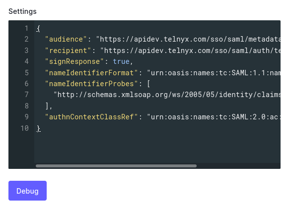
8. Click **Enable**.
9. In the Telnyx Mission Control Portal, click **Enable Single Sign-On**, then **Save Changes**.

   

If you experience technical difficulties, check the status of Auth0's features at [https://status.auth0.com/](https://status.auth0.com/).

Additional resources: [Auth0-as-SAML-provider documentation](https://auth0.com/docs/authenticate/single-sign-on/outbound-single-sign-on/configure-auth0-saml-identity-provider), [Auth0 APIs](https://auth0.com/docs/api), [Auth0 SDK libraries](https://auth0.com/docs/libraries), [Auth0 community forums](https://community.auth0.com/), [Auth0 support](https://support.auth0.com/).
