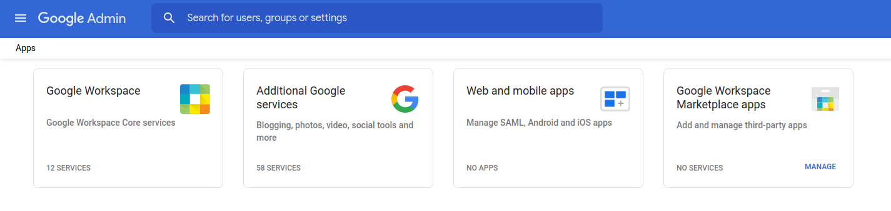
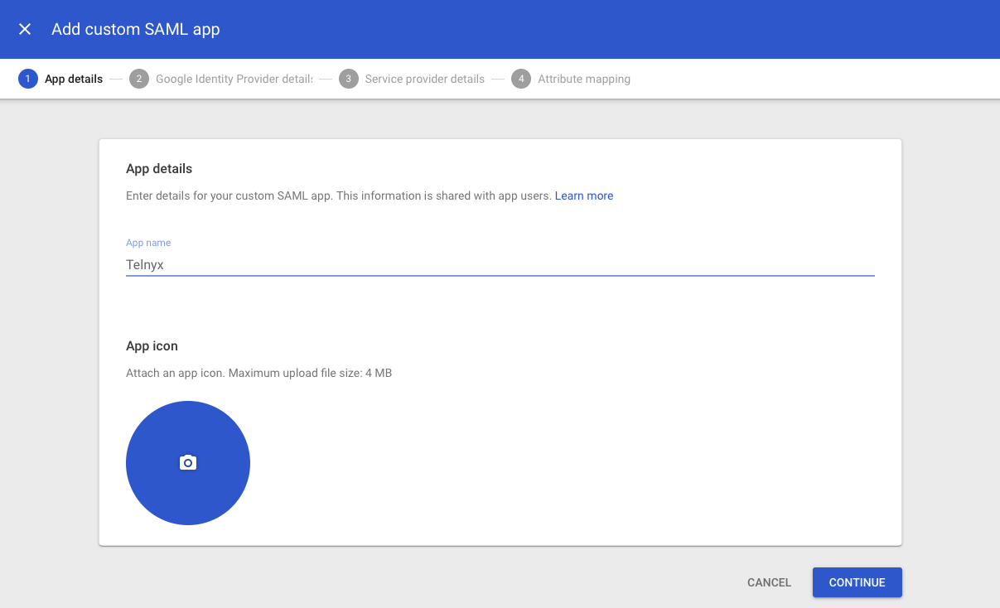
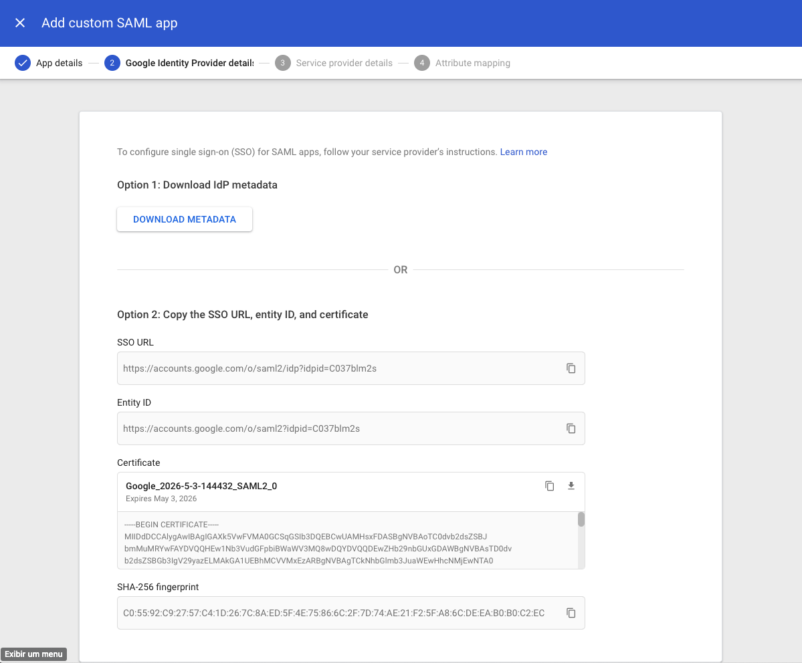
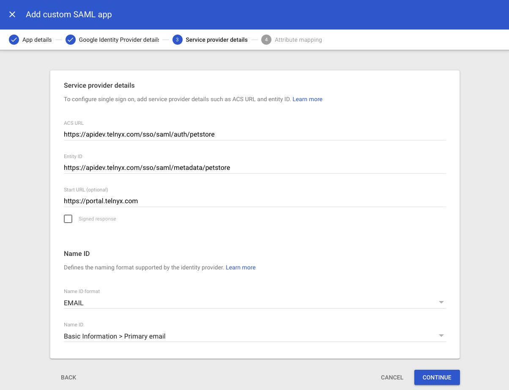

# Telnyx Compliance and SSO Identity Provider Setup

*Part 4 of 4 — see also: [Part 1](telnyx-compliance-and-sso-identity-provider-setup--part-1.md), [Part 2](telnyx-compliance-and-sso-identity-provider-setup--part-2.md), [Part 3](telnyx-compliance-and-sso-identity-provider-setup--part-3.md)*

This page consolidates Telnyx guidance on HIPAA, Business Associate Agreements, and the conduit exception, alongside step-by-step instructions for configuring SAML-based Single Sign-On with OneLogin, Okta, LastPass, Azure AD, Auth0, and GSuite.

## GSuite SSO Integration

[GSuite](https://workspace.google.com/) is a collection of business, productivity, collaboration, and education software developed and powered by Google. It is one of the many SAML providers that Telnyx supports for use with its SSO feature.

### Add a SAML app to GSuite

1. Open the Google GSuite admin portal, log in, and click the **Apps** icon.

   
2. Click the **Web and mobile apps** tile.

   
3. On the Web & Mobile apps page, click the **Add Apps** drop-down and select **Add custom SAML app**.

   
4. Fill in an app name of your choice and click **Continue**.

   
5. On the Google Identity Provider details page, note the **SSO URL**, **Entity ID**, and **SHA-256 fingerprint**.

   

### Enable SSO for your organization

1. In the Telnyx Mission Control Portal, navigate to the [Single Sign-On](https://portal.telnyx.com/#/advanced-features/single-sign-on) section and click **Enable Single Sign-On**.

   
2. Provide the following:
   - **Authentication Provider Name:** your choice.
   - **Short Name:** your choice (used in SSO URLs).
   - **Manually enter configuration:** select this.
   - **IdP Certificate Fingerprint:** SHA-256 fingerprint from GSuite.
   - **IdP Certificate Fingerprint Algorithm:** *sha256*.
   - **IdP Entity ID:** Entity ID from GSuite.
   - **IdP SSO Target URL:** SSO URL from GSuite.

   
3. Click **Save Changes**.
4. From the **Authentication Provider Generated Config** section, copy the **Assertion Consumer Service URL**, **Service Provider Entity ID**, and **Name Identifier Format**.

   
5. Return to GSuite and click **Continue**.

### Configure Telnyx as the SSO Provider

1. On the **Service Provider Details** page, provide:
   - **ACS URL:** Assertion Consumer Service URL from Telnyx.
   - **Entity ID:** Service Provider Entity ID from Telnyx.
   - **Start URL:** `https://portal.telnyx.com`.
   - **Name ID format:** *EMAIL*.
   - **Name ID:** *Basic Information > Primary email*.

   
2. Click **Continue**, then **Finish**.

### Enable your SSO configuration on your Telnyx account

1. In the Telnyx Mission Control Portal, check **Enable Single-Sign-On**.

   
2. Click **Save Changes**.

If you experience technical difficulties, check the status of GSuite's features at [https://www.google.com/appsstatus/dashboard/](https://www.google.com/appsstatus/dashboard/#hl=en&v=status).

Additional resources: [GSuite FAQ](https://workspace.google.com/faq/), [GSuite support](https://workspace.google.com/support/), [GSuite troubleshooting](https://workspace.google.com/support/#google-workspace-trouble-shooting), [GSuite admin help community](https://support.google.com/a/community?hl=en), [GSuite learning center (Documentation)](https://support.google.com/a/users/?hl=en#topic=9917952).

## Related Articles

- [OneLogin: SAML Identity Setup](onelogin-saml-identity-setup.md)
- [Okta: SAML Identity Setup](okta-saml-identity-setup.md)
- [LastPass: SAML Identity Setup](lastpass-saml-identity-setup.md)
- [Azure AD: SAML Identity Setup](azure-ad-saml-identity-setup.md)
- [Auth0 SSO Integration With Telnyx](auth0-sso-integration-with-telnyx.md)
- [GSuite SSO Integration With Telnyx](gsuite-sso-integration-with-telnyx.md)
- [Configuring Linphone with Telnyx](configuring-linphone-with-telnyx.md)
- [What is DTMF? and how to configure it on Telnyx](what-is-dtmf-and-how-to-configure-it-on-telnyx.md)
- [Port Request Rejected](port-request-rejected.md)
- [Managed Accounts](managed-accounts.md)
- [Toll-Free Messaging](toll-free-messaging.md)
