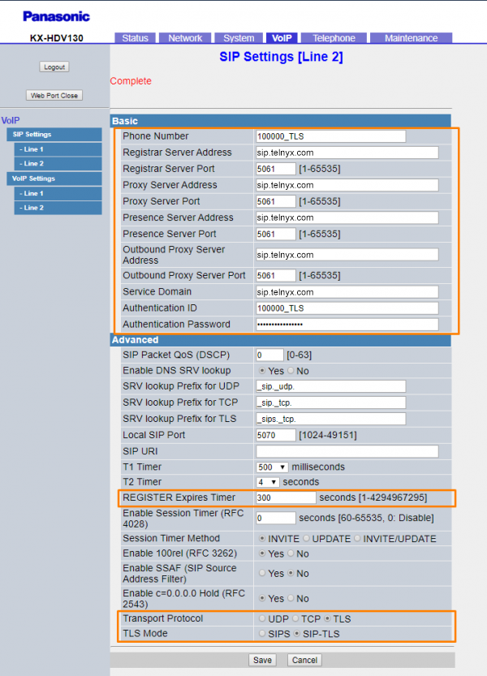

# Telnyx Device Setup and Voice Features

*Part 1 of 3 — see also: [Part 2](telnyx-device-setup-and-voice-features--part-2.md), [Part 3](telnyx-device-setup-and-voice-features--part-3.md)*

Step-by-step Telnyx setup guides for the Panasonic KX-TGP 550, Panasonic KX-HDV series, Konftel 300Wx, Konftel 300IPx, Snom M100 KLE, and Vtech VCS754 ErisStation, plus an overview of Telnyx Real-Time Transcription and the HD Voice Number Feature.

## Device Overview

The following devices are covered in this guide:

- **Panasonic KX-TGP 550** — A 2-in-1 cordless VoIP phone and base handset with a 2.1" backlit LCD, 100-entry phone book, support for up to 3 simultaneous network conversations, up to 8 SIP registrations, a DID per handset, HD Voice (G.722) on DECT, and plug-and-play configuration. Standby time is approximately 10 days with 5 hours of talk time. The same configuration applies to the KX-TGP 500 (remote handset only) and KX-TGP 551.
- **Panasonic KX-HDV series** — Entry-level IP desk phones (KX-HDV130, KX-HDV230, KX-HDV330) that balance low cost with reliable SIP performance.
- **Konftel 300Wx** — A wireless DECT conference phone with more than 60 hours of call time per charge, hybrid app integration, and expandable microphone support.
- **Konftel 300IPx** — A SIP conference phone designed to pair with the Konftel Unite mobile app for one-touch meeting control.
- **Snom M100 KLE** — A SIP DECT 4-line base station supporting up to 8 SIP registrations, 4 outgoing calls in parallel, 1,000-entry phonebook, 3-way local conferencing, and up to 10 paired Snom KLE DECT handsets/desksets.
- **Vtech VCS754 ErisStation** — An all-in-one conference phone with magnetic charging bays and portable DECT 6.0 microphones using Orbitlink Wireless Technology.

## Pre-requisites

Before configuring any device, ensure that:

- Your [Telnyx Mission Control Portal](telnyx-mission-control-portal.md) account is configured properly.
- A DID has been provisioned from Telnyx.
- (Recommended) TLS encryption is enabled to secure your traffic.

## Panasonic KX-TGP 550 Setup

### Register your handset(s)

1. Dock the handset into the base unit.
2. Press the center button and select **Menu**.
3. Choose **Initial Settings** (wrench icon), then **Registration** → **Register Handset**.
4. Press and hold the **ALL** button on the base unit for 4 seconds (beeping may or may not occur).
5. Press **OK** on the handset.

### Obtain the device's IP address

1. Press the center button and select **IP Service** (toolbox icon).
2. Navigate to **Network Setting** → **IP Setting** to view the IP address.
3. Return to **Network Setting** and enable **Embedded Web** (set to **On**).
4. Enter the IP address in a browser. Default credentials: **admin** / **adminpass**.

### Configure the KX-TGP 550 to connect to Telnyx

From the **VoIP** tab in the configuration panel, enter:

- **Phone number:** Your Telnyx DID
- **Line ID:** Telnyx SIP account username
- **Registrar Server Address:** *sip.telnyx.com*
- **Registrar Server Port:** *5060*
- **Proxy Server Address:** *sip.telnyx.com*
- **Proxy Server Port:** *5060*
- **Presence Server Port:** *5060*
- **Service domain:** *sip.telnyx.com*
- **Source Port:** *5060*
- **Authentication ID:** Telnyx SIP account username
- **Authentication Password:** Telnyx SIP account password
- **Keep Alive Interval:** ~15

## Panasonic KX-HDV Setup

### Get the device's IP address and log into the web portal

1. From the phone, open **Basic Settings** → **Other Options** → **Embedded Web** and set it to **On**.
2. Navigate to **System Settings** → **Status** → **IPv4 Settings** → **IP Address** and record the address.
3. Enter *http://* followed by the IP address in a browser.
4. Default credentials: **admin** / **adminpass**.

### Configure the SIP profile

1. Click the **VoIP** tab, then **SIP Settings** → **Line 1**.
2. In the **Basic** section, enter:
   - **Phone Number:** Telnyx SIP main account or sub-account
   - **Registrar Server Address:** *sip.telnyx.com*
   - **Registrar Server Port:** *5060* (UDP) or *5061* (TLS)
   - **Proxy Server Address:** *sip.telnyx.com*
   - **Proxy Server Port:** *5060* (UDP) or *5061* (TLS)
   - **Presence Server Address:** *sip.telnyx.com*
   - **Presence Server Port:** *5060* (UDP) or *5061* (TLS)
   - **Outbound Proxy Server Address:** *sip.telnyx.com*
   - **Outbound Proxy Server Port:** *5060* (UDP) or *5061* (TLS)
   - **Service Domain:** *sip.telnyx.com*
   - **Authentication ID:** Telnyx SIP account or sub-account
   - **Authentication Password:** Telnyx SIP account or sub-account password
3. In the **Advanced** section, set:
   - **REGISTER Expires Timer:** *300*
   - **Transport Protocol:** *UDP* by default; choose *TLS* if encryption is enabled
   - **TLS Mode:** *SIPS* by default; choose *SIP-TLS* if encryption is enabled
4. If using TLS, set **SRTP Mode** to *SRTP* under **VoIP Settings** → **Line 1** → **Advanced**.

5. Click **Save**.

### Configure audio codecs

1. From the **VoIP** tab, open **VoIP Settings** → **Line 1**.
2. Enable the supported Telnyx codecs (ulaw/g711u, alaw/g711a, g722, g729) and disable others.

3. Click **Save**.

Verify registration under **Status** → **VoIP Status**.

## Konftel 300Wx Setup

### Obtain the device's IP address

1. From the device menu, select **Status** → **Network** and note the IP address.
2. Enter *http://* followed by the IP address in a browser.
3. Default credentials: **admin** / **admin**.

### Add a SIP server

1. From the left-hand menu, click **Server** → **Add Server**.
2. Configure:
   - **Server Alias:** A name of your choice
   - **NAT Adaption:** *Enabled*
   - **Registrar:** *sip.telnyx.com*
   - **Outbound Proxy:** *sip.telnyx.com*
   - **Reregistration Time (s):** *300*
   - **SIP Transport:** *TCP*
   - **Keep Alive:** *Enabled*
   - **Codec Priority:** ulaw(g711u), alaw(g711a), g722, g729
   - **Secure RTP / Secure RTP Auth:** *Enabled* (if using TLS)
3. Click **Save**.

### Add an extension

1. Click **Extensions** → **Add Extension**.
2. Configure:
   - **Extension:** Your Telnyx DID
   - **Authentication Username:** Telnyx SIP username
   - **Authentication Password:** Telnyx SIP password
   - **Server:** The server created above
3. Select the target device and click **Save**.

### Verify registration

Under **Extensions**, confirm the new server's **State** field reads *SIP Registered*.

## Konftel 300IPx Setup

### Get the device's IP address and log into the web portal

1. From the phone, navigate to **Menu** → **Status** → **Network** and note the IP address.
2. Enter *http://* followed by the IP address in a browser.
3. Default credentials: **ADMIN** / **1234**.

### Configure a SIP extension

1. Click **Settings** → **SIP** → **Edit** next to the desired profile.
2. In the **Account 1** section, enter:
   - **Enable Account:** *Yes*
   - **Account Name:** Display name
   - **User:** Telnyx account ID
   - **Registrar:** *sip.telnyx.com*
   - **Proxy:** Blank or *sip.telnyx.com*
   - **Enable Keep Alive:** *Yes*
   - **Realm:** Blank or *sip.telnyx.com*
   - **Authentication Name:** Telnyx account ID
   - **Password:** Telnyx account password
   - **Registration Interval:** *300*

3. In the **Transport** section, set:
   - **Protocol:** *UDP* or *TCP* (or *TLS* if encryption is enabled)
   - **Local port:** *5060* (or *5061* for TLS)

### Verify the SIP account status

Click **Status** → **SIP** and confirm the account is registered.

