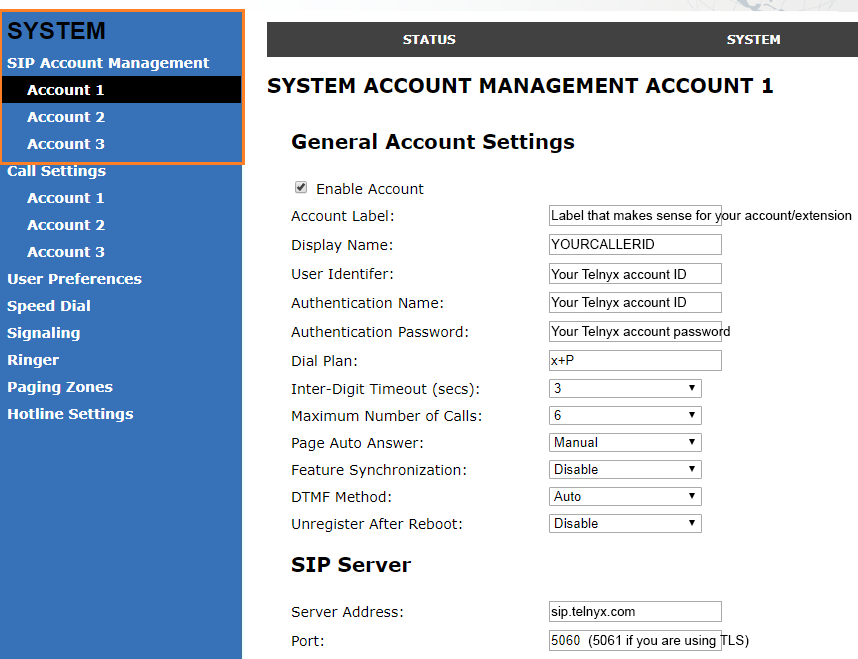
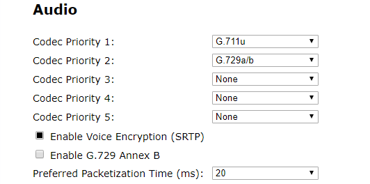

# Telnyx Device Setup and Voice Features

*Part 2 of 3 — see also: [Part 1](telnyx-device-setup-and-voice-features--part-1.md), [Part 3](telnyx-device-setup-and-voice-features--part-3.md)*

Step-by-step Telnyx setup guides for the Panasonic KX-TGP 550, Panasonic KX-HDV series, Konftel 300Wx, Konftel 300IPx, Snom M100 KLE, and Vtech VCS754 ErisStation, plus an overview of Telnyx Real-Time Transcription and the HD Voice Number Feature.

## Snom M100 KLE Setup

### Get the device's IP address and log into the web portal

1. Press **Menu/Select**, then navigate to **Status** → **Network** and note the IP address.
2. Enter *http://* followed by the IP address in a browser.
3. Default credentials: **admin** / **admin**.

### Configure the base station

1. Click the **System** tab.
2. In **General Account Settings**, enter:
   - **User Identifier:** Telnyx main SIP account or sub-account UserID (e.g. 100000 or 100000_sub)
   - **Authentication Name:** Telnyx main SIP account or sub-account UserID
   - **Authentication Password:** SIP account password
3. In the **SIP Server** section, enter:
   - **Server address:** *sip.telnyx.com*
   - **Port:** *5060* (or *5061* for TLS)
4. In the **Registration** section, enter:
   - **Server Address:** *sip.telnyx.com*
   - **Port:** *5060* (or *5061* for TLS)

5. Click the **Status** tab and confirm the account shows *Registered*.

## Vtech VCS754 Setup

### Get the device's IP address and log into the web portal

1. Press **Menu**, then select **Status** → **Network** and note the IP address.
2. Enter *http://* followed by the IP address in a browser.
3. Default credentials: **admin** / **admin**.

### Configure the conference phone

1. Click the **System** tab and select the account to configure.
2. In **General Account Settings**, enter:
   - **Account Label:** A descriptive name
   - **Display Name:** Caller ID (use capital letters, no special characters, ≤15 characters for Canadian carriers)
   - **User Identifier:** Telnyx account ID
   - **Authentication Name:** Telnyx account ID
   - **Authentication Password:** Telnyx account password
   - **Dial Plan:** *x+P* (default)
3. In the **SIP Server** section, enter:
   - **Server Address:** *sip.telnyx.com*
   - **Port:** *5060* (or *5061* for TLS)
4. Repeat the same values in the **Registration**, **Outbound Proxy**, and **Backup Outbound Proxy** sections.

5. In the **Audio** section, configure:
   - **Ringer Tone:** As preferred
   - **Codec Priority:** ulaw(g711u), alaw(g711a), g722, g729
   - **Enable Voice Encryption (SRTP):** Check if using TLS

### Configure signaling settings

1. Click the **System** tab and select **Signaling Settings**.
2. Enter:
   - **Local SIP Port:** *5060* (or *5061* for TLS)
   - **Transport:** *UDP* or *TCP* (or *TLS/TCP* for TLS)

## Troubleshooting

### KX-TGP 550: No IP address visible

1. Confirm the phone is connected to the network and a DHCP server is available.
2. Repeat the handset registration process.

## Real-Time Transcription

Telnyx offers real-time transcription (speech-to-text) for live phone calls via the Voice API and TeXML. Unlike post-call transcription, results appear nearly instantaneously as the conversation unfolds.

### Key features

- **Instantaneous:** Text appears almost in real time.
- **Automated:** Powered by speech-to-text algorithms without human intervention.
- **Multi-functional:** Useful for accessibility, legal compliance, documentation, and analytics.
- **Accuracy:** Varies with speech clarity, background noise, and engine sophistication.

### Voice API parameters

- `call_control_id` — Unique ID for controlling the call.
- `client_state` — Adds call state to webhooks.
- `command_id` — Optional arbitrary ID.
- `interim_results` — Faster but less accurate; only available with Engine A (Google).
- `language` — Sets the transcription language.
- `transcription_engine` — `A` (Google, default; supports `interim_results`) or `B` (Telnyx; more accurate, lower cost).
- `transcription_tracks` — `inbound`, `outbound`, or `both`.

### TeXML attributes

### Use cases

- **AI / LLM integration** — Pass call audio to AI for evaluation, summarization, or participation.
- **Voicemail** — Read and share written transcripts of messages.
- **Business meetings** — Provide a written record and free participants from note-taking.
- **Legal proceedings** — Live transcripts for compliance.
- **Accessibility** — Support hearing-impaired participants.
- **Customer service** — Real-time analytics and quality control.

### Pricing

- **Telnyx engine (B):** $0.025 USD per minute.
- **Google engine (A):** $0.050 USD per minute.

See the [Voice pricing page](https://portal.telnyx.com/#/pricing/voice) for current rates.

### Automatic transcription with call recording timeout

If a call recording timeout is configured, Telnyx uses transcription to detect silence and may automatically trigger real-time transcription. This will incur transcription charges even if not explicitly enabled.
