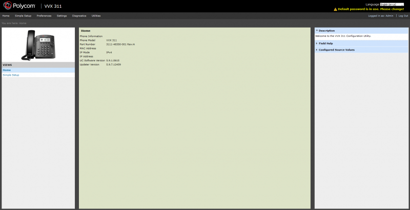
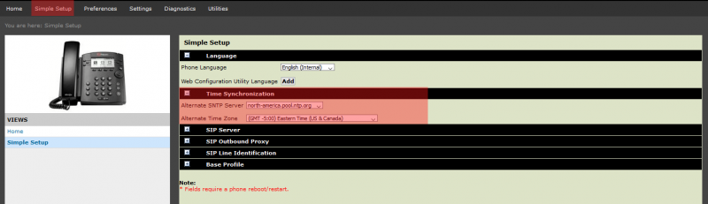
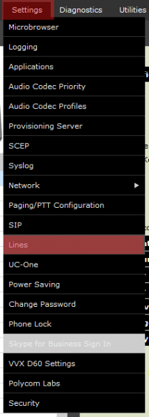
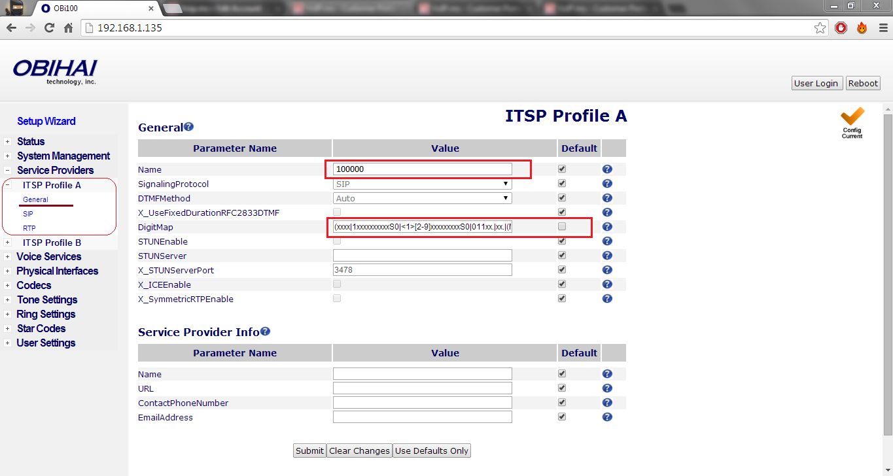
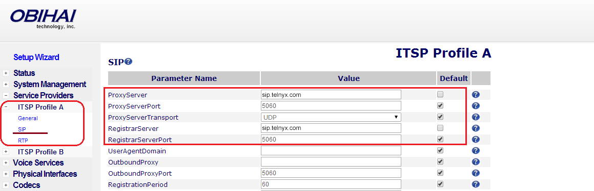

# Telnyx Device Setup Guides

*Part 1 of 4 — see also: [Part 2](telnyx-device-setup-guides--part-2.md), [Part 3](telnyx-device-setup-guides--part-3.md), [Part 4](telnyx-device-setup-guides--part-4.md)*

Consolidated Telnyx setup guides for SIP-capable desk phones, conference phones, and ATAs (Polycom VVX 300-series, Poly OBi300, FortiFone FON-570/375/175/H25, Flyingvoice, Snom C520, and Snom D7xx), plus a Linksys ATA dialplan reference. Each guide covers obtaining the device IP, logging into the web portal, and entering Telnyx SIP credentials (server sip.telnyx.com, ports 5060/5061, supported codecs, and caller ID naming conventions).

## Overview

This page consolidates Telnyx setup guides for a range of SIP-capable desk phones, conference phones, and ATAs. Each device follows a similar workflow: confirm the Telnyx Mission Control Portal is configured, obtain the device's IP address, log into the device's web portal, and enter Telnyx SIP credentials (server `sip.telnyx.com`, ports `5060` for UDP/TCP or `5061` for TLS, and the supported codec list). The sections below cover device-specific steps, default credentials, and any optional features such as encryption, NTP, or dialplan configuration.

Common pre-requisites across all devices:

- Ensure the [Telnyx Mission Control Portal](https://support.telnyx.com/en/articles/1176636-get-started-with-a-mission-control-account) is configured properly.
- Recommended: [Enable TLS to encrypt your traffic](https://support.telnyx.com/en/articles/1130711-does-telnyx-encrypt-communication).

Common caller ID naming conventions referenced in every device guide:

- Use capital letters for the outbound Caller ID Name.
- Do not use special characters; spaces are allowed.
- Some Canadian providers display no more than 15 characters — keep the name short.

Telnyx-supported audio codecs (in recommended priority order):

1. `ulaw` (g711u)
2. `alaw` (g711a)
3. `g722`
4. `g729`

## Polycom VVX 300-series

The [Polycom VVX 300-series](https://www.poly.com/us/en/products/phones/vvx/vvx-301-311) IP phones feature Acoustic Clarity Technology, HD Voice, programmable buttons, call waiting/forwarding/hold, a call directory, and speakerphone.

### Pre-requisites

- Telnyx Mission Control Portal configured.
- [Purchase a DID](https://portal.telnyx.com/#/app/numbers/search-numbers).
- [Set up a Telnyx SIP connection](https://portal.telnyx.com/#/app/connections).
- [Provision your number](https://portal.telnyx.com/#/app/numbers/my-numbers) (assign it to a SIP connection).
- [Create an outbound voice profile](https://portal.telnyx.com/#/app/outbound).
- Create an [IP-based connection](https://portal.telnyx.com/#/app/connections) on the Telnyx Mission Control Portal.
- Recommended: [Enable TLS](https://support.telnyx.com/en/articles/1130711-does-telnyx-encrypt-communication).
- Download Elastix 4 ISO from the [Telnyx Dropbox](https://www.dropbox.com/sh/rzrdrpu0ocumu95/AABJeNgKkOkDCYLkSrsIuD3Aa?dl=0) (V4 is no longer available through the provider). Note any username/password set during this step for later use.

### Get the device IP address and log into the web portal

1. Connect the phone to a network with a DHCP server and wait 1–2 minutes for it to boot. The IP may be displayed on boot depending on firmware.
2. If the IP is not shown, press the **Home** button and go to **Settings > Status > Network > TCP/IP Parameters** to find it.
3. Open a browser (Chrome/Firefox recommended) and enter `https://<phone IP Address>`.
4. Default password: `456`.

### Configure NTP settings

From the top navigation, click **Simple Setup** and expand **Time Synchronization**:

- **Alternate SNTP Server:** `north-america.pool.ntp.org` (see the [NTP pool usage page](https://www.ntppool.org/en/use.html) for additional regions).
- **Alternate Time Zone:** your preferred time zone.

### Configure SIP settings

1. Click **Settings > Lines** in the left-hand navigation to open the Line 1 configuration screen.

2. Configure each line button individually. The following settings apply to each line:

**Identification**

- **Display Name:** outbound caller ID name (see naming conventions above; review [Telnyx's caller ID number policy](https://support.telnyx.com/en/articles/3546251-caller-id-number-policy)).
- **Address:** Telnyx account name.
- **Label:** name shown next to the line button.
- **SRTP settings:** all set to `No`.
- **Server Auto Discovery:** `Disabled`.

**Server 1**

- **Address:** Telnyx SIP server FQDN or IP address.
- **Port:** `5060`.
- **Transport:** `UDP Only`.
- **Expires:** `300` (adjust based on gateway/router timeout).
- **Subscription Expire(s):** `300`.

**Message Center**

- **Callback Mode:** `Contact`.
- **Callback Contact:** `*97` (dials the assigned extension's voicemail box).

### Restart and verify

1. From the phone, go to **Utilities > Restart Phone**.
2. When prompted, click **Yes**.

After reboot, the phone should show online, the registration status on the VoIP Control Panel should show registered, and you should be able to make and receive calls.

Additional resources: [Polycom support](https://support.hp.com/us-en/poly) and the Polycom VVX 300-series IP phone user guide.

## Poly OBi300 ATA

The [Poly OBi300](https://www.poly.com/br/pt/products/phones/obi/obi300) is a VoIP adapter that supports up to four VoIP services and connects an analog phone or fax machine to digital communications. It supports an optional WiFi accessory.

Pre-requisites: Telnyx Mission Control Portal configured, TLS recommended, and a phone connected to the OBi300.

### Get the device IP address and log into the OBi web portal

1. From the phone connected to the OBi300, dial `***` and press `1` to confirm and hear the IP address.
2. Open a browser and enter `http://<IP address>`. Default credentials: `admin` / `admin`.

### Disable auto-provisioning

From the left-hand navigation:

- **System Management > Auto Provisioning > Auto Firmware Update** — Method: `Disabled`.
- **System Management > Auto Provisioning > ITSP Provisioning** — Method: `Disabled`.
- **System Management > Auto Provisioning > OBiTALK Provisioning** — Method: `Disabled`.
- **Voice Services > OBiTALK Service** — uncheck **Enable**.

### Configure the ITSP profile

Expand **Service Providers**, then the profile being configured, and click **General**:

- **Name:** Telnyx account ID.
- **DigitMap:** copy the line (including parentheses) from the DigitMap field in the ITSP Profile and replace the `555` digits with the area code of your choice.

### Configure the SIP profile

Expand **Service Providers**, then the profile, and click **SIP**:

- **AuthUserName:** Telnyx account ID.
- **AuthPassword:** Telnyx account password.
- **ProxyServerPort:** `5060` (UDP/TCP) or `5061` (TLS).
- **ProxyServerTransport:** `UDP` or `TCP` (or `TLS/TCP` for TLS).
- **RegistrarServerPort:** `5060` or `5061`.
- **OutboundProxyPort:** `5060` or `5061`.
- **X_OutboundProxyTransport:** `UDP`/`TCP` or `TLS/TCP`.
- **RegisterExpires:** `300`.

For TLS, expand **Voice Services**, click the service being configured, and set:

- **X_KeepAliveServerPort:** `5061`.
- **X_SRTP:** `Use SRTP Only`.

### Configure audio codecs

Expand **Codecs** and set codecs in priority order: `ulaw (g711u)`, `alaw (g711a)`, `g722`, `g729`.

Additional resources: [Poly OBi300 knowledgebase](https://support.hp.com/us-en/poly) and [Poly support](https://support.hp.com/us-en/contact?openCLC=true).
