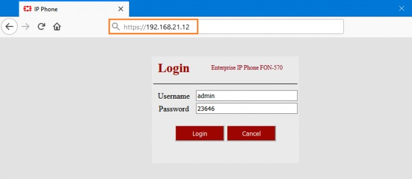
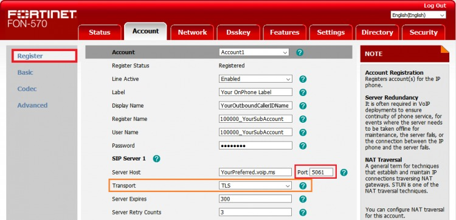
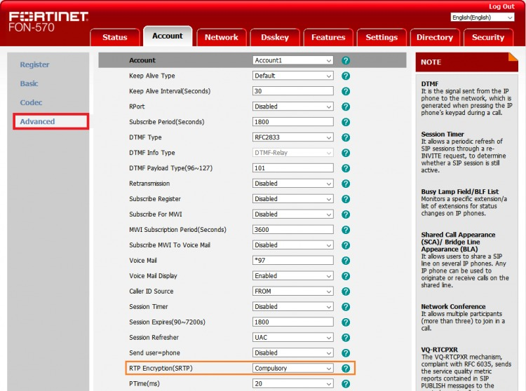
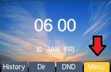
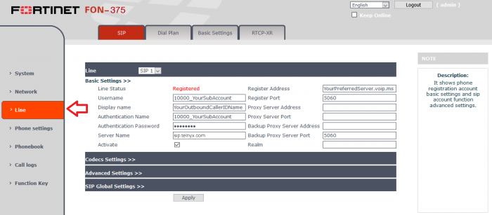
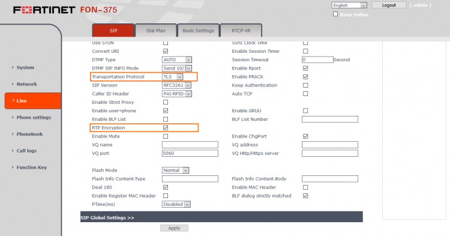
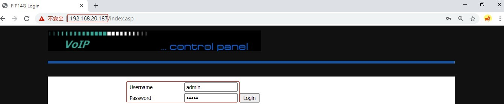
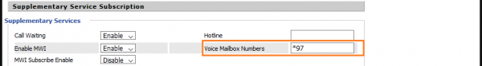
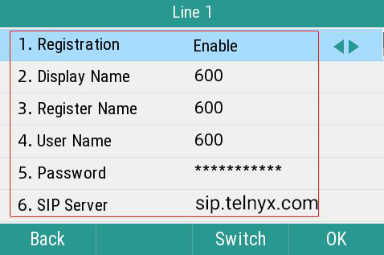
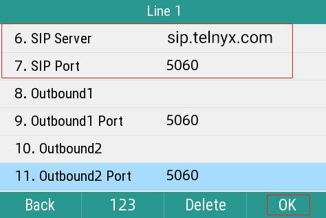

# Telnyx Device Setup Guides

*Part 2 of 4 — see also: [Part 1](telnyx-device-setup-guides--part-1.md), [Part 3](telnyx-device-setup-guides--part-3.md), [Part 4](telnyx-device-setup-guides--part-4.md)*

Consolidated Telnyx setup guides for SIP-capable desk phones, conference phones, and ATAs (Polycom VVX 300-series, Poly OBi300, FortiFone FON-570/375/175/H25, Flyingvoice, Snom C520, and Snom D7xx), plus a Linksys ATA dialplan reference. Each guide covers obtaining the device IP, logging into the web portal, and entering Telnyx SIP credentials (server sip.telnyx.com, ports 5060/5061, supported codecs, and caller ID naming conventions).

## FortiFone FON-570

The [FortiFone FON-570](https://www.fortinet.com/products/business-phone-systems/fortivoice-fortifone/phones-softclients) is a top-line model with a 7" color screen, 7 dedicated feature keys, 109 programmable phone keys, full-duplex speakerphone, dual 10/100/1000 Ethernet ports, and integrated PoE.

### Get the device IP address

1. Press the **OK** button on the phone, or the **Menu** button on the screen.
2. Click **Status** on-screen.

3. The IP address is shown on the **Status** page.

### Set up the FortiFone for traffic flow

1. Open a browser and enter `http://<IP address>`. Default credentials: `admin` / `23646`.

2. Click the **Account** tab and select **Register** in the left-hand navigation. Enter:

- **Line Active:** `Enabled`.
- **Label:** a recognizable name.
- **Display Name:** caller ID (follow naming conventions).
- **Register Name:** Telnyx SIP account username.
- **User Name:** Telnyx SIP account username.
- **Password:** Telnyx SIP account password.
- **Server Host:** `sip.telnyx.com`.
- **Port:** `5060` (UDP) or `5061` (TLS).
- **Transport:** `UDP` by default; choose `TLS` if TLS/SRTP is enabled.
- **Server Expires:** `300`.
- **Server Retry Counts:** `3` (default).

3. (Optional, required for TLS) Click **Advanced** in the left-hand navigation and set **RTP Encryption (SRTP):** `Compulsory`.

4. Click the **Settings** tab, then **Date and Time** in the left-hand navigation:

- **Time Synchronized via DHCP:** `Yes`.
- **Time zone:** select from the drop-down.
- **Location:** select for daylight saving.
- **Primary Server:** `pool.ntp.org` (optional).
- **Time Format:** 12-hour or 24-hour.
- **Date Format:** preferred format.

5. Click **Confirm**.

Additional resources: [FortiFONE documentation](https://www.fortinet.com/search?q=fortifone) and [Fortinet support](https://www.fortinet.com/support/contact).

## FortiFone FON-375/175/H25

This guide also covers the FortiFone FON-175 and FortiFone FON-H25. The FON-570 is a top-line model with a 7" color screen, 7 dedicated feature keys, 109 programmable phone keys, full-duplex speakerphone, dual 10/100/1000 Ethernet ports, and integrated PoE.

### Get the device IP address

1. Tap the **Menu** button on the LCD screen and select **Status** to see the IP address.

### Set up the FortiFone for traffic flow

1. Open a browser and enter `http://<IP address>`. Default credentials: `admin` / `23656`.

2. Click **Line** in the left-hand menu and select the **SIP** tab. In the **Line** section, enter:

- **Username:** SIP main or sub-account username.
- **Display Name:** caller ID (follow naming conventions).
- **Authentication Name:** SIP main or sub-account username.
- **Authentication Password:** SIP main or sub-account password.
- **Server Name:** `sip.telnyx.com`.
- **Register Address:** `sip.telnyx.com`.
- **Register Port:** `5060` (UDP) or `5061` (TLS).
- **Activate:** checked.

3. In the **Advanced** section:

- **Transportation Protocol:** `UDP` by default; choose `TLS` if TLS/SRTP is enabled.

4. (Optional, required for TLS) Still in **Advanced**:

- **Transportation Protocol:** `TCP`.
- **RTP Encryption:** checked.

Additional resources: [FortiFONE documentation](https://www.fortinet.com/search?q=fortifone) and [Fortinet support](https://www.fortinet.com/support/contact).

## Flyingvoice IP Phones

[Flyingvoice](https://www.flyingvoice.com/) provides VoIP phones, ATAs, gateways, and routers. Their WiFi IP phones eliminate the need for a hard-wired internet connection. This guide covers the [entire range of Flyingvoice IP phones](https://www.flyingvoice.com/products.html).

Pre-requisites: Telnyx Mission Control Portal configured (with an extension/sub-account), TLS recommended.

### Physically connect the phone to a network

Connect the phone to the same network as the computer used for configuration.

### Get the device IP address and log into the web portal

1. Turn on the phone. After initialization, the LCD shows the date, time, and IP address.
2. Open a browser and enter `http://<IP address>`. Default credentials: `admin` / `admin`.

### Set up the Flyingvoice phone for traffic flow

1. Click the **SIP Account** tab, then the **Line 1** sub-tab. Configure:

- **Line Enable:** `Enable`.
- **Display Name:** caller ID (follow naming conventions).
- **Phone Number:** Telnyx username.
- **Account:** Telnyx username.
- **Password:** Telnyx password.
- **Proxy Server:** `sip.telnyx.com`.
- **Proxy Port:** `5060` (UDP) or `5061` (TLS).
- **Transport:** `UDP` by default; choose `TLS` if TLS/SRTP is enabled.

- **Voice Mailbox Numbers:** `*97`.

- **Register Refresh Interval (sec):** `180`.

- **RTP Port Min:** `100001`.
- **RTP Port Max:** `200000`.

2. Click **Save & Apply**.

### (Optional) Set the Multiple Line button

1. Click the **Phone** tab, then the **Line Key** sub-tab.

2. In the **Dsskey** table, locate the LineKey number and provide:

- **Type:** `Line`.
- **Line:** `Line 1`.
- **Label:** e.g., `L1`, `Line1`, or the extension number.

3. Click **Save**.

### (Optional) Set up a SIP trunk from the phone

1. From the phone screen, navigate to **Menu > Advanced**.
2. Enter the default password `admin`.
3. Go to **Accounts > Line 1** and enable **Registration**.
4. Enter:

- **Phone Number:** Telnyx username.
- **Account:** (Telnyx username).
- **Password:** Telnyx password.
- **Display Name:** caller ID (follow naming conventions).
- **Register Name:** Telnyx username.
- **User Name:** Telnyx username.
- **Password:** Telnyx password.
- **SIP Server:** `sip.telnyx.com`.
- **SIP Port:** `5060` (UDP) or `5061` (TLS).

5. Press **OK**.

Additional resources: [Flyingvoice documentation, firmware, and product detail](https://www.flyingvoice.com/download.html), [Flyingvoice training videos](https://www.flyingvoice.com/training.html), and [Flyingvoice FAQs](https://www.flyingvoice.com/Faq/index.html).
