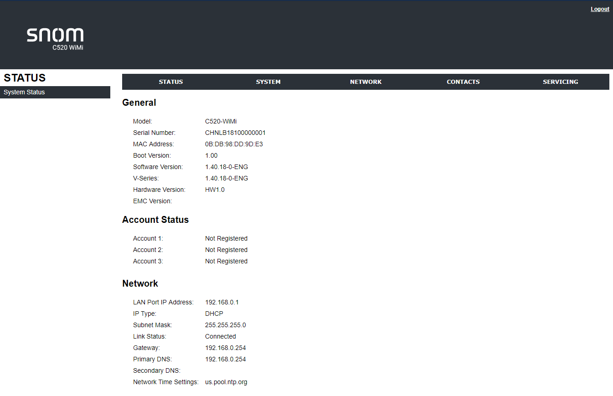
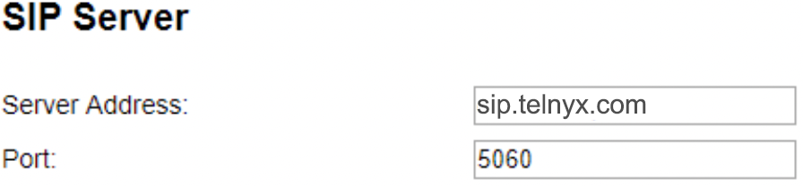
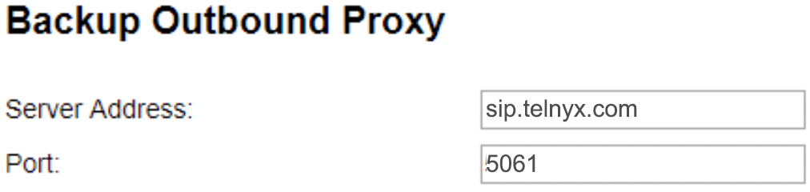
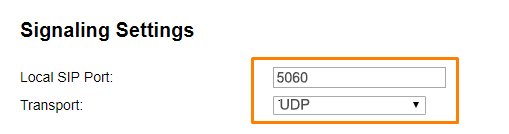
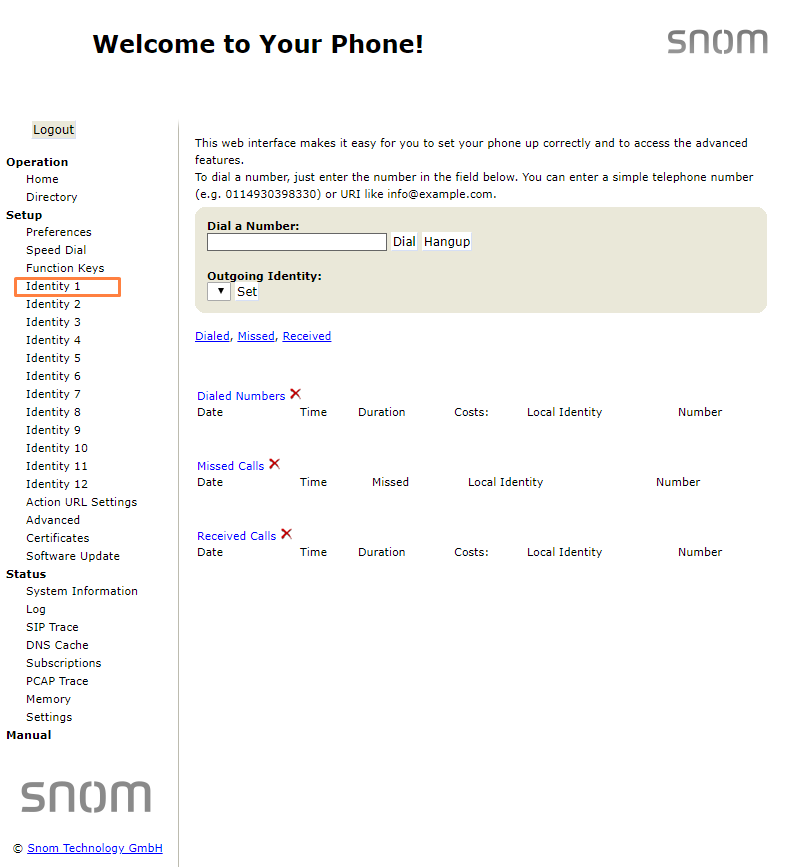
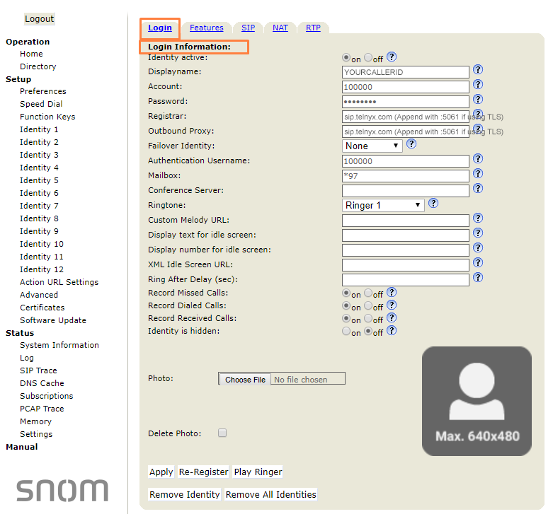
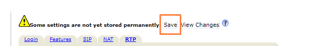

# Telnyx Device Setup Guides

*Part 3 of 4 — see also: [Part 1](telnyx-device-setup-guides--part-1.md), [Part 2](telnyx-device-setup-guides--part-2.md), [Part 4](telnyx-device-setup-guides--part-4.md)*

Consolidated Telnyx setup guides for SIP-capable desk phones, conference phones, and ATAs (Polycom VVX 300-series, Poly OBi300, FortiFone FON-570/375/175/H25, Flyingvoice, Snom C520, and Snom D7xx), plus a Linksys ATA dialplan reference. Each guide covers obtaining the device IP, logging into the web portal, and entering Telnyx SIP credentials (server sip.telnyx.com, ports 5060/5061, supported codecs, and caller ID naming conventions).

## Snom C520 Conference Phone

The [Snom C520](https://www.snomamericas.com/en/pd/ip-phones/conferencing/c520) SIP conference phone uses Bluetooth and DECT 6.0 for hands-free calls. It includes one fixed built-in mic and two wireless mics, supporting nine or more active participants in a small room, and scales up with the C52-SP DECT expansion speakerphone to 27 or more participants.

### Get the device IP address and log into the C520 web portal

1. Click the **Menu** button on the phone.
2. Scroll to **Status** and select **Network** to find the IP address.
3. Open a browser and enter `http://<IP address>`. Default credentials: `admin` / `admin`.

### Configure the C520

1. Click the **System** tab in the top navigation.
2. From the left-hand menu, expand **SIP Account Management** and click the account to configure.
3. In the **General** section, provide:

- **Account Label:** a recognizable label (often the same as the caller ID).
- **Display Name:** caller ID (follow naming conventions).
- **User Identifier:** Telnyx account ID.
- **Authentication Name:** Telnyx account ID.
- **Authentication Password:** Telnyx account password.
- **Dial Plan:** `x+P` (default).

4. In the **SIP Server** section:

- **Server Address:** `sip.telnyx.com`.
- **Port:** `5060` (UDP/TCP) or `5061` (TLS).

5. In the **Registration** section:

- **Server Address:** `sip.telnyx.com`.
- **Port:** `5060` or `5061`.
- **Expiration (secs):** `300`.
- **Registration Freq (secs):** `10`.

6. In the **Outbound Proxy** section:

- **Server Address:** `sip.telnyx.com`.
- **Port:** `5060` or `5061`.

7. Leave **Backup Outbound Proxy** blank unless TLS is enabled. For TLS:

- **Server Address:** `sip.telnyx.com`.
- **Port:** `5061`.

8. In the **Audio** section, set codecs in priority order: `ulaw (g711u)`, `alaw (g711a)`, `g722`, `g729`.

9. In **Signaling Settings**:

- **Local SIP Port:** `5060` or `5061`.
- **Transport:** `UDP` or `TCP` (or `TLS/TCP` for TLS).

Additional resources: [C520 Datasheet](https://www.snomamericas.com/assets/c5d49735-2ad0-4e53-8315-5d36b531b9cf/snom_C520_datasheet_en.pdf), [C520 User Manual](https://www.snomamericas.com/assets/0988fbb8-88fd-438c-9957-3828fbcb84e9/UM_C520_en.pdf), [C520 Quick-install Guide](https://www.snomamericas.com/assets/7796f36f-3c78-4f9b-b817-b31025915d21/QIG_C520.pdf), [Snom support](https://www.snomamericas.com/support/contact/), [Snom service hub](https://service.snom.com/), and [Snom helpdesk](https://jira.snom.com/servicedesk/customer/user/login).

## Snom D7xx Desk Phones

The [Snom Professional D7xx](https://www.snomamericas.com/en/ip-phones/desk-phones/d7xx-series-next-gen) series offers wideband HD audio, Bluetooth compatibility, programmable keys, and preinstalled security certificates. While screenshots are taken from a D735, the steps apply to the D120, D717, D735, and D785.

### Get the device IP address and log into the web portal

1. Click the **Settings** button on the phone.
2. Scroll to **Information** and select **System Information** to find the IP address.
3. Open a browser and enter `http://<IP address>`. Default credentials: `admin` / `0000`.

4. Click **Identity 1** (or the identity to configure).

### Configure the D7xx phone

1. On the **Login** tab, provide:

- **Displayname:** caller ID (follow naming conventions).
- **Account:** Telnyx account ID.
- **Password:** Telnyx account password.
- **Registrar:** `sip.telnyx.com` (UDP/TCP) or `sip.telnyx.com:5061` (TLS).
- **Outbound Proxy:** `sip.telnyx.com` or `sip.telnyx.com:5061`.
- **Authentication Username:** Telnyx account ID.
- **Mailbox:** `*97`.

2. Click **Apply**.
3. On the **SIP** tab, provide:

- **Dial-Plan String:** `^.$`.
- **Proposed Expiry:** `300`.
- **Subscription Expiry:** `300`.
- **Failed Subscription Retry Time:** `300`.

4. Click **Apply**.

### Configure codecs

1. In the **RTP Identity Settings** field, set codecs in priority order: `ulaw (g711u)`, `alaw (g711a)`, `g722`, `g729`.
2. For TLS, also set:

- **RTP Encryption:** `on`.
- **RTP/SAVP:** `Mandatory`.

3. Click **Apply**, then **Save** at the top of the page.

Additional resources: [D735 datasheet](https://www.snomamericas.com/assets/2fa680f5-dba0-4469-8db2-57b36b38e733/snom_D735_datasheet_en_20210210.pdf), [D735 product brochure](https://www.snomamericas.com/assets/2b70597b-c8a3-4fb7-8692-4f67b7d080f1/snomamericas_product_catalog_en.pdf), [D735 instruction manual](https://www.snomamericas.com/assets/a2344b3a-44b0-4102-8ebd-f746a0a91506/UM_D735_en.pdf), [D735 quick reference guide](https://www.snomamericas.com/assets/a95d9ab1-7175-46bf-bd1c-b6fcb7f7dcc2/Snom_D735_Quick_Reference_Guide__Default_variant.pdf), [D717 documents](https://www.snomamericas.com/en/pd/ip-phones/desk-phones/d7xx-series-next-gen/d717), [D785 documents](https://www.snomamericas.com/en/pd/ip-phones/desk-phones/d7xx-series-next-gen/d785), [Snom support](https://www.snomamericas.com/support/contact/), [Snom service hub](https://service.snom.com/), and [Snom helpdesk](https://jira.snom.com/servicedesk/customer/user/login).

## Linksys ATA Dialplan Reference

A dialplan (or dial plan) is a string of characters that determines how entered phone digits are interpreted and transmitted by an ATA device. It also tells the device whether to accept or reject a call, and can be used to block call profiles such as long distance or international. The basic dialplan provided in the configuration samples for Linksys ATA devices works with Telnyx.

### Linksys dialplan digit sequence reference

| Digit Sequence | Function |
| --- | --- |
| `0 1 2 3 4 5 6 7 8 9 * #` | Characters available to use that map to a phone digit. |
| `x` | Any phone digit. |
| `[sequence]` | Allow-list of digits. `[1-5]` allows digits 1 through 5. `[25-7*]` allows 2, 5, 6, 7, or `*` (4, 8, and 9 are excluded). |
| `.` (period) | Accept zero or more entries of the preceding number. `01.` allows 0, 01, 011, and so on. |
| `<dialed:substituted>` | Sequence substitution. `<:1555>xxxxxxx` prefixes a 7-digit number with `1555` (e.g., `6782345` becomes `15556782345`). |
| `,` (comma) | Plays an "outside line" dial tone after a trigger. `9, 1x.` plays the tone after `9` and continues until `1` is pressed. |
| `!` (exclamation point) | Prohibits a dial sequence. `1900xxxxxxx!` rejects any 1-900 number. |
| `S0` or `L0` | Overrides the Short or Long inter-digit timer to 0 seconds. `<:1555>[2-9]xxxxxxS2` waits 2 seconds for additional digits on a 7-digit local call, then prefixes with the local area code + 1-555. `1[2-9]xx[2-9]xxxxxxS0` sends an 11-digit +1-areacode-number immediately without waiting. |
| `P#` (where `#` is the pause duration in seconds) | Pauses `#` seconds. |
