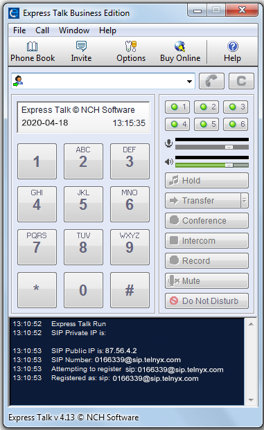
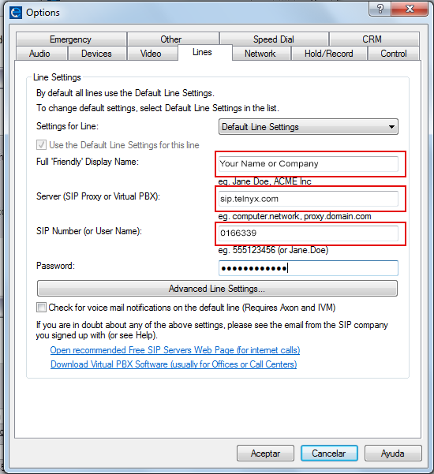

# Telnyx Device Setup: NCH Express Talk and Fanvil IP Phones

*Part 1 of 7 — see also: [Part 2](telnyx-device-setup-nch-express-talk-and-fanvil-ip-phones--part-2.md), [Part 3](telnyx-device-setup-nch-express-talk-and-fanvil-ip-phones--part-3.md), [Part 4](telnyx-device-setup-nch-express-talk-and-fanvil-ip-phones--part-4.md), [Part 5](telnyx-device-setup-nch-express-talk-and-fanvil-ip-phones--part-5.md), [Part 6](telnyx-device-setup-nch-express-talk-and-fanvil-ip-phones--part-6.md), [Part 7](telnyx-device-setup-nch-express-talk-and-fanvil-ip-phones--part-7.md)*

Consolidated Telnyx setup guides for the NCH Express Talk softphone and several Fanvil IP phone families (X4G, X2C/X2P/X2CP, X7/X7C/X7A, V67/V65/V64/V62, X-series, and XU series), covering product overviews, prerequisites, SIP trunk configuration, codec selection, and optional TLS certificate setup.

## Overview

This page consolidates Telnyx setup guides for several Fanvil IP phone families and the NCH Express Talk softphone. Each device family has its own configuration flow, but the underlying Telnyx SIP trunk parameters (server, ports, codecs, TLS) are consistent across the Fanvil lineup.

## NCH Express Talk

NCH's Express Talk is a VoIP softphone that allows you to make calls from your PC or Mac instead of requiring the use of external or traditional handsets. Express Talk works with almost any VoIP SIP gateway provider and offers common VoIP features such as conferencing, call recording, caller ID display, and voice commands, and allows you to configure up to 6 distinct lines, making it most ideal for small businesses or enterprise offices that are on the smaller side. It integrates with Microsoft Address Book and includes a phone book with a quick dial configuration, and can be used with USB phones, headsets, microphones, and webcams.

> **Note:** A free trial version is available, however it is for non-commercial use only.

**System requirements:**

- Windows XP/Vista/7/8/8.1/10/11
- macOS X 10.5 – 10.14
- A soundcard

**Telnyx-side pre-requisites:**

- Configure your SIP channel
- (Recommended) Configure SIP TLS/SRTP to encrypt call traffic

### Configure Express Talk

1. From your computer, run the Express Talk softphone.

   
2. Open the **File** menu and select **Options**.

   
3. Click on the **Lines** tab and provide the following information:
   1. **Full "Friendly" display name:** The display name of your choice (your own name, business name, or role).
   2. **Server (SIP Proxy or Virtual PBX):** `sip.telnyx.com`
   3. **SIP Number (or Username):** Your Telnyx SIP account ID
   4. **Password:** Your Telnyx SIP account password

   

Once saved, Express Talk is ready to make and receive calls with Telnyx.

**Additional resources:**

- Download Express Talk for [Windows](https://www.nch.com.au/components/talksetup.exe) or [Mac](https://www.nch.com.au/components/talkmaci.zip)
- [Express Talk SDK](https://www.nch.com.au/talk/sdk.html)
- [Express Talk technical support](https://www.nch.com.au/talk/support.html)
- [Pricing and purchasing](https://secure.nch.com.au/cgi-bin/register.exe?software=talk)

## Fanvil X4G

The [Fanvil X4/X4G](https://www.fanvil.com/Product/info/id/72.html) is a feature-rich SIP phone for business. The 4-line IP phone has been designed with ease of use in mind. Dual 10/100 Mbps (X4G: 10/100/1000 Mbps) network ports with integrated PoE are ideal for extended network use. It delivers superb sound quality and a rich visual experience, with a second DSS color screen supporting up to 30 DSS keys. Standard encryption protocols are used for highly secure remote provisioning and software upgrades.

**Pre-requisites:**

- Ensure that your Telnyx Mission Command Portal is configured properly
- Recommended: Enable TLS to encrypt your traffic

### Get your phone's IP address

1. From your IP phone go to **OK > Status > IP Address** to obtain its IP address.
2. From a computer on the same physical network, open a web browser and enter this IP address, prepended with `http://`.
3. Log in for the first time with the default credentials (change them after first login):
   1. **Username:** `admin`
   2. **Password:** `admin`

### Create a SIP account in the Fanvil web portal

1. Click on **Lines** in the left-hand menu.
2. Click on the **SIP** tab and provide the following:
   1. **Username:** Your Telnyx account username
   2. **Display name:** Your caller ID. Follow these naming conventions:
      1. Caller ID Name should be in capital letters for clearer display on some devices.
      2. Do not use special characters (they will not be displayed). Spaces are allowed.
      3. Some Canadian providers will not show more than 15 characters — consider shortening your caller ID.
   3. **Authentication name:** Your Telnyx account username
   4. **Authentication Password:** Your Telnyx account password
   5. **Server Name:** `sip.telnyx.com`
   6. **Register Address:** `sip.telnyx.com`
   7. **Register Port:** `5060` for UDP transport, `5061` for TLS transport
   8. **Proxy Server Address:** `sip.telnyx.com`
   9. **Backup Proxy Server Address:** `sip.telnyx.com`
   10. **Backup Proxy Server Port:** `5060` for UDP transport, `5061` for TLS transport
   11. **Activate:** Check this box to activate
3. Click **Apply**.
4. Refresh the page to ensure that your new SIP account shows as registered.

**Additional resources:**

- [Fanvil FAQ](https://www.fanvil.com/Support/index.html)
- [Fanvil training videos](https://www.fanvil.com/Support/trainingVideo.html)
- [Fanvil support](https://www.fanvil.com/Support/ticket.html)
- [Fanvil X4 series firmware](https://www.fanvil.com/Support/download/id/72.html)
