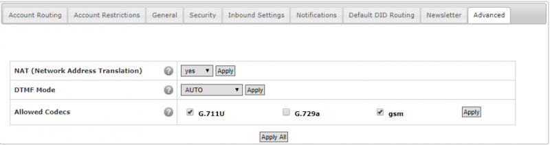

# Telnyx Hardware Compatibility and Device Setup

*Part 1 of 3 — see also: [Part 2](telnyx-hardware-compatibility-and-device-setup--part-2.md), [Part 3](telnyx-hardware-compatibility-and-device-setup--part-3.md)*

Telnyx is a cloud-based communications platform that does not sell hardware but is compatible with virtually any SIP-enabled device. This page consolidates guidance on recommended hardware configurations and step-by-step setup instructions for a range of supported devices, including IP phones, conference phones, ATAs, SBCs, and PBX systems.

## Overview

Telnyx is a cloud-based platform and does not provide or sell hardware directly. However, Telnyx is compatible with almost any SIP-enabled device or platform, and call forwarding to outside numbers on existing networks is supported for additional customizability. Configuration guides for many supported devices are available in the Telnyx knowledge base, and the support team can assist with setup when needed.

## Recommended Hardware Configurations

Any SIP-compatible hardware that supports the following audio codecs will work with Telnyx:

- G.729
- G.711 (ulaw or alaw)
- Opus

The Telnyx knowledge base maintains a list of platforms that have been interop-tested with the platform.

## General Setup Prerequisites

Before configuring any device with Telnyx, the following prerequisites typically apply:

- The Telnyx Mission Control Portal must be configured properly.
- A DID (Direct Inward Dialing number) should be purchased.
- A Telnyx SIP connection must be set up.
- The number must be provisioned (assigned to a SIP connection).
- An outbound voice profile should be created.
- An IP-based connection should be created on the Mission Control Portal.
- It is recommended to enable TLS to encrypt traffic.

## Audiocodes SBC Setup

AudioCodes Session Border Controller (SBC) devices provide seamless connectivity, enhanced security, and quality assurance for VoIP networks. They can serve as a demarcation point between an enterprise VoIP network and a service provider SIP trunk, or as peering/access SBCs in a service provider core. The lineup supports both SIP-to-TDM and SIP-to-SIP hybrid functionality.

To configure an AudioCodes SBC with Telnyx using the INI file:

**Define the IP Group:**

```
[ IPGroup ]
IPGroup_Description:  Telnyx
IPGroup_SIPGroupName: sip.telnyx.com
[ \IPGroup ]
```

**Define the SIP Proxy:**

```
[ ProxyIp ]
FORMAT ProxyIp_Index = ProxyIp_IpAddress, ProxyIp_TransportType, ProxyIp_ProxySetId;
ProxyIp 1 = "192.76.120.10/32:5060", 0, 1;
ProxyIp 2 = "64.16.250.10/32:5060", 0, 1;
[ \ProxyIp ]
```

**Define Coders:**

```
[ CodersGroup0 ]
CodersGroup0_Name:        g711ulaw64k
CodersGroup0_pTime:       20
CodersGroup0_PayloadType: 0
[ \CodersGroup0 ]
```

Additional configurations such as IP profiles and routing may be required depending on requirements.

## Polycom VVX 300-Series Setup

Polycom VVX phones feature Acoustic Clarity Technology and HD Voice for clear conversations, with programmable buttons, call waiting/forwarding/hold, a call directory, and speakerphone.

**Get the device IP address and log into the web portal:**

1. Connect the phone to a network with a DHCP server and wait for it to boot (1-2 minutes).
2. If the IP address is not displayed on boot, press the Home button and navigate to **Settings > Status > Network > TCP/IP Parameters**.
3. Open a browser and enter `https://<phone IP Address>`.
4. Default password: `456`.


**Configure NTP settings:**

From **Simple Setup**, expand **Time Synchronization** and provide:

- Alternate SNTP Server: `north-america.pool.ntp.org` (for North America)
- Alternate Time Zone: preferred time zone


**Configure SIP settings:**

Navigate to **Settings > Lines** and configure each line button. For the **Identification** section:

- Display Name: outbound caller ID name (use capital letters, no special characters, spaces allowed; Canadian providers may not show more than 15 characters)
- Address: Telnyx account name
- Label: name listed next to the line button
- SRTP settings: set to `No`
- Server Auto Discovery: `Disabled`

For the **Server 1** section:

- Address: Telnyx SIP server FQDN or IP address
- Port: `5060`
- Transport: `UDP Only`
- Expires: `300`
- Subscription Expire(s): `300`

For the **Message Center** section:

- Callback Mode: `Contact`
- Callback Contact: `*97`


**Restart and verify:**

From the phone, go to **Utilities > Restart Phone** and confirm. After reboot, the phone should show online and be able to make/receive calls.

## PhoneSuite Voiceware Setup

PhoneSuite offers hospitality-focused communications solutions including Voiceware, a software VoIP IP-PBX designed for hotels. It is scalable and flexible, with no need for expensive equipment or firmware upgrades.

**Configure the PBX:**

1. Open the PhoneSuite PBX Voiceware portal and click the **Advanced** tab. Set **DTMF Mode** to `Auto`.



2. Create a new SIP trunk with the following settings:

- Type: `SIP`
- Device Name: your device name
- Friendly Name: e.g., `TelnyxTrunk`
- Secret: Telnyx password
- Username: Telnyx account number
- Insecure: `Invite`
- Host: `sip.telnyx.com`
- Port: `5060`
- NAT: checked
- Register?: checked
- Audio Codecs: move `ulaw(g711u)`, `alaw(g711a)`, `g722`, and `g729` from Available to Allowed
- Usable as Trunk: checked
- Channels: one per simultaneous call
- Credentials: `Same as Above`
- Reg. Username: account number (same as device name)
- Reg. Server: `sip.telnyx.com`


## Snom C520 Conference Phone Setup

The Snom C520 SIP conference phone uses Bluetooth and DECT 6.0 technology, with one fixed built-in mic and two wireless mics supporting nine or more active participants in a small conference room. It can scale up with the C52-SP DECT expansion speakerphone for 27 or more participants.

**Get the device IP address and log into the web portal:**

1. Press the **Menu** button, scroll to **Status**, and select **Network** to find the IP address.
2. Enter `http://<IP address>` in a browser.
3. Default credentials: User `admin`, Password `admin`.


**Configure the C520:**

Navigate to **System > SIP Account Management** and select the account to configure.

In the **General** section:

- Account Label: descriptive label (often the caller ID)
- Display Name: caller ID (capital letters, no special characters, spaces allowed; Canadian providers may not show more than 15 characters)
- User Identifier: Telnyx account ID
- Authentication Name: Telnyx account ID
- Authentication Password: Telnyx account password
- Dial Plan: `x+P` (default)


In the **SIP Server** section:

- Server Address: `sip.telnyx.com`
- Port: `5060` (or `5061` for TLS)


In the **Registration** section:

- Server Address: `sip.telnyx.com`
- Port: `5060` (or `5061` for TLS)
- Expiration (secs): `300`
- Registration Freq (secs): `10`


In the **Outbound Proxy** section:

- Server Address: `sip.telnyx.com`
- Port: `5060` (or `5061` for TLS)


Leave the **Backup Outbound Proxy** blank unless using TLS, in which case set Server Address to `sip.telnyx.com` and Port to `5061`.


In the **Audio** section, set codecs in priority sequence. Telnyx supports `ulaw(g711u)`, `alaw(g711a)`, `g722`, and `g729`.


In the **Signaling Settings** section:

- Local SIP Port: `5060` (or `5061` for TLS)
- Transport: `UDP` or `TCP` (or `TLS/TCP` for TLS)


