# Telnyx Hardware Compatibility and Device Setup

*Part 2 of 3 — see also: [Part 1](telnyx-hardware-compatibility-and-device-setup--part-1.md), [Part 3](telnyx-hardware-compatibility-and-device-setup--part-3.md)*

Telnyx is a cloud-based communications platform that does not sell hardware but is compatible with virtually any SIP-enabled device. This page consolidates guidance on recommended hardware configurations and step-by-step setup instructions for a range of supported devices, including IP phones, conference phones, ATAs, SBCs, and PBX systems.

## Audiocodes 400HD IP Phone Setup

The AudioCodes 400HD series includes feature-rich IP phones for service providers, hosted services, unified communications, enterprise IP telephony, and contact centers.

**Get the device IP address and log into the web portal:**

1. Navigate to **Menu > Device Status > Network Settings > IP Address**.
2. Enter `http://<IP address>` in a browser.
3. Default credentials: Username `admin`, Password `1234`.

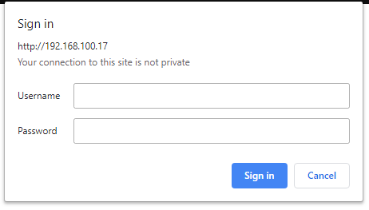

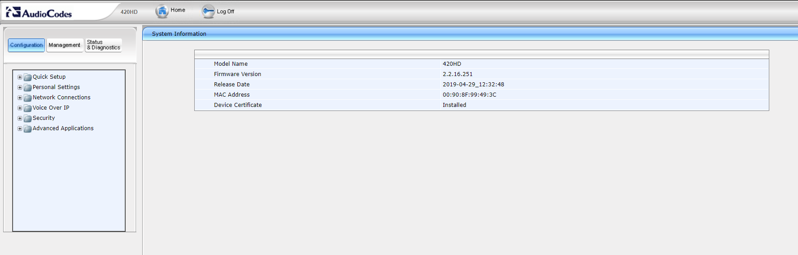

**Configure the 400HD:**

From the **Configuration** tab, expand **Quick Setup**.

In the **SIP Proxy and Registrar** section:

- Use SIP Proxy: `Enable`
- Proxy IP Address or Host Name: `sip.telnyx.com`
- Proxy Port: `5060` (or `5061` for TLS)
- Use SIP Proxy IP and Port for Registration: `Enable`
- Use SIP Registrar: `Disable`

In the **Line Settings** section:

- Line Number: `1`
- Line 1 Activate: `Enable`
- Line 1 Display Name: caller ID (capital letters, no special characters, spaces allowed; Canadian providers may not show more than 15 characters)
- Line 1 User ID: Telnyx account ID
- Line 1 Authentication User Name: Telnyx account ID
- Line 1 Authentication Password: Telnyx account password

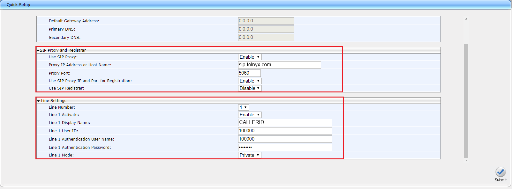

**TLS encryption network settings (if applicable):**

Navigate to **Voice Over IP > Signaling Protocols**:

- SIP Transport Protocol: `TLS`
- TLS Port: `5061`
- SIP Local Port: `5081`
- Proxy IP Address or Host Name: `sip.telnyx.com:5061`
- Proxy Port: `5061`
- Use SIP Proxy IP and Port for Registration: `Disable`
- Use SIP Outbound Proxy: `Disable`

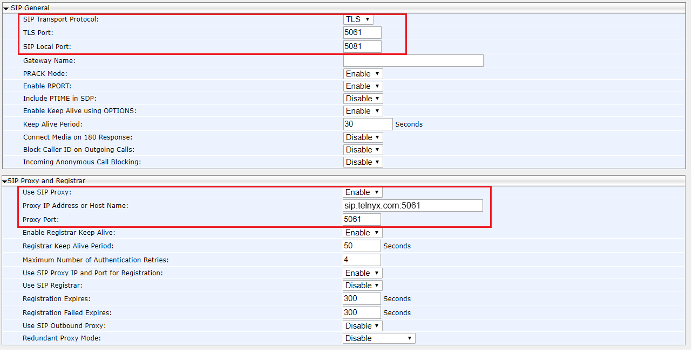

Navigate to **Voice Over IP > Media Streaming** to enable SRTP:

- SRTP Encryption and Authentication: `REQUIRE ENCRYPTION`
- Method: `AES_CM_128_ALL_METHODS`
- Negotiation mode: `Basic`
- ARIA: `Disable`

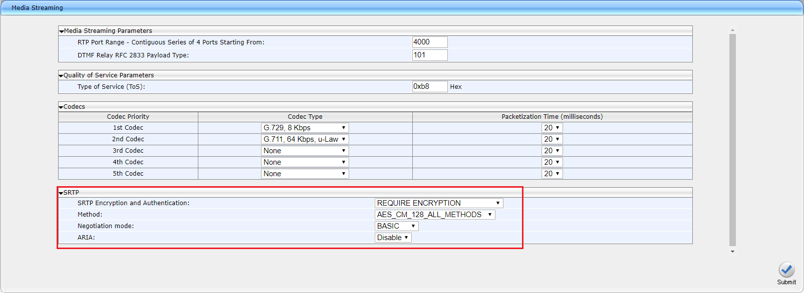

**Registration time and NAT keep alive:**

Navigate to **Voice Over IP > Signaling Protocols**:

- Enable Registrar Keep Alive: `Enable`
- Registrar Keep Alive Period: `50 Seconds`
- Registration Expires: `300 Seconds`

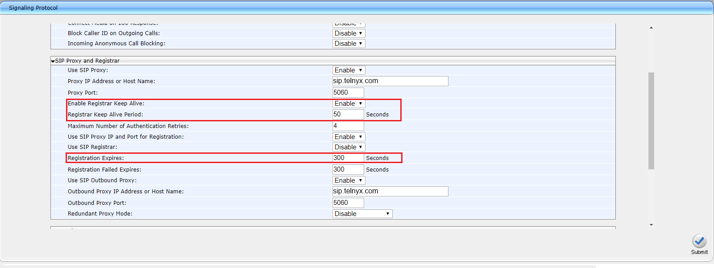

**Audio codecs:**

Navigate to **Voice Over IP > Media Streaming** and set codecs in priority sequence. Telnyx supports `ulaw(g711u)`, `alaw(g711a)`, `g722`, and `g729`.

## Poly OBi300 ATA Setup

The Poly OBi300 VoIP adapter enables home offices to connect an analog phone or fax machine and use up to four VoIP services. It supports an optional WiFi accessory for flexible placement.

**Get the device IP address and log into the web portal:**

1. From the connected phone, dial `***` and press `1` to hear the IP address.
2. Enter `http://<IP address>` in a browser.
3. Default credentials: Username `admin`, Password `admin`.

**Disable auto-provisioning:**

- System Management > Auto Provisioning > Auto Firmware Update: Method `Disabled`
- System Management > Auto Provisioning > ITSP Provisioning: Method `Disabled`
- System Management > Auto Provisioning > OBiTALK Provisioning: Method `Disabled`
- Voice Services > OBiTALK Service: Enable unchecked

**Configure the ITSP profile:**

Expand **Service Providers**, then the profile to configure, and click **General**:

- Name: Telnyx account ID
- DigitMap: copy the line and replace `555` digits with the area code of choice

**Configure the SIP profile:**

Expand **Service Providers**, then the profile, and click **SIP**:

- AuthUserName: Telnyx account ID
- AuthPassword: Telnyx account password
- ProxyServerPort: `5060` (or `5061` for TLS)
- ProxyServerTransport: `UDP` or `TCP` (or `TLS/TCP` for TLS)
- RegistrarServerPort: `5060` (or `5061` for TLS)
- OutboundProxyPort: `5060` (or `5061` for TLS)
- X_OutboundProxyTransport: `UDP` or `TCP` (or `TLS/TCP` for TLS)
- RegisterExpires: `300`

For TLS, expand **Voice Services**, click the service being configured, and set:

- X_KeepAliveServerPort: `5061`
- X_SRTP: `Use SRTP Only`

**Audio codecs:**

Expand **Codecs** and set codecs in priority sequence. Telnyx supports `ulaw(g711u)`, `alaw(g711a)`, `g722`, and `g729`.

## Cisco 68xx/88xx Series Setup

The Cisco 68xx and 88xx series are multiplatform phones designed for affordability, delivering reliable business-grade audio with Gigabit Ethernet integration. They are supported on Cisco-approved third-party UCaaS providers.

**Get the device IP address and log into the web portal:**

1. Press the **Menu** button and navigate to **Network Status > IPv4 Address**.
2. Enter `http://<IP address>` in a browser.
3. Press **Skip** to bypass login credentials on first access.

**Configure a SIP extension:**

Click the **Voice** tab, then the extension tab to configure.

In the **General and NAT Settings** section:

- Line Enable: `Yes`
- NAT Mapping Enable: `Yes`
- NAT Keep Alive Enable: `Yes`

In the **SIP Settings** section:

- SIP Transport: `UDP` or `TCP` (or `TLS` for TLS)
- SIP Port: `5060` (or `5061` for TLS)

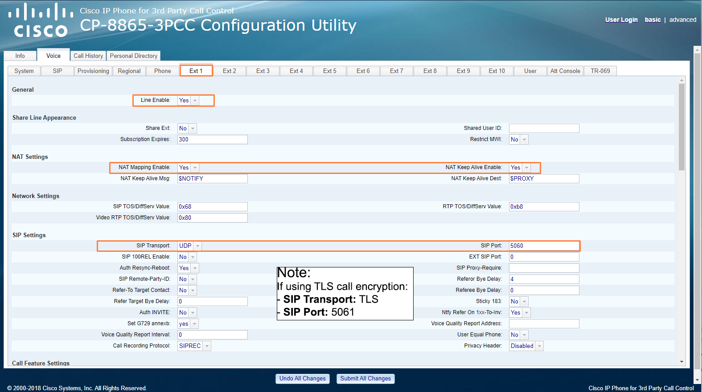

In the **Proxy and Registration** section:

- Proxy: `sip.telnyx.com`
- Outbound Proxy: `sip.telnyx.com`
- Register: `Yes`
- Register Expires: `300`

In the **Subscriber Information** section:

- Display Name: caller ID (capital letters, no special characters, spaces allowed; Canadian providers may not show more than 15 characters)
- User ID: Telnyx account ID
- Password: Telnyx account password
- Auth ID: Telnyx account ID

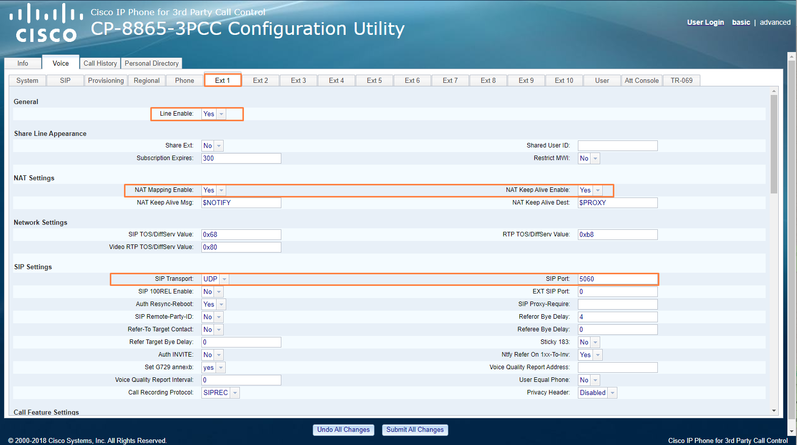

In the **Audio Configuration** section, set codecs in priority sequence. Telnyx supports `ulaw(g711u)`, `alaw(g711a)`, `g722`, and `g729`. For TLS, set Encryption Method to `AES128`.

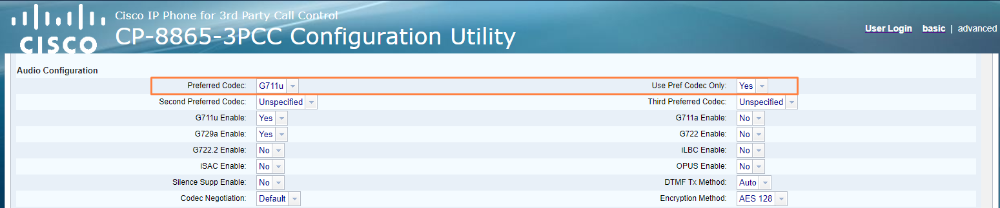

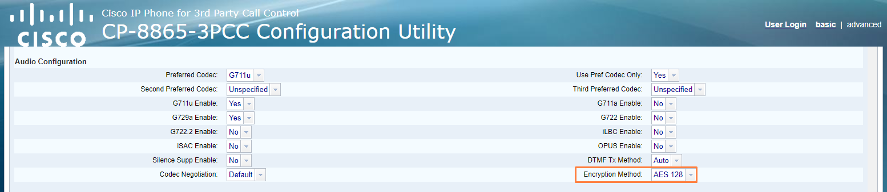

**Additional security settings (TLS only):**

On the **Voice** tab, click the **User** sub-tab. In the **Supplementary Services** section, set Secure Call Setting to `Yes`.

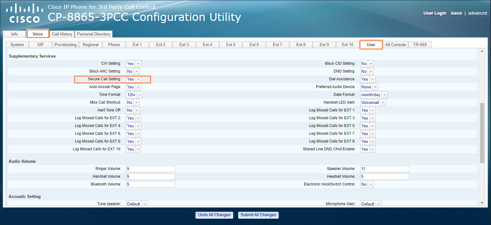

Some Cisco devices (such as the 6821) require a TLS certificate. The certificate can be obtained from [crt.sh](https://crt.sh/?id=1199354). On the **Voice** tab, click the **Provisioning** sub-tab and paste the certificate link in the **Custom CA Rule** field.

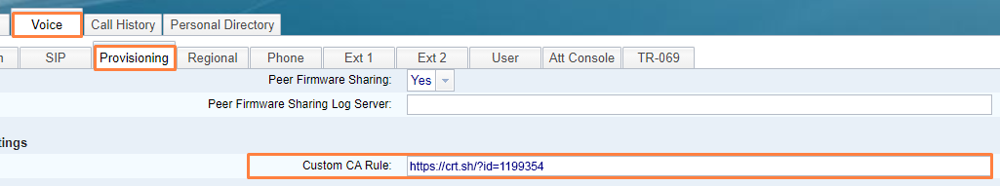

Click **Submit All Changes** at the bottom of the screen. Do not unplug the phone during the update.
