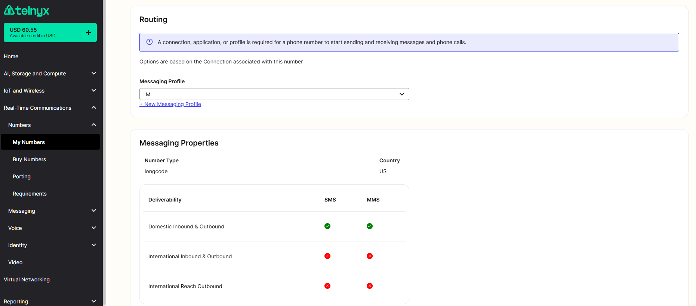

# Telnyx Messaging

*Part 1 of 3 — see also: [Part 2](telnyx-messaging--part-2.md), [Part 3](telnyx-messaging--part-3.md)*

A consolidated guide to Telnyx messaging capabilities, covering SMS and MMS sending and receiving, messaging profile configuration, Zapier-based automations, third-party integrations, bulk and group messaging, and frequently asked questions about MMS limits, file types, and delivery behavior.

## Overview

Telnyx provides programmable messaging through its Mission Control Portal and APIs (V1 and V2). To send or receive SMS and MMS you need a Telnyx account, an SMS-enabled phone number, a messaging profile assigned to that number, and an API key for authentication. Inbound messages are delivered to a webhook URL configured on the messaging profile, and outbound messages are sent via the Telnyx API.

## Setting Up a Messaging Profile

A Messaging Profile is the central configuration object that controls how a phone number sends and receives messages. To create one, open the [Programmable Messaging](https://portal.telnyx.com/#/programmable-messaging/profiles) tab in the Mission Control Portal and click **Add New Profile** (or **Create your first profile** for new accounts).

Give the profile a unique name. API V2 is selected by default. Under **Inbound Settings**, set the protocol to HTTP and provide a webhook URL — this is required to deliver inbound messages to your application. Under **Outbound Settings** you can configure:

- **Alphanumeric Sender ID** — used for one-way outbound international messages, typically your client's business name.
- **Manage Allowed Destinations** — whitelist or restrict international destinations to mitigate fraud.
- **Number Pooling** — deliver messages from a pool of numbers associated with the profile to handle higher volume. See [Number Pooling](number-pooling.md) for details.
- **MMS Fallback** — convert MMS to SMS with the media URL appended to the body when the destination does not support MMS.
- **MMS Transcoding** — compress images and videos to meet carrier size restrictions, allowing MMS up to 5 MB.
- **Enable Daily Spend Limit Per Connection** — cap outbound spend in USD per day, resetting at 00:00:00 UTC.

After saving, note the profile's Unique ID. Then assign the profile to a phone number: go to **My Numbers**, find the number, click the edit (pencil) icon under the **Messaging Profile** column, choose the profile from the dropdown, and accept the cost change. The profile's "# of phone numbers" count should update accordingly.

Effective **March 1, 2024**, Telnyx requires whitelisted destination countries on every Messaging or Verify Profile created or edited via the Portal or API, and a default Alphanumeric Sender ID for non-US destinations.

## Sending and Receiving SMS

### Receiving SMS

There is no in-portal inbox for inbound SMS. To receive messages, attach a webhook URL to the messaging profile associated with the number. In the Mission Control Portal, navigate to **Messaging > Programmable Messaging**, select the profile, open the **Inbound** tab, and paste your webhook URL. Once saved, any SMS sent to the number will be POSTed to that webhook. For testing, a service like [webhook.site](https://webhook.site/) can be used to inspect payloads. See [How to Leverage Webhooks](how-to-leverage-webhooks.md) for more on webhook configuration.

### Sending SMS

Outbound SMS is sent by POSTing to the Telnyx API. The V2 endpoint is `https://api.telnyx.com/v2/messages`, authenticated with a Bearer token (your API V2 key). The request body includes `from`, `to`, and `text` fields, plus an optional `webhook_url` for delivery status callbacks.

## Sending and Receiving MMS

Telnyx supports MMS through both API V1 and API V2. See the [Sending SMS and MMS Quick Start](https://developers.telnyx.com/docs/messaging/messages/send-message) and [Receiving SMS and MMS Quick Start](https://developers.telnyx.com/docs/messaging/messages/receive-message) for full developer documentation.

### Sending MMS

A V2 MMS request looks like:

```
curl --request POST 'https://api.telnyx.com/v2/messages' \
--header 'Accept: application/json' \
--header 'Authorization: Bearer API V2 KEY' \
--header 'Content-Type: application/json' \
--data-raw '{
  "from": "+your purchased number",
  "to": "+the number you want to message",
  "webhook_url": "your webhook url",
  "text": "Did you get this image?",
  "subject": "Bear Picture",
  "media_urls": ["https://placebear.com/802/503.jpg"]
}'
```

A number's MMS capability is shown in the Mission Control Portal — a checkmark next to the number indicates it is MMS-capable.



### Receiving MMS

Telnyx does not automatically distinguish MMS from SMS at the webhook. One reliable way to differentiate them is to inspect the `Content-Type` header — MMS payloads arrive as `multipart/form-data`.

### Supported File Types and Sizes

Supported MIME types for MMS attachments:

- text/plain
- text/vcard
- image/jpeg
- image/png
- image/gif
- video/3gpp
- video/mp4

Maximum attachment size depends on the destination carrier tier:

- **Tier 1** (Verizon, T-Mobile, AT&T, Sprint): up to 1 MB
- **Tier 2**: up to 600 KB
- **Tier 3**: up to 300 KB

Total message size is capped at 1 MB, and no more than 10 `media_urls` are allowed per message. To stay safely under the limit, target 1 MB minus 100 KB to leave room for encoding overhead. Use the [Number Lookup](https://developers.telnyx.com/docs/identity) service to identify a number's carrier.

By default, accounts are limited to 1 MMS message per second. Contact [sales@telnyx.com](mailto:sales@telnyx.com) to request an increase.
