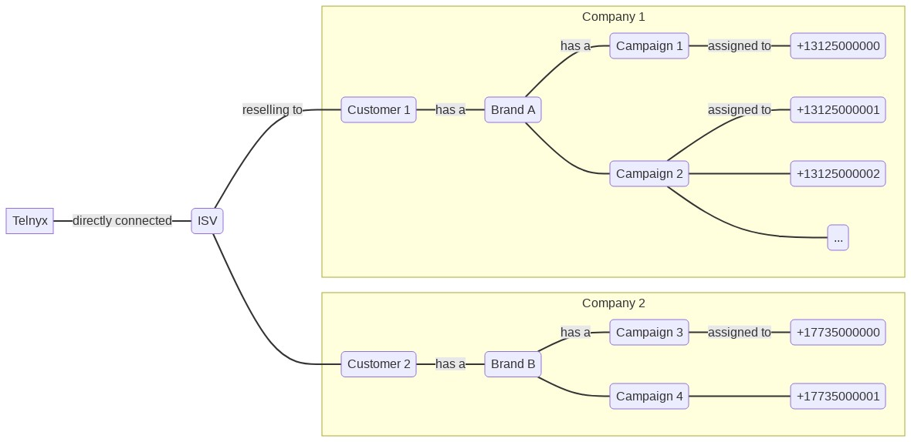

# Telnyx Messaging Compliance and Number Types

*Part 2 of 4 — see also: [Part 1](telnyx-messaging-compliance-and-number-types--part-1.md), [Part 3](telnyx-messaging-compliance-and-number-types--part-3.md), [Part 4](telnyx-messaging-compliance-and-number-types--part-4.md)*

Comprehensive guide to Telnyx messaging compliance, covering US short code ordering and registration, 10DLC use cases and trust scores, ISV requirements, long code deliverability, short code keyword and CTA standards, acceptable use policies, forbidden messaging categories, supported carriers, and country-specific SMS guidelines for Norway, Belize, and the Palestinian Territory.

## ISVs and 10DLC

An Independent Service Vendor (ISV) sells products and services to other businesses. If your end-users are separate business entities, you are an ISV. Examples include a SaaS product selling messaging services to doctor's offices, or a business specializing in SMS marketing for other businesses.

### ISV Registration Requirements

For every end-user being resold to, a separate brand must be created. After creating the brand, campaigns must be created so campaign IDs can be assigned to phone numbers. Phone numbers must not be shared across multiple brands — doing so violates 10DLC terms of usage and may result in fines and blocking.

A maximum of 49 phone numbers can be assigned to a campaign without requiring special permission from T-Mobile (obtained via their [number pool request form](https://assets.ctfassets.net/taysl255dolk/7jAkNNeHEqfeNMF3PnukdG/603e4f4177ac79bd239fcdb87e41f900/TMUS-10DLC-Number-Pool-Request_v2.0.numbers)).

### Sharing Traffic Among Numbers

Every number must be associated with a campaign, and each campaign can only be associated with one brand. No two brands can share the same number. Mobile network operators will not approve ISVs for special consideration in this case.

Recommended iterative migration approach:

1. Create a new Messaging Profile.
2. Buy or use a dedicated phone number for this Messaging Profile.
3. Create a 10DLC brand for the end-user.
4. Create a 10DLC campaign.
5. Assign the 10DLC campaign to the phone number.

Then update backend logic so the end-user uses the new Messaging Profile and phone number.

### Alternatives to Per-End-User Brands and Campaigns

Options for continuing to use long-code numbers for A2P messages are limited:

1. Use one brand and one campaign across end-users with an approved Number Pooling agreement from T-Mobile (unlikely to be approved unless the business is a franchise).
2. Use one brand and one campaign across end-users without explicit approval (likely to result in fines and traffic blocking).
3. Use Number Lookup tools to identify and exclude T-Mobile numbers from receiving messages.

Toll-free numbers can also be used for A2P messages and are not subject to 10DLC requirements, though an approval process applies and similar restrictions on using the same number across multiple end-users exist.

## SMS Long Code Deliverability Best Practices

Long code SMS is intended for person-to-person (P2P) communication or application-to-person (A2P) use cases where a human initiates the message. Content should be specific to the recipient. Examples of appropriate use include SMS chat with a sales or customer service representative, appointment reminders, and taxi arrival notifications. Non-unique content (e.g., marketing campaigns) is better suited for short code messaging.

### Send Rate Limits

Mobile operators generally accept only 10 messages per minute from any long code number (no more than one message every 6 seconds). The overall Telnyx portal account is limited to 1 message per second. Higher limits can be requested via sales@telnyx.com. Exceeding these limits will result in throttling.

### Number Selection

Sending high volumes from consecutive numbers triggers SPAM filters. Telnyx recommends purchasing discontiguous numbers for higher-volume messaging.

### URL Length

Lengthy URLs may cause messages to be split into multiple parts (with corresponding charges) and are more likely to be flagged by SPAM filters. When sending multi-part messages with URLs, minimize surrounding text. Messages containing "bitlylinks.com" and "bit.ly" URLs are blocked automatically.

### Opt-Out Language

Mobile operators watch for A2P messaging lacking opt-out language, especially unregistered traffic. Excluding opt-out language is the leading cause of false delivery reports where messages are filtered as spam.

## Short Code Compliance Quick Reference

The following carrier requirements apply when ordering a short code (current as of November 2024).

### Subscription Programs

**Call to Action (CTA)** must include:

- Clear language
- Product description
- Message and data rates may apply
- Message frequency
- Opt-out instructions
- Privacy policy or link to privacy policy
- Link to complete terms and conditions (T&Cs)
- Customer care instructions: *Reply HELP to [10DLC or toll-free #, website, or support email address]*

**Opt-in Confirmation Prompt** (optional):

- Program brand name and/or product description
- Response command (e.g., Reply Y or PIN)

**Welcome Message** must include:

- Program brand name and/or product description
- Message frequency
- Message and data rates may apply
- Customer care contact info (Reply HELP for help, toll-free #, website, or support email address)

**Ongoing Broadcast Copy** must include:

- Program brand name and/or product description
- Opt-out information

### One-Off Programs

**Call to Action (CTA)** must include:

- Product description
- Message and data rates may apply
- Privacy policy or link to privacy policy
- Link to complete T&Cs OR customer care instructions: *Reply HELP to [10DLC, toll-free #, website, or support email address]*

**One-Off Reply** must include:

- Program brand name and/or product description

### Terms and Conditions

Terms may be full on the CTA if the HELP disclosure includes the 10DLC or a form of customer care (toll-free #, website, or support email address). If terms are not in full on the CTA, the following are required:

- Program brand name and/or product description
- Message frequency (subscription only)
- Message and data rates may apply
- Customer care contact info (Reply HELP for help, toll-free #, website, or support email address)

### Privacy Policy

- Any language hinting that personal info is shared or sold to third parties for marketing purposes is not allowed (no share, no disclose, no transfer).
- "We respect your privacy" or "we do not share data" is not sufficient.
- Must state that messaging application data will not be shared with third parties for marketing purposes.

### T-Mobile Notes

The following use cases require additional complexity and review:

- Political campaigns
- Shopping cart reminders
- Donations

Consistency throughout the brief is required. Program description and message frequency must match in the messaging, CTA, and terms page. Gray marketing for financial institutions is not allowed (even at a direct lender).

### Verizon Notes

- For OTP/2FA, there must be an alternative way to receive the passcode (e.g., email).
- Content to avoid: abandoned cart, financial incentives, financial aid (remove industry speak, loan type, link to secure instrument).
- Collections are not allowed.
