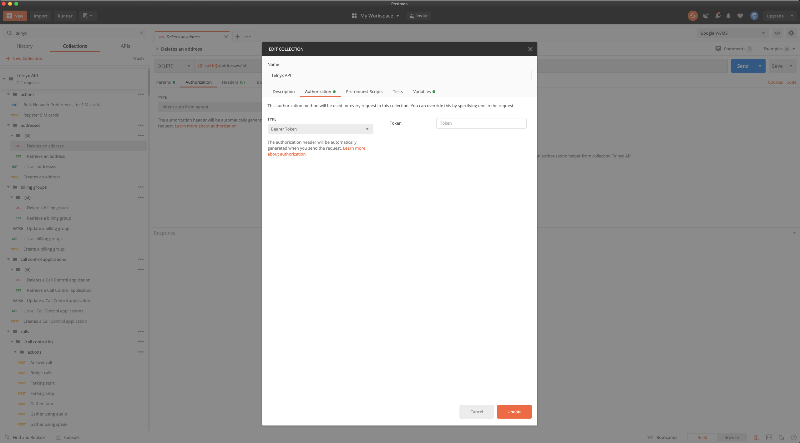
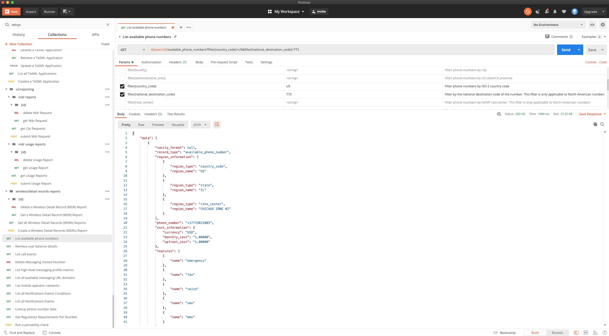

# Telnyx Messaging Setup and Configuration Guide

*Part 1 of 4 — see also: [Part 2](telnyx-messaging-setup-and-configuration-guide--part-2.md), [Part 3](telnyx-messaging-setup-and-configuration-guide--part-3.md), [Part 4](telnyx-messaging-setup-and-configuration-guide--part-4.md)*

This page consolidates Telnyx support documentation covering SMS setup, sending, and advanced messaging features. It includes guidance on SMPP, number pooling, alphanumeric sender IDs, hosted SMS, Postman-based API testing, Python SDK usage, and third-party integrations such as Easy Text Marketing.

## Short Message Peer-to-Peer (SMPP) Setup

The Short Message Peer-to-Peer Protocol is a widely used protocol for SMS delivery and receipt, best suited for customers that require high throughput. This feature is reserved for contracted Telnyx customers only who can commit to a $5,000 minimum spend per month for a period of 12 months. Contact your account manager or sales representative for assistance getting set up.

Telnyx provides a primary SMPP server that must be connected with over TLS. In the future, Telnyx will offer both a primary and secondary server; once available, Telnyx will only guarantee that one of the servers is up at any time, and it will be highly recommended that customers connect to both in order to avoid service outages.


Your username and password will be provided by your Telnyx account manager. You can request one by providing the ID of the Messaging Profile you intend to utilize for SMPP messaging. The Messaging Profile ID can be found by navigating to [Messaging](messaging.md), opening settings for the messaging profile to be used (Basic, Inbound or Outbound), and locating the ID at the bottom of the pop-up screen.

Throughput per number varies by number type. Messages over Long Code numbers can be delivered at 10 messages per number per minute, while messages over toll-free can be delivered at 1,200 messages per number per minute.

### Supported PDUs

Telnyx supports the following SMPP PDUs:

- bind_transmitter
- bind_transceiver
- bind_receiver
- unbind
- submit_sm
- deliver_sm
- enquire_link

### Required Binding Parameters

- system_id = Telnyx provided
- password = Telnyx provided
- Host = smpp.telnyx.com
- Port = 2775
- SSL = yes
- addr_ton = 1 (International)
- addr_npi = 1 (ISDN/telephone numbering plan (E163/E164))

## Number Pooling

Number Pooling allows the automatic selection of the originating numbers in a message request from a pool of all numbers assigned to a given messaging profile. The feature maintains a balance across all numbers associated with a messaging profile to ensure high deliverability with all carriers, helping maintain the health of numbers when being sent to their destination by the respective carriers.

### Maximum Throughput

There is a limit of 6 SMS per minute per virtual number for SMS sent from a long code due to local carrier regulations. If you send messages more quickly, the message(s) will be rejected. If you require a higher throughput, you can purchase more numbers and spread your traffic across your numbers (e.g., 10 numbers = 10 SMS per second). This does not apply to messages sent from a short code or toll-free number.

### Enabling Number Pooling

1. Navigate to the messaging section of your portal.
2. Click the edit icon on your chosen messaging profile.
3. Click on the number pooling option to enable the feature.


To send a message using number pooling, see the [developer documentation](https://developers.telnyx.com/api/messaging/send-message).

### Advanced Options

**Weights** — This is the ratio of toll-free vs long codes that are chosen when sending messages. The ratio determines how much more often a toll-free number will be chosen as compared to a long code number.

Example: With 2 toll-free numbers and 5 long code numbers assigned to a messaging profile with the feature enabled, a long code weight of 1 and toll-free weight of 10 means that for 1,000 messages, each long code number would be selected around 40 times and each toll-free around 400 times (10 times more often). In practice the frequencies will differ a little due to the distributed nature of the feature and maintaining number health.

**Skip Unhealthy Numbers** — When enabled, all unhealthy numbers will be automatically removed from the pool to prevent them from being chosen when sending outbound messages. Health metrics per number are calculated on a regular basis, taking into account the deliverability rate and the amount of messages marked as spam by upstream carriers. If deliverability is below 25% or spam detection is over 75%, numbers will be considered unhealthy.

**Sticky Sender** — When enabled, the number pool will remember which originating number was last used to send a message to the given destination number and will try to use the same originating number for all future communications with this destination.

**Geomatch** — When enabled, messages are automatically sent from a number with the same local area code as the recipient, if available in the Number Pool. For example, sending to a 312 number will use a 312 number from the pool if available; otherwise it defaults to a random healthy number. Geomatch currently only matches US area codes and does not support matching based on country codes.

## Sending SMS with Postman

Before sending SMS, ensure your account is configured: purchase a number, create a messaging profile, and associate that messaging profile with the number. More details for [sending SMS using Postman](https://developers.telnyx.com/docs/messaging/messages/mission-control-portal-set-up) and for [specific error codes](https://developers.telnyx.com/api/errors) are available in the developer documentation. Postman is a RESTful HTTP client and can be downloaded from [postman.com/downloads](https://www.postman.com/downloads/).


### Sending SMS via API v1

1. Open Postman and POST to `https://sms.telnyx.com/messages`.
2. In Headers, set `x-profile-secret` to the secret under your Messaging Profile.
3. In the Body, paste the following:

```
{
"from": "+1[your messaging-enabled number]",
"to": "+1[intended recipient]",
"body": "Hello World"
}
```

### Sending SMS via API v2

Open Postman and POST to `https://api.telnyx.com/v2/messages`.

Generate an API v2 secret key in the [API Keys Section](https://portal.telnyx.com/#/app/api-keys):


- Click on create API key on top.


- This will be the new API v2 key that will be used while sending SMS.


- In the Postman Headers, set `Authorization` to the API v2 secret key, preceded with `Bearer`.


- In the Body, paste the following:

```
{
"from": "+1[your messaging-enabled number]",
"to": "+1[intended recipient]",
"text": "Hello World"
}
```

## Creating a Postman Collection from OpenAPI

To get all of Telnyx API v2 in Postman in a few clicks:

**Step 1**: Navigate to [github.com/team-telnyx/openapi/tree/master/openapi](https://github.com/team-telnyx/openapi/tree/master/openapi).

**Step 2**: From Postman, import the JSON via the raw link in GitHub or a downloaded file.


Use the default settings.


**Step 3**: Add your API token to the collection.




**Step 4**: Use the API.



## Sending and Receiving SMS with the Python SDK

The Telnyx Python SDK can be used to send and receive text messages. Follow the video walkthroughs in the [Send a Text with the Telnyx Python SDK](send-a-text-with-the-telnyx-python-sdk.md) and [Receive a Text with the Telnyx Python SDK](receive-a-text-with-the-telnyx-python-sdk.md) articles to get started. For all things Python + Telnyx, visit the [Developer Docs](https://developers.telnyx.com/).
