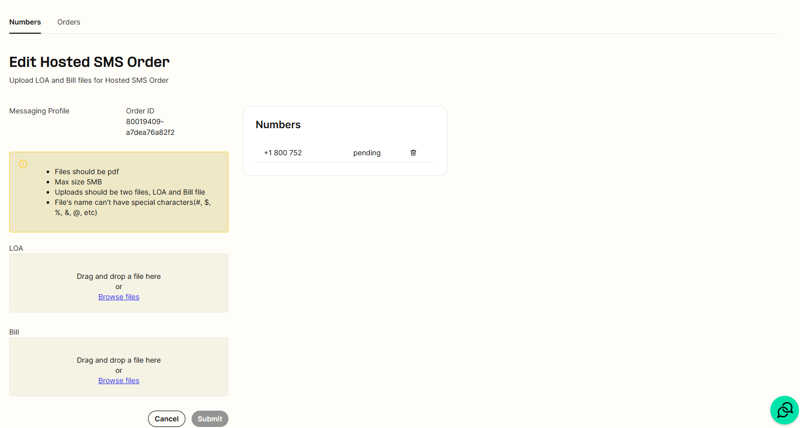
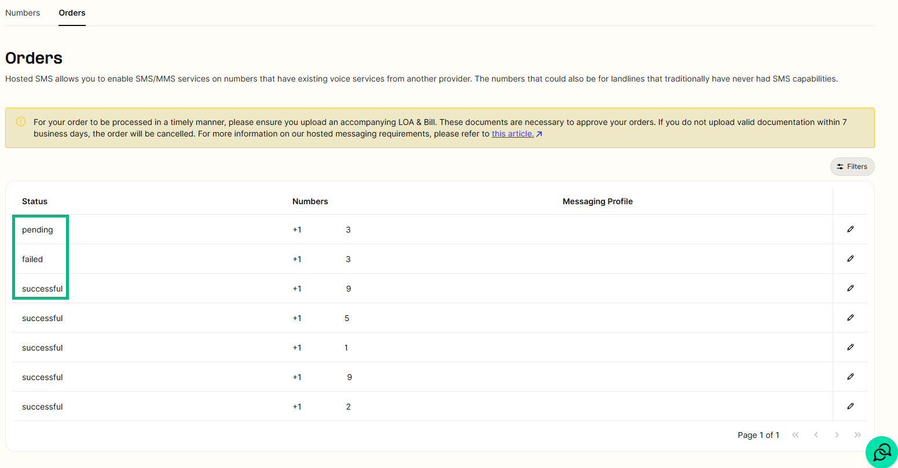

# Telnyx Messaging Setup and Configuration Guide

*Part 3 of 4 — see also: [Part 1](telnyx-messaging-setup-and-configuration-guide--part-1.md), [Part 2](telnyx-messaging-setup-and-configuration-guide--part-2.md), [Part 4](telnyx-messaging-setup-and-configuration-guide--part-4.md)*

This page consolidates Telnyx support documentation covering SMS setup, sending, and advanced messaging features. It includes guidance on SMPP, number pooling, alphanumeric sender IDs, hosted SMS, Postman-based API testing, Python SDK usage, and third-party integrations such as Easy Text Marketing.

## Hosted SMS Messaging

Hosted SMS messaging allows a customer to port and enable messaging with Telnyx for a number, while leaving the voice portion of a number with the current voice provider. This can only be done with the expressed consent of the authorized end user of the number. A Letter of Authorization ([LOA](https://portal.telnyx.com/downloads/other/Telnyx-LOA.pdf)) and invoice from the current messaging provider will be required to submit a hosted messaging request with Telnyx. A [blank SMS LOA](https://drive.google.com/file/d/1yxrQSkEIFA5dPzlmRJAtB7QN3iYDzh0z/view) is also available.

### Submitting an Order

Your account must be [Level 2 Verified](https://support.telnyx.com/en/articles/1130595-account-verification) to successfully submit and activate hosted messaging orders.

In the portal, click on the "Real-Time Communications" dropdown on the left-hand side navigation bar, click on Messaging, and then [Hosted Messaging](https://portal.telnyx.com/#/app/messaging-hosted-sms/numbers) to submit an order to transfer only the messaging portion of a number to be with Telnyx.

#### Create New Order

Click "Create new order" on the top right-hand side. On the next page, provide the numbers to be added for hosted messaging and the messaging profile to assign them to. Up to 200 numbers can be added at a time.

Once the order is created, upload an LOA signed and dated by the End User within the last 30 calendar days as well as an invoice that matches this information.

#### Upload Documents to Order

Navigate to messaging > hosted sms > [orders](https://portal.telnyx.com/#/messaging-hosted-sms/numbers), click the "pencil" to edit the order, and upload the LOA and bill. The order will be in a pending state until the documents are uploaded; if they are not uploaded in a timely manner, the order may be considered failed.

#### Notes

- If no LOA or invoice is provided and the information does not match, the request will be rejected.
- Files should be PDF.
  - Max size 5MB.
  - Uploads should be two files: LOA and Bill.
  - File names cannot have special characters (#, $, %, &, @, etc).
- Once submitted, the order will be processed within 24-48 business working hours.
- Telnyx accepts hosted messaging request submissions 24/7/365 through the portal. However, requests will only be processed Monday through Friday from 9am-5pm CT.
  - Observed holidays: New Year's Day, Memorial Day, Independence Day, Labor Day, Thanksgiving Day, Day after Thanksgiving, Christmas Eve Day, Christmas Day.
- Order status can be viewed as it progresses.

Once the order is complete, the inventory of hosted messaging numbers can be viewed via the API.

Hosted messaging can be done on Bandwidth numbers, but it requires manual intervention by you or Bandwidth's reseller. Messaging providers are allowed to put a block on their numbers and Bandwidth is one such carrier. After submitting the hosted messaging order, reach out to support so Telnyx can proactively reach out to Bandwidth to have them release the messaging for the numbers.

### Common Questions

**Can I port just the messaging capability for a number?** Yes — this is exactly what hosted messaging caters for. You port the messaging services from your current carrier, if they support it, to Telnyx while the voice line stays with the current carrier.

**What are instances where I cannot host messaging with Telnyx?**
- If voice and messaging currently live with a wireless provider. Voice would need to be ported to a non-wireless provider and then hosted messaging could be transferred to Telnyx. This includes numbers that are with Google Voice. Zoom Phone DOES allow hosted messaging away from their network.
- Hosted messaging is only for local numbers in the US and Canada. International numbers are not available.
- Hosted messaging transfers from one Telnyx account to another are not currently supported.

**Can I use a Toll Free number for Hosted Messaging with Telnyx?** Yes, hosted messaging is supported for toll-free numbers. However, hosting toll-free numbers for messaging will take up to a minimum of 72 hours to gain the messaging portion of the number from the losing provider.

**What if I already have voice with Telnyx for a number and wish to have messaging?** This would not be a hosted messaging request. Hosted messaging requests are only for when just the messaging will be with Telnyx. You can add a messaging profile to a TN you already have with Telnyx for voice to port the messaging as well.

**What if I have hosted messaging with Telnyx, but wish to port the messaging to a new provider?** Put in a request with the gaining provider and reach out to Telnyx support to let them know that you will be moving the hosted messaging to another provider so it can be released. If the number is on a Telnyx LRN, you will not be able to port messaging for a TN to a new provider. You can only port messaging for a number if hosted messaging is with Telnyx and the voice portion is already with a different provider other than Telnyx.

**Are there any carriers we are unable to port hosted messaging from?** The only issues arise when a provider has a block on their numbers. The following providers are known to have a block on their numbers for messaging: Bandwidth, Aerialink, and Callfire. If you or your customer know that one of these providers is the underlying provider for messaging, have the direct customer for these providers reach out to them to approve the release of messaging after submitting the request with Telnyx.

### Resources

- [telnyx.com/release-notes/hosted-sms](https://telnyx.com/release-notes/hosted-sms)
- [developers.telnyx.com/docs/messaging/messages/hosted-sms](https://developers.telnyx.com/docs/messaging/messages/hosted-sms)
- [telnyx.com/resources/hosted-messaging-telnyx](https://telnyx.com/resources/hosted-messaging-telnyx)
- [portal.telnyx.com/#/pricing/messaging](https://portal.telnyx.com/#/pricing/messaging)
