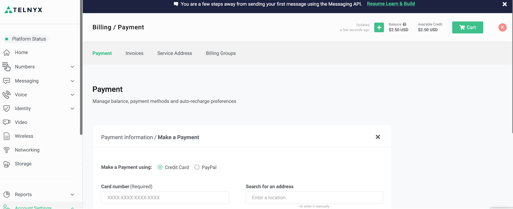
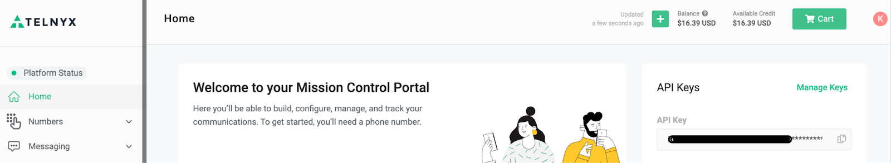
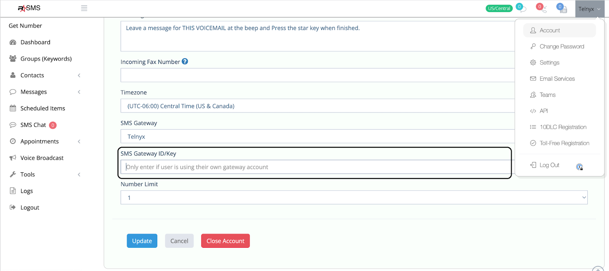
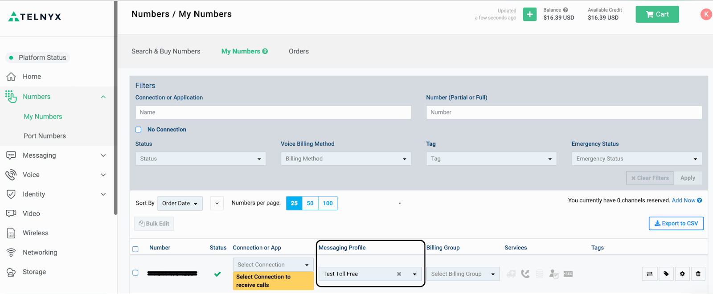

# Telnyx Messaging Setup and Configuration Guide

*Part 4 of 4 — see also: [Part 1](telnyx-messaging-setup-and-configuration-guide--part-1.md), [Part 2](telnyx-messaging-setup-and-configuration-guide--part-2.md), [Part 3](telnyx-messaging-setup-and-configuration-guide--part-3.md)*

This page consolidates Telnyx support documentation covering SMS setup, sending, and advanced messaging features. It includes guidance on SMPP, number pooling, alphanumeric sender IDs, hosted SMS, Postman-based API testing, Python SDK usage, and third-party integrations such as Easy Text Marketing.

## Easy Text Marketing and Telnyx Integration

This onboarding guide is for Easy Text Marketing (formerly known as Rockstar SMS) SMS customers using Telnyx as their BYOC Carrier. The full setup should take less than 30 minutes from start to finish.

### Signup

Create a Telnyx Account at [telnyx.com/sign-up](https://telnyx.com/sign-up). It is free to sign up.

Click through the drop-downs to answer a few short onboarding prompts.

### Adding Funds

The Telnyx platform is prepaid (you only pay for what you use), so add funds at [portal.telnyx.com/#/billing/payment](https://portal.telnyx.com/#/billing/payment). Depending on your volume, $25 should be more than enough to get most people started. The only purchase in this guide is a phone number, which standard costs $1 activation and $1 per month.

### Select the Recharge Settings

Once a payment method is added and after the first payment, auto-recharge settings can be chosen at [portal.telnyx.com/#/billing/payment](https://portal.telnyx.com/#/billing/payment).

Copy your API Key (not the public key) at [portal.telnyx.com/#/home](https://portal.telnyx.com/#/home) to plug into the Easy Text Marketing platform.

### Configure the Easy Text Marketing Profile

In your Easy Text Marketing Profile, select Telnyx as your SMS Gateway and enter the Telnyx API Key copied in the previous step at [rockstarsms.app/users/edit](https://rockstarsms.app/users/edit).

### Get a Number

In the Easy Text Marketing Dashboard, click "Get a Number" (this should automatically create a Telnyx messaging profile) at [rockstarsms.app/users/profile](https://rockstarsms.app/users/profile).

### Assign the Messaging Profile

Return to Telnyx and assign the Messaging Profile with the Easy Text Marketing webhook to the new number at [portal.telnyx.com/#/voice/my-numbers](https://portal.telnyx.com/#/voice/my-numbers). Click the drop-down in the highlighted section and select the Easy Text Marketing Messaging Profile, which is probably listed as "Text Marketing Made Easy".

For help with Telnyx steps, contact [klane@telnyx.com](mailto:klane@telnyx.com). For sub-accounts ("Managed Accounts"), also reach out to [klane@telnyx.com](mailto:klane@telnyx.com). For support on the Easy Text Marketing steps, visit [rockstarsms.app/helpdesk/](https://rockstarsms.app/helpdesk/).

