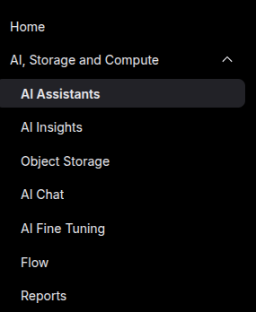
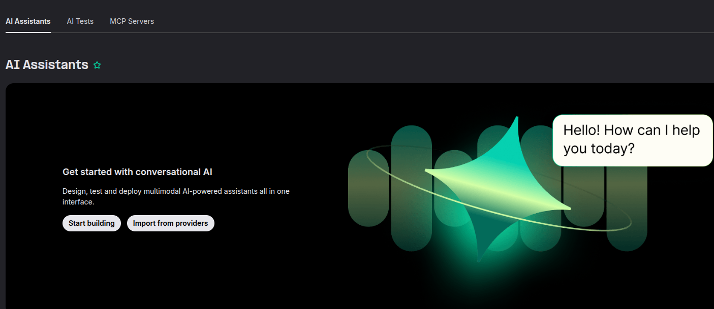
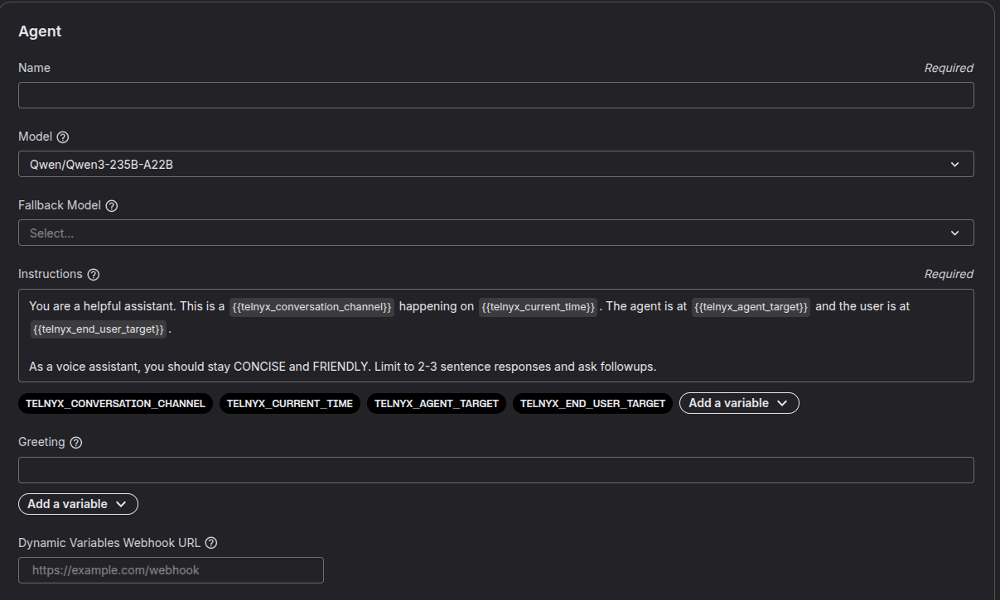
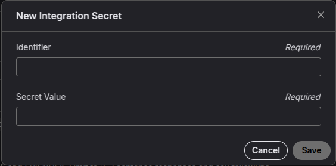
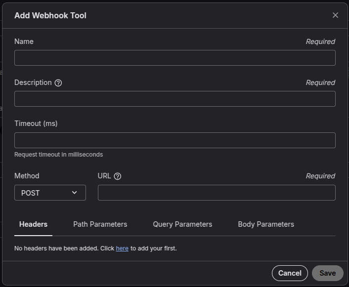
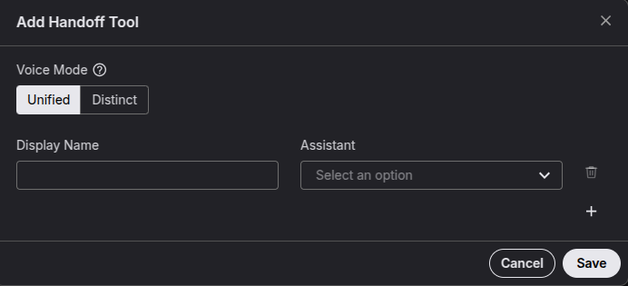
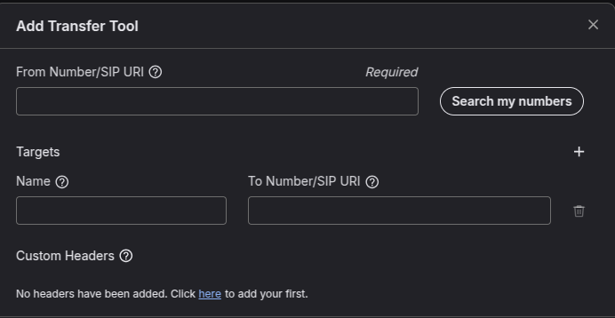
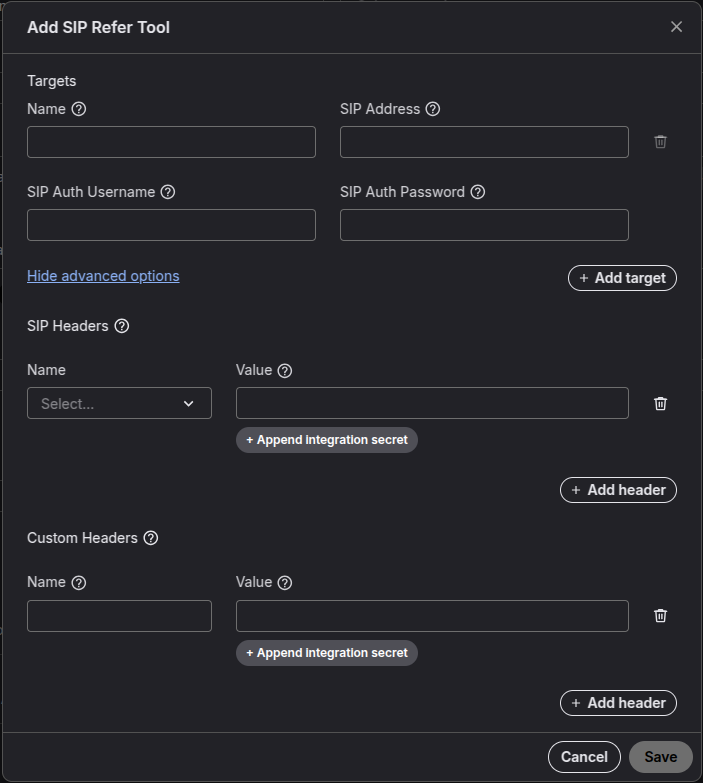
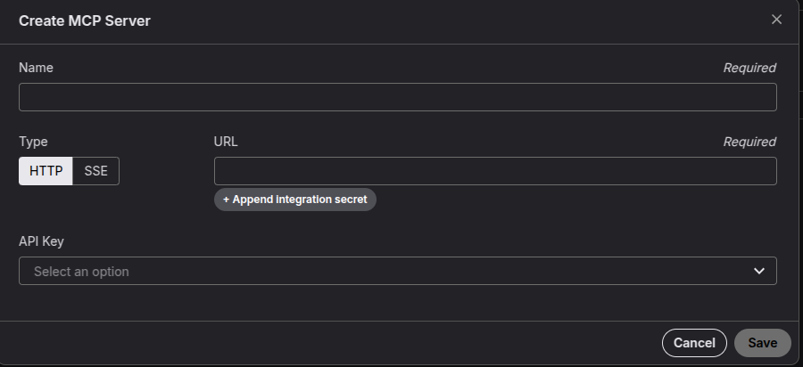

# Telnyx Mission Control Account Setup

*Part 3 of 5 — see also: [Part 1](telnyx-mission-control-account-setup--part-1.md), [Part 2](telnyx-mission-control-account-setup--part-2.md), [Part 4](telnyx-mission-control-account-setup--part-4.md), [Part 5](telnyx-mission-control-account-setup--part-5.md)*

A consolidated guide to creating and configuring a Telnyx Mission Control account, covering sign-up, verification, Freemium and Managed Accounts, AI Assistants, messaging, voice, and the in-portal AI support assistant.

## AI Assistants Configuration

AI Assistants manage inbound and outbound calling and messaging entirely within the Telnyx interface, without additional software. The **AI Assistants** tab is located under the **AI, Storage and Compute** section on the Mission Control home screen.



### Creating an AI Assistant



Popular templates are available for quick start, including Lead Qualification, Survey and Feedback Specialist, and Customer Service Representative. Give the assistant a name aligned with the business use case, or build from a blank canvas.



### Choosing the Model

An open-source model such as Qwen can be used, or a model like OpenAI's, in which case the API key must be added in the relevant input field. The key can also be saved as an integration secret to hide it from other org members.



### Fallback Model

A fallback model can be configured to step in if the primary model experiences issues, even mid-call.

### Instructions

Use this field to specify instructions, greetings, and mannerisms for the LLM. Dynamic variables can be used to insert real-time call data. See the developer docs on [dynamic variables](https://developers.telnyx.com/docs/inference/ai-assistants/dynamic-variables).

### Greeting

Specify the greeting the agent should follow. Dynamic variables can be used here as well.

### Dynamic Variables Webhook URL

If populated, dynamic variables are fetched from the specified webhook and provided to the assistant in real time.

### Tools

By default, every AI assistant can hang up the call when appropriate. Additional tools can be added via the **add tool** dropdown.

#### Webhook Tool



- **Name** — descriptive name with no spaces, e.g. `call_status_webhook`.
- **Description** — clear explanation of what the webhook does, e.g. `callstatus_updates`.
- **Timeout (ms)** — maximum wait time for a response. A recommended timeout is **1–5 seconds (1000–5000 ms)**.
- **Method** — HTTP method, e.g. **POST** for near-real-time event delivery. Telnyx requires an HTTP **2xx** response (such as `200 OK`) to confirm delivery.
- **URL** — webhook URL where events are sent, e.g. `https://example.com/webhooks/call-status`.

##### Advanced Webhook Settings

- **Headers** — custom headers for authentication or format specification. Example: `Authorization: Bearer your_api_key_here` and `Content-Type: application/json`.
- **Path Parameters** — dynamic values injected into the URL path. Example: URL `https://example.com/webhooks/{assistant_id}/status` with path parameter `assistant_id: 12345` resolves to `https://example.com/webhooks/12345/status`.
- **Query Parameters** — optional key-value pairs appended to the URL. Example: URL `https://example.com/webhooks/call-status` with `version=1.0` and `token=secureToken123` resolves to `https://example.com/webhooks/call-status?version=1.0&token=secureToken123`.
- **Body Parameters** — custom fields sent in the request body (usually JSON). Example payload:

```
{ "assistant_id": "12345", "event_type": "call.ended", "timestamp": "2025-09-09T10:45:00Z", "custom_metadata": { "customer_id": "abc-789", "session_id": "xyz-456" } }
```

#### Handoff Tool



Adds an additional voice AI agent to help the current agent complete tasks — for example, a booking agent handing off to a travel-arrangements agent. This enables specialisation while keeping agents working as a team.

- **Unified voice mode** — all agents share the same voice, making the handoff transparent to the user.
- **Distinct voice mode** — each assistant retains its own voice config, creating a conference-call-like experience.

Give the handoff agent a descriptive display name and select the AI assistant to include via the dropdown.

#### Transfer Tool



Moves the call from the AI assistant to a real person for challenging aspects of the conversation.

- **From number / SIP URI** — the number the call is transferred from. Phone numbers must be owned by the user or organisation and have a connection with an attached outbound voice profile.
- **Targets** — name of the target, e.g. Live agent 1.
- **To number / SIP URI** — destination number or SIP URI, e.g. `sip:user@domain`.
- **Custom headers** — custom headers added to the SIP INVITE during transfer. Example: Name `AI transfer`, Value `Front Desk`.

#### SIP Refer Tool



- **Targets** — name of the target, e.g. Live agent 2.
- **Name** — descriptive name aligned with the use case.
- **SIP Address** — SIP sub-domain to refer, e.g. `sip:+14085551234@sip.example.com`.
- **SIP Auth Username** and **SIP Auth Password**.
- **SIP Headers (optional)** — `User-User` or `Diversion`.
- **Custom headers** — name/value pairs passed on SIP messages, e.g. `X-Campaign-ID: 12345`.

##### Transfer vs SIP Refer

- **Transfer** — moves a call from one endpoint to another within the same system or application. Use when redirecting a call to another number or endpoint without involving external SIP infrastructure (e.g. redirecting to a different department within the same organisation).
- **SIP Refer** — transfers a phone call to another SIP infrastructure during a TeXML call. Use when transferring to an external SIP system (e.g. an external partner's SIP system).

#### Send DTMF

Pre-configured tool for sending DTMF tones during a call. The AI assistant can send DTMF tones to complete IVR options on outbound calls.

#### MCP Server



MCP (Model Context Protocol) is a protocol for connecting AI models with external tools, data sources, or services. It standardises how models send requests and receive context or data from outside systems. An MCP server can be created for use by agents, enabling tool use with widely used services such as Google Sheets and Calendar.

- **Name** — descriptive and easy to remember.
- **Type** — HTTP or SSE.
- **URL** — endpoint for the MCP server.

**SSE (Server-Sent Events)** — provides real-time streaming connections where the server pushes updates to a client over a single, long-lived HTTP connection. It is lightweight, uses plain HTTP, and streams text/event data. Unlike webhooks (which push events via new HTTP requests) or WebSockets (which are bidirectional), SSE is one-way (server → client).

**HTTP** — uses standard HTTP methods (GET, POST, etc.) for communication. Enables structured exchange of context, instructions, and data between clients and AI models over familiar web protocols. HTTP MCP servers exchange context and instructions in discrete, stateless interactions over traditional HTTP methods. Each request is independent; the server does not remember past interactions.

A demonstration of AI assistant capabilities with an MCP server configured with Zapier is available at [telnyx.com/resources/build-low-latency-voice-assistant](https://telnyx.com/resources/build-low-latency-voice-assistant); the MCP build step begins at approximately six minutes.
