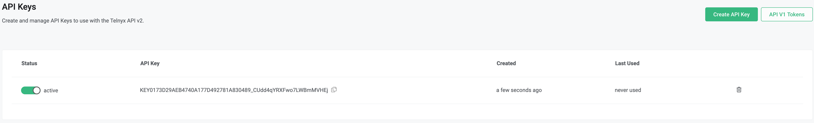
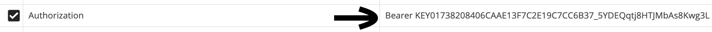

# Telnyx Mission Control Account Setup and Messaging

*Part 2 of 5 — see also: [Part 1](telnyx-mission-control-account-setup-and-messaging--part-1.md), [Part 3](telnyx-mission-control-account-setup-and-messaging--part-3.md), [Part 4](telnyx-mission-control-account-setup-and-messaging--part-4.md), [Part 5](telnyx-mission-control-account-setup-and-messaging--part-5.md)*

This page covers how to sign up for a Telnyx Mission Control account, configure it for voice and messaging, send SMS and Alphanumeric SMS via Postman using API v1 and v2, understand global Alphanumeric Sender ID capabilities by country, and access useful Mission Control resources.

## Setting Up Messaging in Mission Control

Before configuring your messaging system, review the [Acceptable Use Policy for Messaging](acceptable-use-policy-for-messaging.md). If you prefer a guided setup and know some programming concepts, check out the messaging [Learn & Build](https://portal.telnyx.com/#/app/programmable-messaging/learn-and-build) after completing steps 1 and 2 below.

### 1. Level 1 Verification

In order to assign a connection or messaging profile on a DID, or a connection on an outbound voice profile, you must be Level 1 verified. See [Account Verification](account-verification.md) for more information.

### 2. Payments

Add a payment method to your account in order to top up your balance. This is necessary to purchase numbers, send messages, and make/receive calls. See [Billing Setup & Billing Groups](billing-setup-billing-groups.md) for further details.

### 3. Messaging Profile Setup

A messaging profile is a record that contains all the basic settings for your messages. Telnyx's messaging features are completely programmatic, so you will need a webhook URL in order to receive inbound messages and track outbound messages. See [Setting Up a Messaging Profile](setting-up-a-messaging-profile.md) for how to create one.

### 4. DIDs

A DID (or TN, telephone number) is required in order to send and receive messages. There are several types of numbers and requirements for each:

1. **Regular number (10-Digit Long Code):** A regular number, such as your cellphone, including its country code: +1 234 567 8910, +52 2345 1232, etc.
2. **Toll free number:** A national number that allows caller fees to be passed on to the receiver (except for messaging).
3. **Short code:** A special type of number used for high-volume messaging such as 2FA codes.

Numbers must explicitly be SMS and/or MMS enabled. Each has different requirements and pricing depending on location. If you acquire a number without SMS capabilities, messaging cannot be added later. Alternatively, you can port a number into Telnyx; see [Port Numbers to Telnyx](port-numbers-to-telnyx.md).

Once you have added a DID on your account, assign the messaging profile via the numbers main page or the number configuration page.

**Notes:**

- If you cannot assign a messaging profile and the column shows **Not SMS Capable**, the number you have acquired is not capable of sending or receiving messages. When searching and purchasing numbers, make sure the messaging features icon shows **SMS Available**.
- If you encounter the error "**Could not enable messaging on the number.**" when assigning a messaging profile to an SMS-capable number, this may be related to underlying provisioning with the central authority that handles carrier NetNumber ID routing updates. If the error persists, contact Telnyx support.

See [Search and Buy Numbers](search-and-buy-numbers.md) for more details on the number search feature.

### 5. Determine Your Type of Traffic

Messaging is categorized into two types: A2P (Application-to-Person) and P2P (Person-to-Person). See [Guide to Using Our Traffic Type Feature](guide-to-using-our-traffic-type-feature.md) for more information.

If your traffic is A2P, check the local regulations for messaging. In the US and Canada, Telnyx strongly recommends optionally registering for 10DLC (soon mandatory) or mandatorily registering Toll-Free Messaging; these may have additional lead time of up to 4 weeks or more depending on your use case and required documents. See [Frequently Asked Questions About 10DLC](frequently-asked-questions-about-10dlc.md) and [Toll-Free Messaging](toll-free-messaging.md) for more information.

### Related Messaging Articles

- To increase your default sending rate, you must first obtain [Level 2 Verification](account-verification.md).
- See [Search and Buy Numbers](search-and-buy-numbers.md) for more information on purchasing toll-free and 10-digit numbers.
- See [Country-Specific SMS Guidelines](https://support.telnyx.com/en/collections/3731154-country-specific-sms-guidelines) for country-specific guidelines for SMS.
- See [Short Code Supported Carriers](short-code-supported-carriers.md) for information on Short Code.
- For SMPP, see [Short Message Peer-to-Peer Set-up Guide](short-message-peer-to-peer-set-up-guide.md).
- See [Sending Alphanumeric SMS - Sender ID](sending-alphanumeric-sms-sender-id.md) for Alphanumeric sending (only available outside the US and Canada).

## Sending SMS with Postman

Before sending SMS, configure your account by purchasing a number, creating a messaging profile, and associating that messaging profile with the number. See [Sending SMS using Postman](https://developers.telnyx.com/docs/messaging/messages/mission-control-portal-set-up) for more details and [specific error codes](https://developers.telnyx.com/api/errors) for troubleshooting.

[Postman](https://www.postman.com/downloads/) is a RESTful HTTP client used in the examples below.

### Sending SMS via API v1

1. Open Postman. **POST** to `https://sms.telnyx.com/messages`.
2. In **Headers**, set your `x-profile-secret` to the secret under your Messaging Profile.
3. In the **Body**, paste the following:

```
{
"from": "+1[your messaging-enabled number]",
"to": "+1[intended recipient]",
"body": "Hello World"
}
```

### Sending SMS via API v2

Open Postman. **POST** to `https://api.telnyx.com/v2/messages`.

Generate an API v2 secret key in the [API Keys Section](https://portal.telnyx.com/#/app/api-keys) of the Mission Control portal.


- Click **Create API key** at the top.


- This will be the new API v2 key used while sending SMS.



- In the Postman **Headers**, set your `Authorization` to the API v2 secret key, preceded with `Bearer`.



- In the **Body**, paste the following:

```
{
"from": "+1[your messaging-enabled number]",
"to": "+1[intended recipient]",
"text": "Hello World"
}
```
