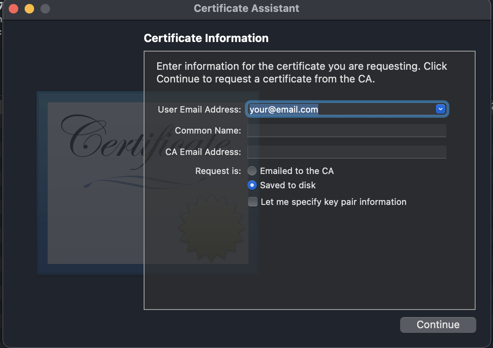
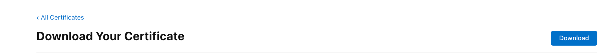
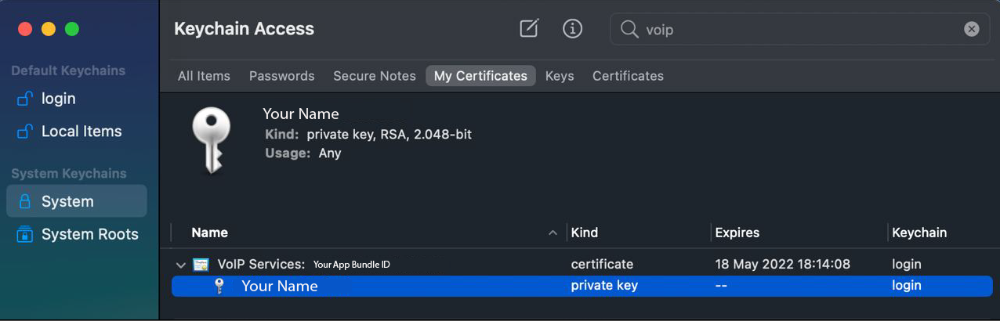
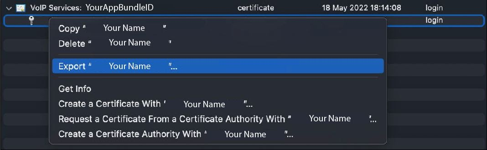

# Telnyx Network, Webhook, and Push Notification Configuration

*Part 3 of 5 — see also: [Part 1](telnyx-network-webhook-and-push-notification-configuration--part-1.md), [Part 2](telnyx-network-webhook-and-push-notification-configuration--part-2.md), [Part 4](telnyx-network-webhook-and-push-notification-configuration--part-4.md), [Part 5](telnyx-network-webhook-and-push-notification-configuration--part-5.md)*

This page consolidates Telnyx guidance on whitelisting SIP signaling, media, and webhook IP addresses; configuring and verifying webhooks (including signature rotation); setting up iOS and Android push notifications for the WebRTC SDK; and accessing support resources such as the status page, bug reporting, and the Bot-to-Bot Knowledge Agent API.

## iOS Push Notifications (WebRTC SDK)

The Telnyx iOS Client WebRTC SDK uses APNS to deliver push notifications. To receive notifications when receiving calls on an iOS mobile device, configure a VoIP push certificate.

### Creating a VoIP Push Certificate

To generate VoIP push certificates you need:

- An Apple developer account
- App BundleID
- A CSR (Certificate Signing Request)

Steps:

1. Go to <https://developer.apple.com/> and log in.
2. In the **Overview** section, select **Certificates, Identifiers & Profiles**.


3. Press the blue "+" button to add a new Certificate.


4. Search for **VoIP Services Certificate** and click **Continue**.


5. Select the **BundleID** of the target application and click **Continue**.


6. Upload a CSR from your Mac.


### Generating the CSR

1. Open Keychain Access on your Mac.
2. Go to **Keychain Access → Certificate Assistance → Request a Certificate from a Certificate Authority**.


3. Add your email address, select **Save to disk**, and click **Continue**.



4. Save the Certificate Signing Request (CSR) to your Mac.


### Downloading the Certificate

1. After creating the CSR, press **Choose File**, select the CSR, and click **Continue**.


2. Download the new certificate.



3. Locate the downloaded file (usually `voip_services.cer`) and double-click it to install it on your Mac.

### Obtaining cert.pem and key.pem

To allow the Telnyx VoIP push service to send notifications to your app, export the VoIP certificate and key:

1. Open Keychain Access on your Mac.
2. Search for "VoIP services" and verify the certificate is installed for your app's BundleID.



3. Open the contextual menu and select **Export**.



4. Save the `.p12` file (a password is requested before saving).


5. Run the following commands to obtain `cert.pem` and `key.pem`:

```
$ openssl pkcs12 -in PATH_TO_YOUR_P12 -nokeys -out cert.pem -nodes
$ openssl pkcs12 -in PATH_TO_YOUR_P12 -nocerts -out key.pem -nodes
$ openssl rsa -in key.pem -out key.pem
```

### Configuring iOS VoIP Credentials in the Portal

1. Go to [portal.telnyx.com](https://portal.telnyx.com/#/login/sign-in) and log in.
2. Go to the [API Keys](https://portal.telnyx.com/#/api-keys) section.
3. From the top bar, go to the **Credentials** tab and select **Add → iOS Credential**.


4. Set a credential name (you can use your app bundle ID for easy identification) and copy and paste the contents of your `cert.pem` and `key.pem` files into the defined sections (including the `---BEGIN####---` and `---END---` markers).


5. Save the new push credential by pressing **Add Push Credential**.

### Assigning the iOS Push Credential to a SIP Connection

1. Go to the **SIP Connections** section on the left panel.
2. Open the Settings menu of the SIP connection you want to add a Push Credential to, or [create a new SIP Connection](https://portal.telnyx.com/#/voice/connections).
3. Select the **WEBRTC** tab.
4. Go to the iOS Section and select the PN credential you created.


You can now implement **PushKit** and **Callkit** using the **TelnyxRTC SDK** and receive VoIP push notifications on your iOS device.
