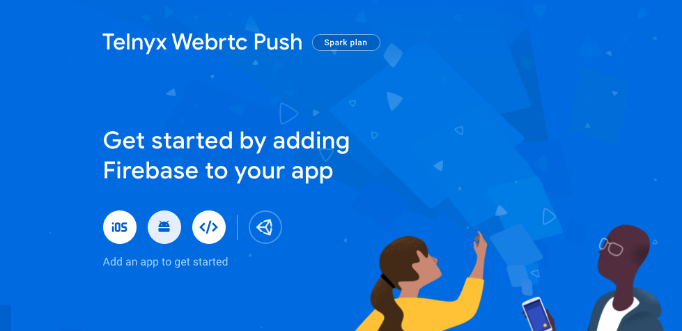
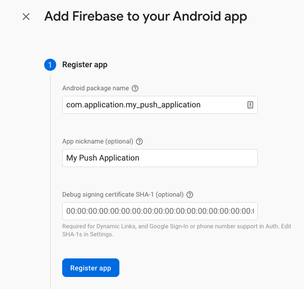
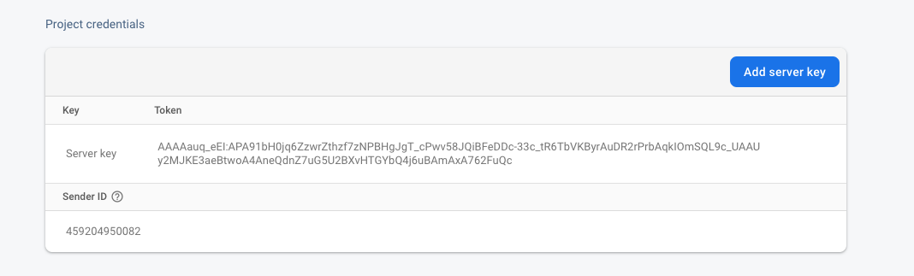
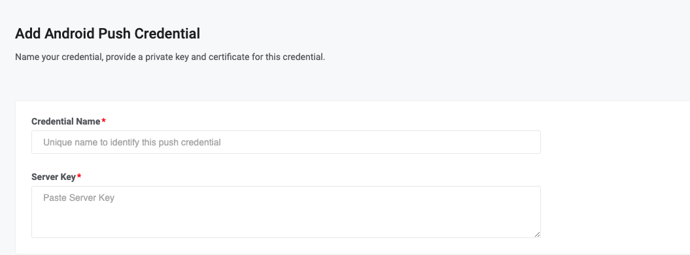

# Telnyx Network, Webhook, and Push Notification Configuration

*Part 4 of 5 — see also: [Part 1](telnyx-network-webhook-and-push-notification-configuration--part-1.md), [Part 2](telnyx-network-webhook-and-push-notification-configuration--part-2.md), [Part 3](telnyx-network-webhook-and-push-notification-configuration--part-3.md), [Part 5](telnyx-network-webhook-and-push-notification-configuration--part-5.md)*

This page consolidates Telnyx guidance on whitelisting SIP signaling, media, and webhook IP addresses; configuring and verifying webhooks (including signature rotation); setting up iOS and Android push notifications for the WebRTC SDK; and accessing support resources such as the status page, bug reporting, and the Bot-to-Bot Knowledge Agent API.

## Android Push Notifications (WebRTC SDK)

The Telnyx Android Client WebRTC SDK uses Firebase Cloud Messaging (FCM) to deliver push notifications. To receive notifications when receiving calls on an Android mobile device, enable Firebase Cloud Messaging within your application.

### Requirements

- Set up a Firebase console account
- Create a Firebase project
- Add Firebase to your Android Application
- Set up a Push Credential within the Telnyx Portal
- Generate a Firebase Cloud Messaging instance token
- Send the token with your login message

### Registering the Application

1. Click the Android icon on the Firebase console home screen.



2. Enter your application details and register your application.



3. After registration, Firebase generates a `google-services.json` file that must be added to your project root directory.


### Firebase Configuration

Follow the [Firebase Android setup guide](https://firebase.google.com/docs/android/setup#add-config-file) to enable Firebase products within your application. Alternatively, add Firebase using the Firebase Assistant within Android Studio if it is set up in your IDE; see the [assistant steps](https://firebase.google.com/docs/android/setup#assistant).

Once your application is set up within the Firebase Console, you can access the server key required for portal setup. Go to **Project Overview → Project Settings → Cloud Messaging** to view the project credentials.



### Android VoIP Credential Setup in the Portal

1. Go to [portal.telnyx.com](https://portal.telnyx.com/#/login/sign-in) and log in.
2. Go to the [API Keys & Credentials](https://portal.telnyx.com/#/api-keys) section on the left panel under Account Settings.
3. From the top bar, go to the [Credentials](https://portal.telnyx.com/#/api-keys/push-credentials) tab and select **Add → Android Credential**.


4. Enter the details required for your Android Push Credentials, including a credential name and the server key from Firebase.



5. Save the new push credential by pressing **Add Push Credential**.

### Attaching the Android Push Credential to a SIP Connection

1. Go to **Voice Suite → SIP Trunking** on the left panel.
2. Open the Settings menu of the SIP connection you want to add a Push Credential to, or [create a new SIP Connection](https://portal.telnyx.com/#/voice/connections).
3. Select the **WebRTC** tab.
4. Go to the Android Section and select the PN credential you previously created.


### Final Steps

Once Firebase is integrated within your application, retrieve a token with a method such as:

```
private fun getFCMToken() {
  FirebaseApp.initializeApp(this)
  FirebaseMessaging.getInstance().token.addOnCompleteListener { task ->
    if (!task.isSuccessful) {
      Timber.d("Fetching FCM registration token failed")
    } else if (task.isSuccessful) {
      try {
        token = task.result
      } catch (e: IOException) {
        Timber.d(e)
      }
      Timber.d("FCM token received: $token")
    }
  }
}
```

Create a `MessagingService` for your application. The `MessagingService` is the class that handles FCM messages and creates notifications for the device from these messages. See the [Firebase MessagingService reference](https://firebase.google.com/docs/reference/android/com/google/firebase/messaging/FirebaseMessagingService) and a [sample implementation](https://github.com/team-telnyx/telnyx-webrtc-android/blob/main/app/src/main/java/com/telnyx/webrtc/sdk/utility/MyFirebaseMessagingService.kt).

Once the class is created, update your manifest and specify the newly created service as described in the [Firebase Android client manifest guide](https://firebase.google.com/docs/cloud-messaging/android/client#manifest). You are now ready to receive push notifications via Firebase Messaging Service.

## Status Page and Incident Visibility

The Telnyx status page provides real-time updates on incidents and maintenance schedules: <https://status.telnyx.com/>. You can subscribe to updates in real time through multiple channels.
