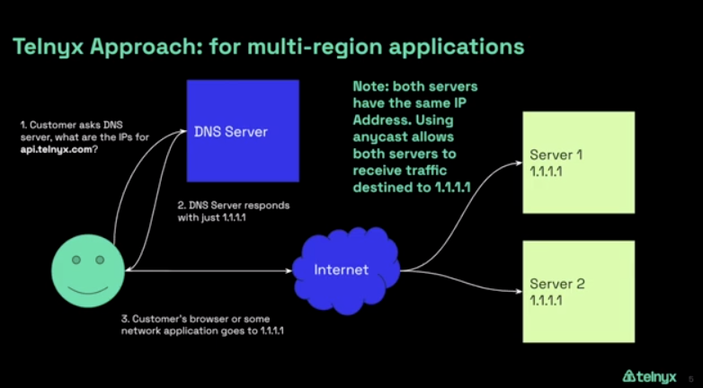
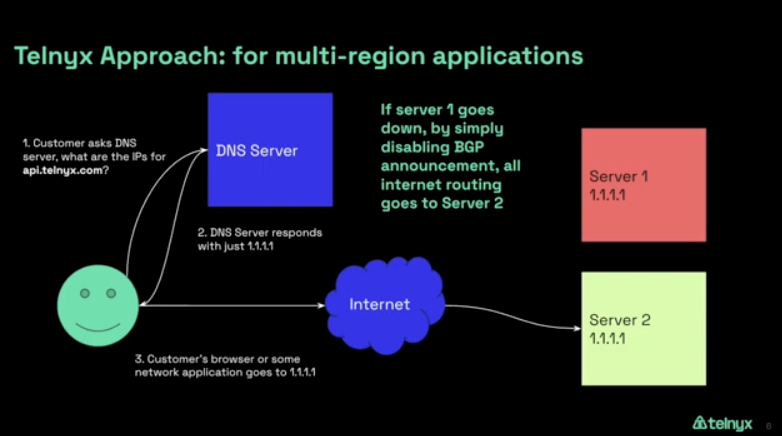

# Telnyx Networking and Global Edge Router

*Part 1 of 4 — see also: [Part 2](telnyx-networking-and-global-edge-router--part-2.md), [Part 3](telnyx-networking-and-global-edge-router--part-3.md), [Part 4](telnyx-networking-and-global-edge-router--part-4.md)*

This page covers Telnyx's network equipment, the Global Edge Router product (including its WireGuard-based architecture, benefits, multi-cloud use cases, and pricing), and step-by-step setup guides for connecting the Edge Router to AWS Lightsail, AWS VPC, Azure Linux VMs, Oracle VMs, pfSense, and Android/iOS devices. It also includes instructions for setting up the Telnyx side of the configuration via the Mission Control portal or API, verifying connectivity, and creating a Postman collection from the Telnyx OpenAPI specification.

## Telnyx Network Equipment

Telnyx employs best-in-class equipment across its network. Cisco ASR routers are used for both core and edge routing, Juniper QFX5100 switches handle aggregation, and Brocade Vyatta with virtualized routing platforms powers Cloud CE routing. For more on Telnyx's network architecture, see the [Telnyx Network Page](https://telnyx.com/our-network).

## Global Edge Router Overview

The [Telnyx Edge Router](https://telnyx.com/products/global-edge-router) lets you operate in multi-cloud and/or self-hosted environments using Telnyx's global, high-speed, high-bandwidth edge network to connect customers and team members to your applications. It provides access to a global edge network of 25+ points of presence to decrease latency for highly available applications and services, and offers redundancy across cloud providers thanks to [BGP](https://telnyx.com/resources/what-is-bgp)-anycast.

### How WireGuard Powers the Edge Router

The Telnyx Edge Router uses [WireGuard](https://www.wireguard.com/install/) to connect users to applications globally. WireGuard is an open-source VPN technology and protocol designed for secure, fast, and efficient communication across networks. In WireGuard, a "peer" is an endpoint that participates in the VPN network; each device or system that connects is considered a peer, and peers can communicate directly with one another.

A WireGuard peer works as follows:

1. **Key Generation**: Each peer generates a pair of cryptographic keys (private and public) used to establish secure connections and authenticate peers.
2. **Configuration**: The network administrator sets up each peer's configuration, including public key, allowed IP addresses, and other parameters.
3. **Handshake**: When a peer wants to connect to another, it initiates a handshake, exchanging public keys, establishing a secure session, and agreeing on cryptographic parameters.
4. **Encryption and Decryption**: Once the handshake completes, data sent between peers is encrypted by the sender using the recipient's public key and decrypted by the recipient using its private key.
5. **Allowed IPs**: Each peer defines a list of allowed IP addresses for remote peers, accepting traffic only from those addresses.
6. **Routing**: WireGuard operates at the kernel level; encrypted packets are passed to the kernel, which handles routing. Packets are encapsulated within UDP, making traversal of firewalls and NAT devices easier.
7. **Dynamic Roaming**: WireGuard handles dynamic changes in network interfaces and IP addresses gracefully; if a peer switches networks, the VPN tunnel remains intact.
8. **Keepalive**: Peers send periodic keepalive packets to ensure the connection is active and to detect unreachable peers.

### Benefits of the Edge Router

Using the Telnyx Edge Router increases performance during failover and decreases costs by enabling multi-cloud and self-hosted environments.

**Typical DNS-based approach (downsides):**

1. **Lookup**: The client uses DNS to look up the IP address of the domain name it's trying to reach (the failed server).
2. **Routing**: Once the IP address is found, the packet is sent across the Internet, routed by various routers along the way.
3. **Destination Unreachable**: When the packet arrives at the IP address, the server is down and cannot establish a connection or respond.
4. **Timeout**: After some time, the client registers a timeout because no response was received.

This process continues until the DNS server updates its records and stops sending traffic to the failed server, creating a poor customer experience. A typical cloud approach also relies on a single cloud provider, creating a single point of failure and limiting options for reducing cloud spend.

**Optimized Telnyx Edge Router approach:** Telnyx dynamically advertises a single global IP, providing redundancy across 25+ edge PoPs. In the event of a failure, traffic reroutes to the working server using BGP Anycast. This creates automatic redundancies and failovers that perform more highly during a crisis than competing technologies.

Image description: Image shows how Telnyx advertises a single IP for multiple servers.

Image description: Shows automatic failover to working server.

### Multi-Cloud Approach

Most cloud providers use BGP-anycast on their own networks in the event that one of their sites becomes overloaded or goes down. As more businesses move toward multi-cloud and self-hosted solutions, Telnyx identified a gap: there was no solution providing instant failover between cloud providers. Global Edge Router fills that gap, allowing you to maintain the agility and cost-savings of multi-cloud or self-hosted solutions while having a resilient failover in place if a provider or site goes offline.

- **Increased cloud redundancy**: Every cloud service is prone to error—even the largest providers, like AWS and Google Cloud, have reported complete outages. Hosting services on a diversified network that isn't reliant on a single cloud provider keeps applications and services online and protected.
- **Increased cloud flexibility**: Using multiple providers means companies can choose the cloud service that best suits their needs based on available features, allowing them to quickly create and release new features.
- **Controlling cloud costs**: When businesses are tied to one cloud provider, there can be little room to negotiate. A multi-cloud or self-hosting solution reduces cloud spend and maintains leverage over large cloud vendors.

Supported cloud vendors include Microsoft Azure, AWS, Google Cloud, and IBM Softlayer.

### Edge Router Use Cases

- **Migrations**: The Edge Router is ideal for migrating from a single cloud provider to a multi-cloud approach, or from cloud to hybrid or full self-hosted assets. While transitioning, you can seamlessly bring infrastructure up and down without performance degradation. Telnyx's global network and billing model (no data caps, no per-seat license cost) make it a scalable, low, flat monthly cost.
- **Mergers and Acquisitions**: In M&A scenarios, multi-cloud or hybrid infrastructure may be forced. The Edge Router lets you mesh different technology platforms to share resources, leverage feature sets from each vendor, migrate between providers, or continue operating in a multi-cloud approach.
- **Siloed Lines of Business**: Different departments may spin up infrastructure from different vendors. The Edge Router gives you the control to consolidate redundant operations.
- **IoT and Wireless SIMs Data Control**: Combined with Telnyx's global carrier partnerships, the Edge Router lets you control IoT and Wireless data end-to-end. [Wireless SIMs](https://telnyx.com/products/iot-sim-card) offer data and text capabilities, with voice soon to be added.
- **Mid-Market Enterprise Cost Savings and Performance**: For mid-market enterprises focused on growth and profitability, the Edge Router's automatic failover, global coverage, and low flat costs let you focus on your core offering while protecting redundancy, resiliency, and performance.

### Cost

The Edge Router is offered at one low monthly recurring cost based on the maximum speed [bandwidth tier](https://telnyx.com/pricing/global-edge-router) you select, starting at $5 per month. There is no data cap on what you can transmit and receive.
