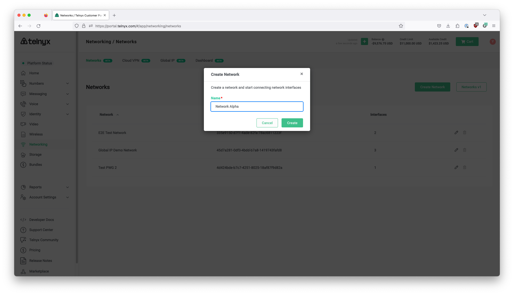
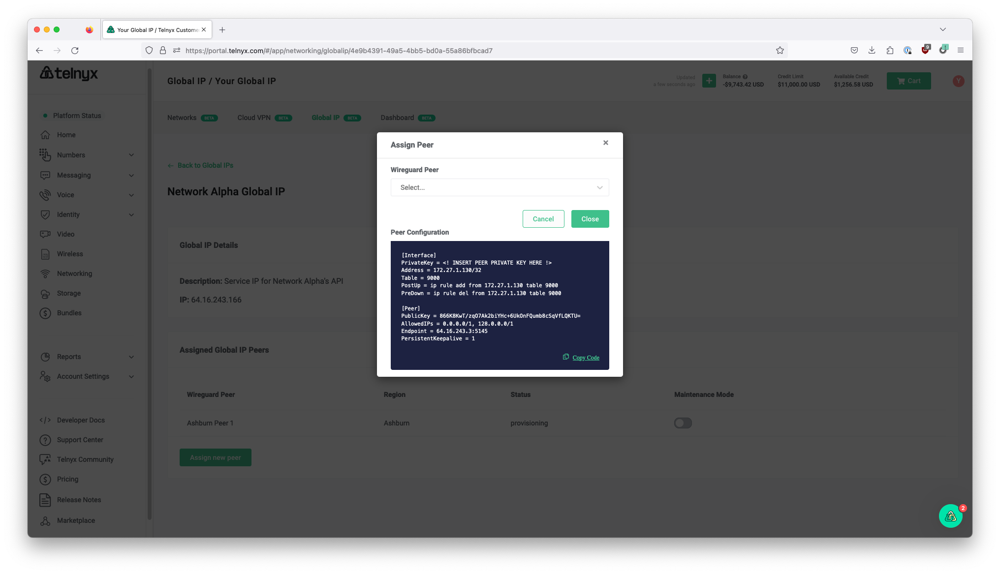
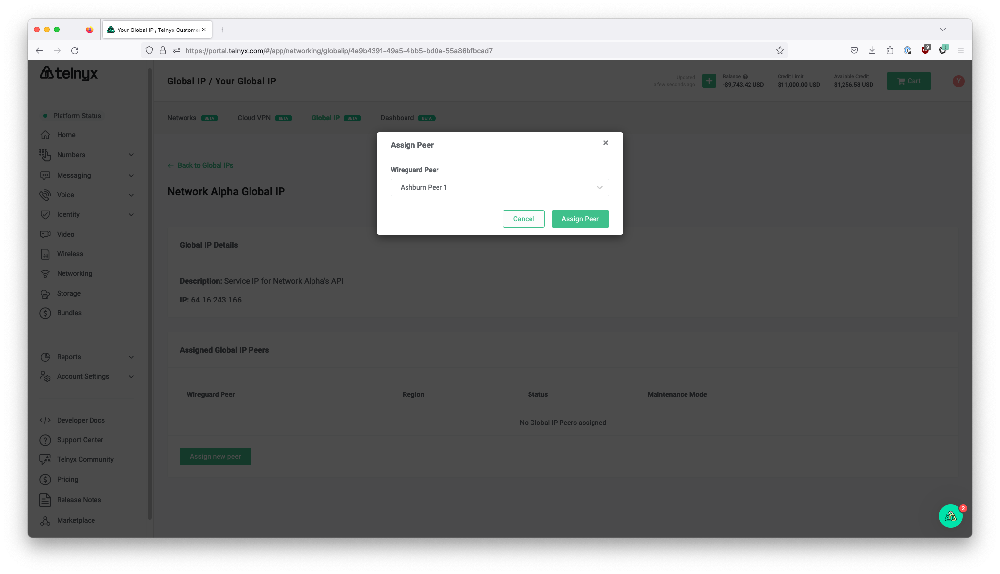
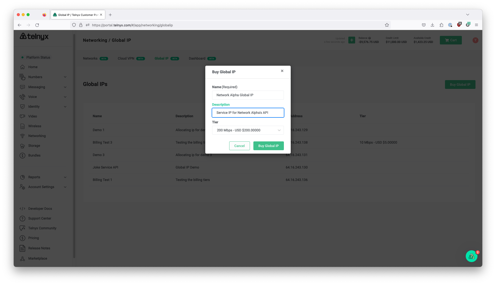
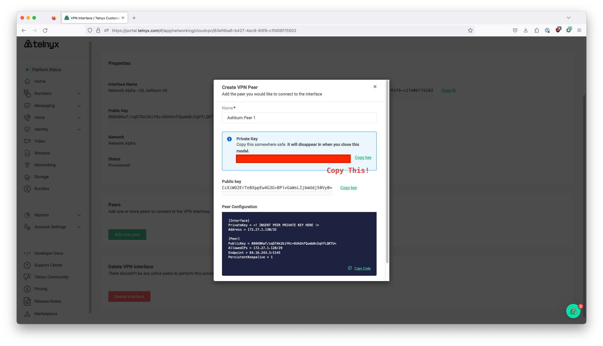
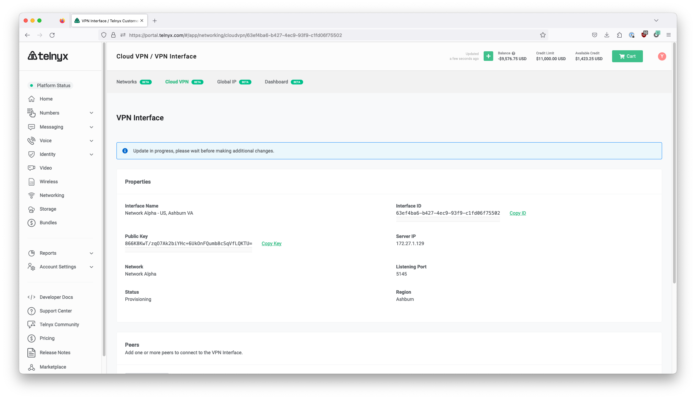
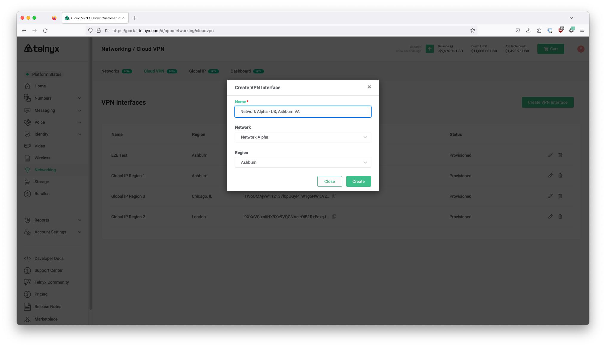

# Telnyx Networking and Global Edge Router

*Part 2 of 4 — see also: [Part 1](telnyx-networking-and-global-edge-router--part-1.md), [Part 3](telnyx-networking-and-global-edge-router--part-3.md), [Part 4](telnyx-networking-and-global-edge-router--part-4.md)*

This page covers Telnyx's network equipment, the Global Edge Router product (including its WireGuard-based architecture, benefits, multi-cloud use cases, and pricing), and step-by-step setup guides for connecting the Edge Router to AWS Lightsail, AWS VPC, Azure Linux VMs, Oracle VMs, pfSense, and Android/iOS devices. It also includes instructions for setting up the Telnyx side of the configuration via the Mission Control portal or API, verifying connectivity, and creating a Postman collection from the Telnyx OpenAPI specification.

## Configuring Global Edge Router in Mission Control

> **NOTE:** Global IP for customers is currently disabled. At present there are no plans to re-enable it in the near future.

The setup process for Global Edge Router involves the following steps:

1. **Create your network**: Sign up for the [Mission Control Portal](https://portal.telnyx.com/) and navigate to the Networking tab on the left-side menu. In the "Networks" section, click "Create Network". Give your new network a name and click "Create".

   

2. **Create a WireGuard® interface**: Select [Cloud VPN](https://telnyx.com/products/cloud-vpn) in the top menu and click "Create VPN Interface". Enter a name for your VPN interface and select a Network and region for your new VPN.

   

3. **Wait for the WireGuard® interface to provision**: This typically takes just a few minutes (you may need to refresh the page to see the 'provisioned' status).

   

4. **Create a WireGuard® Peer**: Once the VPN interface is provisioned, click the edit icon on your VPN interface. Within the VPN interface, scroll down to the "Peers" section and select "Add new peer". Name your new peer and choose to use your own public key. Click "Create Peer".

   

5. **Copy your new Private Key**: After Peer creation, copy the private key and close the pop-up.

   

6. **Acquire a Global IP**: Back in the Networking tab, select "Global IP" in the top menu. Click on "Buy Global IP" in the top right-hand corner. Name your new global IP and add a description before selecting your Tier. Global IP prices are based on port capacity—not egress fees. When you've selected your Tier, click "Buy Global IP".

   

7. **Assign WireGuard Peer to your new Global IP**: In the Global IPs tab, click on your new IP, and select "Assign new peer" at the bottom of the page. If you have multiple, choose the WireGuard® Peer you would like to associate with the IP and click "Assign Peer".

   

8. **Copy and paste WireGuard® configuration to service VM**: Using the Private Key from Step 5, paste your WireGuard® configuration to service your VM.

   

## Telnyx Setup via API

You can also use direct API calls to set up the Telnyx side of the configuration:

1. Create a new Network:

```
curl --request POST \
  --url https://api.telnyx.com/v2/networks \
  --header 'Authorization: Bearer <YOUR_TOKEN_HERE>' \
  --header 'Content-Type: application/json' \
  --data '{
    "name": "Test Network"
}'
```

2. Create a Wireguard Interface:

```
curl -i -X POST \
  https://api.telnyx.com/v2/wireguard_interfaces \
  -H 'Authorization: Bearer <YOUR_TOKEN_HERE>' \
  -H 'Content-Type: application/json' \
  -d '{
    "network_id": "<NETWORK_ID_HERE>",
    "name": "test interface",
    "region_code": "ashburn-va"
  }'
```

3. Create a Wireguard Peer:

```
curl -i -X POST \
  https://api.telnyx.com/v2/wireguard_peers \
  -H 'Authorization: Bearer <YOUR_TOKEN_HERE>' \
  -H 'Content-Type: application/json' \
  -d '{
    "wireguard_interface_id": "<WIREGUARD_INTERFACE_ID_HERE>"
  }'
```

> Note: At this current stage, only ports 80/443 are supported and Telnyx is looking into broadening this to encompass more ports.
