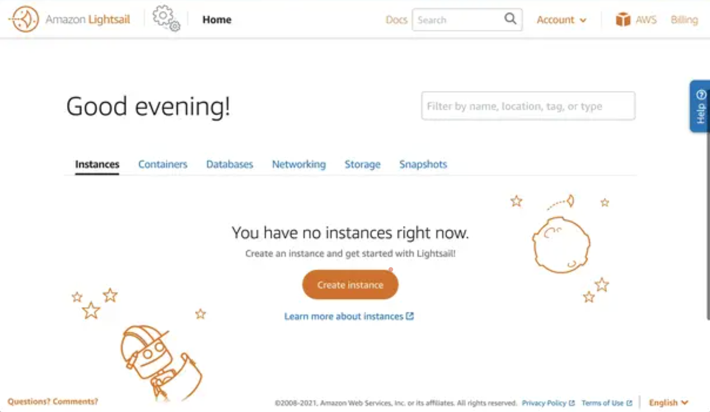
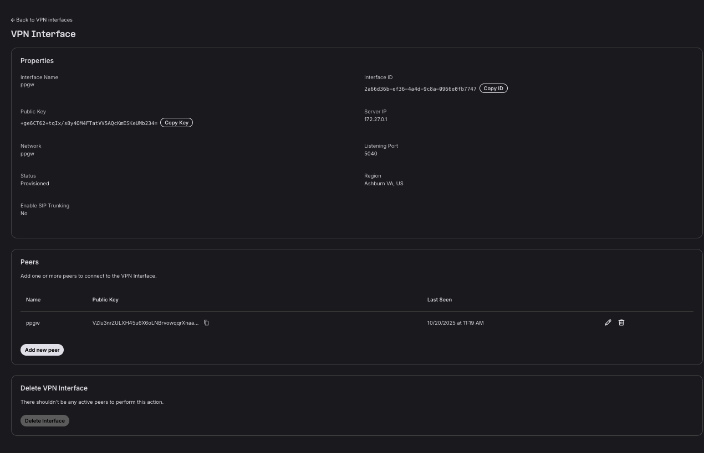

# Telnyx Networking and Global Edge Router

*Part 3 of 4 — see also: [Part 1](telnyx-networking-and-global-edge-router--part-1.md), [Part 2](telnyx-networking-and-global-edge-router--part-2.md), [Part 4](telnyx-networking-and-global-edge-router--part-4.md)*

This page covers Telnyx's network equipment, the Global Edge Router product (including its WireGuard-based architecture, benefits, multi-cloud use cases, and pricing), and step-by-step setup guides for connecting the Edge Router to AWS Lightsail, AWS VPC, Azure Linux VMs, Oracle VMs, pfSense, and Android/iOS devices. It also includes instructions for setting up the Telnyx side of the configuration via the Mission Control portal or API, verifying connectivity, and creating a Postman collection from the Telnyx OpenAPI specification.

## Deploying on Specific Platforms

After completing the Telnyx configuration, you can connect a variety of platforms to the Telnyx Edge Routing Network using the Peer Configuration file and private key from the Telnyx portal.


### AWS Lightsail

1. **Configure for Telnyx**: Copy the Peer Configuration file and private key from the Telnyx portal.
2. **Deploy an Amazon Lightsail VPS**: Log in to Amazon Lightsail and click "Create instance". Choose a location by clicking "Change AWS Region and Availability Zone". Select "Linux/Unix" and choose "Ubuntu 20.04 LTS" as the operating system. Give the instance a name and click "Create instance". Take note of the public IP address for SSH and WireGuard configuration.

   

   

   > Note: Telnyx Networking and Edge Routing works on any distro that supports WireGuard; reference the [WireGuard installation site](https://www.wireguard.com/install/).

3. **Configure Networking**: Click on the instance name and go to the "Networking" section. Delete the HTTP rule (since it's not a web server) by clicking the recycle bin icon next to it. Click "Add rule", select "Custom", choose "UDP", assign port 51820, and click "Create". This port will be used by the WireGuard service to connect to clients.

   

   > Note: Disabling IPv6 is optional and depends on your usage preferences.

4. **Connect via SSH**: Navigate to the "Account" section, then click on "SSH keys". Download the key assigned to your instance and save it on your computer. Open a Terminal session (Unix-like) or Putty (Windows). Make the key readable only by the current user:

   ```
   chmod 600 ~/Desktop/vpn.cer
   ```

   Connect to the VPS instance using the public IP address and the certificate path:

   ```
   ssh -i ~/Desktop/vpn.cer ubuntu@[PUBLIC_IP_ADDRESS]
   ```

   

5. **Enable Port Forwarding**: Create a file called `10-wireguard.conf` in the `/etc/sysctl.d` directory:

   ```
   sudo vim /etc/sysctl.d/10-wireguard.conf
   ```

   Add the following contents:

   ```
   net.ipv4.ip_forward=1
   ```

   Enable port forwarding immediately:

   ```
   sudo sysctl -p /etc/sysctl.d/10-wireguard.conf
   ```

6. **Install WireGuard and Generate Keys**:

   ```
   sudo apt update && sudo apt install wireguard -y
   cd /etc/wireguard/
   wg genkey | tee server.key | wg pubkey > server.pub
   wg genkey | tee client.key | wg pubkey > client.pub
   ```

   A list of files should now be created:

   ```
   /etc/wireguard# ls -l
   total 16
   -rw------- 1 root root 45 Jun 29 10:32 client.key
   -rw------- 1 root root 45 Jun 29 10:32 client.pub
   -rw------- 1 root root 45 Jun 29 10:32 server.key
   -rw------- 1 root root 45 Jun 29 10:32 server.pub
   ```

   > Make sure to keep track of these files as they will be used if you want to connect multiple peers or manage this server remotely from a different WireGuard Client.

7. **Create the WireGuard Server Configuration**:

   ```
   sudo vim wg0.conf
   ```

   Copy/paste the configuration files from Step 1 inside here. To enable the service when the server boots:

   ```
   sudo systemctl enable wg-quick@wg0
   ```

   To start the service now:

   ```
   sudo systemctl start wg-quick@wg0
   ```

8. **Test**: Check the [portal](https://portal.telnyx.com/#/app/networking/cloudvpn/) to see the last seen status change, or curl/trace into your server to confirm the Global IP configured to it.

   

### AWS VPC

1. **Telnyx Configuration**: Copy the Peer Configuration file and private key from the Telnyx portal.
2. **Install WireGuard**: Telnyx Edge Routing supports any distribution that supports WireGuard. Referencing the Ubuntu installation:

   ```
   apt install wireguard-tools
   ```

   WireGuard uses UDP port 51280 as the listening port for the interface. If you are going to route traffic through the EC2 instance, you'll need to turn off the source/destination check for the VPN instance. You can do this with the AWS CLI:

   ```
   aws ec2 modify-instance-attribute --no-source-dest-check --instance-id <instance-id>
   ```

3. **Configure Telnyx with WireGuard**: Create a configuration file in the `/etc/wireguard` folder called `wg0.conf`:

   ```
   [Interface]
   PrivateKey = <private key for this machine>
   Address = <IP address for WireGuard interface>
   PostUp = iptables -A FORWARD -i wg0 -j ACCEPT; iptables -t nat -A POSTROUTING -o eth0 -j MASQUERADE
   PostDown = iptables -D FORWARD -i wg0 -j ACCEPT; iptables -t nat -D POSTROUTING -o eth0 -j MASQUERADE
   ListenPort = 51280

   [Peer]
   PublicKey = <public key for peer machine>
   AllowedIPs = <IP address for peer WireGuard interface>, <additional CIDRs>
   PersistentKeepalive = 1
   ```

   > Note: If you have chosen an interface name different from `wg0`, please ensure that you modify the PostUp and PostDown lines accordingly. This configuration utilizes Network Address Translation (NAT) to present the VPN traffic as if it originates from the VPN instance within the VPC, eliminating the need to disable source/destination checks or update routing tables.

   > Note: If your client devices are situated behind a NAT, include the `PersistentKeepalive` setting. While it may not be necessary for everyone, many will find it beneficial.

   > Note: For `<additional CIDRs>`, if you desire other IP addresses from the peer's network to route through this connection, specify those addresses/networks here. This is particularly significant in the "client" side configuration, where you consolidate all traffic for a VPC (or a group of VPCs) through a single WireGuard node.

4. **Test**: Check the [portal](https://portal.telnyx.com/#/app/networking/cloudvpn/) to see the last seen status change, or curl/trace into your server to confirm the Global IP configured to it.

### Azure Linux VMs

1. **Telnyx Configuration**: Copy the Peer Configuration file and private key from the Telnyx portal.
2. **Create an Azure Linux VM and SSH in**: Head over to the [Azure Portal](https://portal.azure.com/#blade/HubsExtension/BrowseResource/resourceType/Microsoft.Compute%2FVirtualMachines) to create a Linux VM of your choosing. Edge router runs on WireGuard in the background, making it easily compatible with most Linux distributions offered by the Azure Marketplace. [SSH](https://learn.microsoft.com/en-us/azure/virtual-machines/linux/ssh-from-windows) into your Azure VM instance.
3. **Set up WireGuard for Telnyx**: While SSH'ed into your VM, install WireGuard:

   ```
   sudo apt update
   sudo apt install wireguard
   ```

   > Note: You can utilize [WireGuard Manager](https://github.com/complexorganizations/wireguard-manager) to make the setup process more straightforward, but it is not necessary.

   Open the conf file:

   ```
   sudo vi /etc/wireguard/wg0.conf
   ```

   Copy/paste the information from Step 1. Save and quit:

   ```
   :wq
   ```

   

4. **Test**: Run the VPN:

   ```
   sudo wg-quick up wg0
   ```

   

   Check the [portal](https://portal.telnyx.com/#/app/networking/cloudvpn/) to see the last seen status change, or curl/trace into your server to confirm the Global IP configured to it.

### Android/iOS

WireGuard has native client installations for both [Android](https://play.google.com/store/apps/details?id=com.wireguard.android) and [iOS](https://apps.apple.com/us/app/wireguard/id1441195209?ls=1) that can be used to test or monitor Telnyx Edge instances. This is the easiest way to test the service, in three simple steps.

1. **Telnyx Configuration**: Copy the Peer Configuration file and private key from the Telnyx portal.
2. **WireGuard Setup**: Install the client on your preferred platform. On the top right, there will be a + button to add a peer. Click it and add the configuration settings generated from Step 1.

   

   

3. **Test**: Check the [portal](https://portal.telnyx.com/#/app/networking/cloudvpn/) to see the last seen status change, or curl/trace into your server to confirm the Global IP configured to it.

   

### Oracle VMs

1. **Telnyx Configuration**: Copy the Peer Configuration file and private key from the Telnyx portal.
2. **Create your Oracle Cloud Compute Instance**: Follow a guide to create your Oracle Cloud VM Instance and install WireGuard.
3. **Configure WireGuard with Telnyx**: Create a configuration file in the `/etc/wireguard` folder called `wg0.conf`:

   ```
   [Interface]
   PrivateKey = private key for this machine
   Address = IP address for WireGuard interface
   PostUp = iptables -A FORWARD -i wg0 -j ACCEPT; iptables -t nat -A POSTROUTING -o eth0 -j MASQUERADE
   PostDown = iptables -D FORWARD -i wg0 -j ACCEPT; iptables -t nat -D POSTROUTING -o eth0 -j MASQUERADE
   ListenPort = 51280

   [Peer]
   PublicKey = public key for peer machine
   AllowedIPs = IP address for peer WireGuard interface, additional CIDRs
   PersistentKeepalive = 1
   ```

   > Note: If you have chosen an interface name different from `wg0`, modify the PostUp and PostDown lines accordingly. This configuration utilizes NAT to present the VPN traffic as if it originates from the VPN instance within the VPC.

4. **Additional Oracle NAT and Routing Configuration**: Oracle Cloud has specific NAT configuration issues that block WireGuard by default. To work around this, update your `wg0.conf` file with the following:

   ```
   PostUp = /etc/wireguard/helper/add-nat-routing.sh
   PostDown = /etc/wireguard/helper/remove-nat-routing.sh
   ```

   Create the following two scripts in the `/etc/wireguard/helper/` directory with execute permissions:

   **Script 1 — add-nat-routing.sh**:

   ```
   #!/bin/bash
   IPT="/sbin/iptables"
   IPT6="/sbin/ip6tables"

   IN_FACE="ens3" # NIC connected to the internet
   WG_FACE="wg0" # WG NIC
   SUB_NET="10.66.66.0/24" # WG IPv4 sub/net aka CIDR
   WG_PORT="59075" # WG udp port
   SUB_NET_6="fd42:42:42::/64" # WG IPv6 sub/net

   ## IPv4 ##
   $IPT -t nat -I POSTROUTING 1 -s $SUB_NET -o $IN_FACE -j MASQUERADE
   $IPT -I INPUT 1 -i $WG_FACE -j ACCEPT
   $IPT -I FORWARD 1 -i $IN_FACE -o $WG_FACE -j ACCEPT
   $IPT -I FORWARD 1 -i $WG_FACE -o $IN_FACE -j ACCEPT
   $IPT -I INPUT 1 -i $IN_FACE -p udp --dport $WG_PORT -j ACCEPT

   ## IPv6 (Uncomment) ##
   $IPT6 -t nat -I POSTROUTING 1 -s $SUB_NET_6 -o $IN_FACE -j MASQUERADE
   $IPT6 -I INPUT 1 -i $WG_FACE -j ACCEPT
   $IPT6 -I FORWARD 1 -i $IN_FACE -o $WG_FACE -j ACCEPT
   $IPT6 -I FORWARD 1 -i $WG_FACE -o $IN_FACE -j ACCEPT
   ```

   **Script 2 — remove-nat-routing.sh**:

   ```
   #!/bin/bash
   IPT="/sbin/iptables"
   IPT6="/sbin/ip6tables"

   IN_FACE="ens3" # NIC connected to the internet
   WG_FACE="wg0" # WG NIC
   SUB_NET="10.66.66.0/24" # WG IPv4 sub/net aka CIDR
   WG_PORT="59075" # WG udp port
   SUB_NET_6="fd42:42:42::/64" # WG IPv6 sub/net

   # IPv4 rules #
   $IPT -t nat -D POSTROUTING -s $SUB_NET -o $IN_FACE -j MASQUERADE
   $IPT -D INPUT -i $WG_FACE -j ACCEPT
   $IPT -D FORWARD -i $IN_FACE -o $WG_FACE -j ACCEPT
   $IPT -D FORWARD -i $WG_FACE -o $IN_FACE -j ACCEPT
   $IPT -D INPUT -i $IN_FACE -p udp --dport $WG_PORT -j ACCEPT

   # IPv6 rules (uncomment) #
   $IPT6 -t nat -D POSTROUTING -s $SUB_NET_6 -o $IN_FACE -j MASQUERADE
   $IPT6 -D INPUT -i $WG_FACE -j ACCEPT
   $IPT6 -D FORWARD -i $IN_FACE -o $WG_FACE -j ACCEPT
   $IPT6 -D FORWARD -i $WG_FACE -o $IN_FACE -j ACCEPT
   ```

   The first script ensures that traffic running from the VPN is correctly routed through the network on the Oracle Cloud servers, while the second script correctly disables the routing configuration when the service is stopped. A more detailed writeup can be [found here written by Vadim Smirnov](https://www.ntkernel.com/setting-up-wireguard-on-oracle-cloud-overcoming-nat-and-routing-challenges/).

5. **Test**: Check the [portal](https://portal.telnyx.com/#/app/networking/cloudvpn/) to see the last seen status change, or curl/trace into your server to confirm the Global IP configured to it.

### pfSense

1. **Telnyx Configuration**: Copy the Peer Configuration file and private key from the Telnyx portal.
2. **pfSense Configuration**:
   - Ensure you have the WireGuard package installed.
   - Navigate to **VPN → Wireguard** and add a new Tunnel. Give the tunnel a descriptive name (e.g., `telnyx_wg`). Paste the Private Key from the Telnyx Wireguard Peer setup into Private Key for the Interface Keys.
   - Add a new Peer: Uncheck the Dynamic Endpoint, then paste the Endpoint, Public Key, and Allowed IPs from the Telnyx Wireguard Peer setup.
   - Navigate to **Interface → Assignments** and add a new interface with the Wireguard tunnel (e.g., `telnyx_wg`). Click on the Interface to edit it:
     - Set IPv4 Configuration Type to Static IPv4.
     - Under Static IPv4 Configuration, set the IPv4 Address to the Interface Address found in the Telnyx Wireguard Peer setup.
     - Select `/16` for the subnet mask.
3. **Set up 1:1 NAT and Outbound NAT**:
   - **1:1 NAT** (so traffic ingressing through your Wireguard peer routes to your service VM):
     - Interface: the Wireguard tunnel interface
     - External subnet: Wireguard tunnel Interface address
     - Internal IP: the IP address of the machine you are hosting your machine on

     

   - **Outbound NAT** (so your service VM can send traffic back to your pfsense instance without needing to know about the route to the Wireguard interface):
     - Interface: WAN interface (or whichever interface your VM is also listening on)
     - Address Family: IPv4 + IPv6
     - Protocol: any (restrict as you would like)
     - Source: Any (restrict as you would like)
     - Destination: specify the IP address of your VM on the Interface
     - Translation Address: Interface Address

     
