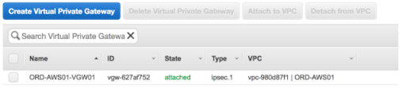
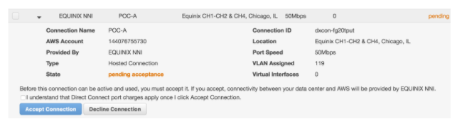
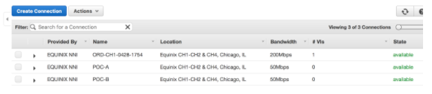
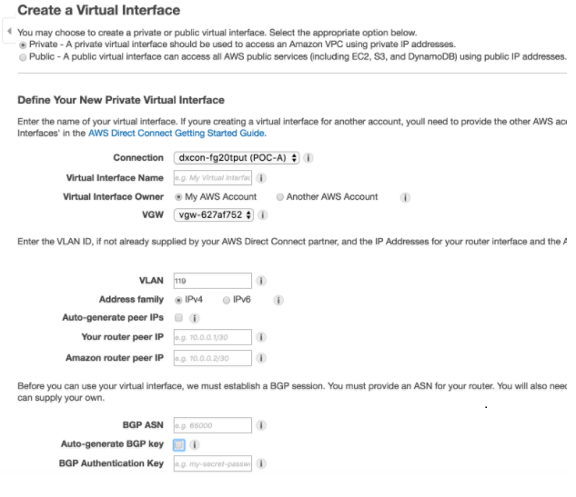
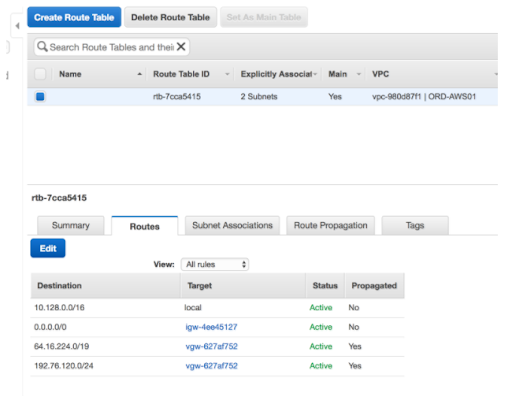

# Telnyx Networking and Storage Integrations

*Part 1 of 7 — see also: [Part 2](telnyx-networking-and-storage-integrations--part-2.md), [Part 3](telnyx-networking-and-storage-integrations--part-3.md), [Part 4](telnyx-networking-and-storage-integrations--part-4.md), [Part 5](telnyx-networking-and-storage-integrations--part-5.md), [Part 6](telnyx-networking-and-storage-integrations--part-6.md), [Part 7](telnyx-networking-and-storage-integrations--part-7.md)*

This page consolidates Telnyx networking and storage integration guides, covering virtual cross connect (VXC) setup with AWS, Azure, Google Cloud, and Megaport, configuration of S3-compatible clients (Cyberduck, WAL-G, Arq Backup, Backup4all, Duplicati, WinSCP, CrossFTP) with Telnyx Storage, and a WireGuard-based Cloud VPN tutorial for connecting a Digital Ocean Ubuntu server to the Telnyx network.

## Overview

A virtual cross connect (VXC) is a private, direct connection between cloud providers that is faster and safer than a traditional public internet connection. Using a VXC allows you to bypass the public internet and gain direct, private access to Telnyx, eliminating hops and reducing the risk of packet loss and jitter while benefiting from the additional security of direct interconnection.

> **Note:** To protect against man-in-the-middle attacks, Telnyx recommends that you [encrypt both signaling and media with TLS & Z/SRTP](https://support.telnyx.com/en/articles/1130711-does-telnyx-encrypt-communication).

## AWS Virtual Cross Connect

This section describes how to integrate an AWS VPC environment with the Telnyx network backbone.

**Pre-requisites**

- An existing AWS Virtual Private Cloud (VPC)
- The following information ready:
  - 12-digit AWS VPC account number
  - AWS region
  - Bandwidth speed between you and your VPC
  - Network name

**Step 1: Provide Telnyx with VXC preferences**

1. Log into your Telnyx Mission Control Portal.
2. Navigate to the **Networking** section.
3. Click **Create a New VXC** and provide the following values:
   1. The 12-digit AWS account number associated with your VPC
   2. AWS region
   3. Bandwidth speed
   4. Network name

After receiving the request, Telnyx will create 1 or 2 Direct Connect connections that you can accept from your AWS console.

> **Note:** This request will take 1–3 days for Telnyx to complete. Once you submit your preferences to Telnyx, you will not be able to change them without creating a new VXC. You can complete step 2 now, but step 3 cannot be completed until Telnyx finishes this task.

**Step 2: Create a Virtual Private Gateway (VGW)**

A VGW is an intermediary between AWS Direct Connect and your AWS VPC. You will need to create 1 VGW in order to complete this setup.

Create the VGW:

1. Open the [Amazon VPC console](https://console.aws.amazon.com/vpc/).
2. Click **Virtual Private Gateways > Create Virtual Private Gateway**.
3. Name your gateway.
4. Use the default ASN.
5. Choose **Create Virtual Private Gateway**.

Associate the new VGW with your destination AWS VPC:

1. From the [Amazon VPC console](https://console.aws.amazon.com/vpc/), select the VGW you just created.
2. Click **Actions** and choose **Attach to VPC**.
3. Select your VPC from the list and choose **Yes, Attach**.

**Step 3: Accept pending Direct Connect connections**

Once Telnyx finishes creating your new VGWs, they will be waiting for permission to accept Direct Connect connections.

> **Note:** If you requested a backup link, you'll see 2 pending connections in this step. If you didn't, you'll see 1.

1. Open your [AWS Direct Connect console](https://console.aws.amazon.com/directconnect/).
2. Click **Connections** in the navigation pane.
3. You should see either 1 or 2 connections waiting for acceptance.

4. For each connection, expand it and select **I understand that Direct Connect port charges apply once I click Accept Connection**, then choose **Accept Connection**.

5. Once the connections are completed, your output should show each connection as available.

**Step 4: Create a virtual interface for each circuit**

In this step, you will create a private virtual interface. These are used to access a VPC using a private IP address. This is where all Layer 3 addressing and [BGP](https://telnyx.com/resources/what-is-bgp) details will be completed.

> **Note:** Some of the information you'll need to supply in this step will have been provided to you in the Telnyx support email that should have come along with your new VGW(s). If you did not receive this, or you can't locate it, reach out to Telnyx support.

1. Open your [AWS Direct Connect console](https://console.aws.amazon.com/directconnect/).
2. Click **Connections** in the navigation pane.
3. Select the first connection on the list (that you configured in step 3) and choose **Actions > Create Virtual Interface**.
4. Fill out the form with the following information:
   1. **Public or Private:** Private
   2. **Virtual Interface Name:** Use the connection ID
   3. **Your router peer IP:** Use the Telnyx IP that was provided in the Telnyx support email
   4. **Amazon router peer IP:** Use the customer IP that was provided in the Telnyx support email
   5. **BGP ASN:** You can find this in the Telnyx support email
   6. **BGP Authentication Key:** You can find this in the Telnyx support email

5. If you requested a redundant backup link, repeat steps 3 through 5 for that connection as well.

**Step 5: Enable route propagation for VPC route tables**

Now that you have created virtual interfaces, BGP sessions will form with Telnyx and routing will be in place on these connections. In this step, you'll ensure that route propagation is enabled for the VGW, which will allow it to automatically propagate routes to the route tables so you don't have to do it manually.

1. Open your [AWS Direct Connect console](https://console.aws.amazon.com/directconnect/).
2. Click the **Route Propagate** tab.
3. Choose **Edit**.
4. Select the **Propagate** checkbox next to your VGW.
5. Hit **Save**.

The routing table should now display Telnyx prefixes routing to the VGW. When these are visible in the routing table, integration between Telnyx and AWS is complete and you can test IP reachability.

**Further documentation**

- Amazon AWS [Direct Connect user guide](https://docs.aws.amazon.com/directconnect/latest/UserGuide/Welcome.html)
- Amazon AWS [Direct Connect virtual interfaces user guide](https://docs.aws.amazon.com/directconnect/latest/UserGuide/WorkingWithVirtualInterfaces.html)
- Amazon AWS [Virtual Private Cloud](https://docs.aws.amazon.com/vpc/)
