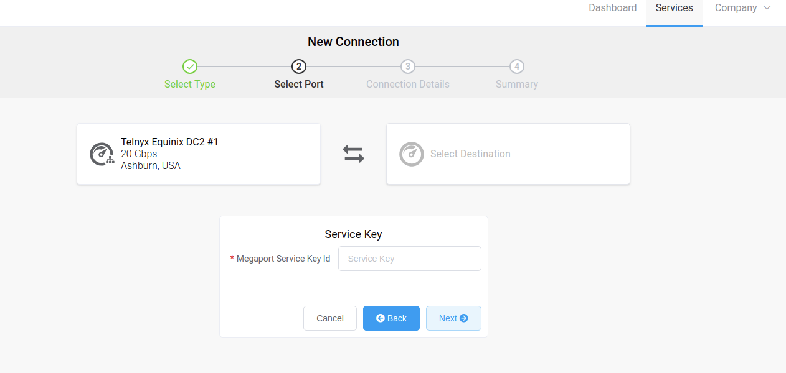
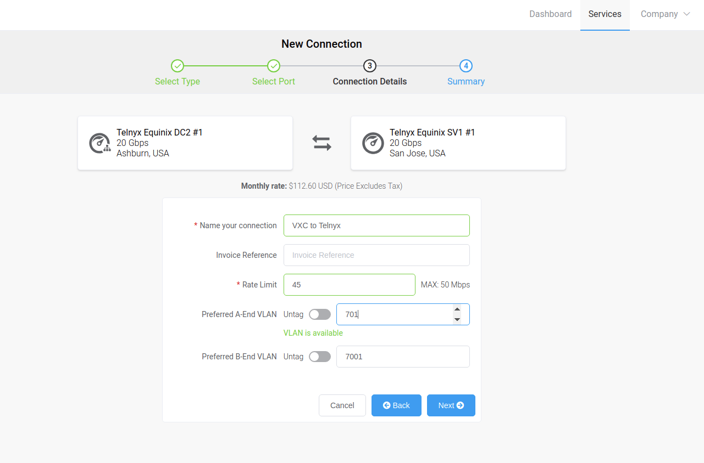
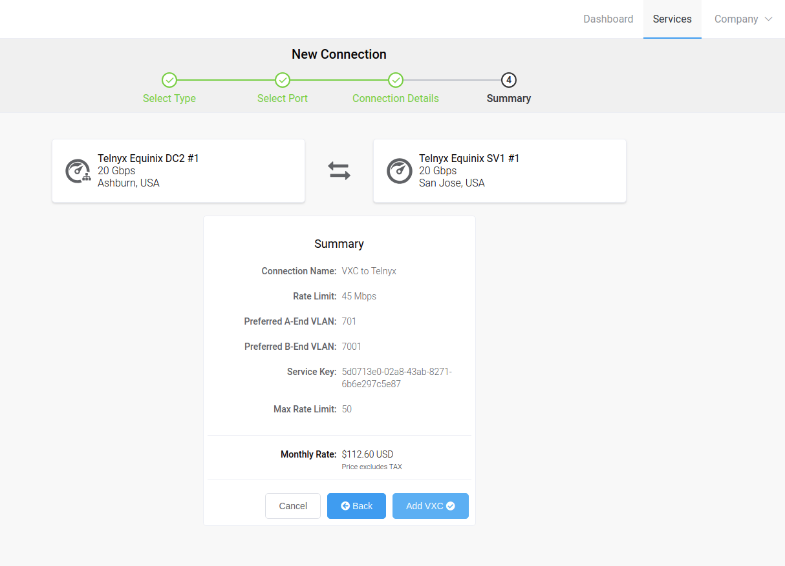
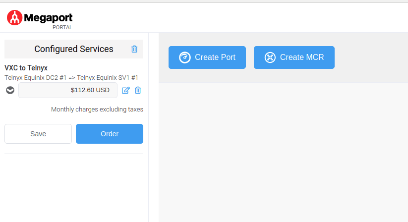

# Telnyx Networking and Storage Integrations

*Part 1 of 5 — see also: [Part 2](telnyx-networking-and-storage-integrations--part-2.md), [Part 3](telnyx-networking-and-storage-integrations--part-3.md), [Part 4](telnyx-networking-and-storage-integrations--part-4.md), [Part 5](telnyx-networking-and-storage-integrations--part-5.md)*

This page consolidates Telnyx support documentation covering Megaport network integration, Telnyx Storage configuration with third-party S3-compatible clients (Cyberduck, Arq Backup, Backup4all, Duplicati, WinSCP, CrossFTP), and Telnyx Networking setup across Global Edge Router, Ubuntu, Azure Linux VMs, Oracle VMs, and pfSense using WireGuard-based Cloud VPN.

## Megaport Configuration with Telnyx

[Megaport](https://www.megaport.com/) is a global Network as a Service provider that uses SDN to provision instant, dedicated access to AWS Direct Connect across hundreds of global locations. Configuring Megaport with Telnyx establishes a private network connection between the two platforms.

**Pre-requisites**

- Ensure that your Telnyx Mission Control Portal is configured properly.
- Recommended: enable TLS to encrypt your traffic.
- Megaport ports must be live on both ends.

**Create a connection between Telnyx and the Megaport portal**

1. Log into your Megaport portal account.
2. Click **+ Connection**.
3. Click **Enter Service Key**.

   

   
4. Provide the following information:
   1. **Megaport Service Key ID:** Enter the service key provided by Telnyx. The data from this key will populate. If you did not receive a service key, or are unsure, contact Telnyx Support.

      
5. Once you've entered your service key, the details on your screen will update.

   
6. Click **Next**.
7. Confirm the following auto-filled details:
   1. **Name your connection:** Choose a name that helps you easily identify the connection and its purpose.
   2. **Rate limit:** Caps how often an action can be repeated within a certain timeframe, helping to mitigate malicious bot activity.
   3. **Preferred A-End VLAN:** Each VXC is delivered as a separate VLAN on your Port. This must be a unique VLAN ID on this Port and can range from 2 to 4093. If you specify a VLAN ID that is already in use, the system displays the next available VLAN number. The VLAN ID must be unique to proceed with the order. If you don't specify a value, Megaport will assign one.

      
8. Click **Next**.
9. Once you've confirmed all your details, click **Add VXC** to update your ordering cart.

   
10. View your cart and click **Order**. This sends an email to Telnyx for approval. Once Telnyx approves your connection, the VXC between your Megaport setup and Telnyx is created.

    

Additional resources: [Megaport documentation](https://docs.megaport.com/), [Megaport support](https://docs.megaport.com/support/contact/), and [Megaport resource center](https://www.megaport.com/resources/).
