# Telnyx Networking and Storage Integrations

*Part 2 of 7 — see also: [Part 1](telnyx-networking-and-storage-integrations--part-1.md), [Part 3](telnyx-networking-and-storage-integrations--part-3.md), [Part 4](telnyx-networking-and-storage-integrations--part-4.md), [Part 5](telnyx-networking-and-storage-integrations--part-5.md), [Part 6](telnyx-networking-and-storage-integrations--part-6.md), [Part 7](telnyx-networking-and-storage-integrations--part-7.md)*

This page consolidates Telnyx networking and storage integration guides, covering virtual cross connect (VXC) setup with AWS, Azure, Google Cloud, and Megaport, configuration of S3-compatible clients (Cyberduck, WAL-G, Arq Backup, Backup4all, Duplicati, WinSCP, CrossFTP) with Telnyx Storage, and a WireGuard-based Cloud VPN tutorial for connecting a Digital Ocean Ubuntu server to the Telnyx network.

## Azure Virtual Cross Connect

This section provides instructions, technical details, and guidelines for integrating a [Microsoft Azure Cloud](https://azure.microsoft.com/en-us/) environment with the Telnyx network backbone.

**Pre-requisites**

- A Microsoft Azure cloud environment

**Step 1: Prepare your Microsoft account for an Azure Express Route**

1. Log into your [Azure Portal](https://portal.azure.com/#home).

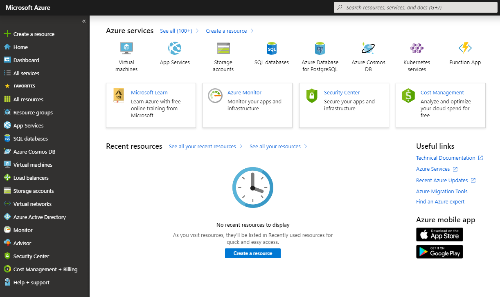
2. Perform a search for *express route* and click on **Express Route Circuits**.

3. Click **Add → Provider**. This provider *must* be *Equinix*. Do **NOT** select *Allow Classic Operations*. Rename other fields at your discretion.

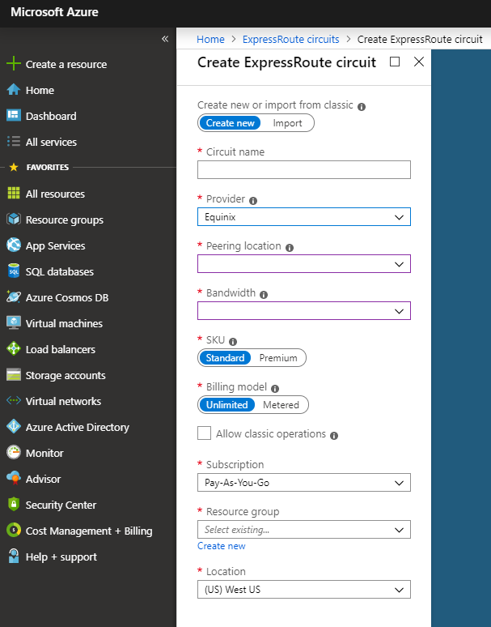
4. Click **OK**.
5. Once the deployment completes, you will see your newly-provisioned Azure Express Route.

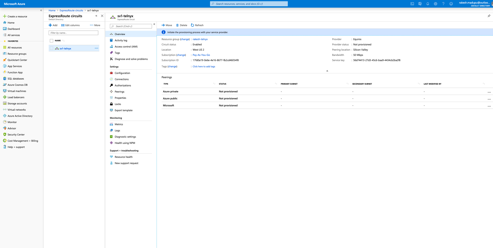

**Step 2: Set up the VXC in your Telnyx Mission Control Portal**

1. Log into your [Telnyx Mission Control Portal](https://portal.telnyx.com).
2. Click on **Networking** in the left-hand menu.

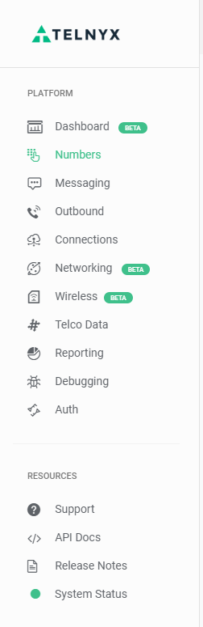
3. Click on the **Create New Network** button on the top-right.

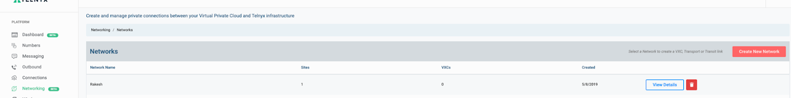
4. Give your network a name and click on the **Create Network** button.

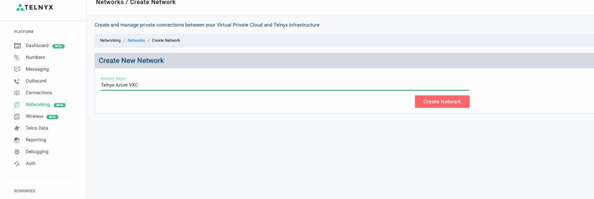
5. Once the Network is created, click on the **Add a Site** button.

6. Choose the Telnyx Backbone Network you want to peer with.

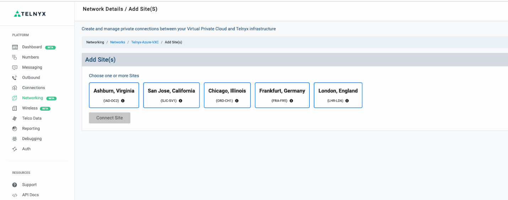
7. Add the VXC by clicking on **Create VXC**.

8. Create an Azure Express Route.

> **Note:** In order to complete this section, Stage 1 needs to have been completed.

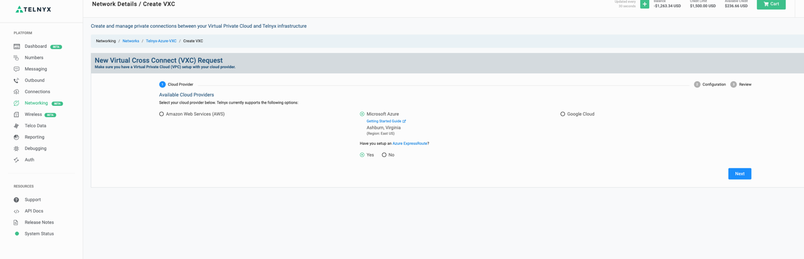
9. Key in the Azure Service Key and Microsoft Azure ASN. Typically it is **12076**.

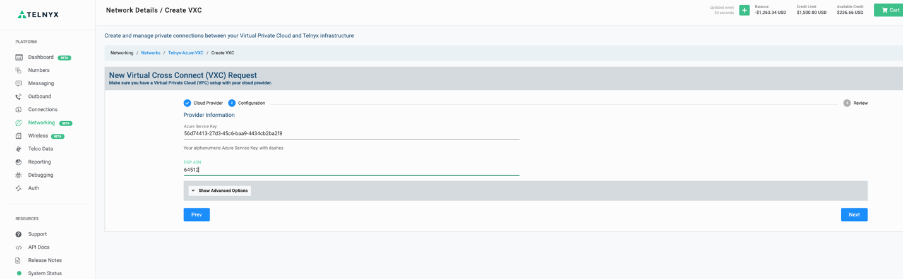
10. Now create your VXC and submit it to the Telnyx Network team.

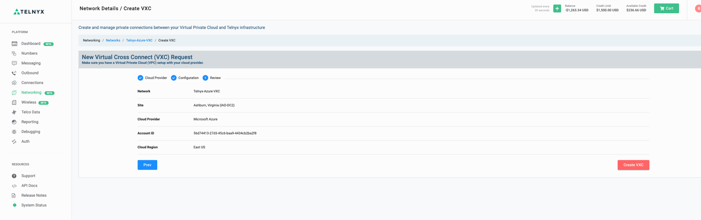

> Connection acceptance will be performed by the Telnyx Network Team.

> **IMPORTANT:** Do NOT enable Routing status via the slider. This step has to be coordinated in sync with the Telnyx Network Team, as enabling this without backend configuration may blackhole your voice traffic.

**Step 3: Turn up routing and NAT configuration**

1. Arrange a maintenance activity and coordinate with Telnyx Network Engineering to turn on the routing. Please [contact Telnyx Support](https://telnyx.com/contact-us) to assist with this.

> **Note:** This activity has to be coordinated with the Network team to complete back-end configuration during the maintenance window.

2. Once you enable the circuit using the Routing Status slider, you should see a routing table in Express Route similar to the following:

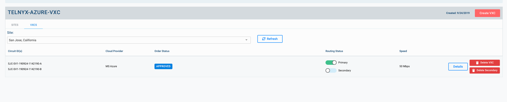

Once enabled with routing, you'll see Telnyx public ranges via the Express Route Circuit. This will ensure that these are preferred over the Internet Routing Table.

**Additional documentation**

- [Microsoft Azure technical documentation](https://learn.microsoft.com/en-us/)
