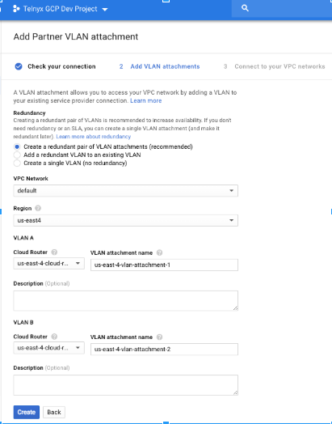
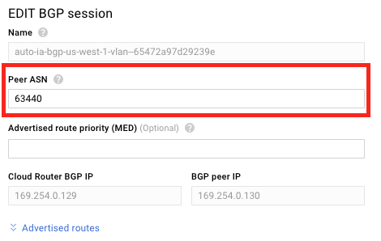
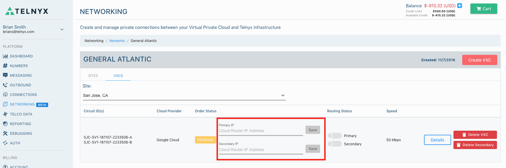
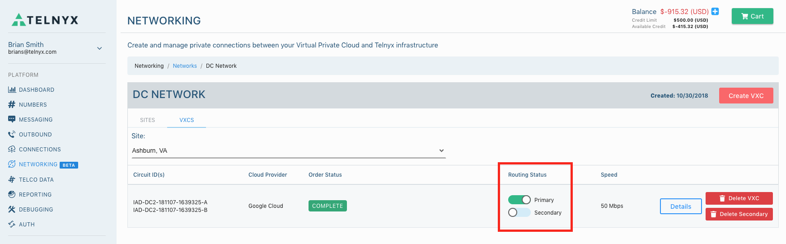

# Telnyx Networking and Storage Integrations

*Part 3 of 7 — see also: [Part 1](telnyx-networking-and-storage-integrations--part-1.md), [Part 2](telnyx-networking-and-storage-integrations--part-2.md), [Part 4](telnyx-networking-and-storage-integrations--part-4.md), [Part 5](telnyx-networking-and-storage-integrations--part-5.md), [Part 6](telnyx-networking-and-storage-integrations--part-6.md), [Part 7](telnyx-networking-and-storage-integrations--part-7.md)*

This page consolidates Telnyx networking and storage integration guides, covering virtual cross connect (VXC) setup with AWS, Azure, Google Cloud, and Megaport, configuration of S3-compatible clients (Cyberduck, WAL-G, Arq Backup, Backup4all, Duplicati, WinSCP, CrossFTP) with Telnyx Storage, and a WireGuard-based Cloud VPN tutorial for connecting a Digital Ocean Ubuntu server to the Telnyx network.

## Google VPC Integration

This section provides instructions, technical details, and guidelines for integrating a [Google Cloud](https://cloud.google.com/) environment with the Telnyx network backbone.

**Pre-requisites**

- A GCP Virtual Private Cloud (VPC) network
- For optimal performance, your VPC needs to be located in the same region where you plan to build a Virtual Cross Connect (VXC)

**Step 1: Create a GCP Partner Interconnect and VLAN attachments**

In this step, you'll create a GCP partner interconnect, which will connect your Google Cloud VPC to the Telnyx network. You will then create VLAN attachments, which are connections between your local routers and Google Cloud's routers used by your partner interconnect.

1. Open the [Google Cloud Platform VPC](https://console.cloud.google.com/hybrid/interconnects/).
2. Choose **Interconnect Type → Partner Interconnect**.

3. Under **Add Partner VLAN Attachment → Check your connection**, choose *I already have a service provider*.

4. Under **Add VLAN attachments**, fill in the following:
   1. **Redundancy:** Telnyx recommends selecting *Create a redundant pair of VLAN attachments*. See pricing for each Virtual Cross Connect [here](https://telnyx.com). Note that a redundant pair of VLAN attachments requires two VXCs.
   2. **VPC network:** *default*
   3. **Region:** The region should be the same region where you're running the software application.
   4. **Cloud Router:** The router will be created in the same region as your VPC Network.
   5. **Name the VLAN attachment(s):** Consider a naming convention similar to `us-east-4-vlan-attachment-1` (i.e., country-region-etc).

5. Click **Create**.
6. Now select **OK** to connect your VPC networks.
7. Click on VLAN Attachment Detail and copy your pairing key(s). You will need them.

**Step 2: Provide Telnyx with VXC preferences**

In this step, you'll let Telnyx know your VXC preferences for a network and a site. The network uses virtual routing and forwarding technology to provide you with a unique routing table within Telnyx's routers. A site is a Telnyx Point of Presence (PoP) where Telnyx houses its network gear.

1. Log into your Telnyx Mission Control Portal.
2. Go to the **Networking** section.
3. Click **Create New Network** to create a new one. If you have one you want to use, click **View Details** for that network.
4. Find the **Site Detail** section of your network and click **Add Site(s)**, then **Create VXC** to create a new site. If you have a site you want to use, click **Create VXC** on an existing site.

> Select sites that are local to your Google Cloud region(s). See a [list of Telnyx sites and their corresponding local Google Cloud regions](https://telnyx.com/).

5. Select **Google Cloud** as your Cloud Provider.
6. Click **Next**.
7. Select Bandwidth Speed.
8. Click **Next**.
9. Input your **Google Pairing Key** for your primary VLAN attachment (i.e., the last number of the pairing key should be "1"). You can retrieve this from <https://console.cloud.google.com/hybrid/interconnects> by viewing **VLAN Attachment Detail**. The key will be in the format `<random>/<vlan-attachment-region>/<edge-availability-domain>`.
10. If you created a redundant link, click **Secondary Link** and input your **Google Pairing Key** from the secondary **VLAN Attachment** (i.e., the last number of the pairing key should be "2").
11. Review **New Virtual Cross Connect (VXC) Request**. Click **Create VXC**.

**Step 3: Activate the Virtual Cross Connect in Google Cloud**

Now that everything is configured, let's activate your VXC in Google Cloud.

1. Open the Google Cloud Platform VPC at <https://console.cloud.google.com/hybrid/interconnects/>.
2. For each VLAN Attachment under Actions, click **Activate** (this option may take up to 5 minutes to appear), then click **Accept**.

3. For each VLAN Attachment under Actions, click **Configure [BGP](https://telnyx.com/resources/what-is-bgp)**.

4. In EDIT BGP session, in the **Peer ASN** field, input **63440**. Click **Save and Continue**.

5. Click **Refresh**. Status should say **Up**.

6. Copy the **Cloud Router IP** for each VLAN Attachment. You will need this in the next step.

**Step 4: Complete your order in Telnyx**

1. Copy the **Cloud Router IP** for the first VLAN Attachment. Click **Save**. If you have a redundant link, copy the **Cloud Router IP** for the second VLAN Attachment. Click **Save**.

2. Telnyx will approve your request (this may take up to 3 hours). Order Status will change from **Pending** to **Active** to **Complete**. Once an **Order Status** is complete, the BGP session between Telnyx and Google Cloud will be active.
3. To receive traffic from Telnyx, your cloud hosts must have public IP addresses configured. Consult your Telnyx representative before clicking 'Enable' if you need assistance.
4. Under routing status, click the button to enable. Doing this will transition packet delivery from your Cloud Provider's Internet transit to the private Virtual Cross Connect, resulting in a brief traffic disruption.

**Further documentation**

- [Google VPC documentation](https://cloud.google.com/vpc#section-4)
- [VLAN attachments documentation](https://cloud.google.com/network-connectivity/docs/interconnect/how-to/partner/creating-vlan-attachments)
