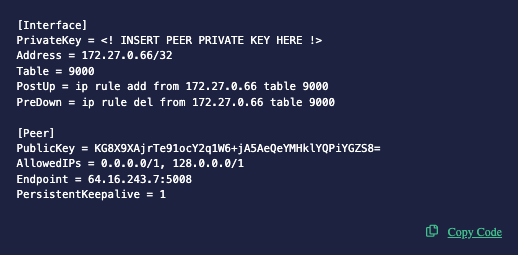
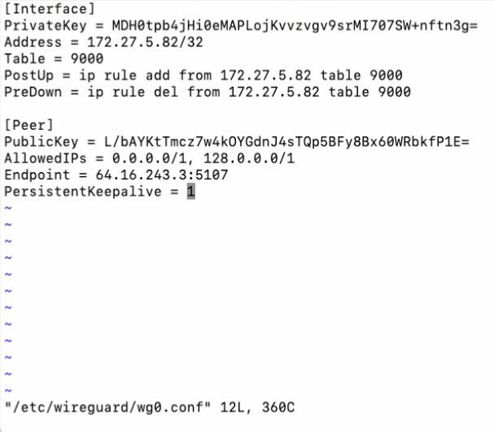
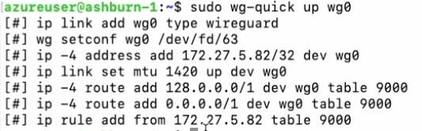
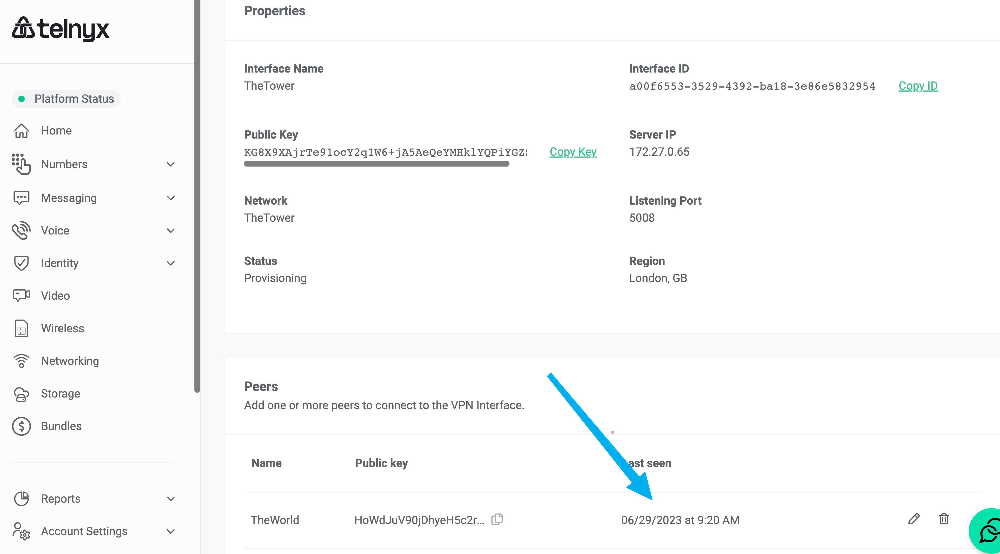

# Telnyx Networking and Storage Integrations

*Part 4 of 5 — see also: [Part 1](telnyx-networking-and-storage-integrations--part-1.md), [Part 2](telnyx-networking-and-storage-integrations--part-2.md), [Part 3](telnyx-networking-and-storage-integrations--part-3.md), [Part 5](telnyx-networking-and-storage-integrations--part-5.md)*

This page consolidates Telnyx support documentation covering Megaport network integration, Telnyx Storage configuration with third-party S3-compatible clients (Cyberduck, Arq Backup, Backup4all, Duplicati, WinSCP, CrossFTP), and Telnyx Networking setup across Global Edge Router, Ubuntu, Azure Linux VMs, Oracle VMs, and pfSense using WireGuard-based Cloud VPN.

## Telnyx Networking on Azure Linux VMs

**Step 1: Telnyx configuration with Azure Linux VMs**

Reference the introduction to Telnyx Networking section. Copy and take note of the Peer Configuration file along with the private key that you got assigned from the tutorial.



**Step 2: Create an Azure Linux VM and SSH in**

Create a Linux VM of your choosing in the [Azure Portal](https://portal.azure.com/#blade/HubsExtension/BrowseResource/resourceType/Microsoft.Compute%2FVirtualMachines). Edge Router runs on WireGuard in the background, which makes it easily compatible with most Linux distributions offered by the Azure Marketplace. [SSH](https://learn.microsoft.com/en-us/azure/virtual-machines/linux/ssh-from-windows) into your Azure VM instance.

**Step 3: Setting up WireGuard for Telnyx**

While SSH'd into your VM, install WireGuard:

```
sudo apt update
sudo apt install wireguard
```

> You can use [WireGuard Manager](https://github.com/complexorganizations/wireguard-manager) to streamline the setup process, but it is not necessary.

After installation, open the WireGuard configuration file:

```
sudo vi /etc/wireguard/wg0.conf
```

Copy and paste the information from Step 1.



Save and quit:

```
:wq
```

**Step 4: Test**

Bring up the VPN:

```
sudo wg-quick up wg0
```



Verify by checking the [portal](https://portal.telnyx.com/#/app/networking/cloudvpn/) for the `last seen` status change:



Or curl/trace into your server to confirm the Global IP configured to it:

```
root@MacBook-Pro % ping 172.27.1.17
PING 172.27.1.17 (172.27.1.17): 56 data bytes
64 bytes from 172.27.1.17: icmp_seq=0 ttl=53 time=184.512 ms
64 bytes from 172.27.1.17: icmp_seq=1 ttl=53 time=183.202 ms
64 bytes from 172.27.1.17: icmp_seq=2 ttl=53 time=183.365 ms
64 bytes from 172.27.1.17: icmp_seq=3 ttl=53 time=183.040 ms
64 bytes from 172.27.1.17: icmp_seq=4 ttl=53 time=183.310 ms
64 bytes from 172.27.1.17: icmp_seq=5 ttl=53 time=183.980 ms
64 bytes from 172.27.1.17: icmp_seq=6 ttl=53 time=183.457 ms
64 bytes from 172.27.1.17: icmp_seq=7 ttl=53 time=183.097 ms
^C
--- 172.27.1.17 ping statistics ---
8 packets transmitted, 8 packets received, 0.0% packet loss
round-trip min/avg/max/stddev = 183.040/183.495/184.512/0.471 ms
```

## Telnyx Networking on Oracle VMs

**Step 1: Telnyx configuration with Oracle VMs**

Reference the introduction to Telnyx Networking section. Copy and take note of the Peer Configuration file along with the private key that you got assigned from the tutorial.


**Step 2: Create your Oracle Cloud Compute Instance**

Create your own Oracle Cloud VM Instance. A good overview and guide on how to do so can be found in the community writeup by n00, which also covers the installation of WireGuard.

**Step 3: Configuring WireGuard with Telnyx**

Create a configuration file in `/etc/wireguard` called `wg0.conf` and place the configuration instructions generated from Step 1.

```
[Interface]
PrivateKey = private key for this machine
Address = IP address for WireGuard interface
PostUp = iptables -A FORWARD -i wg0 -j ACCEPT; iptables -t nat -A POSTROUTING -o eth0 -j MASQUERADE
PostDown = iptables -D FORWARD -i wg0 -j ACCEPT; iptables -t nat -D POSTROUTING -o eth0 -j MASQUERADE
ListenPort = 51280

[Peer]
PublicKey = public key for peer machine
AllowedIPs = IP address for peer WireGuard interface, additional CIDRs
PersistentKeepalive = 1
```

If you have chosen an interface name different from `wg0`, modify the `PostUp` and `PostDown` lines accordingly. This configuration uses Network Address Translation (NAT) to present the VPN traffic as if it originates from the VPN instance within the VPC, eliminating the need to disable source/destination checks or update routing tables. The `PersistentKeepalive` setting is included because client devices are often situated behind a NAT. The **additional CIDRs** notation lets you route other IP addresses from the peer's network through this connection, which is particularly significant in the "client" side configuration where you consolidate all traffic for a VPC (or a group of VPCs) through a single WireGuard node.

**Step 4: Additional Oracle NAT and routing configuration**

Oracle Cloud blocks WireGuard by default due to its NAT settings. To work around this, create two helper scripts.

**Step 4.1: Update `wg0.conf`**

```
PostUp = /etc/wireguard/helper/add-nat-routing.sh
PostDown = /etc/wireguard/helper/remove-nat-routing.sh
```

**Step 4.2: Create the helper scripts in `/etc/wireguard/helper/` with execute permissions**

`add-nat-routing.sh`:

```
#!/bin/bash
IPT="/sbin/iptables"
IPT6="/sbin/ip6tables"

IN_FACE="ens3" # NIC connected to the internet
WG_FACE="wg0" # WG NIC
SUB_NET="10.66.66.0/24" # WG IPv4 sub/net aka CIDR
WG_PORT="59075" # WG udp port
SUB_NET_6="fd42:42:42::/64" # WG IPv6 sub/net

## IPv4 ##
$IPT -t nat -I POSTROUTING 1 -s $SUB_NET -o $IN_FACE -j MASQUERADE
$IPT -I INPUT 1 -i $WG_FACE -j ACCEPT
$IPT -I FORWARD 1 -i $IN_FACE -o $WG_FACE -j ACCEPT
$IPT -I FORWARD 1 -i $WG_FACE -o $IN_FACE -j ACCEPT
$IPT -I INPUT 1 -i $IN_FACE -p udp --dport $WG_PORT -j ACCEPT

## IPv6 (Uncomment) ##
$IPT6 -t nat -I POSTROUTING 1 -s $SUB_NET_6 -o $IN_FACE -j MASQUERADE
$IPT6 -I INPUT 1 -i $WG_FACE -j ACCEPT
$IPT6 -I FORWARD 1 -i $IN_FACE -o $WG_FACE -j ACCEPT
$IPT6 -I FORWARD 1 -i $WG_FACE -o $IN_FACE -j ACCEPT
```

`remove-nat-routing.sh`:

```
#!/bin/bash
IPT="/sbin/iptables"
IPT6="/sbin/ip6tables"

IN_FACE="ens3" # NIC connected to the internet
WG_FACE="wg0" # WG NIC
SUB_NET="10.66.66.0/24" # WG IPv4 sub/net aka CIDR
WG_PORT="59075" # WG udp port
SUB_NET_6="fd42:42:42::/64" # WG IPv6 sub/net

## IPv4 rules #
$IPT -t nat -D POSTROUTING -s $SUB_NET -o $IN_FACE -j MASQUERADE
$IPT -D INPUT -i $WG_FACE -j ACCEPT
$IPT -D FORWARD -i $IN_FACE -o $WG_FACE -j ACCEPT
$IPT -D FORWARD -i $WG_FACE -o $IN_FACE -j ACCEPT
$IPT -D INPUT -i $IN_FACE -p udp --dport $WG_PORT -j ACCEPT

## IPv6 rules (uncomment) #
$IPT6 -t nat -D POSTROUTING -s $SUB_NET_6 -o $IN_FACE -j MASQUERADE
$IPT6 -D INPUT -i $WG_FACE -j ACCEPT
$IPT6 -D FORWARD -i $IN_FACE -o $WG_FACE -j ACCEPT
$IPT6 -D FORWARD -i $WG_FACE -o $IN_FACE -j ACCEPT
```

The first script ensures that traffic running from the VPN is correctly routed through the network on the Oracle Cloud servers, while the second script disables the routing configuration when the service is stopped. A more detailed writeup of the above can be [found here written by Vadim Smirnov](https://www.ntkernel.com/setting-up-wireguard-on-oracle-cloud-overcoming-nat-and-routing-challenges/).

**Step 5: Test**

Verify by checking the [portal](https://portal.telnyx.com/#/app/networking/cloudvpn/) for the `last seen` status change:


Or curl/trace into your server to confirm the Global IP configured to it:

```
root@MacBook-Pro % ping 172.27.1.17
PING 172.27.1.17 (172.27.1.17): 56 data bytes
64 bytes from 172.27.1.17: icmp_seq=0 ttl=53 time=184.512 ms
64 bytes from 172.27.1.17: icmp_seq=1 ttl=53 time=183.202 ms
64 bytes from 172.27.1.17: icmp_seq=2 ttl=53 time=183.365 ms
64 bytes from 172.27.1.17: icmp_seq=3 ttl=53 time=183.040 ms
64 bytes from 172.27.1.17: icmp_seq=4 ttl=53 time=183.310 ms
64 bytes from 172.27.1.17: icmp_seq=5 ttl=53 time=183.980 ms
64 bytes from 172.27.1.17: icmp_seq=6 ttl=53 time=183.457 ms
64 bytes from 172.27.1.17: icmp_seq=7 ttl=53 time=183.097 ms
^C
--- 172.27.1.17 ping statistics ---
8 packets transmitted, 8 packets received, 0.0% packet loss
round-trip min/avg/max/stddev = 183.040/183.495/184.512/0.471 ms
```
