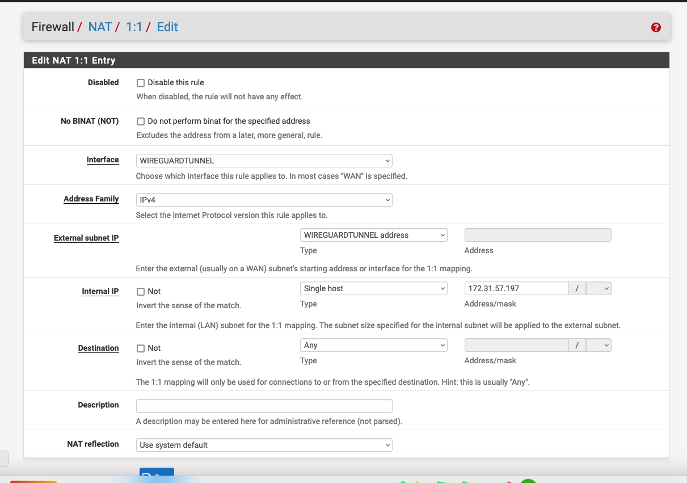
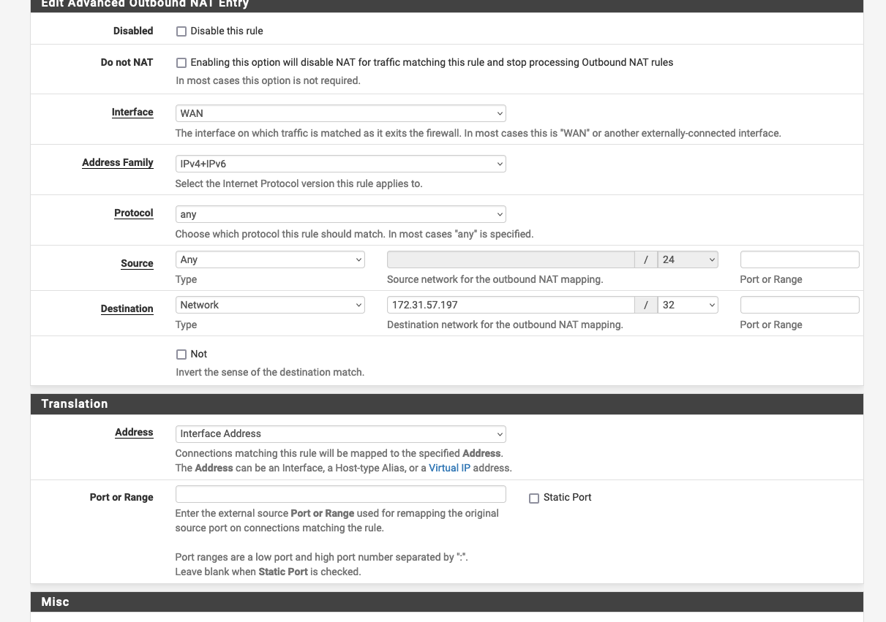

# Telnyx Networking and Storage Integrations

*Part 5 of 5 — see also: [Part 1](telnyx-networking-and-storage-integrations--part-1.md), [Part 2](telnyx-networking-and-storage-integrations--part-2.md), [Part 3](telnyx-networking-and-storage-integrations--part-3.md), [Part 4](telnyx-networking-and-storage-integrations--part-4.md)*

This page consolidates Telnyx support documentation covering Megaport network integration, Telnyx Storage configuration with third-party S3-compatible clients (Cyberduck, Arq Backup, Backup4all, Duplicati, WinSCP, CrossFTP), and Telnyx Networking setup across Global Edge Router, Ubuntu, Azure Linux VMs, Oracle VMs, and pfSense using WireGuard-based Cloud VPN.

## Telnyx Networking on pfSense

**Step 1: Telnyx configuration with pfSense**

Reference the introduction to Telnyx Networking section. Copy and take note of the Peer Configuration file along with the private key that you got assigned from the tutorial.


**Step 1.5: Telnyx setup using API**

You can also use direct API calls to set up everything from above.

1. Create a new Network:

```
curl --request POST \
  --url https://api.telnyx.com/v2/networks \
  --header 'Authorization: Bearer <YOUR_TOKEN_HERE>' \
  --header 'Content-Type: application/json' \
  --data '{
    "name": "Test Network"
}'
```

2. Create a WireGuard Interface:

```
curl -i -X POST \
  https://api.telnyx.com/v2/wireguard_interfaces \
  -H 'Authorization: Bearer <YOUR_TOKEN_HERE>' \
  -H 'Content-Type: application/json' \
  -d '{
    "network_id": "<NETWORK_ID_HERE>",
    "name": "test interface",
    "region_code": "ashburn-va"
  }'
```

3. Create a WireGuard Peer:

```
curl -i -X POST \
  https://api.telnyx.com/v2/wireguard_peers \
  -H 'Authorization: Bearer <YOUR_TOKEN_HERE>' \
  -H 'Content-Type: application/json' \
  -d '{
    "wireguard_interface_id": "<WIREGUARD_INTERFACE_ID_HERE>"
  }'
```

> At this current stage, only ports 80/443 are supported and Telnyx is looking into broadening this to encompass more ports.

**Step 2: pfSense configuration**

1. Ensure you have the WireGuard package installed.
2. Set up WireGuard on pfSense:
   1. Navigate to **VPN → WireGuard**.
   2. Add a new Tunnel:
      1. Give the tunnel a descriptive name, like `telnyx_wg`.
      2. Paste the Private Key from **Telnyx Setup: 3. Create a WireGuard Peer** into Private Key for the Interface Keys.
   3. Add a new Peer:
      1. Uncheck **Dynamic Endpoint**.
      2. Paste the Endpoint from **Telnyx Setup: 3. Create a WireGuard Peer** into Endpoint.
      3. Paste the Public Key from **Telnyx Setup: 3. Create a WireGuard Peer** into Public Key.
      4. Paste the Allowed IPs from **Telnyx Setup: 3. Create a WireGuard Peer** into Allowed IPs.
3. Set up the Interface for WireGuard:
   1. Navigate to **Interface → Assignments**.
   2. Add a new interface with the WireGuard tunnel (for example, `telnyx_wg`).
   3. Click on the Interface to edit it:
      1. Set IPv4 Configuration Type to **Static IPv4**.
      2. Under Static IPv4 Configuration, set the IPv4 Address to the Interface Address found in **Telnyx Setup: 3. Create a WireGuard Peer**.
      3. Select `/16` for the subnet mask.

**Step 3: Setting up 1:1 NAT and outbound NAT**

You will need two NAT configs:

- The 1:1 NAT so that when traffic ingresses through your WireGuard peer, it routes to your service VM.
- Outbound NAT so that your service VM can send traffic back to your pfSense instance without needing to know about the route to the WireGuard interface, and your pfSense instance can send the traffic back to the WireGuard gateway.

1. Create a 1:1 NAT mapping with the following:
   1. **Interface:** the WireGuard tunnel interface.
   2. **External subnet:** WireGuard tunnel Interface address.
   3. **Internal IP:** the IP address of the machine you are hosting your machine on.

   

2. Create an Outbound NAT with the following:
   1. **Interface:** WAN interface (or whichever interface your VM is also listening on).
   2. **Address Family:** IPv4 + IPv6.
   3. **Protocol:** any (restrict as you would like).
   4. **Source:** Any (restrict as you would like).
   5. **Destination:** specify the IP address of your VM on the Interface.
   6. **Translation:** Address — Interface Address.

   
