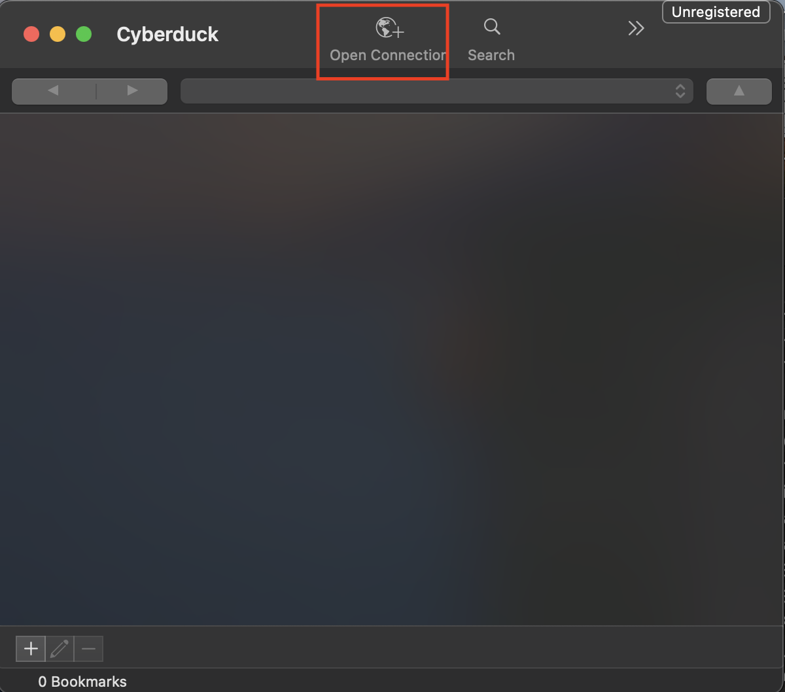
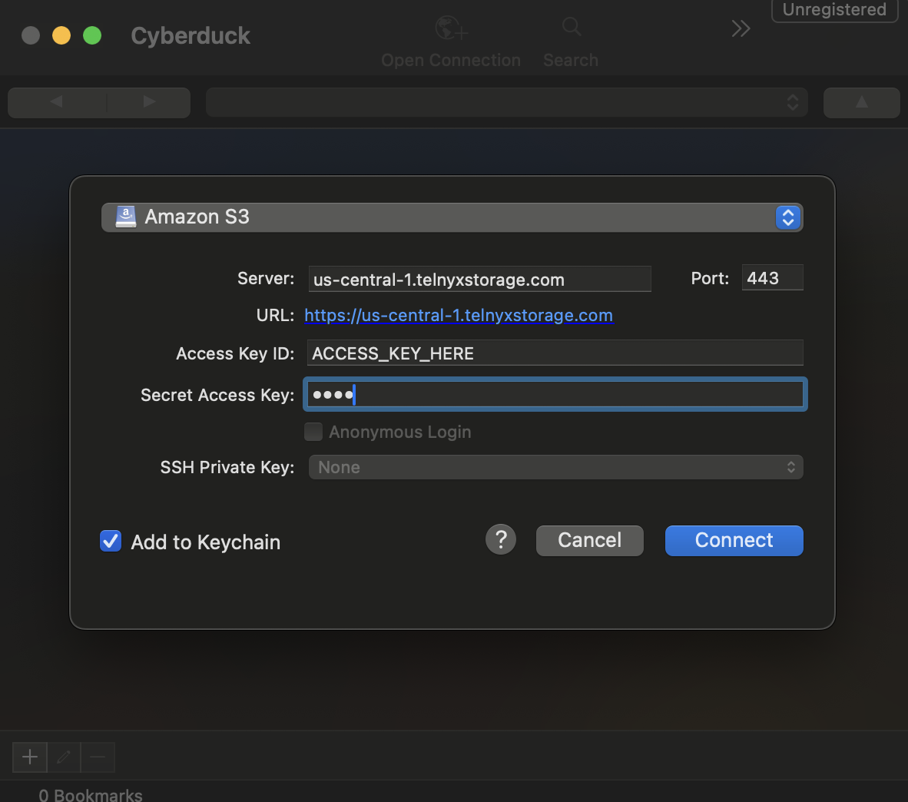
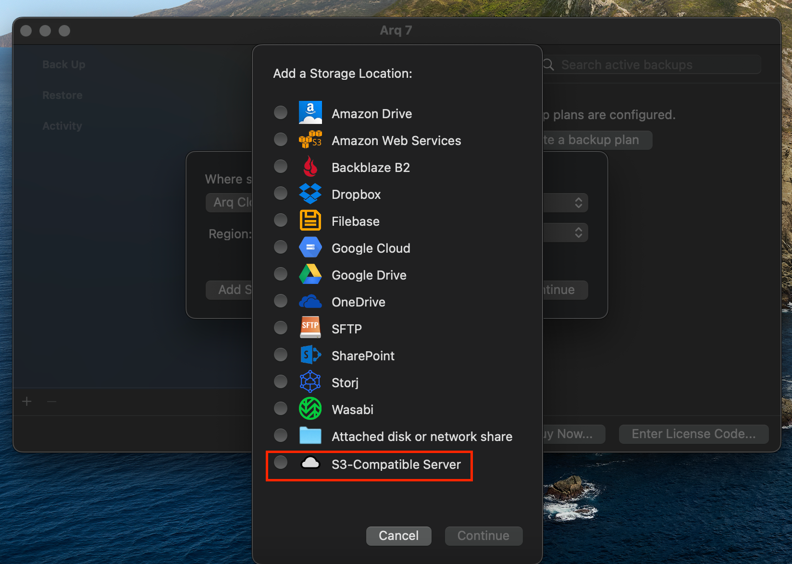
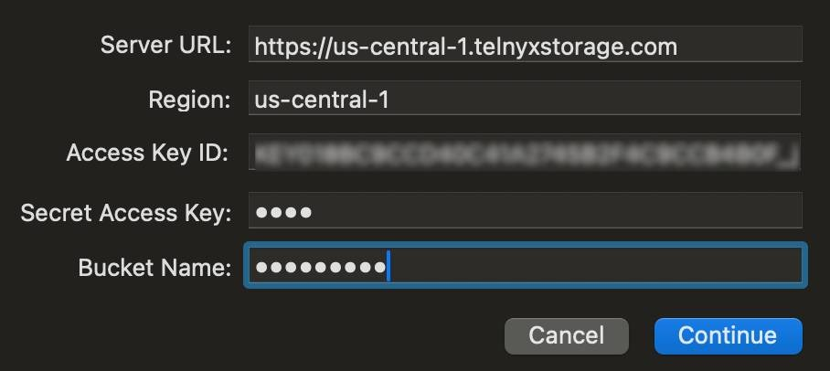
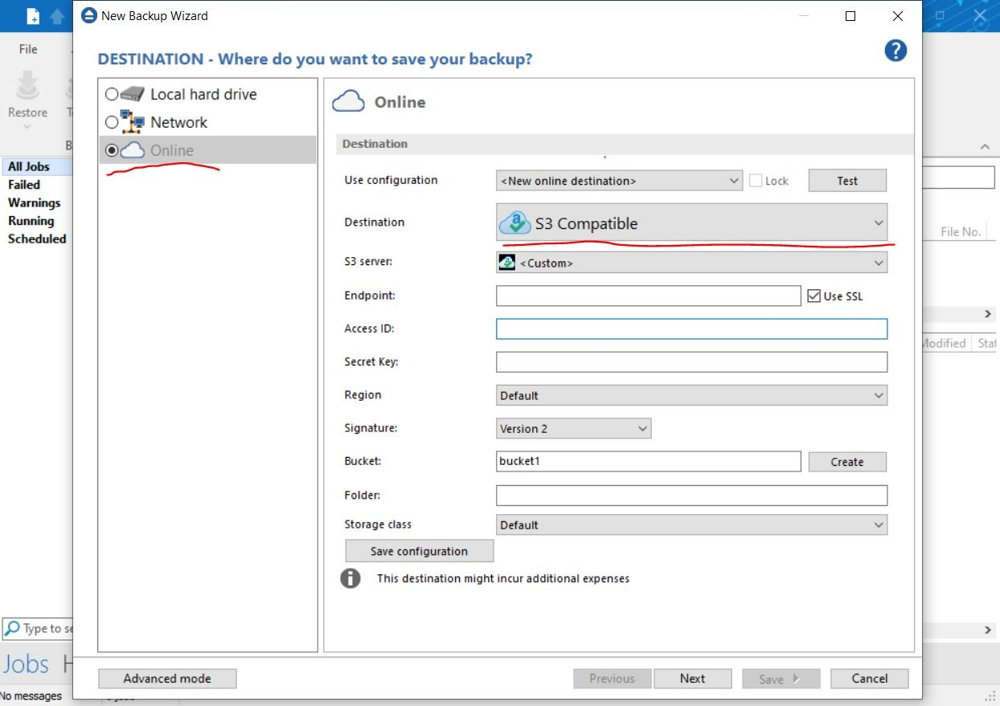
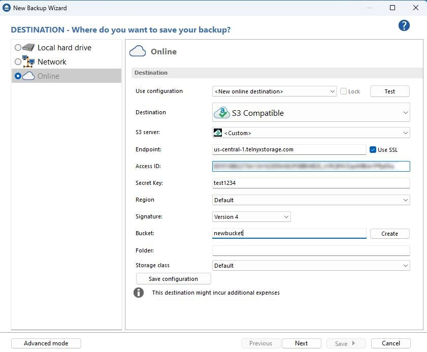
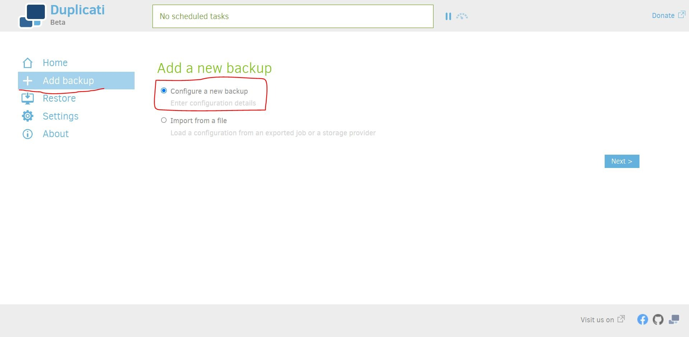
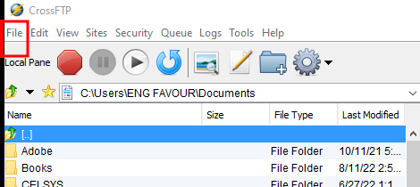

# Telnyx Networking and Storage Integrations

*Part 5 of 7 — see also: [Part 1](telnyx-networking-and-storage-integrations--part-1.md), [Part 2](telnyx-networking-and-storage-integrations--part-2.md), [Part 3](telnyx-networking-and-storage-integrations--part-3.md), [Part 4](telnyx-networking-and-storage-integrations--part-4.md), [Part 6](telnyx-networking-and-storage-integrations--part-6.md), [Part 7](telnyx-networking-and-storage-integrations--part-7.md)*

This page consolidates Telnyx networking and storage integration guides, covering virtual cross connect (VXC) setup with AWS, Azure, Google Cloud, and Megaport, configuration of S3-compatible clients (Cyberduck, WAL-G, Arq Backup, Backup4all, Duplicati, WinSCP, CrossFTP) with Telnyx Storage, and a WireGuard-based Cloud VPN tutorial for connecting a Digital Ocean Ubuntu server to the Telnyx network.

## Telnyx Storage Client Integrations

Telnyx Storage is an S3-compatible object storage service. The following third-party clients can be configured to work with Telnyx Storage using the same general pattern: select an S3-compatible connection type, point the client at a Telnyx [API endpoint](https://developers.telnyx.com/docs/cloud-storage/api-endpoints), and authenticate with a [Telnyx API Key](https://portal.telnyx.com/#/app/api-keys) as the access key. The secret access key is not used by Telnyx Storage, but most clients will complain if it doesn't exist — type any value without spaces, quoting, or special characters.

### Cyberduck

[Cyberduck](https://cyberduck.io/) is a free, open-source file transfer client for macOS and Windows that supports advanced operations such as setting object metadata, versioning, and lifecycle policies.

1. Download and install the latest version of [Cyberduck](https://cyberduck.io/download/).
2. Open Cyberduck and click **Open Connection**.

3. Choose **Amazon S3** as the connection type.

4. Enter the following information:
   1. **Server:** Copy and paste one of the available [API Endpoints](https://developers.telnyx.com/docs/cloud-storage/api-endpoints).
   2. **Port:** 443
   3. **Access Key ID:** Copy and paste your [Telnyx API Key](https://portal.telnyx.com/#/app/api-keys).
   4. **Secret Access Key:** Any value without spaces, quoting, or special characters.
5. Click **Connect**.

All of your buckets should now appear in the Cyberduck UI.

### WAL-G

[WAL-G](https://github.com/wal-g/wal-g) is a backup and disaster recovery tool that enables you to store and manage PostgreSQL WAL (write-ahead log) files on cloud storage services that implement the S3 API.

1. Download and install the latest version of [WAL-G](https://github.com/wal-g/wal-g#installation).
2. Follow [WAL-G's S3 configuration guide](https://github.com/wal-g/wal-g/blob/master/docs/STORAGES.md#s3) and enter the following values:
   1. **AWS_ACCESS_KEY_ID:** Copy and paste your [Telnyx API Key](https://portal.telnyx.com/#/app/api-keys).
   2. **AWS_ENDPOINT:** Copy and paste one of the available [API Endpoints](https://developers.telnyx.com/docs/cloud-storage/api-endpoints).
   3. **AWS_REGION:** Copy and paste the matching region from [API Endpoints](https://developers.telnyx.com/docs/cloud-storage/api-endpoints). For example, if you chose the `https://us-central-1.telnyxstorage.com` endpoint, use `us-central-1` as the region.
   4. **AWS_S3_FORCE_PATH_STYLE:** `true`
   5. **AWS_SECRET_ACCESS_KEY:** Any value without spaces, quoting, or special characters.
   6. **WALE_S3_PREFIX:** Same format as with S3, but pointing to your bucket name. For example, `s3://walg-poc/`.
   7. **PGHOST:** Your Postgres host.
   8. **PGPORT:** Your Postgres port.

### Arq Backup

Arq Backup is a backup software designed for developers that securely backs up important files and data to various storage providers. It offers incremental backups, versioning, compression, encryption, customizable backup schedules, and a backup health monitor.

1. Download and install the latest version of [Arq Backup](https://www.arqbackup.com/).
2. Open Arq Backup and click **New Storage Location**.

3. Select **S3-Compatible Server**.

4. Enter the following information and click **Connect**:
   1. **Server URL:** Copy and paste one of the available [API Endpoints](https://developers.telnyx.com/docs/cloud-storage/api-endpoints).
   2. **Access Key ID:** Copy and paste your [Telnyx API Key](https://portal.telnyx.com/#/app/api-keys).
   3. **Secret Access Key:** Any value without spaces, quoting, or special characters.
   4. **Region:** Copy and paste the matching region from [API Endpoints](https://developers.telnyx.com/docs/cloud-storage/api-endpoints). For example, if you chose the `https://us-central-1.telnyxstorage.com` endpoint, use `us-central-1` as the region.

5. Decide which bucket you would like to store your backups in. You can either create a brand new bucket or use one of your existing buckets.

### Backup4all

Backup4all is a comprehensive backup software that enables users to securely and efficiently back up data to various storage locations such as cloud services, network drives, and external hard drives. It offers full, differential, and incremental backups, compression, encryption, scheduling, and backup verification.

1. Download and install the latest version of [Backup4all](https://www.backup4all.com/).
2. Click **File** and **New** to create a new backup job.
3. For **Destination**, select **Online** on the left navigation bar and then select **S3 Compatible** from the dropdown menu.

4. Enter the following and click **Next**:
   1. **Endpoint:** Copy and paste one of the available [API Endpoints](https://developers.telnyx.com/docs/cloud-storage/api-endpoints).
   2. **Access ID:** Copy and paste your [Telnyx API Key](https://portal.telnyx.com/#/app/api-keys).
   3. **Secret Key:** Any value without spaces, quoting, or special characters.
   4. **Region:** Leave as `default`.
   5. **Signature:** Version 4.
   6. **Bucket:** The name of the bucket you want your data stored in.

### Duplicati

Duplicati is an open-source backup software that provides users with a simple and reliable way to back up files and data to various cloud storage providers. It features strong encryption, incremental and full backups, versioning, and scheduling.

1. Download and install the latest version of [Duplicati](https://duplicati.com/).
2. Open Duplicati and click **Add Backup**, select **Configure a new backup**, and click **Next**.

3. In the **Storage Type** dropdown menu, select **S3 Compatible**.

4. Enter the following information:
   1. **Use SSL:** Toggled on.
   2. **Server:** Select `Custom Server URL` from the dropdown and paste one of the available [API Endpoints](https://developers.telnyx.com/docs/cloud-storage/api-endpoints).
   3. **Bucket Name:** Either the name of an existing bucket or the name for a bucket you want to create.
   4. **Bucket Create Region:** Copy and paste the matching region from [API Endpoints](https://developers.telnyx.com/docs/cloud-storage/api-endpoints). For example, if you chose the `https://us-central-1.telnyxstorage.com` endpoint, use `us-central-1` as the region.
   5. **Storage class:** Default.
   6. **AWS Access ID:** Copy and paste your [Telnyx API Key](https://portal.telnyx.com/#/app/api-keys).
   7. **AWS Access Key:** Any value without spaces, quoting, or special characters.
   8. **Client library to use:** Amazon AWS SDK.

### WinSCP

WinSCP is a popular open-source SFTP, FTP, and SCP client for Windows that provides a secure and intuitive way to transfer files between local and remote servers.

1. Download and install the latest version of [WinSCP](https://winscp.net/eng/index.php).
2. If you have used WinSCP before, click **New Session**.

A modal for configuring your new session will pop up.

3. For **File Protocol**, select `Amazon S3` from the dropdown menu.

4. Enter the following information and click **Login**:
   1. **Host name:** Copy and paste one of the available [API Endpoints](https://developers.telnyx.com/docs/cloud-storage/api-endpoints).
   2. **Port number:** 443.
   3. **Access key ID:** Copy and paste your [Telnyx API Key](https://portal.telnyx.com/#/app/api-keys).
   4. **Secret access key:** Any value without spaces, quoting, or special characters.

### CrossFTP

[CrossFTP](https://www.crossftp.com) is a feature-rich FTP client that lets users easily connect to FTP servers and transfer files. It provides a user-friendly interface, supports various file transfer protocols, and offers advanced features such as multi-threading, synchronization, and encryption.

1. Download and install the latest version of [CrossFTP](https://www.crossftp.com/download.htm).
2. Launch CrossFTP and click **File** then **Site Connect** to open the Site Manager window.

3. Select **S3** from the **Protocol** dropdown and fill in the fields:
   1. **Protocol:** S3/HTTPS.
   2. **Label:** Any name you like.
   3. **Host:** Copy and paste one of the available [API Endpoints](https://developers.telnyx.com/docs/cloud-storage/api-endpoints).
   4. **Port:** 443.
   5. **Access Key:** Copy and paste your [Telnyx API Key](https://portal.telnyx.com/#/app/api-keys).
   6. **Secret:** Any value without spaces, quoting, or special characters.
   7. **Proxy/Firewall:** Select **Use Global Setting** from the dropdown.
   8. **Remote Path:** Copy and paste the name of your bucket. You can get it [here](https://portal.telnyx.com/#/app/storage/buckets).
   9. **Local Path:** Choose a path from your local storage.
   10. **CNAME:** Leave blank.
   11. **Comments:** Optional.

4. Click **Connect** to test the connection and verify the correct configuration.
