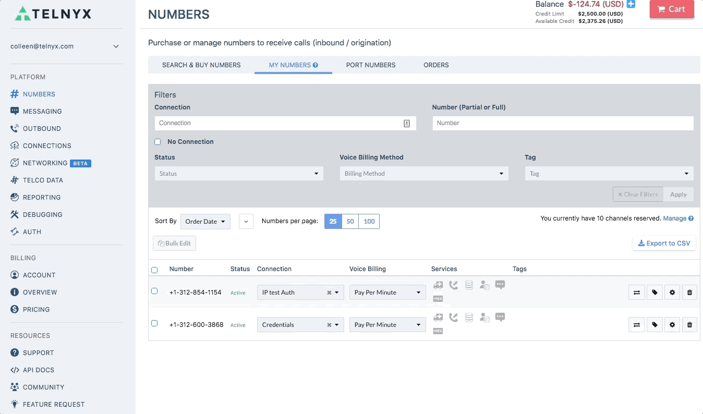

# Telnyx Networking, Edge Routing, and Cloud Integration

*Part 2 of 2 — see also: [Part 1](telnyx-networking-edge-routing-and-cloud-integration--part-1.md)*

This page consolidates Telnyx support documentation covering the Telnyx Edge Router and Global Edge Routing product, WireGuard-based networking on multiple platforms (AWS Lightsail, AWS VPC, Azure, Google Cloud, Android/iOS, Ubuntu, Oracle VMs, pfSense), Virtual Cross Connect (VXC) setup for AWS, Azure, and Google Cloud, and general account topics such as cancellation policy, post-paid service availability, and the Telnyx blog and community resources.

## Virtual Cross Connect (VXC) Setup

A virtual cross connect (VXC) is a private, direct connection between cloud providers that is faster and safer than a traditional public internet connection. It bypasses the public internet, eliminating hops and reducing the risk of packet loss and jitter while adding the security of direct interconnection. To protect against man-in-the-middle attacks, Telnyx recommends [encrypting both signaling and media with TLS & Z/SRTP](https://support.telnyx.com/en/articles/1130711-does-telnyx-encrypt-communication).

### AWS VXC

**Pre-requisites:** an AWS Virtual Private Cloud (VPC), the 12-digit AWS VPC account number, the AWS region, the desired bandwidth speed, and a network name.

1. **Provide Telnyx with VXC preferences** — In the Mission Control Portal, go to *Networking*, click *Create a New VXC*, and provide the AWS account number, region, bandwidth speed, and network name. Telnyx will create 1 or 2 Direct Connect connections within 1–3 days. Once submitted, preferences cannot be changed without creating a new VXC.
2. **Create a Virtual Private Gateway (VGW)** — In the [Amazon VPC console](https://console.aws.amazon.com/vpc/), create a Virtual Private Gateway with the default ASN, then attach it to the destination VPC.
3. **Accept pending Direct Connect connections** — In the [AWS Direct Connect console](https://console.aws.amazon.com/directconnect/), accept each pending connection (1 or 2 depending on whether a backup link was requested).
4. **Create a virtual interface for each circuit** — For each connection, create a *Private* virtual interface using the Telnyx IP, customer IP, BGP ASN, and BGP authentication key provided in the Telnyx support email. Repeat for a redundant backup link if applicable.
5. **Enable route propagation for VPC route tables** — In the Direct Connect console, open the *Route Propagate* tab, click *Edit*, and select the *Propagate* checkbox next to the VGW. The routing table should then display Telnyx prefixes routing to the VGW.

Further reading: [AWS Direct Connect user guide](https://docs.aws.amazon.com/directconnect/latest/UserGuide/Welcome.html), [Direct Connect virtual interfaces user guide](https://docs.aws.amazon.com/directconnect/latest/UserGuide/WorkingWithVirtualInterfaces.html), and [Amazon Virtual Private Cloud](https://docs.aws.amazon.com/vpc/).

### Azure VXC

**Pre-requisites:** a Microsoft Azure cloud environment.

1. **Prepare Microsoft account for Azure Express Route** — In the [Azure Portal](https://portal.azure.com/#home), search for *express route*, click *Express Route Circuits*, then *Add*. The provider **must** be *Equinix*; do **not** select *Allow Classic Operations*.
2. **Set up the VXC in the Telnyx Mission Control Portal** — Log in, click *Networking*, then *Create New Network*. Name the network, click *Add a Site*, choose the Telnyx Backbone Network to peer with, and click *Create VXC*. Create an Azure Express Route, enter the Azure Service Key and Microsoft Azure ASN (typically 12076), then submit the VXC to the Telnyx Network team. **Do not** enable the Routing status slider until coordinated with the Telnyx Network team, as doing so without backend configuration may blackhole voice traffic.
3. **Turn up routing and NAT configuration** — Arrange a maintenance window with Telnyx Network engineering to enable routing. Once enabled, Telnyx public ranges will be visible via the Express Route circuit and preferred over the Internet routing table.

Further reading: [Microsoft Azure technical documentation](https://learn.microsoft.com/en-us/).

### Google Cloud VXC

**Pre-requisites:** a GCP Virtual Private Cloud (VPC) network located in the same region where the VXC will be built.

1. **Create a GCP Partner Interconnect and VLAN attachments** — In the [Google Cloud Platform VPC](https://console.cloud.google.com/hybrid/interconnects/), choose *Interconnect Type → Partner Interconnect*, select *I already have a service provider*, and add VLAN attachments. Telnyx recommends creating a redundant pair of VLAN attachments (which requires two VXCs). Choose the *default* VPC network, the same region as the application, and a Cloud Router in the same region. Click *Create*, then *OK*, and copy the pairing key(s) from the VLAN Attachment Detail.
2. **Provide Telnyx with VXC preferences** — In the Mission Control Portal, go to *Networking*, create or open a network, add a site (selecting sites local to the Google Cloud region), and click *Create VXC*. Select *Google Cloud* as the Cloud Provider, choose bandwidth speed, and enter the Google Pairing Key for the primary VLAN attachment (ending in "1"). For a redundant link, add the secondary pairing key (ending in "2").
3. **Activate the VXC in Google Cloud** — In the [Google Cloud Platform VPC](https://console.cloud.google.com/hybrid/interconnects/), click *Activate* then *Accept* for each VLAN Attachment. Click *Configure BGP* for each, enter **63440** as the Peer ASN, click *Save and Continue*, then *Refresh* until the status shows *Up*. Copy the Cloud Router IP for each VLAN attachment.
4. **Complete the order in Telnyx** — Paste the Cloud Router IP for each VLAN attachment and save. Telnyx will approve the request within 3 hours; the order status will move from *Pending* to *Active* to *Complete*. Cloud hosts must have public IP addresses configured to receive traffic from Telnyx. Enable routing status to transition packet delivery from the cloud provider's Internet transit to the private VXC, which causes a brief traffic disruption.

Further reading: [Google VPC documentation](https://cloud.google.com/vpc#section-4) and [VLAN attachments documentation](https://cloud.google.com/network-connectivity/docs/interconnect/how-to/partner/creating-vlan-attachments).

## Account, Billing, and Resources

### Cancellation Policy

Telnyx does not charge a cancellation fee. There is no contract and no fee to cancel service. Telnyx's policy is to avoid "nickel and diming" users.

### Post-Paid Service

Telnyx does not offer post-paid service at this time. Service is strictly pre-paid.

### Blog and Community

Telnyx maintains a blog and resources hub at [telnyx.com/resources](https://telnyx.com/resources), where you can subscribe with your email address to receive updates. A Community forum is also accessible from within the Mission Control Portal:

To contribute content to the Telnyx blog, contact [andrewm@telnyx.com](mailto:andrewm@telnyx.com).

## Support and Feedback

For questions on any of the topics above, Telnyx offers 24/7 world-class support by phone at +1 888 980 9750 ext 2, by email at [support@telnyx.com](mailto:support@telnyx.com), or via chat from the Mission Control Portal. For discussion, join the Telnyx Slack community at [joinslack.telnyx.com](https://joinslack.telnyx.com/). Feedback on tutorials can be sent to [community@telnyx.com](mailto:community@telnyx.com).
