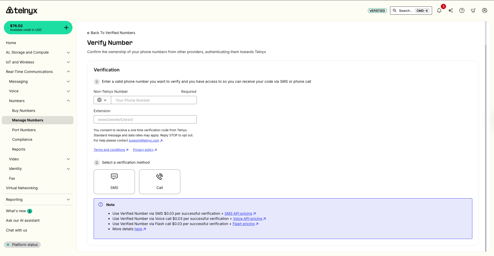

# Telnyx Number Management Guide

*Part 4 of 5 — see also: [Part 1](telnyx-number-management-guide--part-1.md), [Part 2](telnyx-number-management-guide--part-2.md), [Part 3](telnyx-number-management-guide--part-3.md), [Part 5](telnyx-number-management-guide--part-5.md)*

A consolidated reference for managing phone numbers on Telnyx, covering ordering restrictions, toll-free verification, verified (non-Telnyx) numbers, IVR and DTMF verification flows, use-case selection, and the sunset Google Verified Calls product.

## Verifying Numbers Behind an IVR

Some phone numbers sit behind an IVR (interactive voice response) system and require dialing an extension to reach the right person. Telnyx supports verifying numbers behind an IVR automatically.

### Standard Behavior

1. Verification call is initiated.
2. Telnyx calls the target phone number.
3. Call is answered.
4. Verification code is played.
5. User enters the code to complete verification.

### New Behavior (with IVR Extensions)

1. Verification call is initiated, including IVR navigation digits.
2. Telnyx calls the target phone number.
3. Call is answered by the IVR.
4. Telnyx waits, then dials the extension.
5. Extension answers the call.
6. Verification code is played.
7. User enters the code to complete verification.

### Prerequisites

- A [Telnyx Mission Control Portal](https://portal.telnyx.com/) account.
- A valid Telnyx API key (generated in the Mission Control Portal).
- The phone number to verify, in E.164 format (e.g., +15741156782).

### API Parameters

- **phone_number** — Destination number in E.164 format.
- **verification_method** — The method of verification (currently `call` is supported).
- **extension** — The DTMF sequence to navigate the IVR.
  - `w` = wait 0.5 seconds
  - `W` = wait 1 second
  - Digits `0–9` and letters `A–D`
  - Example: `www2wW4w53ww3`

### API Request

Use the [Create Verified Number](https://developers.telnyx.com/api/verified-numbers/create-verified-number) endpoint:

```
curl --location --request POST 'https://api.telnyx.com/v2/verified_numbers' \
  --header 'phone_number: +15741156782' \
  --header 'verification_method: call' \
  --header 'extension: www2wW4w53ww3' \
  --header 'Authorization: Bearer KEYXXXXXXXXXXXXXX'
```

Replace `KEYXXXXXXXXXXXXXX` with your actual API key.

### Response

On success:

```
{ "phone_number": "+15741156782", "verification_method": "call", "extension": "www2wW4w53ww3" }
```

On failure (e.g., number not in E.164 format), an error object describes the issue.

### Mission Control Portal

Log in to the Mission Control Portal and navigate to Real-Time Communications → Numbers → Manage Numbers. You can also use this [direct link](https://portal.telnyx.com/#/numbers/verified-numbers) after login. Switch to the Verified Numbers tab.


Add details of your number and the extension following the format above. Select "Call me with a code". You will receive a call from which the verification code will be read for input to complete verification.



### Tips for Success

- Always format phone numbers in E.164 (e.g., +1 for US numbers).
- Test your extension sequence manually with the IVR before automating.
- Use `w` to add short waits when the IVR is slow to respond.
- Keep your API key private — never share it publicly.

## DTMF Verification (Press 1 to Verify)

Telnyx supports DTMF-based phone number verification, allowing you to verify phone numbers by simply pressing 1 during a verification call. This eliminates the need to receive and enter a verification code manually.

### How It Works

1. Trigger a verification call via the API using the DTMF method.
2. The person associated with the phone number receives a call.
3. They are prompted to press 1 to authorize the verification.
4. If they press 1, the number is verified to your account.
5. If they don't press 1, the verification fails and you can retry.

The verification call does not mention Telnyx anywhere, maintaining privacy.

### Single Number Verification

API request:

```
POST /v2/verified_numbers
{
  "phone_number": "+1541234567",
  "verification_method": "dtmf"
}
```

cURL example:

```
curl --location 'https://api.telnyx.com/v2/verified_numbers' \
  --header 'Content-Type: application/json' \
  --header 'Authorization: Bearer YOUR_API_KEY' \
  --data '{
    "phone_number": "+1541234567",
    "verification_method": "dtmf"
  }'
```

### Bulk Number Verification

Loop through your list of numbers and make individual API calls for each.

Python example:

```
import requests
import time

API_KEY = "YOUR_API_KEY"
API_ENDPOINT = "https://api.telnyx.com/v2/verified_numbers"
phone_numbers = ["+15412345678", "+15412345679", "+15412345680"]

headers = {
    "Content-Type": "application/json",
    "Authorization": f"Bearer {API_KEY}"
}

for phone_number in phone_numbers:
    payload = {
        "phone_number": phone_number,
        "verification_method": "dtmf"
    }
    response = requests.post(API_ENDPOINT, json=payload, headers=headers)
    print(f"Verification initiated for {phone_number}")
    time.sleep(1)  # Delay to avoid rate limiting
```

Bash script (for CSV input):

```
#!/bin/bash
API_KEY="YOUR_API_KEY"
API_ENDPOINT="https://api.telnyx.com/v2/verified_numbers"

while IFS= read -r phone_number; do
  curl -s --location "$API_ENDPOINT" \
    --header 'Content-Type: application/json' \
    --header "Authorization: Bearer $API_KEY" \
    --data '{"phone_number": "'"$phone_number"'", "verification_method": "dtmf"}'
  sleep 1
done < phone_numbers.csv
```

### Checking Verification Status

```
curl --location 'https://api.telnyx.com/v2/verified_numbers/+1541234567' \
  --header 'Authorization: Bearer YOUR_API_KEY'
```

### Receiving Verification Events via Webhooks

Register a webhook to receive verification events automatically instead of polling. Include a `verification_webhook_url` in your request:

```
POST /v2/verified_numbers
{
  "phone_number": "+1541234567",
  "verification_method": "dtmf",
  "verification_webhook_url": "https://your-api.com/api/verification_webhook"
}
```

Verification events are pushed to your webhook URL in the following format:

```
{
  "data": {
    "event_type": "caller_id_verification.completed",
    "id": "evt_abcd-456-hijsk-123",
    "occurred_at": "YYYY-MM-DDT14:22:07.123456Z",
    "payload": {
      "phone_number": "+1245456784",
      "record_type": "caller_id_verification",
      "verification_method": "outbound_call",
      "verified_at": "YYYY-MM-DDT14:21:58.654321Z"
    },
    "record_type": "event"
  }
}
```

### Mission Control Portal

1. Log in to your portal account and navigate to Numbers → Verify Numbers Section.
2. Add the number you want to verify.
3. Click the "Press 1 to verify" button.

The target number receives the verification call and, if they press 1, the number is listed in the Verified Numbers tab.


### Best Practices

- Add delays between bulk verification requests to avoid rate limiting.
- Implement error handling for failed verification attempts.
- If a user doesn't answer or press 1, retry the verification call.
- Keep track of verification statuses for your records.

### Troubleshooting

- **Verification call not received** — Verify the phone number is correct and can receive calls.
- **User didn't press 1 in time** — Retry the verification call.
- **Rate limit exceeded** — Add delays between requests.
- **Invalid phone number format** — Ensure phone numbers are in E.164 format (e.g., +15412345678).

## Google Verified Calls (Sunset)

Google Verified Calls is no longer offered by Telnyx. The product was sunset by Google.

Google Verified Calls was a way for businesses to display their business name, logo, and reason for calling on an end-user's Android device. A verification symbol authenticated the call, increasing end-user trust. Analysis from Google showed customers were 3 times more likely to pick up the phone when the call was marked as Verified by Google.

Verified Calls was available through Google's Phone app on Android, which came preloaded on many Android devices. Display profile approval typically took 1–2 business days if confirmation emails were responded to quickly.

Verified Calls is no longer available in the United States, India, Mexico, Brazil, and Spain, and is no longer available through Telnyx.
